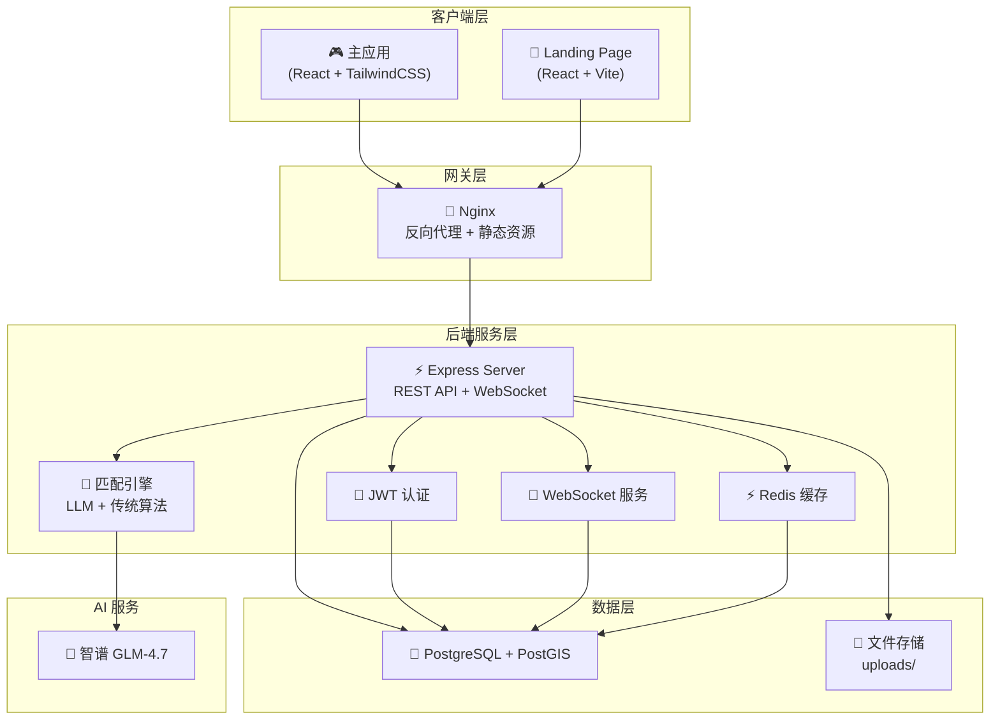
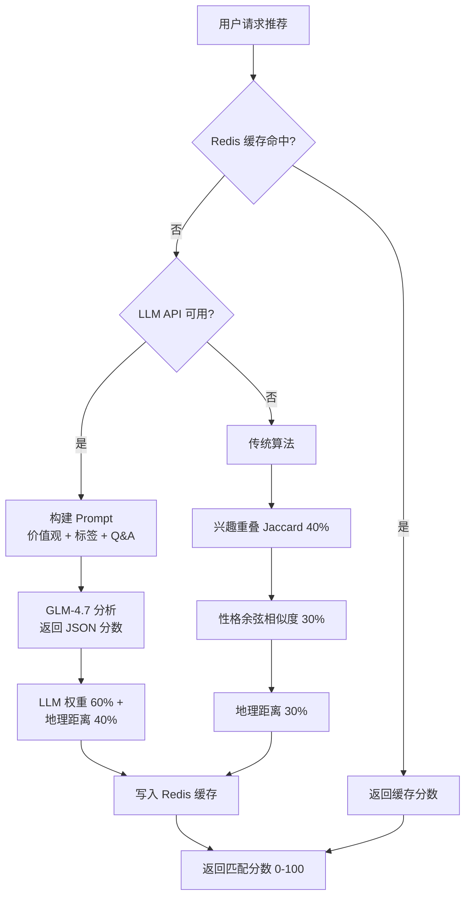

**AIlove** 是一个融合宝可梦 GameBoy 复古风格与 AI 智能匹配算法的创新约会平台。项目以「训练师配对」为核心理念，将交友体验游戏化：用户注册后通过性格测试映射为专属宝可梦形象，系统利用 AI（智谱 GLM-4.7）与传统算法进行多维度匹配，结合地理位置服务（PostGIS）和游戏化机制（HP/EXP 状态条、精灵球积分系统），为用户提供沉浸式的社交体验。

项目当前已完成 Phase 1–4 的开发，涵盖核心认证流程、AI 推荐匹配、实时聊天、地图定位、约会任务、社区照片墙以及精灵球积分系统等完整功能链路。

Sources: [README.md](README.md#L1-L50), [backend/server.js](backend/server.js#L1-L84)

## 项目定位与设计理念

AIlove 的核心设计思想是 **将约会体验转化为宝可梦冒险游戏**。用户在平台中被视为「训练师」，系统根据用户的性格关键词（热情、温柔、幽默等 11 种类型）自动映射到对应的宝可梦种类与头像，形成个性化的身份标识。这种设计不仅降低了传统交友平台的严肃感，还通过游戏化元素（HP 经验条、积分奖励、照片墙审核）增强了用户的持续参与度。

平台的技术选型充分考虑了实时交互与智能匹配的双重需求：后端采用 Express.js + PostgreSQL (PostGIS) + Redis + WebSocket 的组合支撑高并发实时通信；前端使用 React 19 + TypeScript + Vite + TailwindCSS 构建现代化的 SPA 应用；AI 匹配层接入智谱 GLM-4.7 大模型进行深度情感分析。

Sources: [backend/services/pokemonMapper.js](backend/services/pokemonMapper.js#L1-L50), [landingpage/src/App.tsx](landingpage/src/App.tsx#L1-L40)

## 系统架构全景



架构采用经典的三层分离模式：**客户端层**负责 UI 渲染与用户交互，通过 BrowserRouter 实现页面路由并借助 `ProtectedRoute` 组件进行认证守卫；**网关层**使用 Nginx 作为反向代理，将 `/api/` 请求转发至后端容器，静态前端资源直接由 Nginx 托管；**服务层**的 Express 服务器同时承载 REST API 和 WebSocket 双协议，匹配引擎支持 LLM 智能匹配与传统算法的双路回退策略。

Sources: [docker-compose.yml](docker-compose.yml#L1-L40), [nginx.conf](nginx.conf#L1-L31), [backend/server.js](backend/server.js#L1-L84)

## 核心功能模块

AIlove 的功能体系围绕四个阶段逐步构建，每个阶段对应一组完整的业务闭环：

| Phase | 功能模块 | 关键能力 | 后端路由 | 前端页面 |
|-------|---------|---------|---------|---------|
| **Phase 1** | 用户认证与匹配 | JWT 注册/登录、AI 推荐、地图定位、实时聊天 | `/api/auth`, `/api/recommendations`, `/api/map`, `/api/chat` | LoginPage, RegisterPage, HomePage, MapPage, ChatPage |
| **Phase 2** | 约会任务系统 | 约会地点(Pokestop)、任务发起/接受、地点打卡 | `/api/tasks`, `/api/spots` | MapPage(扩展) |
| **Phase 3** | 社区照片墙 | 照片上传/审核、瀑布流展示、点赞互动 | `/api/community` | CommunityPage |
| **Phase 4** | 游戏化系统 | 精灵球积分、用户等级、经验值可视化 | `/api/pokeball`, `/api/rewards` | PokeballPage, ProfilePage |

各模块通过数据库表建立关联：用户表 `users` 是核心枢纽，通过 `user_id` 外键连接推荐表 `recommendations`、聊天表 `chat_messages`、照片表 `community_photos`、任务表 `dating_tasks` 等，形成完整的用户行为数据链路。

Sources: [backend/server.js](backend/server.js#L34-L50), [frontend-react/src/App.tsx](frontend-react/src/App.tsx#L44-L110), [backend/schema.sql](backend/schema.sql#L1-L167)

## 技术栈一览

### 前端技术栈

| 技术 | 版本 | 用途 |
|------|------|------|
| React | 19.2 | 核心 UI 框架 |
| TypeScript | 5.9 | 类型安全 |
| Vite | 7.3 | 构建工具与开发服务器 |
| React Router DOM | 7.13 | 客户端路由管理 |
| TailwindCSS | 4.2 | 原子化样式系统 |
| AMap JS API | 1.0.1 | 高德地图集成 |

### 后端技术栈

| 技术 | 版本 | 用途 |
|------|------|------|
| Node.js | 18+ | 运行时环境 |
| Express.js | 4.18 | HTTP 服务框架 |
| PostgreSQL | 15 + PostGIS 3.3 | 关系型数据库 + 地理空间扩展 |
| Redis | 5.10 (node-redis) | 匹配分数缓存 |
| WebSocket (ws) | 8.14 | 实时通信 |
| JWT (jsonwebtoken) | 9.0 | 身份认证令牌 |
| OpenAI SDK | 6.16 | 智谱 GLM-4.7 API 接入 |
| Multer | 1.4 | 文件上传处理 |
| Winston | 3.19 | 结构化日志系统 |

Sources: [frontend-react/package.json](frontend-react/package.json#L1-L36), [backend/package.json](backend/package.json#L1-L31)

## 项目目录结构

```
AIlove/
├── backend/                    # 后端服务 (Express + PostgreSQL)
│   ├── server.js               # 入口：Express 应用 + WebSocket 初始化
│   ├── db.js                   # PostgreSQL 连接池
│   ├── schema.sql              # 数据库模式定义
│   ├── routes/                 # REST API 路由 (12 个模块)
│   ├── services/               # 业务逻辑层 (匹配算法/缓存/日志/WebSocket)
│   └── migrations/             # 数据库迁移脚本
├── frontend-react/             # 主应用前端 (React SPA)
│   └── src/
│       ├── App.tsx             # 路由定义与认证守卫
│       ├── pages/              # 8 个页面组件
│       ├── components/         # 4 个共享组件 (GameBoy 风格)
│       ├── contexts/           # AuthContext 认证状态
│       └── services/api.ts     # HTTP API 封装
├── landingpage/                # 宣传落地页 (独立 React 应用)
│   └── src/App.tsx             # 功能展示与 CTA
├── docker-compose.yml          # Docker 编排配置
├── nginx.conf                  # Nginx 反向代理配置
└── openspec/                   # OpenSpec 变更管理
```

前端采用**特性按页面组织**的结构：每个业务模块对应独立的页面组件，通过 `AuthContext` 共享认证状态，`api.ts` 统一封装所有 HTTP 请求。后端遵循 **Express 路由 + Service 层**的分层架构，`routes/` 处理请求解析与响应格式化，`services/` 封装核心业务逻辑（匹配算法、缓存策略、WebSocket 通信）。

Sources: [get_dir_structure output](.)

## 匹配算法架构

匹配引擎是 AIlove 的核心智能层，采用 **双路匹配策略**，优先使用 LLM 智能分析，失败时自动回退到传统算法：



LLM 模式利用智谱 GLM-4.7 的 JSON 结构化输出能力，接收双方的价值观描述（`values_description`）、兴趣标签（`tags`）和开放问答（`q_and_a`）进行深度语义分析，输出 0–100 的匹配分数。传统模式则结合 Jaccard 相似系数计算兴趣标签重叠度、余弦相似度分析性格向量、以及 Haversine 公式计算地理距离，三项加权汇总得到最终分数。

Sources: [backend/services/matchingAlgorithm.js](backend/services/matchingAlgorithm.js#L1-L80)

## 阅读引导

本页面提供了 AIlove 项目的全景概览。根据你的开发角色和兴趣方向，建议按照以下路径深入学习：

- **环境搭建** → [快速开始](2-kuai-su-kai-shi) 了解本地开发环境配置流程，随后查看 [环境变量说明](5-huan-jing-bian-liang-shuo-ming) 和 [数据库初始化与迁移](6-shu-ju-ku-chu-shi-hua-yu-qian-yi)
- **技术细节** → [技术栈与依赖](3-ji-zhu-zhan-yu-yi-lai) 获取依赖版本与配置的完整清单
- **功能探索** → [核心功能导览](4-he-xin-gong-neng-dao-lan) 了解各 Phase 功能的使用方式和交互流程
- **架构深入** → [系统整体架构](7-xi-tong-zheng-ti-jia-gou) 理解容器编排、网络拓扑和服务间通信

前端开发者建议优先阅读 [React 项目结构](12-react-xiang-mu-jie-gou) 和 [状态管理与认证上下文](14-zhuang-tai-guan-li-yu-ren-zheng-shang-xia-wen)；后端开发者可从 [Express 路由设计](22-express-lu-you-she-ji) 和 [WebSocket 实时通信](9-websocket-shi-shi-tong-xin) 入手；对 AI 匹配感兴趣的读者可直接跳转至 [匹配算法架构](30-pi-pei-suan-fa-jia-gou)。