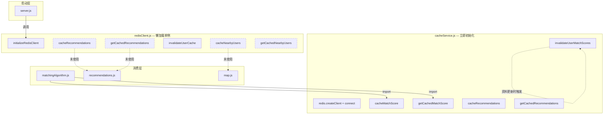
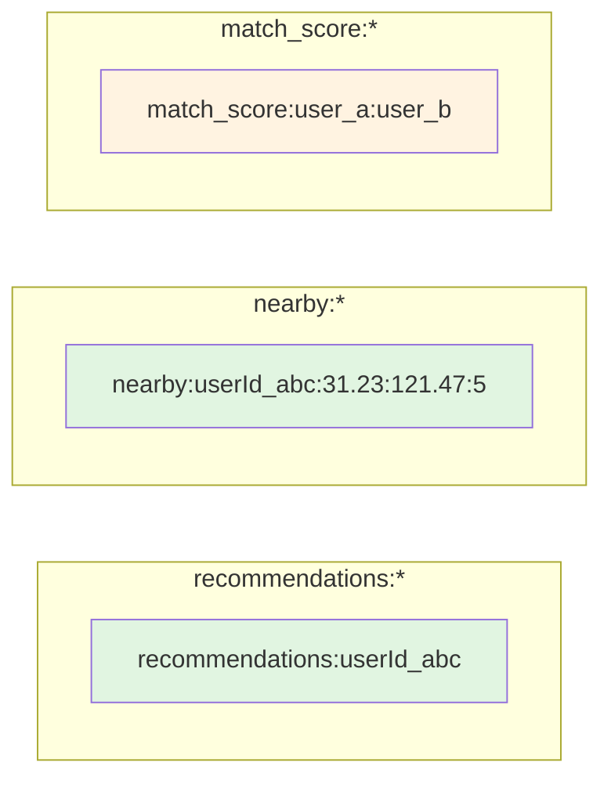
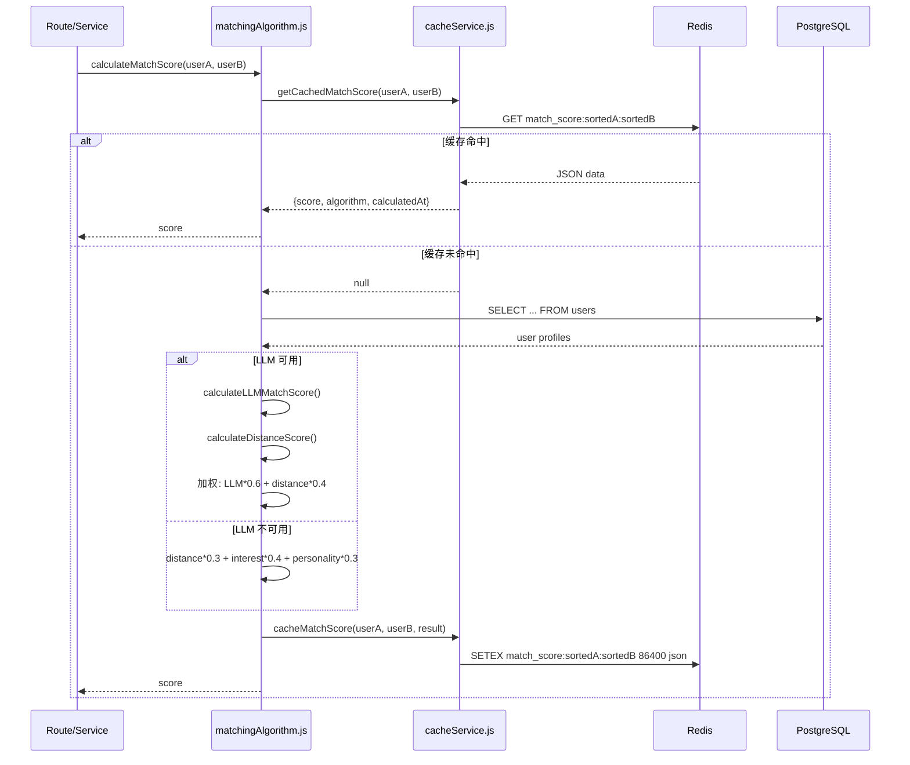
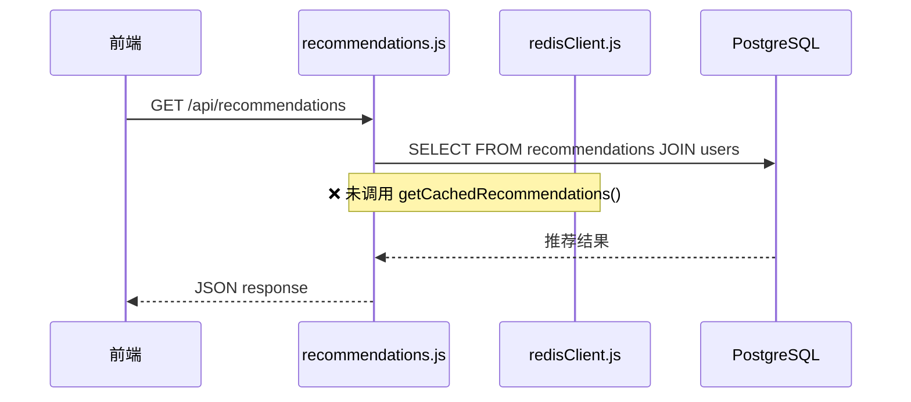

本文档剖析 AI 月老后端系统中 Redis 缓存层的架构设计、键空间策略、TTL 配置以及与核心服务的集成模式。系统当前采用 **双客户端架构**——`redisClient.js` 负责推荐与附近用户的缓存操作，`cacheService.js` 专注于匹配分数的缓存——两者通过不同的初始化时机和生命周期策略服务不同的业务场景。

Sources: [redisClient.js](backend/services/redisClient.js#L1-L96), [cacheService.js](backend/services/cacheService.js#L1-L228), [server.js](backend/server.js#L7-L84)

## 架构概览

系统存在两个独立的 Redis 客户端实例，各自承担不同的职责：



虚线表示 **已实现但尚未被路由层调用的缓存函数**。当前唯一活跃的缓存路径是 `matchingAlgorithm.js` → `cacheService.js` 的匹配分数缓存链路。

Sources: [matchingAlgorithm.js](backend/services/matchingAlgorithm.js#L3-L4), [recommendations.js](backend/routes/recommendations.js#L1-L299)

## 客户端初始化对比

两个客户端模块在连接策略上存在根本差异：

| 维度 | redisClient.js | cacheService.js |
|------|---------------|-----------------|
| 初始化时机 | 懒加载 — `server.js` 启动时调用 `initializeRedisClient()` | 立即初始化 — 模块加载时自动 `connect()` |
| 单例模式 | 通过 `if (redisClient) return redisClient` 保证单例 | 模块级 `const redisClient` 天然单例 |
| 降级策略 | 函数级 `if (!redisClient) return` 防护 | 连接失败时 `catch` 不抛出，主功能不受影响 |
| 重连策略 | 指数退避：`Math.min(retries * 100, 3000)`，上限 10 次 | 线性退避：`retries * 100`，上限 10 次 |
| 优雅关闭 | 无显式关闭逻辑 | 监听 `SIGINT`/`SIGTERM` 调用 `redisClient.quit()` |
| 依赖包版本 | `redis@^5.10.0` | `redis@^5.10.0` |

Sources: [redisClient.js](backend/services/redisClient.js#L9-L26), [cacheService.js](backend/services/cacheService.js#L13-L30)

## 键空间设计

系统采用 **命名空间前缀** 策略组织键，避免不同业务数据的冲突：



### 键格式规范

| 键模式 | 数据来源 | 值结构 | 用途 |
|--------|---------|--------|------|
| `recommendations:{userId}` | `redisClient.js` | JSON 数组 — 推荐用户列表 | 缓存用户推荐列表 |
| `nearby:{userId}:{lat}:{lng}:{radius}` | `redisClient.js` | JSON 数组 — 附近用户列表 | 按地理坐标缓存附近用户 |
| `match_score:{sortedIdA}:{sortedIdB}` | `cacheService.js` | JSON 对象 — `{score, algorithm, calculatedAt}` | 缓存用户间匹配分数 |

**`match_score` 键的特殊设计**：通过 `[userIdA, userIdB].sort()` 对 ID 排序后拼接，确保 `A-B` 与 `B-A` 命中同一缓存键，避免重复计算。

Sources: [redisClient.js](backend/services/redisClient.js#L30-L35), [cacheService.js](backend/services/cacheService.js#L38-L45)

## TTL 策略分析

不同缓存场景采用差异化的过期时间，反映数据新鲜度的业务需求：

```mermaid
gantt
    title 缓存 TTL 对比
    dateFormat  s
    axisFormat  %S秒

    section 附近用户
    nearby  :0, 300

    section 推荐列表
    redisClient :0, 3600
    cacheService :0, 86400

    section 匹配分数
    match_score :0, 86400
```



| 缓存类型 | TTL | 业务考量 |
|---------|-----|---------|
| 附近用户 | **300 秒（5 分钟）** | 地理位置变化频繁，需要高刷新率 |
| 推荐列表（redisClient） | **3600 秒（1 小时）** | 用户资料更新频率中等 |
| 推荐列表（cacheService） | **86400 秒（24 小时）** | 与匹配分数相同的生命周期 |
| 匹配分数 | **86400 秒（24 小时）** | 用户资料不频繁变更，AI 调用成本高 |

**成本优化逻辑**：匹配分数缓存尤其关键——每次 LLM 匹配调用涉及智谱 API 请求，缓存命中可直接节省 API 费用与延迟。传统算法的 Jaccard + Cosine 计算虽然成本较低，但跨用户对的计算量仍随用户数呈 O(n²) 增长。

Sources: [redisClient.js](backend/services/redisClient.js#L30), [cacheService.js](backend/services/cacheService.js#L10)

## 缓存读写流程

### 匹配分数缓存 — 已激活的完整路径

这是当前系统中 **唯一完整集成** 的缓存链路：



Sources: [matchingAlgorithm.js](backend/services/matchingAlgorithm.js#L20-L99)

### 推荐列表缓存 — 已实现但未集成

`redisClient.js` 提供了完整的推荐缓存 API，但 `recommendations.js` 路由目前 **直接查询 PostgreSQL**：



这意味着即使 Redis 中已有缓存数据，推荐接口仍然会走数据库查询路径。

Sources: [recommendations.js](backend/routes/recommendations.js#L151-L210)

## 缓存失效机制

系统提供两种缓存失效策略：

| 函数 | 失效范围 | 调用场景 | 实现方式 |
|------|---------|---------|---------|
| `invalidateUserCache(userId)` | 单用户推荐缓存 | 用户资料更新后 | `DEL recommendations:{userId}` |
| `invalidateUserMatchScores(userId)` | 该用户所有匹配分数 | 用户资料更新后 | `KEYS match_score:*:{userId}` + 批量 `DEL` |

**`invalidateUserMatchScores` 的潜在问题**：使用 `KEYS` 命令在大规模键空间中会导致阻塞。生产环境应替换为 `SCAN` 迭代器，或采用 Hash/Set 数据结构管理用户关联的匹配键。

Sources: [redisClient.js](backend/services/redisClient.js#L61-L66), [cacheService.js](backend/services/cacheService.js#L99-L122)

## 环境变量配置

Redis 作为 **可选依赖** 运行，未配置时系统自动降级：

```env
# .env.example 中的配置（默认注释状态）
REDIS_URL=redis://localhost:6379
```

连接字符串优先级：`process.env.REDIS_URL` → `redis://localhost:6379`。这意味着开发环境无需配置即可启动，但 Redis 功能完全不可用。

Sources: [.env.example](backend/.env.example#L21-L22)

## 容器化部署现状

`docker-compose.yml` 当前 **未包含 Redis 服务**，仅定义了 `backend` 和 `frontend` 两个服务。若要在容器环境中启用 Redis，需要：

1. 在 `docker-compose.yml` 中新增 `redis` 服务
2. 配置 `backend` 服务的环境变量 `REDIS_URL=redis://redis:6379`
3. 通过 `depends_on` 确保启动顺序

Sources: [docker-compose.yml](docker-compose.yml#L1-L40)

## 架构改进建议

基于代码审计发现，以下改进可按优先级实施：

| 优先级 | 改进项 | 影响范围 | 复杂度 |
|--------|--------|---------|--------|
| **P0** | 在 `recommendations.js` 路由中集成 `redisClient.js` 的推荐缓存 | 推荐 API 性能 | 低 |
| **P0** | 在 `map.js` nearby 路由中集成 `cacheNearbyUsers` | 地图 API 性能 | 低 |
| **P1** | 统一双客户端为单一实例 — 消除 `redisClient.js` 与 `cacheService.js` 的连接冗余 | 内存占用 | 中 |
| **P1** | 将 `KEYS` 替换为 `SCAN` 在 `invalidateUserMatchScores` 中 | 大规模数据稳定性 | 低 |
| **P2** | 添加 Redis 服务到 `docker-compose.yml` | 开发/生产环境一致性 | 低 |
| **P2** | 为 `cacheService.js` 添加与 `redisClient.js` 一致的重连上限保护 | 连接稳定性 | 低 |
| **P3** | 引入 Cache-Aside 模式的通用封装 — 消除各业务函数的重复 try-catch | 代码可维护性 | 中 |

Sources: [redisClient.js](backend/services/redisClient.js#L1-L96), [cacheService.js](backend/services/cacheService.js#L99-L122), [docker-compose.yml](docker-compose.yml#L1-L40)

## 下一步

- 了解缓存与匹配算法的协作细节 → [推荐服务与缓存](33-tui-jian-fu-wu-yu-huan-cun)
- 了解数据库层的数据持久化设计 → [数据库模式概览](34-shu-ju-ku-mo-shi-gai-lan)
- 了解系统整体架构 → [系统整体架构](7-xi-tong-zheng-ti-jia-gou)