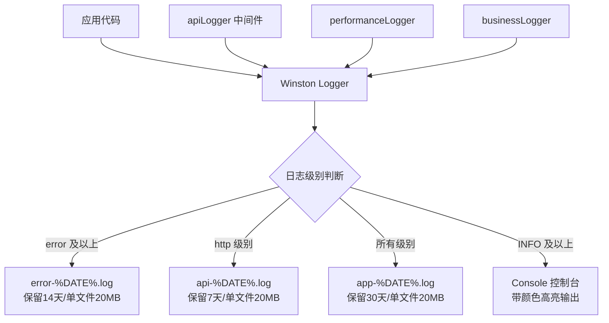
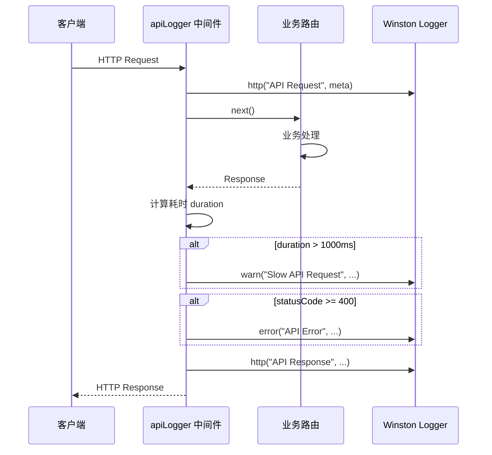
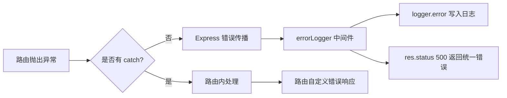
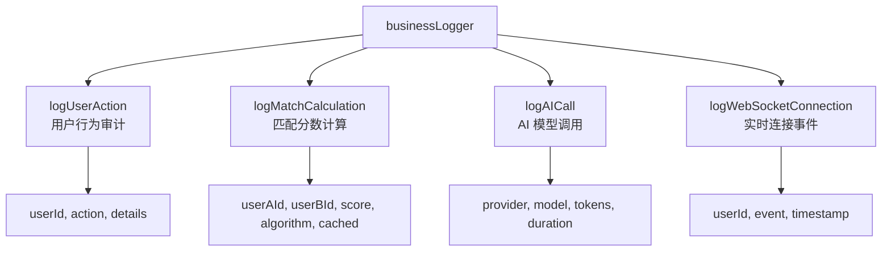
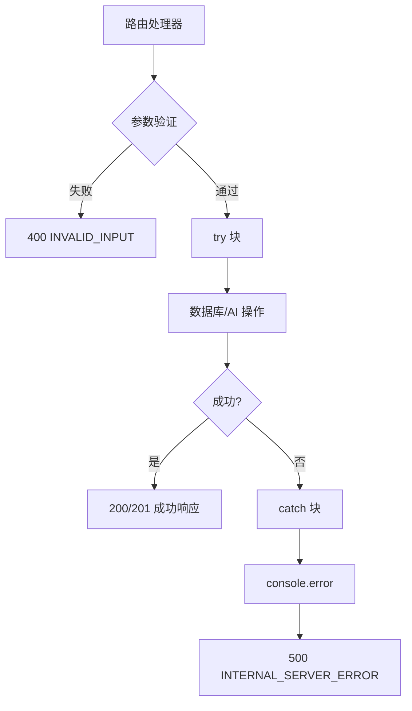
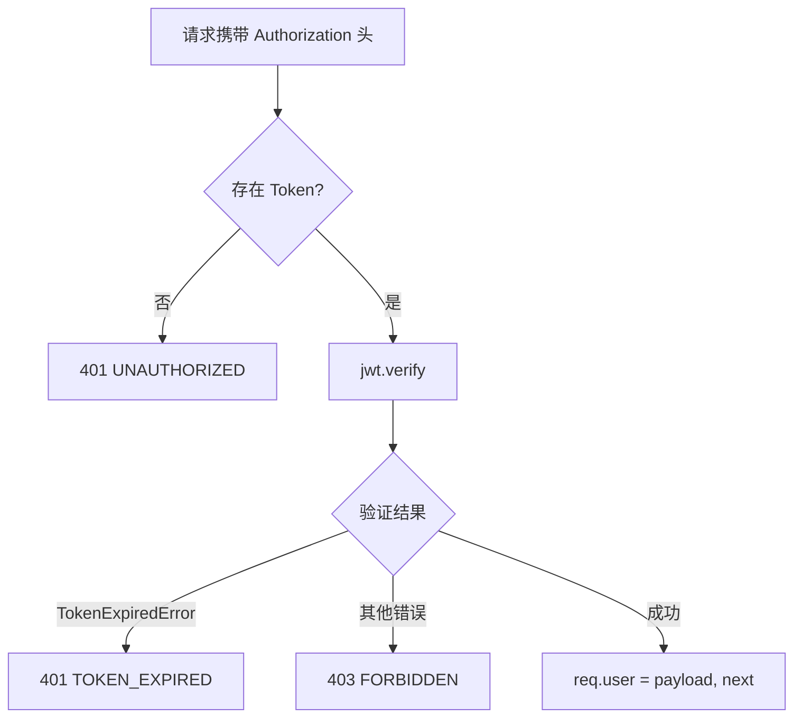
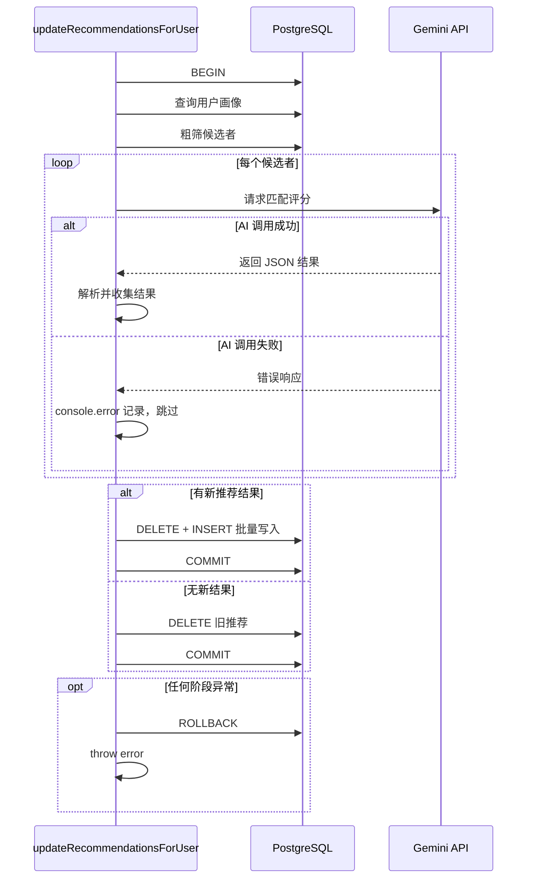
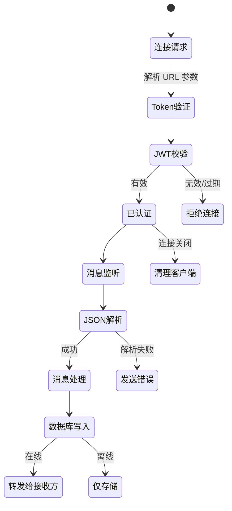
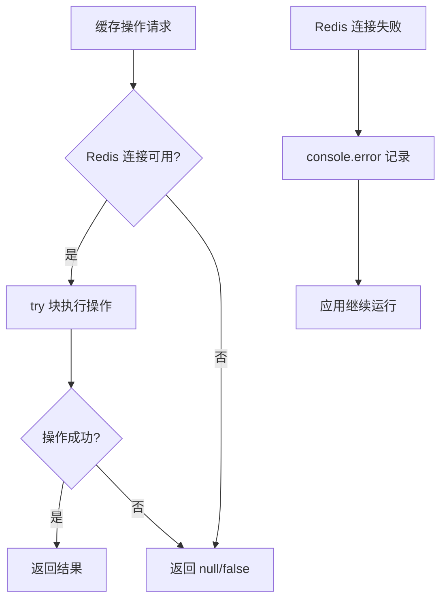

本文档系统性阐述 AI月老 后端的日志架构与错误处理策略。系统采用 **Winston 结构化日志引擎** 作为核心记录器，配合 Express 中间件链实现请求级可观测性，同时在业务层、缓存层与实时通信层分别采用差异化的错误恢复策略。理解该体系有助于在生产环境中快速定位问题、优化慢请求以及保障服务降级时的可用性。

## 日志架构概览

系统日志体系由 **单一定义的 Winston Logger** 和 **四个独立 Transport 输出通道** 组成。所有日志通过统一入口分发，但按语义级别自动路由到不同目标：控制台实时调试、错误文件持久化、应用日志归档、以及 HTTP API 访问流水。

四个 Transport 的保留策略遵循 **不同语义不同生命周期** 的原则。错误日志保留 14 天用于事故回溯，API 流水仅保留 7 天控制磁盘占用，应用日志保留 30 天用于长期趋势分析。所有文件 Transport 均使用 `winston-daily-rotate-file` 实现按日轮转，单文件上限 20MB 防止单个日志文件过大影响 I/O。

Sources: [logger.js](backend/services/logger.js#L1-L70)

## 日志级别与传输矩阵

| 级别 | 控制台 | app 文件 | error 文件 | api 文件 | 典型使用场景 |
|------|--------|----------|------------|----------|-------------|
| `error` | ✅ | ✅ | ✅ | ❌ | 未捕获异常、API 5xx 响应、数据库连接失败 |
| `warn` | ✅ | ✅ | ❌ | ❌ | 慢请求（>1s）、慢数据库查询（>100ms）、AI API 超时 |
| `info` | ✅ | ✅ | ❌ | ❌ | 用户行为、匹配计算、外部 API 调用、业务事件 |
| `http` | ✅ | ✅ | ❌ | ✅ | 所有 API 请求/响应流水 |

级别阈值通过环境变量 `LOG_LEVEL` 控制，默认值为 `info`。在生产环境中建议设置为 `warn` 减少噪声；在开发环境中使用 `debug`（若需要额外调试输出则需扩展 Winston 配置）。

Sources: [logger.js](backend/services/logger.js#L34-L75)

## API 请求日志中间件

`apiLogger` 中间件挂载于所有 `/api` 路由之前，在请求进入时记录方法、URL、IP 与 User-Agent，在响应完成后记录状态码与耗时。该中间件内嵌两项**自动告警逻辑**：当响应耗时超过 1 秒时输出 `warn` 级别的慢请求告警；当状态码 ≥ 400 时输出 `error` 级别的 API 错误记录。

慢请求阈值（1 秒）是系统默认的启发式设定。对于涉及 AI 匹配的接口（如 `/api/recommendations/calculate`），该阈值可能过于严格，因为外部 LLM 调用通常耗时数秒。后续迭代中可针对不同路由组配置差异化阈值。

Sources: [logger.js](backend/services/logger.js#L77-L120) [server.js](backend/server.js#L19-L20)

## 全局错误处理中间件

`errorLogger` 作为 Express 错误处理中间件，挂载在所有路由定义之后。当任何路由中抛出未捕获的异常且未被 `catch` 处理时，该中间件会拦截错误并执行两项操作：以 `error` 级别写入完整错误堆栈（包含 URL、Method、IP），然后向客户端返回统一的 `500 INTERNAL_SERVER_ERROR` JSON 响应。

当前错误处理中间件的局限在于：它向客户端返回固定的中文错误提示"服务器内部错误"，不包含 `requestId` 或错误追踪标识，这增加了运维时关联客户端反馈与服务器日志的难度。在生产环境中建议增加请求 ID 生成中间件并在错误响应中返回。

Sources: [logger.js](backend/services/logger.js#L122-L135) [server.js](backend/server.js#L55-L56)

## 性能监控日志

`performanceLogger` 提供三个专用性能记录器，覆盖数据库、外部 API 与缓存三层关键路径。数据库查询日志以 100ms 为慢查询阈值，外部 API 调用记录成功/慢状态（2 秒分界线），缓存操作记录命中/未命中与耗时。

| 方法 | 参数 | 触发条件 | 日志级别 |
|------|------|----------|----------|
| `logQuery(query, duration)` | SQL 片段（截断至 100 字符）、耗时 | `duration > 100ms` | `warn` |
| `logExternalAPI(api, duration)` | API 名称、耗时 | 所有调用 | `info` |
| `logCache(operation, hit, duration)` | 操作类型、是否命中、耗时 | 所有缓存操作 | `http` |

这些性能日志目前定义在 `logger.js` 中但尚未被广泛集成到数据库查询层。当前 `recommendationService.js` 和各个路由仍使用 `console.log/console.error` 进行性能记录，这是日志体系迁移的下一步优化方向。

Sources: [logger.js](backend/services/logger.js#L137-L167)

## 业务事件日志

`businessLogger` 封装了五类业务事件的标准化记录方式，确保所有业务操作具有统一的日志结构与元数据。

这些业务日志均为 `info` 级别，写入 `app-%DATE%.log` 和控制台。它们在匹配算法执行、AI 调用计费和 WebSocket 连接审计等场景中提供可追溯的事件流水。

Sources: [logger.js](backend/services/logger.js#L169-L222)

## 路由层错误处理模式

各路由文件采用 **try-catch + 结构化错误响应** 的统一模式。所有异步路由处理器被 `try` 块包裹，`catch` 分支通过 `console.error` 打印错误详情并返回包含 `code` 和 `message` 的 JSON 错误对象。

当前路由层的错误处理存在一个 **架构不一致**：所有路由使用 `console.error` 直接输出错误而非通过 `logger.error` 记录。这意味着这些错误不会被写入 `error-%DATE%.log` 文件，也不会进入结构化日志管道。以下是各路由模块的错误处理现状：

| 路由文件 | 错误处理方式 | 是否使用 logger | 错误码覆盖 |
|---------|-------------|----------------|-----------|
| [auth.js](backend/routes/auth.js#L25-L119) | try-catch + console.error | ❌ | 400, 401, 409, 500 |
| [chat.js](backend/routes/chat.js#L15-L123) | try-catch + console.error | ❌ | 400, 500 |
| [recommendations.js](backend/routes/recommendations.js#L20-L288) | try-catch + console.error | ❌ | 400, 404, 500 |
| [users.js](backend/routes/users.js#L77-L193) | try-catch + console.error | ❌ | 400, 401, 403, 404, 500 |
| [community.js](backend/routes/community.js#L87-L367) | try-catch + console.error | ❌ | 400, 403, 500 |
| [pokeball.js](backend/routes/pokeball.js#L63-L304) | try-catch + console.error | ❌ | 400, 404, 500 |

统一迁移到 `logger.error` 可确保所有错误均被持久化记录，并受益于 Winston 的日志轮转和格式化处理。

Sources: [auth.js](backend/routes/auth.js#L72-L74) [chat.js](backend/routes/chat.js#L52-L54) [recommendations.js](backend/routes/recommendations.js#L162-L164)

## 认证中间件错误处理

JWT 认证中间件 `authenticateToken.js` 实现了三层错误区分：无 Token（401 UNAUTHORIZED）、Token 过期（401 TOKEN_EXPIRED）和 Token 无效（403 FORBIDDEN）。该中间件当前使用 `console.error` 记录 JWT 验证错误，同样未通过 Winston Logger 输出。

Sources: [authenticateToken.js](backend/middleware/authenticateToken.js#L1-L26)

## 推荐服务事务与错误处理

`recommendationService.js` 是系统中错误处理最为完善的模块。它使用数据库事务（BEGIN/COMMIT/ROLLBACK）确保推荐数据的一致性，并在每个 AI 调用失败时执行**隔离恢复**——跳过失败的候选者，继续处理剩余的候选者。

该服务在 `catch` 块中执行 ROLLBACK 后重新抛出异常，确保调用者（如路由层）能感知到整体失败。AI 调用的逐条容错策略避免了因单个候选者匹配失败而导致整个推荐流程中断。

Sources: [recommendationService.js](backend/services/recommendationService.js#L15-L294)

## WebSocket 错误处理

WebSocket 服务在连接层、消息处理层和客户端事件层分别实现错误处理。连接阶段验证 JWT 并关闭无效连接；消息处理阶段通过 `try-catch` 包裹 JSON 解析和数据库操作，向发送方返回结构化错误消息；连接关闭和错误事件通过 `close` 和 `error` 回调清理客户端映射。

WebSocket 层当前使用 `console.log/console.error` 而非 Winston Logger，这使得 WebSocket 相关的连接和错误事件未被纳入结构化日志体系。

Sources: [websocketService.js](backend/services/websocketService.js#L1-L144)

## 缓存服务降级策略

Redis 缓存服务实现了**优雅降级**模式：连接失败时仅输出错误日志而不阻塞应用启动；所有缓存读写操作均在 `try-catch` 中执行，失败时返回默认值（`null` 或 `false`）而非抛出异常。这确保了 Redis 不可用时核心业务功能不受影响。

重连策略使用指数退避（`retries * 100ms`），最多重试 10 次后停止重连并输出错误。这种策略在 Redis 临时不可用时避免无限重连消耗资源。

Sources: [cacheService.js](backend/services/cacheService.js#L1-L228)

## 日志配置与运维

日志文件存储在 `backend/../logs` 目录（即项目根目录下的 `logs` 文件夹），由 DailyRotateFile Transport 按日自动生成。文件名模式为 `{type}-{DATE}.log`，其中 DATE 格式为 `YYYY-MM-DD`。

| 日志文件 | 内容 | 保留天数 | 单文件上限 |
|---------|------|---------|-----------|
| `error-YYYY-MM-DD.log` | error 级别及以上 | 14 天 | 20 MB |
| `app-YYYY-MM-DD.log` | 所有级别 | 30 天 | 20 MB |
| `api-YYYY-MM-DD.log` | http 级别 | 7 天 | 20 MB |

通过环境变量 `LOG_LEVEL` 可在运行时调整日志级别：

| LOG_LEVEL 值 | 效果 | 适用环境 |
|-------------|------|---------|
| `error` | 仅记录错误 | 生产高流量 |
| `warn` | 错误 + 警告 | 生产常规 |
| `info` | 错误 + 警告 + 信息（默认） | 开发/测试 |
| `http` | 包含所有 API 流水 | 调试 API 行为 |
| `debug` | 最详细输出 | 深入调试 |

当前 `.env.example` 未包含 `LOG_LEVEL` 配置项，建议在环境变量模板中显式添加以便运维人员管理。

Sources: [logger.js](backend/services/logger.js#L10-L75) [.env.example](backend/.env.example#L1-L25)

## 架构改进建议

基于当前代码模式分析，以下改进方向可显著提升日志体系的可观测性和运维效率：

**统一日志入口**：将所有路由和中间件中的 `console.error` 替换为 `logger.error`。这一步确保所有错误被结构化记录到持久化文件，而非仅输出到可能被 Docker 容器日志轮转丢弃的标准输出。

**请求 ID 追踪**：在 `apiLogger` 中间件中生成唯一 `requestId`（UUID），将其附加到所有后续日志条目和错误响应中。这使得在多请求并发场景下关联特定请求的完整日志链成为可能。

**慢请求阈值差异化**：对涉及外部 AI 调用的路由（如 `/api/recommendations/calculate`）设置更高的慢请求阈值（如 5-10 秒），避免对预期耗时较长的操作产生误报警。

**日志聚合集成**：在生产环境中将 `logs` 目录下的日志文件接入集中式日志系统（如 ELK Stack 或 Loki），利用 Winston 的 JSON 格式输出直接作为结构化日志源。

Sources: [logger.js](backend/services/logger.js#L77-L135) [authenticateToken.js](backend/middleware/authenticateToken.js#L15)

## 下一步阅读

- 了解错误传播的上游链路：[Express 路由设计](22-express-lu-you-she-ji)
- 排查数据库相关的错误处理：[数据库模式概览](34-shu-ju-ku-mo-shi-gai-lan)
- 掌握生产环境部署时的日志管理：[Docker 容器化部署](39-docker-rong-qi-hua-bu-shu)