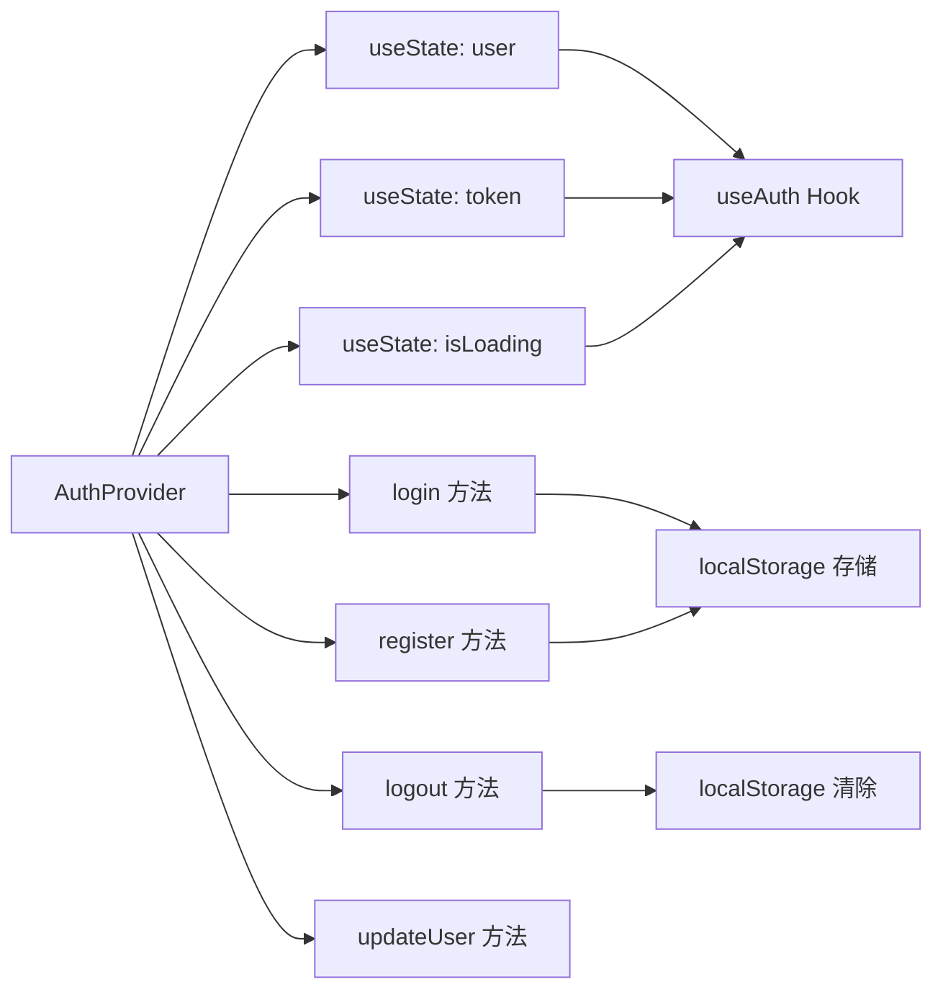
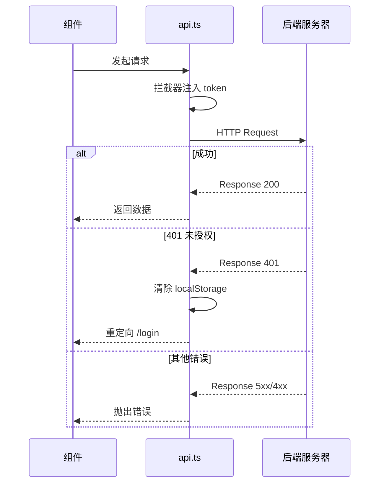
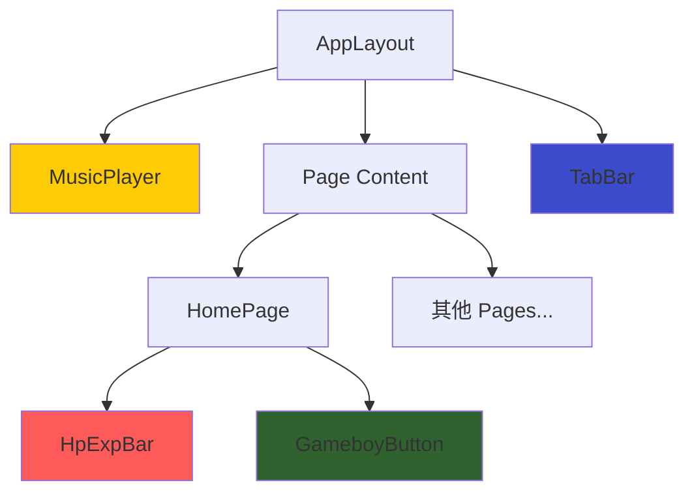

本文档帮助你理解 `frontend-react` 目录的组织方式与设计模式。这是一个基于 **Vite + React 19 + TypeScript** 的宝可梦主题社交应用前端，采用 GameBoy 复古风格设计。

## 整体目录架构

```
frontend-react/
├── package.json          # 项目依赖与脚本配置
├── vite.config.ts        # Vite 构建工具配置
├── tsconfig.json         # TypeScript 根配置
├── tsconfig.app.json     # 应用代码 TypeScript 配置
├── index.html            # HTML 入口模板
├── public/               # 静态资源（不经过构建处理）
│   └── vite.svg
└── src/                  # 源代码目录
    ├── main.tsx          # 应用入口：挂载 React 根节点
    ├── App.tsx           # 根组件：路由定义与布局
    ├── index.css         # 全局样式（Tailwind + 自定义主题）
    ├── App.css           # 组件级样式
    ├── config.ts         # 全局配置：API 地址、端点、二维码映射
    ├── contexts/         # React Context：全局状态管理
    │   └── AuthContext.tsx
    ├── services/         # 业务服务层：HTTP 客户端封装
    │   └── api.ts
    ├── components/       # 可复用 UI 组件
    │   ├── GameboyButton.tsx
    │   ├── HpExpBar.tsx
    │   ├── MusicPlayer.tsx
    │   └── TabBar.tsx
    ├── pages/            # 页面组件（路由级）
    │   ├── HomePage.tsx
    │   ├── LoginPage.tsx
    │   ├── RegisterPage.tsx
    │   ├── MapPage.tsx
    │   ├── ChatPage.tsx
    │   ├── CommunityPage.tsx
    │   ├── ProfilePage.tsx
    │   └── PokeballPage.tsx
    ├── hooks/            # 自定义 React Hooks（预留）
    └── types/            # TypeScript 类型定义（预留）
```

Sources: [package.json](frontend-react/package.json#L1-L36), [vite.config.ts](frontend-react/vite.config.ts#L1-L16)

## 技术栈概览

| 技术 | 版本 | 用途 |
|------|------|------|
| React | 19.2.0 | UI 框架 |
| TypeScript | 5.9.3 | 类型安全 |
| Vite | 7.3.1 | 构建工具与开发服务器 |
| TailwindCSS | 4.2.1 | 原子化 CSS 框架 |
| React Router | 7.13.1 | 客户端路由 |
| Axios | 1.13.6 | HTTP 请求库 |
| 高德地图 JS API | 1.0.1 | 地图功能集成 |

Sources: [package.json](frontend-react/package.json#L9-L24)

## 核心文件解析

### 1. 入口文件：main.tsx

应用的启动入口，负责将 React 根组件挂载到 DOM。使用 `StrictMode` 启用开发模式下的严格检查。

```
main.tsx → App.tsx → BrowserRouter + AuthProvider → Routes
```

Sources: [main.tsx](frontend-react/src/main.tsx#L1-L11)

### 2. 路由与布局：App.tsx

这是整个应用的路由中心，定义了三层架构：

- **AuthProvider**：包裹全局，提供认证状态
- **ProtectedRoute**：路由守卫，未登录用户重定向到 `/login`
- **AppLayout**：页面布局容器，包含 MusicPlayer 和底部 TabBar

路由结构如下：

```mermaid
graph TD
    A[App] --> B[BrowserRouter]
    B --> C[AuthProvider]
    C --> D[AppRoutes]
    D --> E[/login - 公开]
    D --> F[/register - 公开]
    D --> G[ProtectedRoute 守卫]
    G --> H[AppLayout 布局]
    H --> I[MusicPlayer]
    H --> J[页面内容]
    H --> K[TabBar 底部导航]
    J --> L[HomePage /]
    J --> M[MapPage /map]
    J --> N[ChatPage /chat]
    J --> O[CommunityPage /community]
    J --> P[ProfilePage /profile]
    J --> Q[PokeballPage /pokeball]
```

Sources: [App.tsx](frontend-react/src/App.tsx#L1-L123)

### 3. 全局配置：config.ts

集中管理所有外部服务地址和 API 端点，便于环境切换。

| 配置项 | 说明 |
|--------|------|
| `API_BASE_URL` | 后端 API 基础地址 |
| `WS_URL` | WebSocket 实时聊天地址 |
| `UPLOAD_BASE_URL` | 文件上传资源地址 |
| `MUSIC_BASE_URL` | 音乐资源地址 |
| `API_ENDPOINTS` | 所有 API 路由的常量映射 |
| `QR_CODE_IMAGES` | 精灵球充值二维码图片映射 |

Sources: [config.ts](frontend-react/src/config.ts#L1-L53)

## 状态管理模式

项目采用 **React Context API** 进行全局状态管理，核心是 `AuthContext`。



`AuthContext` 提供以下能力：

- **持久化**：token 和用户数据存储在 localStorage
- **自动验证**：应用启动时验证 token 有效性
- **全局访问**：通过 `useAuth()` 自定义 Hook 在任何组件中获取认证状态
- **拦截器集成**：与 `api.ts` 的 axios 拦截器联动处理 401 未授权

Sources: [AuthContext.tsx](frontend-react/src/contexts/AuthContext.tsx#L1-L135)

## HTTP 通信层

`services/api.ts` 封装了 Axios 实例，统一处理认证和错误：

| 功能 | 实现方式 |
|------|----------|
| 请求拦截 | 自动附加 `Authorization: Bearer <token>` 头 |
| 响应拦截 | 401 错误时清除本地存储并跳转登录页 |
| 基础配置 | 统一设置 `baseURL` 和 `Content-Type` |



Sources: [api.ts](frontend-react/src/services/api.ts#L1-L36)

## 组件设计模式

### 可复用 UI 组件

项目中的组件遵循 **受控 props + 变体模式**：

| 组件 | 职责 | 关键 Props |
|------|------|-----------|
| `GameboyButton` | 主题按钮 | `variant`, `size`, `loading`, `subText` |
| `HpExpBar` | 进度条显示 | `hp`, `maxHp`, `exp`, `maxExp` |
| `TabBar` | 底部导航 | 无（通过 NavLink 自动激活状态） |
| `MusicPlayer` | 背景音乐控制 | `src`, `autoPlay` |

### 组件架构关系



Sources: [GameboyButton.tsx](frontend-react/src/components/GameboyButton.tsx#L1-L57), [HpExpBar.tsx](frontend-react/src/components/HpExpBar.tsx#L1-L48), [TabBar.tsx](frontend-react/src/components/TabBar.tsx#L1-L40), [MusicPlayer.tsx](frontend-react/src/components/MusicPlayer.tsx#L1-L124)

## 样式系统

项目采用 **TailwindCSS + CSS 自定义属性** 的混合方案：

```
index.css 结构
├── @import "tailwindcss"          # 引入 Tailwind
├── :root 变量定义                  # GameBoy/宝可梦配色
├── body 全局样式                   # 背景渐变 + 字体
├── .gameboy-border                # 通用边框样式
├── .gameboy-btn                   # 按钮交互效果
├── .pokemon-card                  # 卡片容器样式
├── .gameboy-input                 # 表单输入样式
└── .type-* 属性颜色                # 18 种宝可梦属性色
```

设计特点：
- **GameBoy 四色系统**：`#9BBC0F`（浅绿背景）、`#0F380F`（深绿文字）、`#306230`（中绿强调）、`#8BAC0F`（渐变过渡）
- **宝可梦品牌色**：`#FFCB05`（皮卡丘黄）、`#3B4CCA`（精灵球蓝）、`#FF5A5A`（生命值红）
- **硬阴影风格**：`box-shadow: 4px 4px 0px 0px #000000` 模拟复古像素感

Sources: [index.css](frontend-react/src/index.css#L1-L107)

## 预留扩展目录

| 目录 | 当前状态 | 建议用途 |
|------|----------|----------|
| `hooks/` | 空目录 | 存放自定义 Hooks，如 `useWebSocket`、`useLocation` |
| `types/` | 空目录 | 存放共享 TypeScript 类型定义，如 `User`、`Message`、`Photo` |

这两个目录已创建但尚未使用，随着功能扩展可逐步填充。

## TypeScript 配置要点

[`tsconfig.app.json`](frontend-react/tsconfig.app.json#L1-L29) 的关键配置：

- `target: ES2022`：编译目标为现代 JavaScript
- `moduleResolution: bundler`：适配 Vite 的模块解析策略
- `jsx: react-jsx`：使用 React 17+ 的 JSX 转换
- `strict: true`：启用严格类型检查
- `noUnusedLocals/Parameters: true`：禁止未使用的变量和参数

Sources: [tsconfig.app.json](frontend-react/tsconfig.app.json#L1-L29)

## 下一步学习路径

理解项目结构后，建议按以下顺序深入学习：

1. **[路由与权限控制](13-lu-you-yu-quan-xian-kong-zhi)** — 深入了解 ProtectedRoute 守卫机制
2. **[状态管理与认证上下文](14-zhuang-tai-guan-li-yu-ren-zheng-shang-xia-wen)** — AuthContext 的完整实现细节
3. **[GameBoy 复古风格设计](15-gameboy-fu-gu-feng-ge-she-ji)** — UI 主题系统的实现原理
4. **[首页与推荐列表](18-shou-ye-yu-tui-jian-lie-biao)** — 页面组件的实际开发模式