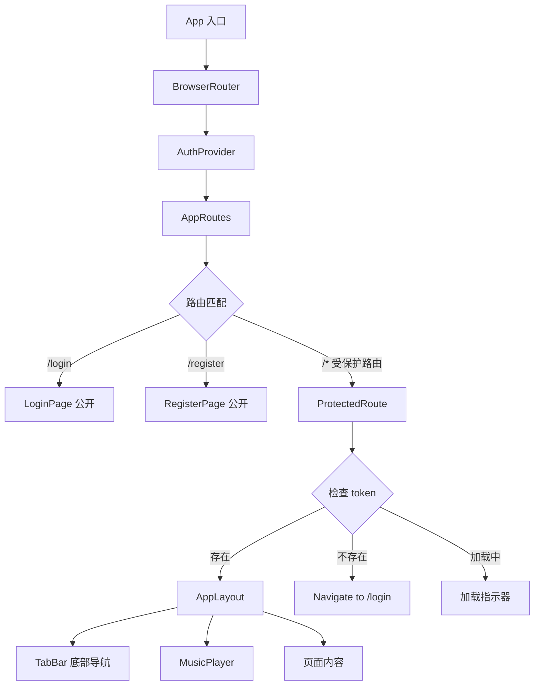
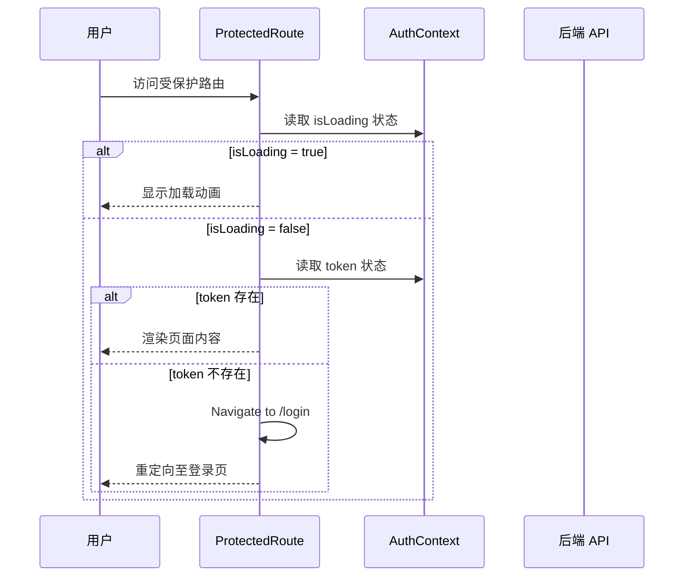
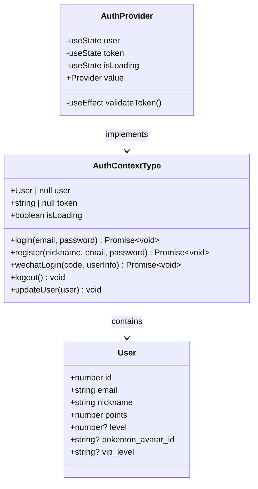
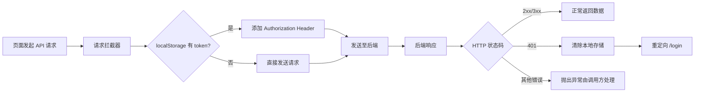
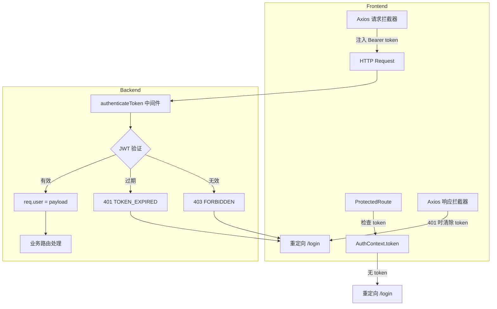

本文档解析 AIlove 前端应用的路由架构与权限控制机制。系统采用 **React Router v6** 作为客户端路由方案，结合 **AuthContext** 认证上下文实现声明式路由守卫，并通过 Axios 拦截器与后端 JWT 中间件形成完整的前后端权限验证闭环。

## 路由架构概览

应用路由采用 **声明式嵌套结构**，将路由定义、权限守卫与页面布局解耦为独立组件。所有路由在 `AppRoutes` 中集中声明，通过 `ProtectedRoute` 组件实现访问控制，`AppLayout` 组件提供统一的页面外壳（底部导航栏与音乐播放器）。

路由表采用扁平化定义，每个受保护路由独立包裹 `ProtectedRoute` 与 `AppLayout`，这种设计避免了嵌套路由的复杂性，同时保证每个页面的权限状态独立可控。

Sources: [App.tsx](frontend-react/src/App.tsx#L25-L102)

## 受保护路由守卫

`ProtectedRoute` 组件是实现前端权限控制的核心。它通过消费 `AuthContext` 中的 `token` 状态，在渲染子组件前执行三重状态判断：

| 状态条件 | 渲染行为 | 用户体验 |
|---------|---------|---------|
| `isLoading === true` | 显示"加载中..."动画 | 避免 token 验证期间的页面闪烁 |
| `token === null` | 重定向至 `/login` | 未登录用户无法访问受保护页面 |
| `token` 存在 | 渲染子组件（页面内容） | 已认证用户正常访问 |

守卫组件在 token 验证完成前（`isLoading` 阶段）阻止任何页面渲染，有效防止未认证状态下的路由闪烁问题。重定向使用 `replace` 模式，避免用户通过浏览器后退按钮绕过登录。

守卫组件不直接调用 API 验证 token，而是依赖 `AuthProvider` 初始化时完成的验证结果，这种职责分离使守卫逻辑保持纯粹的状态判断。

Sources: [App.tsx](frontend-react/src/App.tsx#L13-L23)

## 认证上下文架构

`AuthProvider` 作为全局状态容器，管理用户认证生命周期的全部状态与操作。上下文提供的 `AuthContextType` 接口定义了完整的认证能力契约：

**Token 持久化策略**：应用采用 `localStorage` 存储 token 与用户数据，页面刷新时通过 `useEffect` 中的 `validateToken` 函数向后端发起状态验证请求（`GET /users/me/status`）。验证失败时自动清除本地存储，确保无效凭证不会残留。

登录与注册流程遵循统一模式：调用后端 API 获取 token → 存储至 localStorage → 更新 context 状态。这种模式保证 token 在内存与持久化存储中保持同步。

Sources: [AuthContext.tsx](frontend-react/src/contexts/AuthContext.tsx#L1-L135)

## API 层权限拦截

`api.ts` 中的 Axios 实例配置了请求与响应双向拦截器，形成客户端权限控制的第二道防线：

**请求拦截器**：自动从 `localStorage` 读取 token 并注入到 `Authorization` 请求头，格式为 `Bearer <token>`。所有通过 `api` 实例发起的请求无需手动处理认证头，确保 API 调用的一致性。

**响应拦截器**：捕获 `401 Unauthorized` 状态码时，自动清除本地 token 与用户数据，并将页面重定向至登录页。这种机制处理了 token 过期、服务端主动撤销认证等场景，提供自动化的会话恢复流程。

拦截器模式将认证逻辑从业务代码中剥离，页面组件只需关注数据获取与 UI 渲染，无需处理认证失败的重定向逻辑。

Sources: [api.ts](frontend-react/src/services/api.ts#L1-L36)

## 路由表结构

应用定义了 7 条路由，其中 2 条为公开路由，5 条为受保护路由。路由路径与页面组件的映射关系如下：

| 路径 | 组件 | 权限要求 | 说明 |
|------|------|---------|------|
| `/login` | `LoginPage` | 公开 | 邮箱/微信登录入口 |
| `/register` | `RegisterPage` | 公开 | 新用户注册 |
| `/` | `HomePage` | 需认证 | 推荐列表首页 |
| `/map` | `MapPage` | 需认证 | 地理位置发现页 |
| `/chat` | `ChatPage` | 需认证 | 实时聊天界面 |
| `/community` | `CommunityPage` | 需认证 | 社区照片墙 |
| `/profile` | `ProfilePage` | 需认证 | 个人资料管理 |
| `/pokeball` | `PokeballPage` | 需认证 | 精灵球积分系统 |
| `*` | 重定向 `/` | - | 未知路径兜底 |

**底部导航**：`TabBar` 组件使用 `NavLink` 实现 5 个主导航入口（首页、发现、聊天、社区、我的），通过 `isActive` 状态切换高亮样式（`bg-[#306230]`），与 GameBoy 复古风格保持一致。注意 `/pokeball` 路由未包含在底部导航中，需通过其他入口访问。

Sources: [App.tsx](frontend-react/src/App.tsx#L25-L102) [TabBar.tsx](frontend-react/src/components/TabBar.tsx#L1-L40)

## 前后端权限协同

前端权限控制与后端 JWT 中间件形成协同验证机制：

**验证时机**：前端在路由切换时检查 token 是否存在（快速失败），后端在每个受保护 API 请求时验证 token 有效性（权威验证）。这种双重验证既保证了用户体验（无需等待 API 响应即可拦截未认证访问），又确保了安全性（服务端验证不可绕过）。

**Token 过期处理**：当后端返回 `TOKEN_EXPIRED` 错误时，前端响应拦截器统一处理为 401 状态，触发本地存储清除与登录页重定向。用户需重新登录获取新 token。

Sources: [authenticateToken.js](backend/middleware/authenticateToken.js#L1-L26) [api.ts](frontend-react/src/services/api.ts#L20-L30)

## 扩展建议

当前架构适合单角色用户系统，如需引入角色权限（RBAC）或多租户隔离，可在以下层面扩展：

- **AuthContext 扩展**：在 `User` 接口中添加 `role` 或 `permissions` 字段，`ProtectedRoute` 可接受 `requiredRole` 参数进行角色校验
- **路由守卫升级**：创建 `RoleGuard` 组件包裹在 `ProtectedRoute` 之后，实现细粒度权限控制
- **API 拦截增强**：在响应拦截器中处理 `403 Forbidden` 状态，跳转至权限不足提示页

对于当前应用场景，现有架构已提供完整的认证保护与优雅的用户体验流程。深入了解状态管理细节可参考 [状态管理与认证上下文](14-zhuang-tai-guan-li-yu-ren-zheng-shang-xia-wen)，查看后端 JWT 实现可参考 [JWT 认证与授权中间件](23-jwt-ren-zheng-yu-shou-quan-zhong-jian-jian)。