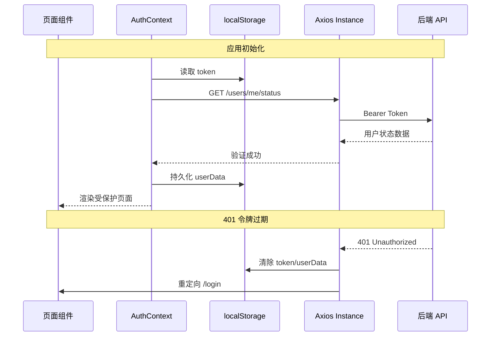
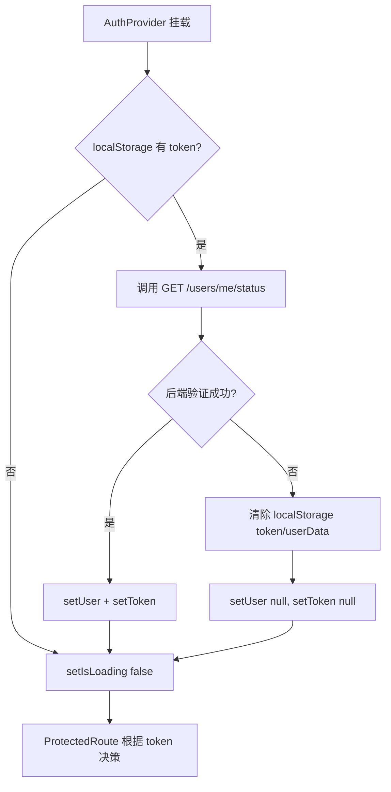
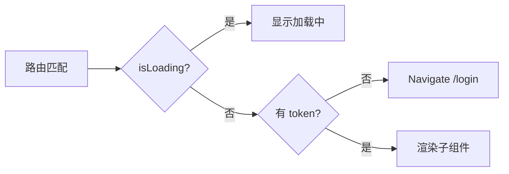

本文档剖析 AIlove 前端的状态管理架构与认证上下文体系。项目采用 **React Context API + localStorage** 的轻量级方案，而非 Redux 或 Zustand 等外部状态库——这一选择与当前应用规模（单页面社交应用、用户态数据单一）相匹配。认证流程以 JWT 为核心，通过 Axios 拦截器实现全链路自动化令牌注入，配合受保护路由守卫完成访问控制。

## 认证架构总览

整个认证体系由前端状态层、HTTP 通信层和后端验证层三部分组成，形成闭环的令牌生命周期管理。

Sources: [AuthContext.tsx](frontend-react/src/contexts/AuthContext.tsx#L34-L52), [api.ts](frontend-react/src/services/api.ts#L24-L34)

## AuthContext 状态模型

`AuthContext` 是前端唯一的全局状态提供者，管理四个核心状态和五个操作方法。它通过 `createContext` + `useContext` 模式暴露认证能力，所有需要感知用户状态的组件均可通过 `useAuth()` 钩子获取。

| 状态属性 | 类型 | 存储位置 | 说明 |
|---------|------|---------|------|
| `user` | `User \| null` | Context + localStorage | 用户核心信息（id、nickname、points、level 等） |
| `token` | `string \| null` | Context + localStorage | JWT 访问令牌 |
| `isLoading` | `boolean` | Context | 应用启动时的令牌验证加载态 |
| 操作方法 | — | — | — |
| `login` | `(email, password) => Promise<void>` | — | 邮箱密码登录 |
| `register` | `(nickname, email, password) => Promise<void>` | — | 新用户注册 |
| `wechatLogin` | `(code, userInfo) => Promise<void>` | — | 微信授权登录 |
| `logout` | `() => void` | — | 清除所有认证状态 |
| `updateUser` | `(user: User) => void` | — | 局部更新用户信息 |

**关键设计决策**：令牌与用户数据采用 **Context + localStorage 双写策略**。Context 提供响应式更新驱动 UI 重渲染，localStorage 保证页面刷新后状态可恢复。这种模式避免了引入额外状态管理库的复杂度，但要求开发者在每次状态变更时同步维护两处存储。

Sources: [AuthContext.tsx](frontend-react/src/contexts/AuthContext.tsx#L6-L25), [AuthContext.tsx](frontend-react/src/contexts/AuthContext.tsx#L29-L32)

## 令牌生命周期

### 初始化验证流程

应用启动时，`AuthProvider` 内部的 `useEffect` 会执行一次令牌验证。该流程决定了用户是看到受保护内容还是被重定向至登录页：

这一设计确保即使客户端 localStorage 中存在令牌，后端也已失效（如 JWT 过期、用户被禁用）的情况下，前端不会错误地渲染受保护页面。验证请求携带的 `Bearer Token` 由 Axios 请求拦截器自动注入。

Sources: [AuthContext.tsx](frontend-react/src/contexts/AuthContext.tsx#L34-L52), [api.ts](frontend-react/src/services/api.ts#L12-L19)

### 登录与注册流程

登录和注册采用相同的模式：调用后端 API 获取 JWT，同步写入 Context 和 localStorage，然后由页面组件通过 `navigate('/')` 跳转至首页。值得注意的是，前端在登录成功后构建的 `userData` 对象仅包含基础字段（`id`、`email`、`nickname`、`points`、`level`），完整的用户资料需要通过 `GET /users/me/profile` 另行获取。

Sources: [AuthContext.tsx](frontend-react/src/contexts/AuthContext.tsx#L54-L71), [AuthContext.tsx](frontend-react/src/contexts/AuthContext.tsx#L73-L90), [auth.js](backend/routes/auth.js#L54-L64)

### 登出流程

`logout()` 方法执行四步清理：移除 `localStorage` 中的 `token` 和 `userData`，将 Context 中的 `user` 和 `token` 置为 `null`。由于 `ProtectedRoute` 监听 `token` 状态，状态更新后未认证的请求会被自动拦截并导向登录页。

Sources: [AuthContext.tsx](frontend-react/src/contexts/AuthContext.tsx#L92-L97)

## Axios 拦截器机制

`api.ts` 封装的 Axios 实例是前后端通信的核心枢纽，通过两个拦截器实现认证自动化：

**请求拦截器**：每次 HTTP 请求发出前，从 `localStorage` 读取 token 并注入 `Authorization: Bearer <token>` 头。这确保所有 API 调用（除登录/注册外）都携带有效凭证，后端 `authenticateToken` 中间件可统一处理验证逻辑。

**响应拦截器**：当后端返回 `401 Unauthorized` 时，拦截器自动清除本地认证状态并触发 `window.location.href = '/login'` 强制跳转。这种硬跳转（而非 React Router 的 `navigate`）确保整个应用状态被完全重置，避免残留的 Context 状态导致不一致。

| 拦截器 | 触发条件 | 行为 | 目标 |
|--------|---------|------|------|
| 请求 | 所有请求 | 注入 `Authorization` 头 | 统一认证凭证传递 |
| 响应 | `401` 状态码 | 清除 localStorage + 跳转登录页 | 令牌失效自动处理 |

Sources: [api.ts](frontend-react/src/services/api.ts#L12-L34), [authenticateToken.js](backend/middleware/authenticateToken.js#L3-L22)

## 受保护路由守卫

`ProtectedRoute` 组件是应用级访问控制的实现载体，包裹在所有需要认证的路由外层：

`ProtectedRoute` 的三层决策逻辑确保了三个关键场景的正确处理：
1. **初始化加载期**（`isLoading === true`）：展示加载态 UI，避免短暂闪烁未授权内容
2. **无令牌**（`!token`）：通过 `<Navigate to="/login" replace />` 重定向，`replace` 参数防止用户通过浏览器后退按钮绕过认证
3. **已认证**：正常渲染被包裹的页面组件和 `AppLayout`（包含底部 TabBar 和 MusicPlayer）

Sources: [App.tsx](frontend-react/src/App.tsx#L15-L31)

## 路由拓扑与认证层级

应用路由呈现清晰的**公开层 / 受保护层**二分结构：

| 路由路径 | 认证要求 | 组件层级 |
|---------|---------|---------|
| `/login` | 公开 | `LoginPage` |
| `/register` | 公开 | `RegisterPage` |
| `/` | 受保护 | `ProtectedRoute → AppLayout → HomePage` |
| `/map` | 受保护 | `ProtectedRoute → AppLayout → MapPage` |
| `/chat` | 受保护 | `ProtectedRoute → AppLayout → ChatPage` |
| `/community` | 受保护 | `ProtectedRoute → AppLayout → CommunityPage` |
| `/profile` | 受保护 | `ProtectedRoute → AppLayout → ProfilePage` |
| `/pokeball` | 受保护 | `ProtectedRoute → AppLayout → PokeballPage` |
| `*` | 公开 | 重定向至 `/`（由 ProtectedRoute 二次拦截） |

所有受保护路由共享 `AppLayout` 外壳，提供统一的 GameBoy 风格渐变背景、音乐播放器和底部导航栏。

Sources: [App.tsx](frontend-react/src/App.tsx#L43-L111)

## 组件消费模式

页面组件通过 `useAuth()` 钩子按需解构所需的状态和方法，形成松耦合的依赖关系：

- **LoginPage**：消费 `login` 和 `wechatLogin` 方法处理表单提交，登录成功后通过 `navigate('/')` 跳转
- **ProfilePage**：消费 `logout` 方法处理登出操作，同时独立调用 `api.get('/users/me/profile')` 获取详细资料
- **其他页面**：部分页面通过 `api` 实例直接发起请求（依赖拦截器自动携带令牌），而不直接消费 `useAuth`

这种按需消费模式意味着并非所有页面都依赖 `AuthContext`——仅需要读写认证状态的组件才引入 `useAuth`，其余组件通过 Axios 拦截器隐式获得认证能力。

Sources: [LoginPage.tsx](frontend-react/src/pages/LoginPage.tsx#L11), [ProfilePage.tsx](frontend-react/src/pages/ProfilePage.tsx#L25), [api.ts](frontend-react/src/services/api.ts#L12-L19)

## 架构评估

### 当前方案的优势

**零依赖轻量设计**：不使用 Redux/Zustand 减少了构建体积和学习成本，对于用户态数据单一的应用而言是合理选择。Context + localStorage 的双写模式在应用刷新时天然恢复状态，无需额外持久化中间件。

**拦截器自动化**：Axios 拦截器将认证逻辑从业务代码中剥离，页面组件无需手动处理令牌注入或 401 错误，降低了各模块的耦合度。

### 潜在改进方向

**令牌刷新机制缺失**：当前 JWT 有效期为 1 小时（后端 `expiresIn: '1h'`），但前端无自动刷新逻辑。令牌过期后用户必须重新登录。引入 Refresh Token 机制或静默续期可提升用户体验。

**用户数据同步不一致**：`AuthContext.user` 仅包含基础字段，而 `GET /users/me/profile` 返回完整资料。当用户在 ProfilePage 修改资料后，`AuthContext.user` 不会自动更新，需要通过 `updateUser()` 手动同步，存在状态不同步的风险。

**useAuth 守卫条件**：`useAuth()` 钩子在 Context 未定义时抛出异常（`throw new Error('useAuth must be used within an AuthProvider')`），这是正确的防御性编程实践，但在大型应用中建议通过可选链或默认值提供更优雅的回退。

Sources: [auth.js](backend/routes/auth.js#L57), [AuthContext.tsx](frontend-react/src/contexts/AuthContext.tsx#L129-L134), [AuthContext.tsx](frontend-react/src/contexts/AuthContext.tsx#L99-L102)

## 延伸阅读

- 了解后端 JWT 验证中间件的详细实现：[JWT 认证与授权中间件](23-jwt-ren-zheng-yu-shou-quan-zhong-jian-jian)
- 查看用户认证 API 的请求/响应规范：[用户认证 API](24-yong-hu-ren-zheng-api)
- 探索路由配置与权限守卫的完整拓扑：[路由与权限控制](13-lu-you-yu-quan-xian-kong-zhi)
- 了解 WebSocket 实时通信中的认证传递：[WebSocket 实时通信](9-websocket-shi-shi-tong-xin)