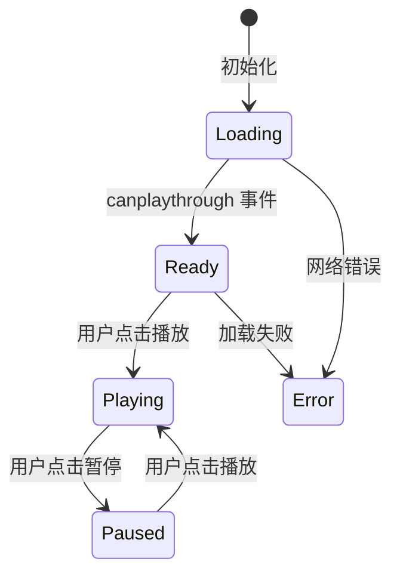
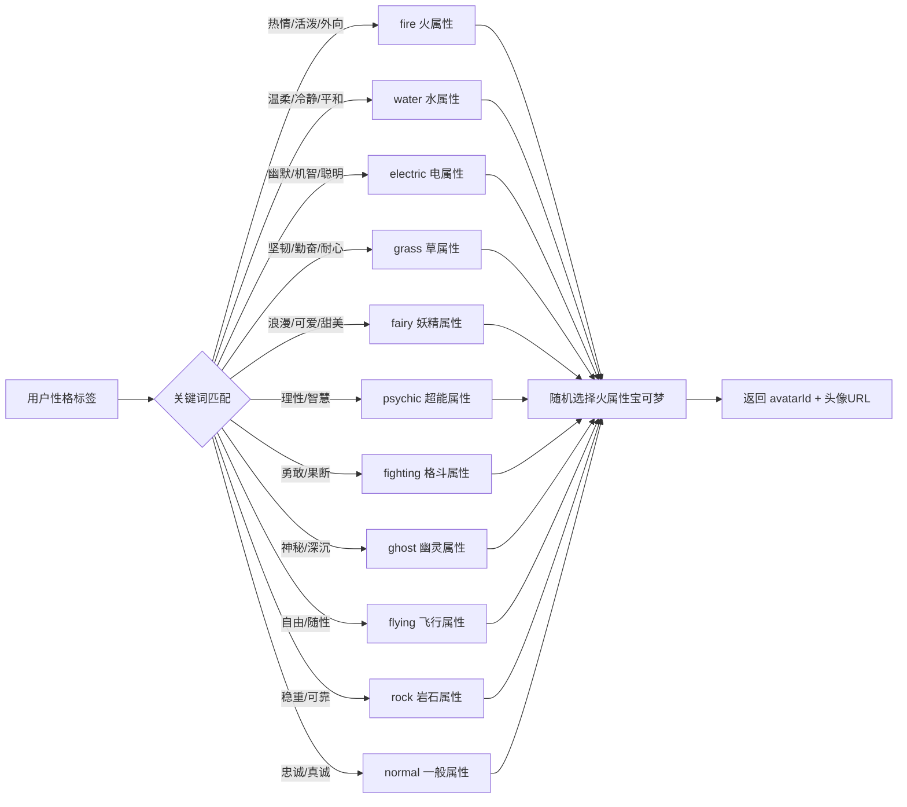
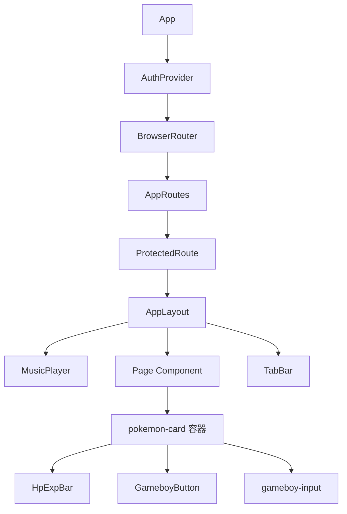

本项目采用 **GameBoy 复古风格** 与 **宝可梦 IP 美学** 双主题融合的设计体系。整个视觉系统以初代 GameBoy 四色灰度为骨架，以宝可梦官方品牌色为点缀，构建了一套贯穿前端页面与后端服务的一致性主题组件库。

## 设计哲学与色彩体系

主题系统建立在三条核心色板之上：GameBoy 原始色调、宝可梦官方品牌色、以及 18 种属性色。这些色值在 [index.css](frontend-react/src/index.css#L4-L17) 中通过 CSS 自定义属性集中定义，确保全局一致性。

| 色板类别 | 变量名 | 色值 | 用途 |
|---------|--------|------|------|
| GameBoy 背景 | `--gameboy-bg` | `#9BBC0F` | 页面主背景渐变 |
| GameBoy 深色 | `--gameboy-dark` | `#0F380F` | 底部 TabBar 背景 |
| GameBoy 强调色 | `--gameboy-accent` | `#306230` | 激活状态、选中高亮 |
| 宝可梦黄 | `--pokemon-yellow` | `#FFCB05` | 主按钮、精灵球展示 |
| 宝可梦蓝 | `--pokemon-blue` | `#3B4CCA` | 次按钮、输入框聚焦 |
| 宝可梦红 | `--pokemon-red` | `#FF5A5A` | 危险操作、HP 条 |
| 硬边框 | `--border-hard` | `4px solid #000` | 所有组件边框 |
| 硬阴影 | `--shadow-hard` | `4px 4px 0px #000` | 组件立体效果 |

页面背景采用从 `#9BBC0F` 到 `#8BAC0F` 的纵向渐变，模拟 GameBoy 屏幕的黄绿色调。所有卡片和按钮使用 4px 纯黑边框配合 4px 偏移的硬阴影，形成经典的"像素按压"视觉效果。

Sources: [index.css](frontend-react/src/index.css#L4-L17)

## 核心组件库

项目包含四个主题组件，分布在 [components](frontend-react/src/components) 目录下：

```
components/
├── GameboyButton.tsx   ← 宝可梦配色按钮
├── HpExpBar.tsx        ← HP/EXP 进度条
├── MusicPlayer.tsx     ← 背景音乐播放器
└── TabBar.tsx          ← 底部导航栏
```

### GameboyButton — 主题化按钮

`GameboyButton` 是系统中最基础的主题组件，继承 `ButtonHTMLAttributes` 并扩展了宝可梦风格变体。它提供三种配色方案和三种尺寸规格，内置 loading 状态和子文本展示能力。

| 属性 | 类型 | 默认值 | 说明 |
|-----|------|--------|------|
| `text` | `string` | 必填 | 主文本 |
| `subText` | `string?` | — | 辅助文本（显示在主文本下方，透明度 75%） |
| `variant` | `'primary' \| 'secondary' \| 'danger'` | `'primary'` | 配色方案 |
| `size` | `'small' \| 'medium' \| 'large'` | `'medium'` | 尺寸规格 |
| `loading` | `boolean` | `false` | 加载中状态，显示旋转沙漏 |

变体配色映射：

```
primary   → bg-[#FFCB05]  (宝可梦黄，黑字)
secondary → bg-[#3B4CCA]  (宝可梦蓝，白字)
danger    → bg-[#FF5A5A]  (宝可梦红，白字)
```

按钮的交互体验通过 CSS 变换实现：按下时 `translate(2px, 2px)` 并缩小阴影从 `4px 4px` 到 `2px 2px`，模拟物理按键的下陷感。该组件被所有页面广泛使用，包括登录、注册、匹配、聊天等核心流程。

Sources: [GameboyButton.tsx](frontend-react/src/components/GameboyButton.tsx#L1-L57)

### HpExpBar — 游戏化进度条

`HpExpBar` 将宝可梦游戏中的 HP（生命值）和 EXP（经验值）进度条概念映射到应用的积分系统。HP 条使用从 `#FF5A5A` 到 `#FF0000` 的红色渐变，EXP 条使用从 `#4A90E2` 到 `#2563EB` 的蓝色渐变，两者均带有 4px 黑边框和 300ms 平滑过渡动画。

| 属性 | 类型 | 默认值 | 说明 |
|-----|------|--------|------|
| `hp` | `number` | 必填 | 当前 HP 值（映射为积分） |
| `maxHp` | `number` | 必填 | 最大 HP 值 |
| `exp` | `number` | 必填 | 当前 EXP 值 |
| `maxExp` | `number` | 必填 | 最大 EXP 值 |
| `showLabels` | `boolean` | `true` | 是否显示 "❤️ HP" 和 "⭐ EXP" 标签 |

进度百分比通过 `Math.min((value / max) * 100, 100)` 计算，确保不会溢出 100%。在 [HomePage](frontend-react/src/pages/HomePage.tsx#L16-L20) 和 [ProfilePage](frontend-react/src/pages/ProfilePage.tsx#L87-L91) 中，HP 和 EXP 均使用 `user.points` 填充，maxHp 设为 100，maxExp 设为 1000，形成积分到游戏化等级的映射关系。

Sources: [HpExpBar.tsx](frontend-react/src/components/HpExpBar.tsx#L1-L48), [HomePage.tsx](frontend-react/src/pages/HomePage.tsx#L16-L20), [ProfilePage.tsx](frontend-react/src/pages/ProfilePage.tsx#L87-L91)

### MusicPlayer — 背景音乐播放器

`MusicPlayer` 提供固定定位在右上角的背景音乐播放控制，默认加载 [松本梨香 - めざせポケモンマスター.mp3](music/松本梨香 - めざせポケモンマスター.mp3)。播放器使用 HTML5 Audio API 实现，支持循环播放、自动播放配置、以及加载/播放/错误三种状态指示。



按钮外观根据状态变化：加载中为灰色 + 旋转沙漏，播放中为宝可梦黄色 + 脉冲动画 + 暂停图标，暂停状态为宝可梦蓝色 + 播放图标。播放按钮同样采用 4px 黑边框和硬阴影的 GameBoy 风格。

Sources: [MusicPlayer.tsx](frontend-react/src/components/MusicPlayer.tsx#L1-L124), [config.ts](frontend-react/src/config.ts#L4)

### TabBar — 底部导航栏

`TabBar` 使用 `react-router-dom` 的 `NavLink` 实现五个主导航标签，背景为 GameBoy 深色 `#0F380F`，顶部带有 4px 黑边框。激活状态的标签背景变为 `#306230` 并显示白色文字，未激活状态为 `#9BBC0F`（GameBoy 原始绿色）。

| 路径 | 标签 | 图标 |
|------|------|------|
| `/` | 首页 | 🏠 |
| `/map` | 发现 | 📍 |
| `/chat` | 聊天 | 💬 |
| `/community` | 社区 | 💕 |
| `/profile` | 我的 | 👤 |

TabBar 通过 `fixed bottom-0` 定位，配合页面的 `pb-20` 底部内边距，确保内容不被导航栏遮挡。

Sources: [TabBar.tsx](frontend-react/src/components/TabBar.tsx#L1-L40), [App.tsx](frontend-react/src/App.tsx#L33-L39)

## CSS 工具类体系

[index.css](frontend-react/src/index.css) 定义了五个核心工具类，覆盖卡片、按钮、输入框和宝可梦属性色：

| CSS 类 | 效果 | 使用场景 |
|--------|------|----------|
| `.gameboy-border` | 4px 黑边框 + 4px 硬阴影 | 通用容器 |
| `.gameboy-btn` | 4px 黑边框 + 4px 硬阴影 + 按下动画 | 所有按钮基类 |
| `.gameboy-input` | 3px 黑边框 + 3px 硬阴影 + 聚焦变蓝 | 表单输入框 |
| `.pokemon-card` | 白色背景 + 4px 黑边框 + 16px 圆角 + 8px 硬阴影 | 所有页面卡片容器 |
| `.type-{属性}` | 对应属性背景色（18种） | 标签、徽章 |

其中 `.pokemon-card` 是页面布局的核心容器类，在全部 8 个页面中被使用超过 20 次，形成统一的卡片视觉风格。18 种属性色从 `type-normal` 到 `type-fairy` 完整映射了宝可梦官方属性配色方案，可用于后续的标签分类和视觉标识。

Sources: [index.css](frontend-react/src/index.css#L23-L107)

## 宝可梦头像分配系统

后端的 [pokemonMapper.js](backend/services/pokemonMapper.js) 实现了从用户性格标签到宝可梦头像的自动映射。该系统采用两层映射策略：性格关键词 → 属性类型 → 具体宝可梦。



每种属性类型包含 5 只经典宝可梦（共 55 只），例如：

| 属性 | 包含宝可梦 | 示例 avatarId |
|------|-----------|--------------|
| fire | 小火龙、六尾、卡蒂狗、小火马、火伊布 | 004, 037, 058, 077, 136 |
| water | 杰尼龟、可达鸭、大舌贝、海星星、水伊布 | 007, 054, 090, 120, 134 |
| electric | 皮卡丘、小磁怪、霹雳球、电击兽、雷伊布 | 025, 081, 100, 125, 135 |
| normal | 伊布、卡比兽、肯泰罗、吉利蛋、多边兽 | 133, 143, 128, 113, 137 |

映射算法在 [mapPersonalityToPokemon](backend/services/pokemonMapper.js#L130-L174) 中实现：统计每个标签匹配到的属性类型频次，选择频次最高的属性，然后从该属性的 5 只宝可梦中随机选取一只。如果用户没有性格标签或无匹配结果，默认分配伊布（avatarId: 133）。头像 URL 通过 PokeAPI 的 GitHub 仓库获取：`https://raw.githubusercontent.com/PokeAPI/sprites/master/sprites/pokemon/{avatarId}.png`。

该映射在用户首次访问 `/users/me/assign-pokemon` 端点时触发，结果持久化到数据库的 `pokemon_avatar_id` 字段。

Sources: [pokemonMapper.js](backend/services/pokemonMapper.js#L1-L229), [users.js](backend/routes/users.js#L680-L720)

## 组件集成模式

所有主题组件通过 [App.tsx](frontend-react/src/App.tsx) 中的 `AppLayout` 布局组件统一注入。`MusicPlayer` 和 `TabBar` 作为全局组件包裹在所有受保护路由的子组件外层，形成一致的页面框架。



页面组件遵循统一的布局模式：外层 `div` 使用 GameBoy 背景渐变，内层使用 `.pokemon-card` 容器划分内容区块，表单元素使用 `.gameboy-input` 样式，操作按钮统一使用 `GameboyButton` 组件。这种一致性使得添加新页面时只需复用现有组件即可融入主题系统。

Sources: [App.tsx](frontend-react/src/App.tsx#L33-L39), [HomePage.tsx](frontend-react/src/pages/HomePage.tsx#L1-L55), [ProfilePage.tsx](frontend-react/src/pages/ProfilePage.tsx#L1-L222)

## 扩展指南

如需添加新的主题组件或修改现有样式，建议遵循以下原则：

1. **新组件**：放置在 `frontend-react/src/components/` 目录下，使用 `.gameboy-btn` 或 `.pokemon-card` 作为基类
2. **新配色**：在 `index.css` 的 `:root` 块中添加 CSS 自定义属性，然后通过 Tailwind 的 `bg-[var(--xxx)]` 语法引用
3. **新属性色**：在 `.type-*` 区域添加新的属性类，保持与官方宝可梦配色一致
4. **新宝可梦映射**：在 [pokemonMapper.js](backend/services/pokemonMapper.js) 的 `personalityToType` 和 `typeToPokemon` 中添加映射关系

对于深入的游戏化系统设计，可参考 [精灵球积分系统 API](28-jing-ling-qiu-ji-fen-xi-tong-api) 了解积分与宝可梦主题的关联；如需了解整体视觉风格的基础，可查阅 [GameBoy 复古风格设计](15-gameboy-fu-gu-feng-ge-she-ji) 和 [TailwindCSS 样式定制](17-tailwindcss-yang-shi-ding-zhi)。