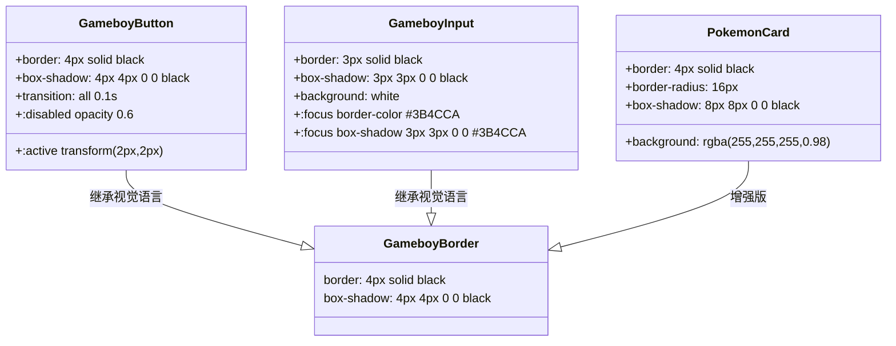

本文档系统阐述 AIlove 前端项目中的 TailwindCSS v4 样式定制体系。项目采用 **宝可梦 + GameBoy 复古** 双主题设计语言，通过 CSS 变量、自定义工具类与 JIT 任意值语法三层架构，实现视觉一致性与可维护性的平衡。

## 技术栈配置

项目采用 TailwindCSS v4 与 Vite 集成方案。v4 版本废弃了传统的 `tailwind.config.js` 配置文件，改为 **CSS-first 配置模式**——所有主题定义直接写入 CSS 文件中。

```mermaid
graph LR
    A[vite.config.ts] -->|@tailwindcss/vite 插件| B[构建管道]
    B --> C[index.css @import tailwindcss]
    C --> D[CSS 变量定义主题色]
    C --> E[自定义工具类]
    D --> F[组件中使用]
    E --> F
    F --> G[JIT 任意值语法]
```

核心配置位于 [vite.config.ts](frontend-react/vite.config.ts#L1-L12)，通过 `@tailwindcss/vite` 插件将 TailwindCSS 接入 Vite 构建流程：

| 配置项 | 值 | 作用 |
|--------|------|------|
| `tailwindcss` 版本 | `^4.2.1` | CSS-first 架构，无需配置文件 |
| `@tailwindcss/vite` | `^4.2.1` | Vite 插件集成 |
| 导入入口 | `@import "tailwindcss"` | 在 `index.css` 中激活 |

Sources: [vite.config.ts](frontend-react/vite.config.ts#L1-L12), [package.json](frontend-react/package.json#L1-L20)

## 设计令牌（Design Tokens）

项目的设计令牌体系建立在 CSS 自定义属性（CSS Variables）之上，定义于 [index.css](frontend-react/src/index.css#L3-L17) 的 `:root` 选择器中。这种设计使得主题色可在任何组件中通过 `var()` 函数引用，同时保留了后续扩展暗黑模式等变体的能力。

### GameBoy 四色调色板

灵感源自初代 GameBoy 的经典四色 LCD 显示方案，构成应用的基础背景与强调色体系：

| 变量名 | 色值 | 用途 | 视觉位置 |
|--------|------|------|----------|
| `--gameboy-bg` | `#9BBC0F` | 主背景色 | 页面整体渐变起始色 |
| `--gameboy-dark` | `#0F380F` | 深色元素 | TabBar 背景色 |
| `--gameboy-accent` | `#306230` | 激活状态 | TabBar 激活项、头像背景 |
| （隐含中间色）| `#8BAC0F` | 渐变过渡 | 页面整体渐变结束色 |

### 宝可梦品牌色

| 变量名 | 色值 | 用途 | 视觉位置 |
|--------|------|------|----------|
| `--pokemon-yellow` | `#FFCB05` | 主按钮色 | 官方 Logo 黄色 |
| `--pokemon-blue` | `#3B4CCA` | 次要按钮/链接色 | 官方 Logo 蓝色 |
| `--pokemon-red` | `#FF5A5A` | 危险操作色 | 精灵球红色 |

### 游戏化系统色

| 变量名 | 色值 | 用途 |
|--------|------|------|
| `--hp-red` | `#FF5A5A` | HP 进度条颜色 |
| `--exp-blue` | `#4A90E2` | EXP 进度条颜色 |

### 硬阴影与边框系统

项目采用 **无模糊硬阴影（Hard Shadow）** 设计语言，模拟像素游戏的物理按钮按压感：

```
--border-hard: 4px solid #000000;
--shadow-hard: 4px 4px 0px 0px #000000;
```

Sources: [index.css](frontend-react/src/index.css#L3-L17)

## 自定义工具类

在 CSS 变量之上，项目定义了一套与组件语义绑定的工具类。这些类名遵循 `gameboy-*` 和 `pokemon-*` 命名约定，提供可直接复用的样式组合。

### 组件级工具类



**GameboyBorder** — 基础边框样式，提供 4px 黑色实线边框与 4px 偏移硬阴影，是整个 UI 系统的视觉基石 [index.css](frontend-react/src/index.css#L35-L37)。

**GameboyButton** — 在边框基础上增加 `transition: all 0.1s` 过渡动画，配合 `:active` 伪类实现 `translate(2px, 2px)` 按压位移效果，模拟物理按钮的触觉反馈 [index.css](frontend-react/src/index.css#L39-L51)。

**GameboyInput** — 表单输入框专用样式，默认状态继承硬阴影设计，聚焦（`:focus`）时边框与阴影颜色切换为宝可梦蓝（`#3B4CCA`），提供明确的视觉焦点指示 [index.css](frontend-react/src/index.css#L57-L68)。

**PokemonCard** — 卡片容器的增强版样式，采用 16px 圆角与更大的 8px 偏移阴影，配合 0.98 透明度的白色背景，形成浮层卡片效果 [index.css](frontend-react/src/index.css#L53-L56)。

Sources: [index.css](frontend-react/src/index.css#L35-L68)

## Tailwind 实用类使用模式

在实际组件开发中，项目采用 **Tailwind 实用类 + CSS 自定义类** 的混合策略。以下通过具体代码展示典型模式。

### 模式一：CSS 类与 Tailwind 类协同

[GameboyButton](frontend-react/src/components/GameboyButton.tsx#L23-L36) 组件展示了如何通过 `baseStyles` 将自定义 CSS 类与 Tailwind 类组合：

```tsx
const baseStyles = 'gameboy-btn font-bold rounded-xl transition-all';
const variants = {
  primary: 'bg-[#FFCB05] hover:bg-[#E6B800] text-black',
  secondary: 'bg-[#3B4CCA] hover:bg-[#2A3BA8] text-white',
  danger: 'bg-[#FF5A5A] hover:bg-[#E64444] text-white',
};
```

`gameboy-btn` 提供边框与阴影基础样式，而 `bg-[#FFCB05]` 等 Tailwind JIT 任意值语法则提供背景色变体。

### 模式二：JIT 任意值语法

项目大量使用 Tailwind v4 的 JIT（Just-In-Time）任意值语法处理精确色值：

| 语法 | 生成 CSS | 使用位置 |
|------|----------|----------|
| `bg-[#FFCB05]` | `background-color: #FFCB05` | 按钮、徽章 |
| `text-[#9BBC0F]` | `color: #9BBC0F` | 非激活 Tab 文字 |
| `border-t-4 border-black` | `border-top: 4px solid black` | TabBar 顶部分隔线 |
| `shadow-[4px_4px_0px_0px_rgba(0,0,0,1)]` | 自定义硬阴影 | 头像容器 |

这种模式适用于**需要精确色值但仅使用 1-2 次的场景**，避免在 CSS 中创建过多自定义类。

### 模式三：响应式与状态类

[TabBar](frontend-react/src/components/TabBar.tsx#L18-L32) 展示了通过函数式 `className` 实现交互状态切换：

```tsx
className={({ isActive }) =>
  `flex flex-col items-center justify-center w-full h-full transition-colors ${
    isActive
      ? 'bg-[#306230] text-white'
      : 'text-[#9BBC0F] hover:bg-[#306230]/50'
  }`
}
```

激活态使用 GameBoy 深绿色（`#306230`）白字，非激活态使用 GameBoy 背景色（`#9BBC0F`）文字配合半透明悬停效果。

Sources: [GameboyButton.tsx](frontend-react/src/components/GameboyButton.tsx#L23-L36), [TabBar.tsx](frontend-react/src/components/TabBar.tsx#L18-L32), [LoginPage.tsx](frontend-react/src/pages/LoginPage.tsx#L113-L118)

## 宝可梦属性类型色系

项目完整实现了 18 种宝可梦属性类型的背景色系，用于可能的类型标签展示 [index.css](frontend-react/src/index.css#L75-L92)：

| 属性 | 色值 | 类名 | 属性 | 色值 | 类名 |
|------|------|------|------|------|------|
| 一般 | `#A8A878` | `.type-normal` | 超能力 | `#F85888` | `.type-psychic` |
| 火 | `#F08030` | `.type-fire` | 虫 | `#A8B820` | `.type-bug` |
| 水 | `#6890F0` | `.type-water` | 岩石 | `#B8A038` | `.type-rock` |
| 电 | `#F8D030` | `.type-electric` | 幽灵 | `#705898` | `.type-ghost` |
| 草 | `#78C850` | `.type-grass` | 龙 | `#7038F8` | `.type-dragon` |
| 冰 | `#98D8D8` | `.type-ice` | 恶 | `#705848` | `.type-dark` |
| 格斗 | `#C03028` | `.type-fighting` | 钢 | `#B8B8D0` | `.type-steel` |
| 毒 | `#A040A0` | `.type-poison` | 妖精 | `#EE99AC` | `.type-fairy` |
| 地面 | `#E0C068` | `.type-ground` | 飞行 | `#A890F0` | `.type-flying` |

Sources: [index.css](frontend-react/src/index.css#L75-L92)

## 动画系统

项目定义了一个自定义 `bounce` 动画 [index.css](frontend-react/src/index.css#L94-L105)，用于增强关键视觉元素的吸引力：

```css
@keyframes bounce {
  0%, 100% { transform: translateY(0); }
  50% { transform: translateY(-10px); }
}
.animate-bounce { animation: bounce 2s infinite; }
```

该动画在 [LoginPage](frontend-react/src/pages/LoginPage.tsx#L65) 的 Logo 图标（🎮）上应用，产生持续弹跳效果以吸引用户注意力。同时项目也利用 Tailwind 内置的 `animate-spin` 实现加载状态指示器 [GameboyButton.tsx](frontend-react/src/components/GameboyButton.tsx#L40-L41)。

Sources: [index.css](frontend-react/src/index.css#L94-L105), [LoginPage.tsx](frontend-react/src/pages/LoginPage.tsx#L65), [GameboyButton.tsx](frontend-react/src/components/GameboyButton.tsx#L40-L41)

## 页面级样式模式

所有页面遵循统一的背景渐变与间距约定，构成一致的视觉层级：

| 模式 | Tailwind 类 | 使用频率 |
|------|-------------|----------|
| 页面背景渐变 | `bg-gradient-to-b from-[#9BBC0F] to-[#8BAC0F]` | 所有页面 |
| 底部间距预留 | `pb-20`（为 TabBar 留空间） | 所有含 TabBar 页面 |
| 卡片容器 | `pokemon-card p-6 mb-4` | 通用布局 |
| 响应式网格 | `grid grid-cols-3 gap-2` | ProfilePage 统计区 |
| 加载状态 | `animate-pulse` | 各页面加载中状态 |

Sources: [HomePage.tsx](frontend-react/src/pages/HomePage.tsx#L10-L11), [LoginPage.tsx](frontend-react/src/pages/LoginPage.tsx#L60), [MapPage.tsx](frontend-react/src/pages/MapPage.tsx#L165), [ProfilePage.tsx](frontend-react/src/pages/ProfilePage.tsx#L57-L59)

## 字体集成

项目指定了 `'Varela Round', 'Nunito', sans-serif` 字体栈 [index.css](frontend-react/src/index.css#L19-L21)。这两款圆润字体与像素风 UI 形成有趣对比——硬边框提供复古游戏感，圆润字体则确保中文内容的可读性。

Sources: [index.css](frontend-react/src/index.css#L19-L21)

## 扩展指南

若需新增自定义样式，推荐遵循以下决策路径：

```mermaid
flowchart TD
    A[新样式需求] --> B{使用频率?}
    B -->|≥3 次| C[在 index.css 中创建自定义类]
    B -->|1-2 次| D{是色值/阴影/尺寸?}
    D -->|是| E[使用 JIT 任意值: bg-[#xxx]]
    D -->|否| F[使用 Tailwind 内置类]
    C --> G{是主题色?}
    G -->|是| H[添加 CSS 变量到 :root]
    G -->|否| I[直接定义类]
```

**新增主题色**：在 [index.css](frontend-react/src/index.css#L3-L17) 的 `:root` 中添加 `--your-variable-name` 变量，后续可通过 `style={{ '--your-variable-name': value }}` 或直接在 CSS 中使用 `var()` 引用。

**新增按钮变体**：在 [GameboyButton.tsx](frontend-react/src/components/GameboyButton.tsx#L26-L29) 的 `variants` 对象中添加新条目，保持 `bg-[#xxx] hover:bg-[#xxx-dark]` 模式。