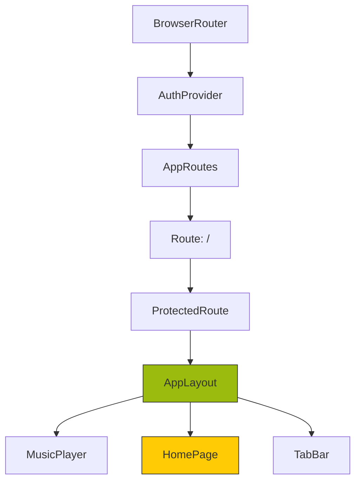
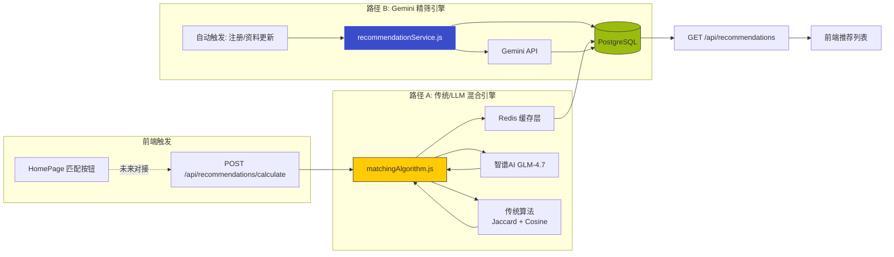
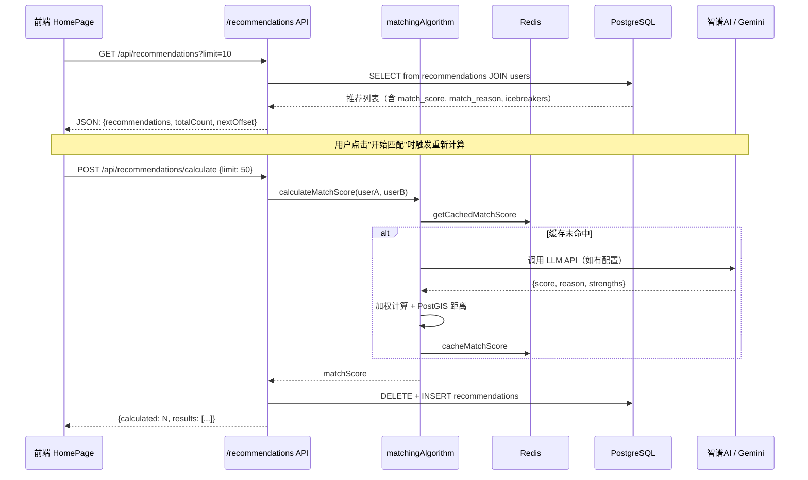

本文档剖析「首页（HomePage）」的 UI 结构及其背后推荐系统的数据流与 API 设计。首页作为用户登录后的默认入口，承担两大职责：展示训练师状态（积分、VIP 等级）并提供「开始匹配」操作的触发点；推荐列表则通过后端预计算 + 缓存策略，向用户返回按匹配度排序的候选用户列表。理解这两条路径，将帮助你快速掌握应用的核心业务逻辑。

## 页面架构与路由定位

`HomePage` 被挂载在根路径 `/` 上，受 `ProtectedRoute` 保护，并嵌套在 `AppLayout` 中。`AppLayout` 负责注入全局 `MusicPlayer` 组件和底部 `TabBar` 导航栏，形成统一的 GameBoy 视觉外壳。



**路由配置要点**：[App.tsx](frontend-react/src/App.tsx#L48-L57) 将首页设为默认受保护路由，未登录用户将被重定向至 `/login`；尾部 `Route path="*"` 将未知路径统一回退到首页，确保用户体验闭环。[App.tsx](frontend-react/src/App.tsx#L108-L108)

## HomePage 组件结构

`HomePage` 是一个轻量级展示组件，依赖 `useAuth` 上下文获取当前用户信息，不直接与后端推荐 API 交互。其 UI 由三个垂直区块构成：

| 区块 | 功能 | 关键组件/样式 |
|------|------|---------------|
| 用户状态卡片 | 显示昵称、HP/EXP 条、VIP 等级、积分 | `pokemon-card` + `HpExpBar` |
| 匹配操作卡片 | 展示"开始匹配"按钮及积分消耗提示 | `GameboyButton`（size: large） |
| 退出登录按钮 | 触发 `AuthContext.logout()` | `GameboyButton`（variant: danger） |

[HomePage.tsx](frontend-react/src/pages/HomePage.tsx#L1-L55) 的整体背景采用 `bg-gradient-to-b from-[#9BBC0F] to-[#8BAC0F]`，延续 GameBoy 经典浅绿调色板。

### HpExpBar 组件

该组件渲染两条进度条（HP 红色 + EXP 蓝色），接受 `hp / maxHp / exp / maxExp` 四个数值参数。百分比计算使用 `Math.min(..., 100)` 防止溢出，宽度通过内联 `style` 驱动，配合 `transition-all duration-300` 实现平滑动画。[HpExpBar.tsx](frontend-react/src/components/HpExpBar.tsx#L10-L11)

### GameboyButton 组件

作为全项目通用按钮基元，支持三种变体（primary 黄色、secondary 蓝色、danger 红色）和三种尺寸。`loading` 状态下自动显示旋转沙漏图标并禁用点击。[GameboyButton.tsx](frontend-react/src/components/GameboyButton.tsx#L25-L35)

## 推荐系统双引擎架构

推荐系统采用**两条独立但互补的计算路径**，对应不同的后端服务文件：



**核心区别**：`matchingAlgorithm.js` 提供实时按需计算能力（缓存优先 → LLM 或传统回退），而 `recommendationService.js` 负责异步全量批量计算（调用 Gemini API 对粗筛后的 200 名候选人逐一定制评估），结果统一写入 `recommendations` 表。

## 后端推荐 API 详解

### POST /api/recommendations/calculate

触发重新计算当前用户的全部推荐。接收可选的 `limit` 参数（默认 50）。流程为：

1. 查询当前用户的偏好设置（性别、年龄范围）
2. 构建候选查询，应用性别和年龄过滤器
3. 使用 `Promise.all` 并行计算每个候选人的 `matchScore`、`matchReason`、`icebreakers`
4. 删除旧推荐记录并批量插入新结果

[recommendations.js](backend/routes/recommendations.js#L16-L171)

### GET /api/recommendations

获取当前用户的推荐列表。支持分页查询参数：

| 参数 | 类型 | 默认值 | 说明 |
|------|------|--------|------|
| `limit` | number | 10 | 每页返回条数 |
| `offset` | number | 0 | 分页偏移量 |
| `min_score` | number | 0 | 最低匹配分数筛选（Phase 3 功能） |

响应结构包含 `recommendations` 数组、`totalCount` 和 `nextOffset`（用于游标式分页）。[recommendations.js](backend/routes/recommendations.js#L176-L225)

### GET /api/recommendations/user/:userId

按需获取与特定用户的匹配分数。先查缓存推荐表，若无记录则实时调用 `calculateMatchScore` 并即时写入。[recommendations.js](backend/routes/recommendations.js#L231-L296)

## 匹配算法分层策略

`matchingAlgorithm.js` 实现了 **三层决策漏斗**：

### 第一层：Redis 缓存

以排序后的双用户 ID 作为键（确保 A-B 与 B-A 命中同一缓存），TTL 为 24 小时。命中则直接返回，跳过所有计算。[cacheService.js](backend/services/cacheService.js#L47-L51)

### 第二层：LLM 智能分析（智谱 AI）

当 `OPENAI_API_KEY` 已配置且双方均填写 `values_description` 时激活。调用 GLM-4.7 模型，要求返回 JSON 格式评分（包含 `score`、`reason`、`strengths`、`suggestions` 字段），配合 PostGIS 距离分数加权：

```
总分 = LLM分数 × 0.6 + 距离分数 × 0.4
```

温度参数设为 0.3 以降低输出随机性。[matchingAlgorithm.js](backend/services/matchingAlgorithm.js#L63-L82)

### 第三层：传统算法回退

LLM 不可用时降级为确定性算法：

| 维度 | 权重 | 算法 |
|------|------|------|
| 地理距离 | 30% | PostGIS `ST_Distance`，按 500m/1km/3km/5km/10km 分级打分 |
| 兴趣重叠 | 40% | Jaccard 相似度（标签交集/并集） |
| 性格匹配 | 30% | 字符级词袋模型 + 余弦相似度 |

[matchingAlgorithm.js](backend/services/matchingAlgorithm.js#L90-L111)

### 破冰话题生成

`generateIcebreakers` 函数基于共同标签和 Q&A 数据动态生成最多 3 条话题。优先使用共同兴趣（如"听说你也喜欢{标签}？"），其次使用共同 Q&A（"你理想中的周末是怎么度过的？"），最后回退到通用问候。[matchingAlgorithm.js](backend/services/matchingAlgorithm.js#L445-L472)

## 数据库模型：recommendations 表

```sql
CREATE TABLE recommendations (
    recommendation_id UUID PRIMARY KEY DEFAULT gen_random_uuid(),
    recommending_user_id UUID NOT NULL REFERENCES users(user_id) ON DELETE CASCADE,
    recommended_user_id UUID NOT NULL REFERENCES users(user_id) ON DELETE CASCADE,
    match_score INT NOT NULL,          -- 0-100
    match_reason TEXT,
    icebreakers JSONB,                 -- 破冰话题数组
    last_calculated TIMESTAMPTZ DEFAULT NOW(),
    UNIQUE (recommending_user_id, recommended_user_id)
);
```

[Schema.sql](backend/schema.sql#L92-L103)

复合唯一约束确保同一用户对同一候选人仅保留一条推荐记录，`last_calculated` 字段作为二级排序键（同分情况下优先展示最近计算的推荐）。

## 数据流全景



## 与相关模块的衔接

- **匹配算法架构**：深入 LLM 与传统算法的数学细节和 Prompt 工程 → [匹配算法架构](30-pi-pei-suan-fa-jia-gou)
- **推荐匹配 API**：完整 API 契约、错误码与鉴权流程 → [推荐匹配 API](25-tui-jian-pi-pei-api)
- **推荐服务与缓存**：Redis 缓存策略的详细设计 → [推荐服务与缓存](33-tui-jian-fu-wu-yu-huan-cun)
- **实时聊天界面**：匹配成功后进入聊天流程 → [实时聊天界面](20-shi-shi-liao-tian-jie-mian)
- **地图与地理位置**：距离分数的空间数据来源 → [地图与地理位置](19-di-tu-yu-di-li-wei-zhi)

## 开发注意事项

1. **当前首页尚未对接推荐列表 UI**——`HomePage.tsx` 仅展示状态信息和匹配按钮，推荐列表的卡片渲染组件尚未实现。建议参考 `GET /api/recommendations` 响应结构，在首页或新建推荐页面中渲染候选用户卡片。

2. **推荐计算的触发时机**：`recommendationService.updateRecommendationsForUser` 应在用户注册成功或资料更新时由注册/用户路由调用，而非在前端手动触发。目前 `POST /calculate` 路由使用 `matchingAlgorithm.js` 的传统/LLM 混合引擎，与 `recommendationService.js` 的 Gemini 精筛引擎是两套并行实现。

3. **分页实现**：`GET /api/recommendations` 返回 `nextOffset` 而非 `hasNextPage` 布尔值，前端应使用 `offset + limit` 模式实现无限滚动或分页器。

4. **GameBoy 样式一致性**：所有页面应通过 `AppLayout` 继承底部 `TabBar`（[TabBar.tsx](frontend-react/src/components/TabBar.tsx#L1-L40)）和 `MusicPlayer` 组件，确保导航与音乐体验统一。