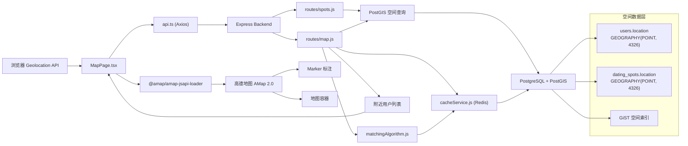
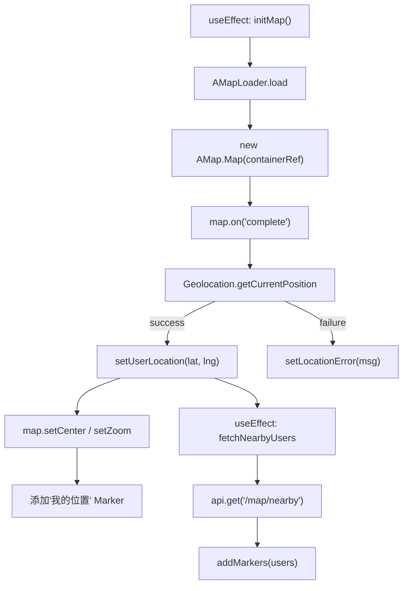
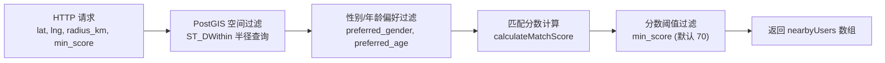
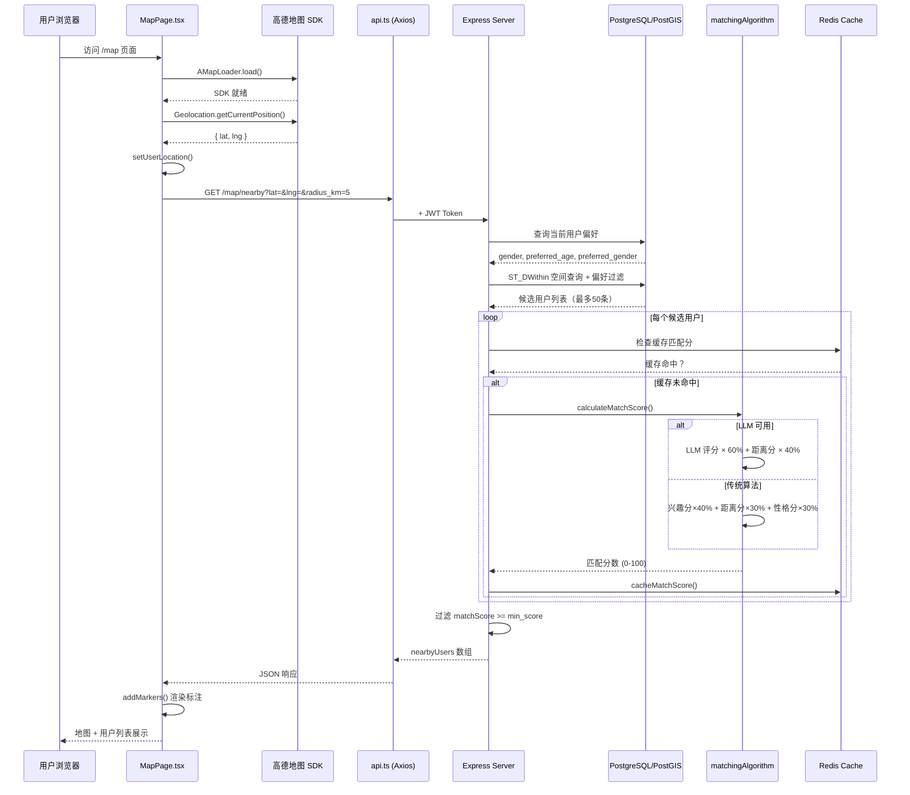

本页说明 AIlove 项目中地图显示、地理位置追踪、附近用户发现与约会地点（Dating Spots）查询的完整实现。系统以 **PostgreSQL/PostGIS** 为空间数据核心，**高德地图 AMap 2.0** 为前端可视化载体，构建了一套从定位采集 → 空间查询 → 匹配过滤 → 地图渲染的端到端地理能力。

## 系统架构概览



前端通过高德地图获取用户经纬度后，将坐标发送至后端 `/api/map/nearby` 接口；后端利用 PostGIS 的 `ST_DWithin` 进行半径过滤，再将候选用户逐一输入匹配算法计算分数，最终返回满足阈值的结果供前端渲染标注。

Sources: [MapPage.tsx](frontend-react/src/pages/MapPage.tsx#L1-L56), [map.js](backend/routes/map.js#L1-L75), [schema.sql](backend/schema.sql#L10-L11), [App.tsx](frontend-react/src/App.tsx#L58-L68)

## 前端地图组件

### MapPage 生命周期

`MapPage` 组件 (`/map` 路由) 使用 `@amap/amap-jsapi-loader` 动态加载高德地图 SDK，整个初始化流程分为三个阶段：

1. **SDK 加载** — 通过 `AMapLoader.load()` 异步加载 AMap 2.0 核心库及 `Geolocation`、`Marker` 插件
2. **地图实例化** — 以默认中心点 `[116.397428, 39.90923]`（北京）创建 2D 视图，缩放级别 15
3. **定位获取** — 在 `complete` 事件触发后调用 `AMap.Geolocation.getCurrentPosition()`，成功后将用户位置设为地图中心并添加自定义标记



高德地图 API Key 通过环境变量 `VITE_AMAP_KEY` 读取，降级使用硬编码密钥 [config.ts](frontend-react/src/config.ts#L18)。

Sources: [MapPage.tsx](frontend-react/src/pages/MapPage.tsx#L29-L105), [config.ts](frontend-react/src/config.ts#L18)

### 搜索半径控制

组件提供五个预设搜索半径按钮（1km / 5km / 10km / 20km / 50km），点击后更新 `radius` 状态，自动触发 `useEffect` 中的 `fetchNearbyUsers` 重新拉取数据。用户列表采用 GameBoy 复古风格卡片设计，点击任意条目弹出详情模态框。

Sources: [MapPage.tsx](frontend-react/src/pages/MapPage.tsx#L218-L235), [MapPage.tsx](frontend-react/src/pages/MapPage.tsx#L241-L285)

## 后端地图 API

### 位置更新接口

`POST /api/map/update-location` 接收 `{ lat, lng }` 请求体，使用 PostGIS 函数同时写入三种位置表示：

| 字段 | 类型 | 用途 |
|------|------|------|
| `location` | `GEOGRAPHY(POINT, 4326)` | PostGIS 空间查询核心字段 |
| `location_latitude` | `DOUBLE PRECISION` | 快速距离计算与缓存 |
| `location_longitude` | `DOUBLE PRECISION` | 快速距离计算与缓存 |

SQL 使用 `ST_SetSRID(ST_MakePoint(lng, lat), 4326)::GEOGRAPHY` 构建标准地理点，坐标系 EPSG:4326（WGS84）。输入校验覆盖类型检查和经纬度范围限制。

Sources: [map.js](backend/routes/map.js#L14-L62)

### 附近用户查询接口

`GET /api/map/nearby` 是地图功能的核心端点，执行三层过滤：



**第一层 — 空间过滤**：使用 `ST_DWithin` 在 `users.location` 列上执行半径搜索，参数将 `radius_km` 转换为米。查询按 `<->`（KNN 最近邻运算符）排序，限制 50 条。

**第二层 — 偏好过滤**：基于当前用户的 `preferred_gender`、`preferred_age_min`、`preferred_age_max` 构建动态 WHERE 条件，同时强制异性匹配（`u.gender != currentUser.gender`）。

**第三层 — AI/传统匹配过滤**：对空间过滤后的候选用户，并行调用 `calculateMatchScore(userId, candidateId)` 计算匹配分，仅返回 `matchScore >= min_score`（默认 70）的用户。此处存在 **N+1 查询风险** — 每个候选用户独立触发一次匹配分数计算（含数据库查询 + 可能的 LLM API 调用）。

Sources: [map.js](backend/routes/map.js#L68-L200), [matchingAlgorithm.js](backend/services/matchingAlgorithm.js#L15-L106)

### 响应数据结构

```json
{
  "nearbyUsers": [
    {
      "userId": "uuid",
      "nickname": "string",
      "age": 25,
      "gender": "female",
      "distance": { "meters": 1234, "kilometers": 1.2, "text": "1.2km" },
      "matchScore": 85,
      "level": 3,
      "points": 150
    }
  ],
  "count": 1,
  "searchRadius": { "kilometers": 5, "center": { "lat": 39.9, "lng": 116.4 } },
  "filter": { "minScore": 70 }
}
```

Sources: [map.js](backend/routes/map.js#L149-L180)

## 约会地点系统（Dating Spots）

### 数据模型

`dating_spots` 表将线下约会场所抽象为类 **PokéStop** 的游戏化元素：

| 字段 | 类型 | 说明 |
|------|------|------|
| `spot_id` | `UUID` | 主键 |
| `name` | `VARCHAR(100)` | 地点名称 |
| `location` | `GEOGRAPHY(POINT, 4326)` | PostGIS 空间坐标 |
| `type` | `VARCHAR(50)` | 类型：cafe / park / restaurant / cinema / mall 等 |
| `address` | `TEXT` | 详细地址 |
| `reward_points` | `INT DEFAULT 50` | 打卡奖励积分 |
| `description` | `TEXT` | 地点描述 |

空间索引使用 **GiST**（Generalized Search Tree），针对 GEOGRAPHY 类型提供高效的 KNN 和半径查询。

Sources: [schema.sql](backend/schema.sql#L68-L79), [schema.sql](backend/schema.sql#L129)

### 附近地点查询

`GET /api/spots/nearby` 与用户查询类似，使用 `ST_DWithin` 执行空间过滤，返回包含 `lat/lng`、距离信息和 `rewardPoints` 的完整地点数据。此外，`GET /api/spots` 支持按类型筛选和分页查询全部地点。

Sources: [spots.js](backend/routes/spots.js#L12-L98), [spots.js](backend/routes/spots.js#L104-L185)

## PostGIS 空间查询详解

### 核心函数使用模式

系统统一使用以下 PostGIS 函数链构建空间查询：

```sql
-- 构建地理点
ST_SetSRID(ST_MakePoint(longitude, latitude), 4326)::GEOGRAPHY

-- 半径过滤（高效利用 GiST 索引）
ST_DWithin(users.location, <target_point>, radius_meters)

-- 距离计算
ST_Distance(users.location, <target_point>)  -- 返回米

-- 最近邻排序（KNN）
ORDER BY users.location <-> <target_point>
```

**关键注意**：`ST_MakePoint` 的参数顺序为 **(经度, 纬度)**，而非 (纬度, 经度)。这在 [map.js](backend/routes/map.js#L34) 的位置更新查询中已正确实现：`ST_MakePoint($1, $2)` 对应 `[lng, lat]`。

Sources: [map.js](backend/routes/map.js#L30-L40), [spots.js](backend/routes/spots.js#L43-L55), [matchingAlgorithm.js](backend/services/matchingAlgorithm.js#L230-L240)

### 距离评分阶梯

匹配算法中的 `calculateDistanceScore` 函数将地理距离映射为 0-100 分，采用分段阶梯规则：

| 距离范围 | 分数 | 语义 |
|----------|------|------|
| 0 — 500m | 100 | 极近 |
| 500m — 1km | 90 | 很近 |
| 1km — 3km | 70 | 近 |
| 3km — 5km | 50 | 中等 |
| 5km — 10km | 30 | 较远 |
| > 10km | 10 | 远 |

在 LLM 匹配模式下，距离分数以 **40% 权重** 与 LLM 评分（60%）混合；在传统匹配模式下，距离分数以 **30% 权重** 与兴趣重叠分（40%）、性格匹配分（30%）混合。

Sources: [matchingAlgorithm.js](backend/services/matchingAlgorithm.js#L226-L265), [matchingAlgorithm.js](backend/services/matchingAlgorithm.js#L68-L75), [matchingAlgorithm.js](backend/services/matchingAlgorithm.js#L90-L100)

## 数据流完整链路



Sources: [MapPage.tsx](frontend-react/src/pages/MapPage.tsx#L33-L56), [map.js](backend/routes/map.js#L68-L178), [matchingAlgorithm.js](backend/services/matchingAlgorithm.js#L15-L106), [cacheService.js](backend/services/cacheService.js#L1-L30)

## 与相关模块的协作关系

| 模块 | 交互方式 | 说明 |
|------|----------|------|
| [PostGIS 地理位置查询](36-postgis-di-li-wei-zhi-cha-xun) | 数据库层 | 共享 `location` GEOGRAPHY 字段和空间索引 |
| [AI 匹配算法架构](30-pi-pei-suan-fa-jia-gou) | 服务层调用 | `calculateMatchScore` 同时用于 `/map/nearby` 和推荐系统 |
| [Redis 缓存策略](10-redis-huan-cun-ce-lue) | 缓存匹配分 | `cacheMatchScore` / `getCachedMatchScore` 降低重复计算开销 |
| [精灵球积分系统 API](28-jing-ling-qiu-ji-fen-xi-tong-api) | 数据关联 | 返回的 `level` 和 `points` 来自用户表的游戏化字段 |
| [约会地点管理](spots.js) | 独立路由 | `/api/spots/nearby` 复用 PostGIS 空间查询模式 |
| [路由与权限控制](13-lu-you-yu-quan-xian-kong-zhi) | 前端路由 | `/map` 通过 `ProtectedRoute` 守卫，需 JWT 认证 |

## 已知实现细节

- **高德地图集成**：使用 `@amap/amap-jsapi-loader` 加载 AMap 2.0，Marker 采用自定义 HTML 内容（宝可梦主题配色）
- **前后端端点不一致**：前端 `updateLocation()` 调用 `PUT /users/me/location`，但后端 map.js 暴露的是 `POST /api/map/update-location` — 需要确认 `/users/me/location` 路由是否在 `routes/users.js` 中另行定义
- **前端接口参数差异**：前端发送 `radius` 参数，后端期望 `radius_km`，存在命名不匹配
- **N+1 查询**：`/map/nearby` 对每个候选用户独立计算匹配分，候选数接近 50 时可能产生显著延迟
- **类型定义缺失**：`frontend-react/src/types/` 目录为空，`NearbyUser` 接口内联定义在 MapPage.tsx 中，未与后端响应格式完全对齐

Sources: [MapPage.tsx](frontend-react/src/pages/MapPage.tsx#L157-L164), [map.js](backend/routes/map.js#L71), [MapPage.tsx](frontend-react/src/pages/MapPage.tsx#L131-L134)

## 扩展方向

- 将匹配分数批量计算改造为单条 SQL 聚合查询，消除 N+1 问题
- 在 `types/` 目录中定义共享 TypeScript 接口，与后端响应格式保持同步
- 为 Dating Spots 前端可视化添加图标类型区分和打卡交互
- 引入 Geohash 预过滤层（`location_geohash` 字段已存在但未使用）
- 支持 `dating_tasks` 在地图上的可视化展示（约会邀请关联地点）