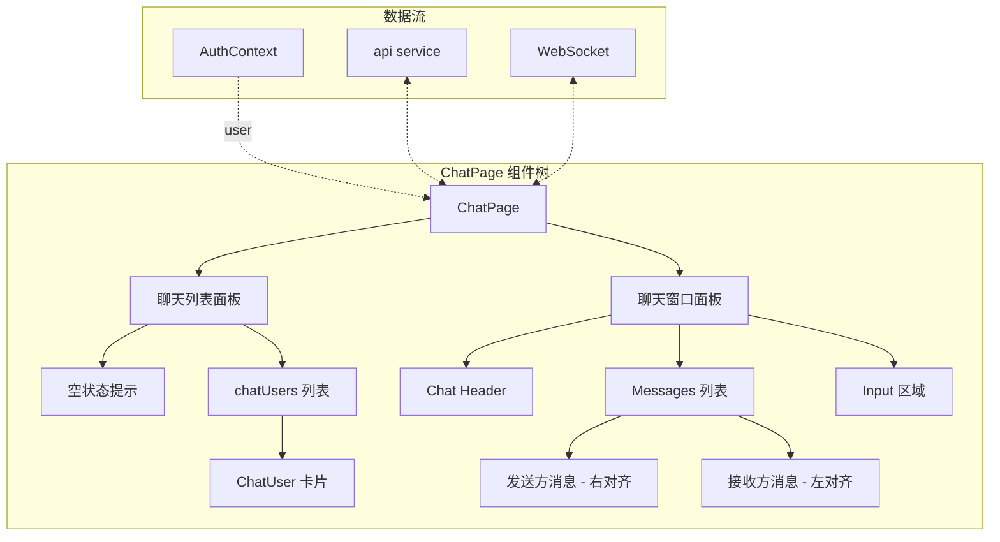
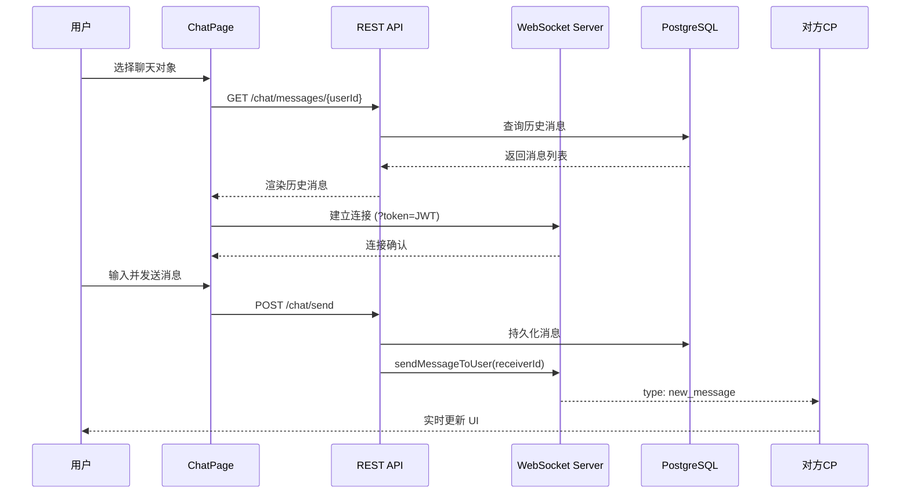
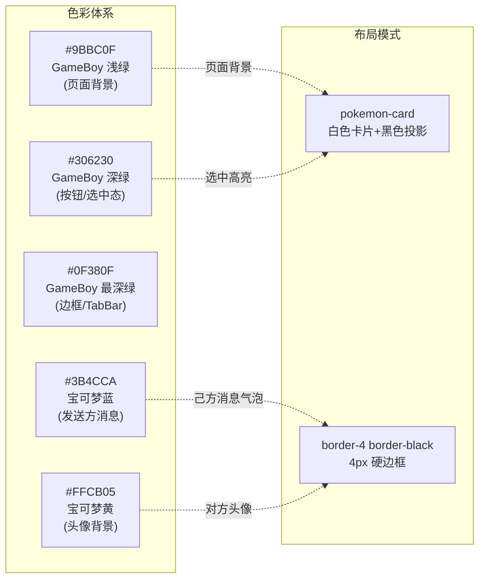
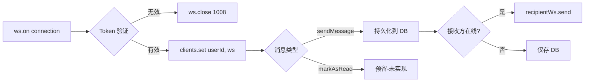

实时聊天界面是 AI 月老应用中用户完成匹配后的一对一通信枢纽。该页面采用 **REST + WebSocket 混合架构**：历史消息通过 RESTful API 加载，新消息通过 WebSocket 实时推送。UI 层深度集成 GameBoy 复古像素风格，以宝可梦主题色构建沉浸式交互体验。页面路由为 `/chat`，受 `ProtectedRoute` 守卫保护，仅认证用户可访问。

Sources: [ChatPage.tsx](frontend-react/src/pages/ChatPage.tsx#L1-L249), [App.tsx](frontend-react/src/App.tsx#L58-L67), [index.css](frontend-react/src/index.css#L1-L75)

## 组件架构概览

ChatPage 组件采用 **双窗格布局**：左侧为聊天列表，右侧为消息窗口。在移动端，两者通过条件渲染实现视图切换；在桌面端（`md` 断点以上），左右面板同时可见。

组件内部维护 6 个核心状态：`chatUsers`（会话列表）、`selectedUser`（当前对话对象）、`messages`（消息数组）、`newMessage`（输入框内容）、`loading`（加载状态）、`ws`（WebSocket 实例）。通过 `useRef` 追踪消息列表底部，实现自动滚动。

Sources: [ChatPage.tsx](frontend-react/src/pages/ChatPage.tsx#L15-L22)

## 双模式通信协议

聊天界面采用 **REST 加载历史 + WebSocket 实时推送** 的混合模式。用户切换对话对象时，系统先通过 REST API 获取历史消息，随后建立 WebSocket 连接接收实时新消息。

**消息发送流程**：前端调用 `POST /chat/send` 将消息持久化到数据库，后端通过 `sendMessageToUser` 函数查找接收方的 WebSocket 连接并推送。若接收方离线，消息仅存储于数据库，待下次打开聊天窗口时通过 REST API 加载。

**消息接收流程**：WebSocket `onmessage` 回调中，前端校验消息的 `sender_id` 或 `receiver_id` 是否与 `selectedUser` 匹配，匹配则追加到 `messages` 状态数组。

Sources: [ChatPage.tsx](frontend-react/src/pages/ChatPage.tsx#L68-L93), [websocketService.js](backend/services/websocketService.js#L45-L80), [chat.js](backend/routes/chat.js#L92-L118)

## 状态管理与生命周期

组件通过 3 个 `useEffect` 钩子管理数据流与资源清理：

| Effect 触发条件 | 执行操作 | 清理操作 |
|---|---|---|
| 组件挂载 (`[]`) | 调用 `fetchChatUsers()` 获取会话列表 | 关闭 WebSocket 连接 |
| `selectedUser` 变化 | 调用 `fetchMessages()` 加载历史消息 + `connectWebSocket()` 建立实时连接 | 关闭旧 WebSocket 连接 |
| `messages` 变化 | 调用 `scrollToBottom()` 滚动至最新消息 | 无 |

这种设计确保了用户在切换对话时，旧连接被正确释放，新连接在历史消息加载完成后建立。`messagesEndRef` 结合 `scrollIntoView({ behavior: 'smooth' })` 实现平滑滚动，避免突兀的跳转体验。

Sources: [ChatPage.tsx](frontend-react/src/pages/ChatPage.tsx#L25-L38)

## UI 设计系统

聊天界面深度融入项目的 **GameBoy 复古设计语言**，通过 TailwindCSS 内联类与全局 CSS 变量协同实现视觉一致性。

**消息气泡设计**：发送方消息使用 `bg-[#3B4CCA] text-white`（宝可梦蓝底白字），接收方消息使用 `bg-white`（白底黑字），通过 `msg.sender_id === String(user?.id)` 条件判断左右对齐。输入框与发送按钮均继承 `border-4 border-black` 硬边框风格，按钮 hover 时过渡至 `#0F380F` 深色态。

Sources: [ChatPage.tsx](frontend-react/src/pages/ChatPage.tsx#L148-L165), [ChatPage.tsx](frontend-react/src/pages/ChatPage.tsx#L206-L228), [index.css](frontend-react/src/index.css#L54-L61)

## 后端服务集成

### REST API 端点

后端 `chat.js` 路由挂载于 `/api/chat`，提供以下端点：

| 方法 | 路径 | 功能 | 认证 | 参数 |
|---|---|---|---|---|
| GET | `/:chatPartnerId/messages` | 获取与指定用户的历史消息 | JWT | `limit`（默认 50）, `beforeTimestamp`（分页） |
| POST | `/:chatPartnerId/messages` | 发送新消息 | JWT | `content`（请求体） |

消息查询使用双向过滤：`(sender_id = $1 AND receiver_id = $2) OR (sender_id = $2 AND receiver_id = $1)`，确保获取双方往来记录。时间戳降序排列配合 `LIMIT` 实现分页加载。

### WebSocket 服务

WebSocket 服务器在 `server.js` 中初始化，监听路径 `/ws/chat`。连接建立时需通过 URL 参数传递 JWT Token，服务端验证后以 `userId` 为键存入 `clients` Map。

服务端导出 `sendMessageToUser(userId, messageObject)` 函数，供 REST 路由调用以实现跨协议消息推送。

Sources: [chat.js](backend/routes/chat.js#L8-L128), [websocketService.js](backend/services/websocketService.js#L10-L144), [server.js](backend/server.js#L63-L71)

## 数据库模型

`chat_messages` 表定义如下：

| 字段 | 类型 | 约束 | 说明 |
|---|---|---|---|
| `message_id` | UUID | PK, default gen_random_uuid() | 消息唯一标识 |
| `sender_id` | UUID | FK → users(user_id), NOT NULL | 发送者 ID |
| `receiver_id` | UUID | FK → users(user_id), NOT NULL | 接收者 ID |
| `content` | TEXT | NOT NULL | 消息内容 |
| `timestamp` | TIMESTAMPTZ | DEFAULT NOW() | 发送时间 |
| `status` | VARCHAR(20) | DEFAULT 'sent' | 状态：sent/delivered/read |

性能优化方面，数据库创建了两个复合索引：`idx_chat_messages_sender_receiver` 和 `idx_chat_messages_receiver_sender`，均以 `(id1, id2, timestamp DESC)` 排序，覆盖双向查询场景。

Sources: [schema.sql](backend/schema.sql#L106-L126)

## 已知问题与注意事项

### API 端点不匹配

当前前端调用的端点与后端实际路由存在不一致：

| 前端调用 | 后端实际路由 | 状态 |
|---|---|---|
| `GET /chat/conversations` | 未实现 | ⚠️ 缺失 |
| `GET /chat/messages/{userId}` | `GET /:chatPartnerId/messages` | ✅ 匹配 |
| `POST /chat/send` | `POST /:chatPartnerId/messages` | ⚠️ 路径不匹配 |

前端 `fetchChatUsers()` 调用的 `/chat/conversations` 端点在后端 `chat.js` 中未定义，将导致会话列表无法加载。`sendMessage()` 使用 `POST /chat/send`，而后端期望的路径为 `POST /:chatPartnerId/messages`。

### WebSocket URL 硬编码

`ChatPage.tsx` 中 WebSocket URL 硬编码为 `ws://localhost:3052/ws/chat`，而配置文件 [config.ts](frontend-react/src/config.ts#L4) 已定义 `WS_URL = 'ws://192.168.0.14:3052/ws/chat'`，建议统一使用配置常量以避免环境切换时的连接失败。

### 已读状态未实现

后端 `websocketService.js` 中 `markAsRead` 消息类型的处理逻辑被注释（第 85-98 行），消息的 `status` 字段目前始终为 `'sent'`，未实现 `delivered` 和 `read` 状态流转。

Sources: [ChatPage.tsx](frontend-react/src/pages/ChatPage.tsx#L52-L109), [chat.js](backend/routes/chat.js#L1-L130), [websocketService.js](backend/services/websocketService.js#L85-L98), [config.ts](frontend-react/src/config.ts#L4)

## 扩展开发指南

### 添加消息类型支持

当前仅支持纯文本消息。若需扩展图片、表情等消息类型，建议在 `chat_messages` 表增加 `message_type` 字段（ENUM: 'text', 'image', 'emoji'），并在 `content` 字段中存储结构化 JSON 或 URL 引用。

### 实现消息分页

当历史消息超过 50 条时，需实现滚动加载。可在 `fetchMessages` 中基于 `beforeTimestamp` 参数实现向上滚动时加载更多历史消息，结合 `IntersectionObserver` 监听滚动容器顶部触发加载。

### 连接状态可视化

建议在 UI 中增加 WebSocket 连接状态指示器（在线/离线/重连中），通过 `websocket.onclose` 和重连逻辑提升用户体验。可参考 `useWebSocket` 自定义 Hook 模式封装连接管理逻辑。