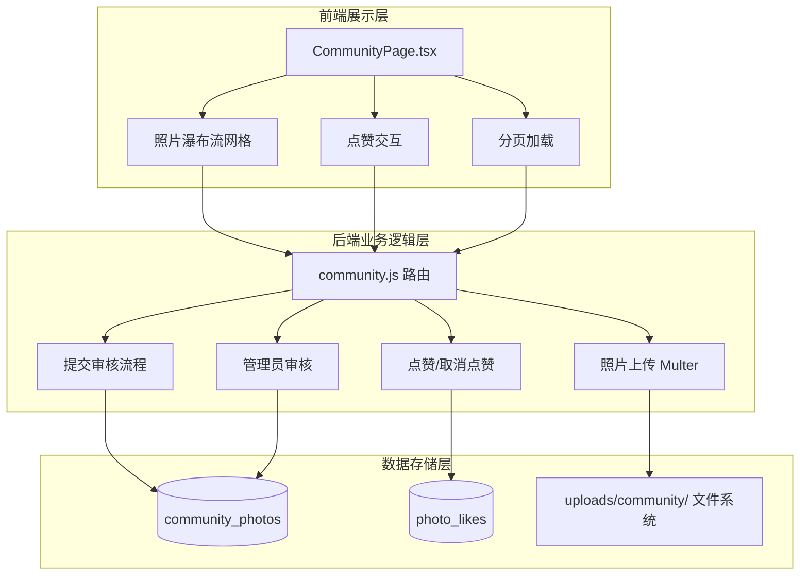
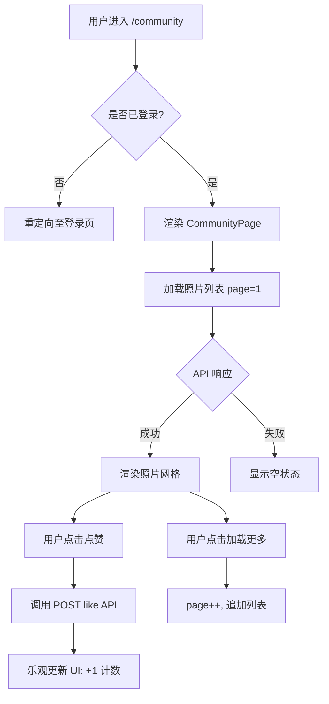
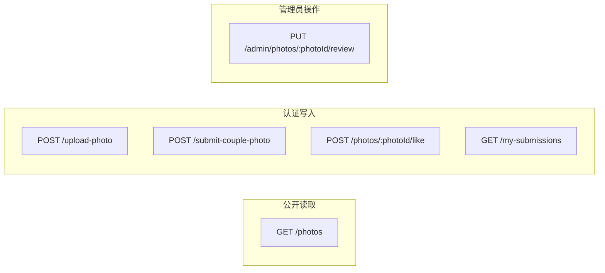
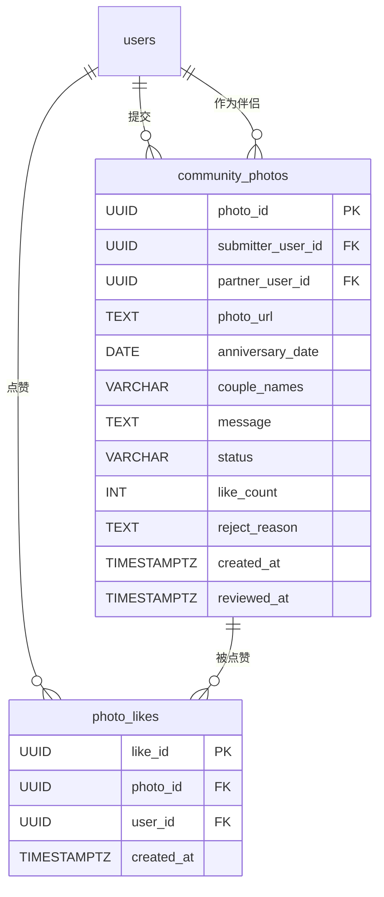
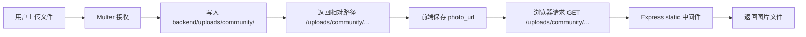
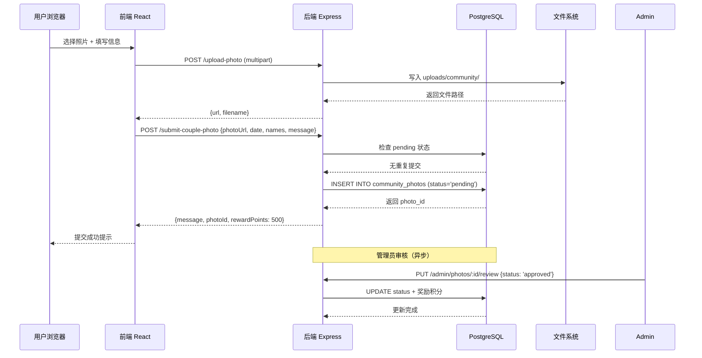

社区照片墙（"爱情墙"）是项目的 Phase 3 核心功能模块，为情侣用户提供一个分享甜蜜瞬间、互相点赞互动的社交空间。该功能采用 **提交-审核-展示** 三段式工作流，结合精灵球积分系统的激励机制，鼓励用户生成内容。

## 功能概览

社区照片墙围绕两个核心数据实体构建：照片记录与点赞行为。整个系统可分为前端展示层、后端业务逻辑层、数据存储层三个层次。

| 功能模块 | 前端入口 | 后端路由 | 数据库表 | 状态 |
|---------|---------|---------|---------|-----|
| 照片列表浏览 | `GET /community/photos` | `GET /api/community/photos` | `community_photos` | ✅ 已实现 |
| 照片文件上传 | 定义于 `API_ENDPOINTS.COMMUNITY.UPLOAD` | `POST /api/community/upload-photo` | 文件系统 | ✅ 已实现 |
| 照片提交审核 | — | `POST /api/community/submit-couple-photo` | `community_photos` | ✅ 已实现 |
| 点赞/取消点赞 | 卡片内点赞按钮 | `POST /api/community/photos/:photoId/like` | `photo_likes` | ✅ 已实现 |
| 我的提交记录 | — | `GET /api/community/my-submissions` | `community_photos` | ✅ 已实现 |
| 管理员审核 | — | `PUT /api/community/admin/photos/:photoId/review` | `community_photos` | ⚠️ 缺少权限校验 |

Sources: [frontend-react/src/pages/CommunityPage.tsx](frontend-react/src/pages/CommunityPage.tsx#L1-L158), [backend/routes/community.js](backend/routes/community.js#L1-L390), [backend/migrations/create_community_tables.sql](backend/migrations/create_community_tables.sql#L1-L40)

## 前端架构设计

`CommunityPage` 组件是照片墙的唯一页面入口，通过 `ProtectedRoute` 包裹确保登录访问，挂载于 `/community` 路由路径，并由底部 `TabBar` 的 💕 社区标签导航可达。

照片卡片采用 **pokemon-card** 样式容器，每张卡片包含：正方形图片区域（`aspect-square`，无图时显示 📷 占位符）、用户头像首字母圆形标识、昵称、文案、点赞与评论计数区。点赞按钮支持状态切换：已点赞显示 ❤️ 红色，未点赞显示 🤍 灰色，点击后通过乐观更新立即反映 UI 变化。

当前前端实现存在一个值得关注的设计特点：**发布按钮**（`+ 发布`）仅作为视觉占位存在，尚未绑定上传与提交逻辑。完整的照片提交流程需要协调文件上传接口与元数据提交接口，目前仅在后端定义。

Sources: [frontend-react/src/pages/CommunityPage.tsx](frontend-react/src/pages/CommunityPage.tsx#L1-L158), [frontend-react/src/App.tsx](frontend-react/src/App.tsx#L79-L83), [frontend-react/src/components/TabBar.tsx](frontend-react/src/components/TabBar.tsx#L1-L40)

## 后端路由体系

后端 `community.js` 模块通过 Express Router 组织，挂载于 `/api/community` 前缀。路由按功能可分为四类：

**照片列表接口**（`GET /photos`）查询 `status = 'approved'` 的记录，按创建时间倒序排列。支持 `page` 和 `pageSize` 两个查询参数进行分页，默认每页 10 条。SQL 查询通过 LEFT JOIN 关联 `users` 表两次，分别获取提交者和伴侣的昵称。

**文件上传接口**（`POST /upload-photo`）使用 Multer 中间件处理 `multipart/form-data` 请求。配置限制包括：文件类型仅允许 `jpg/jpeg/png/gif`，单文件最大 10MB，存储路径为 `backend/uploads/community/`，文件名格式为 `couple-<timestamp>-<random>.<ext>`。

**提交审核接口**（`POST /submit-couple-photo`）采用事务保护，先检查用户是否存在 `pending` 状态的未处理提交，防止重复提交。插入记录时状态默认为 `'pending'`。审核通过后奖励 500 积分。

**点赞接口**（`POST /photos/:photoId/like`）实现 toggle 语义：若 `photo_likes` 表中已存在记录则删除（取消点赞并 -1），否则插入（点赞并 +1）。`UNIQUE(photo_id, user_id)` 约束确保单用户对单照片仅能点赞一次。

**管理员审核接口**（`PUT /admin/photos/:photoId/review`）在事务中更新照片状态，若审核通过则执行积分奖励逻辑：更新 `users.points` 和 `users.total_points_earned`，并在 `point_history` 中插入记录。当前实现缺少管理员权限校验（代码中标注 TODO）。

Sources: [backend/routes/community.js](backend/routes/community.js#L45-L390), [backend/server.js](backend/server.js#L48-L62), [backend/migrations/create_community_tables.sql](backend/migrations/create_community_tables.sql#L1-L40)

## 数据模型设计

数据库层面由两张表构成核心数据模型：

**community_photos** — 照片主记录表：

| 字段 | 类型 | 约束 | 说明 |
|-----|------|------|------|
| photo_id | UUID | PK, DEFAULT gen_random_uuid() | 照片唯一标识 |
| submitter_user_id | UUID | NOT NULL, FK → users | 提交者 |
| partner_user_id | UUID | FK → users, ON DELETE SET NULL | 伴侣（可选） |
| photo_url | TEXT | NOT NULL | 照片相对路径 |
| anniversary_date | DATE | NOT NULL | 纪念日期 |
| couple_names | VARCHAR(100) | NULL | 情侣名称 |
| message | TEXT | NULL | 留言内容 |
| status | VARCHAR(20) | DEFAULT 'pending', CHECK | pending/approved/rejected |
| like_count | INT | DEFAULT 0 | 点赞计数（冗余字段） |
| reject_reason | TEXT | NULL | 拒绝原因 |
| created_at | TIMESTAMPTZ | DEFAULT CURRENT_TIMESTAMP | 创建时间 |
| reviewed_at | TIMESTAMPTZ | NULL | 审核时间 |

**photo_likes** — 点赞关联表：

| 字段 | 类型 | 约束 | 说明 |
|-----|------|------|------|
| like_id | UUID | PK, DEFAULT gen_random_uuid() | 点赞记录 ID |
| photo_id | UUID | NOT NULL, FK → community_photos, ON DELETE CASCADE | 关联照片 |
| user_id | UUID | NOT NULL, FK → users, ON DELETE CASCADE | 点赞用户 |
| created_at | TIMESTAMPTZ | DEFAULT CURRENT_TIMESTAMP | 点赞时间 |
| — | — | UNIQUE(photo_id, user_id) | 防重复点赞约束 |

索引策略覆盖三个查询维度：按提交者查询（`idx_community_photos_submitter`）、按审核状态过滤（`idx_community_photos_status`）、按时间倒序排序（`idx_community_photos_created`），以及点赞表的关联查询索引。

Sources: [backend/migrations/create_community_tables.sql](backend/migrations/create_community_tables.sql#L1-L40)

## 静态文件服务

照片文件的存储与访问通过 Express 静态中间件实现。上传的文件存储在 `backend/uploads/community/` 目录，通过 `app.use('/uploads', express.static(...))` 挂载为可公开访问的静态资源。

服务器同时提供其他静态资源目录：`/music` 映射到 `music/`，`/pictures` 映射到 `pictures/`。前端配置文件中定义了 `UPLOAD_BASE_URL` 用于拼接完整的图片访问地址。

Sources: [backend/server.js](backend/server.js#L25-L30), [frontend-react/src/config.ts](frontend-react/src/config.ts#L2-L4)

## 前后端接口差异分析

当前前端 `CommunityPage` 组件与后端 `GET /api/community/photos` 接口之间存在字段映射不一致的问题，这是开发过程中需要优先对齐的技术债务：

| 维度 | 前端期望字段 | 后端实际返回字段 | 影响 |
|-----|-------------|----------------|------|
| 照片 ID | `photo.photo_id` | `photo.id` | ❌ 渲染失败 |
| 图片 URL | `photo.image_url` | `photo.url` | ❌ 图片不显示 |
| 用户昵称 | `photo.nickname` | `photo.coupleNames` | ❌ 显示异常 |
| 文案 | `photo.caption` | `photo.message` | ❌ 文案丢失 |
| 点赞数 | `photo.likes_count` | `photo.likeCount` | ❌ 计数不显示 |
| 是否已赞 | `photo.is_liked` | 无此字段 | ❌ 状态缺失 |
| 分页参数 | `limit: 20` | 读取 `pageSize` 参数 | ⚠️ 默认值不同 |

前端查询使用 `params: { page, limit: 20 }` 而后端期望 `pageSize` 参数（默认值 10），且后端返回的数据结构与前端 `Photo` 接口定义完全不匹配。解决此差异有两种路径：修改后端响应格式以匹配前端，或在前端添加数据适配层进行字段映射。

Sources: [frontend-react/src/pages/CommunityPage.tsx](frontend-react/src/pages/CommunityPage.tsx#L30-L40), [backend/routes/community.js](backend/routes/community.js#L48-L88)

## 照片提交流程设计

完整的照片提交流程（待前端实现）遵循以下时序：

Sources: [backend/routes/community.js](backend/routes/community.js#L90-L200), [backend/routes/community.js](backend/routes/community.js#L280-L360)

## 相关页面导航

- 了解精灵球积分奖励机制 → [精灵球积分系统 API](28-jing-ling-qiu-ji-fen-xi-tong-api)
- 查看数据库模式全局设计 → [数据库模式概览](34-shu-ju-ku-mo-shi-gai-lan)
- 了解游戏化数据模型 → [游戏化系统数据模型](38-you-xi-hua-xi-tong-shu-ju-mo-xing)
- 查看前后端通信协议 → [前后端通信协议](8-qian-hou-duan-tong-xin-xie-yi)