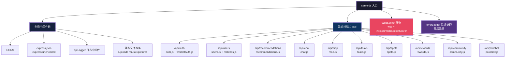
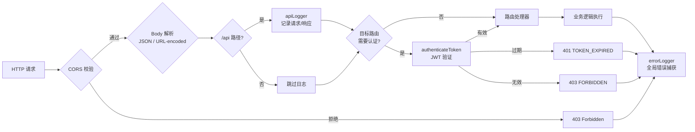

本文档系统化阐述 AIlove 后端基于 Express.js 构建的路由层架构，涵盖路由组织策略、URL 设计约定、中间件管道、以及各模块路由的端点全景。阅读完本节后，建议继续阅读 [JWT 认证与授权中间件](23-jwt-ren-zheng-yu-shou-quan-zhong-jian-jian) 理解认证守卫机制，以及 [前后端通信协议](8-qian-hou-duan-tong-xin-xie-yi) 掌握完整的 API 契约。

## 路由层架构总览

Express 路由层采用 **模块化挂载 + 中间件管道** 的分层设计。入口文件 `server.js` 作为路由注册中心，负责将 12 个独立路由模块按功能域挂载到 `/api` 基础路径下，同时串联全局中间件链。



Sources: [server.js](backend/server.js#L1-L84)

## 路由挂载拓扑

所有路由统一挂载于 `/api` 前缀之下，形成清晰的功能域划分。下表展示了完整的路由前缀映射关系及其核心职责：

| 路由前缀 | 模块文件 | 核心职责 | 认证要求 |
|---------|---------|---------|---------|
| `/api/auth` | `auth.js` + `wechatAuth.js` | 用户注册、登录、微信授权 | 部分接口免认证 |
| `/api/users` | `users.js` + `matches.js` | 个人档案、照片管理、匹配操作、配对记录 | 全部需要认证 |
| `/api/recommendations` | `recommendations.js` | 推荐计算与列表查询 | 全部需要认证 |
| `/api/chat` | `chat.js` | 聊天消息收发、历史记录 | 全部需要认证 |
| `/api/map` | `map.js` | 地理位置更新、附近用户查询 | 全部需要认证 |
| `/api/tasks` | `tasks.js` | 约会邀请、任务状态管理 | 全部需要认证 |
| `/api/spots` | `spots.js` | 约会地点查询、地理搜索 | 全部需要认证 |
| `/api/rewards` | `rewards.js` | 积分奖励、排行榜 | 全部需要认证 |
| `/api/community` | `community.js` | 照片墙浏览、上传、提交 | 部分免认证 |
| `/api/pokeball` | `pokeball.js` | 精灵球充值、消费、交易历史 | 全部需要认证 |

Sources: [server.js](backend/server.js#L34-L49), [auth.js](backend/routes/auth.js#L8-L9), [users.js](backend/routes/users.js#L10), [matches.js](backend/routes/matches.js#L9-L10), [chat.js](backend/routes/chat.js#L5-L6), [map.js](backend/routes/map.js#L3-L4), [recommendations.js](backend/routes/recommendations.js#L3-L8)

## 中间件管道设计

请求进入路由处理前需经过三层中间件过滤，形成**防御性管道**：



认证中间件 `authenticateToken` 是路由层的核心守卫，从 `Authorization` 请求头提取 Bearer Token 后进行 JWT 校验，解析后的用户载荷挂载至 `req.user` 对象。所有需要认证的端点在路由定义中显式注册此中间件：

```javascript
router.get('/me/profile', authenticateToken, async (req, res) => { ... });
```

Sources: [authenticateToken.js](backend/middleware/authenticateToken.js#L1-L26), [server.js](backend/server.js#L18-L22), [server.js](backend/server.js#L55-L62)

## API 端点全景

### 认证模块 (`/api/auth`)

认证域由两个文件共同承载，遵循**认证无关**原则——所有端点无需 JWT 校验。

| 方法 | 路径 | 文件 | 功能描述 |
|-----|------|-----|---------|
| `POST` | `/api/auth/register` | auth.js | 用户注册，验证邮箱格式与密码长度，生成 UUID 和 JWT |
| `POST` | `/api/auth/login` | auth.js | 邮箱密码登录，bcrypt 校验，返回 JWT（1小时有效期）|
| `POST` | `/api/auth/wechat-login` | wechatAuth.js | 微信小程序一键登录，自动创建用户（30天有效期）|
| `GET` | `/api/auth/wechat-user-info` | wechatAuth.js | 获取微信用户信息（需要认证）|

认证模块设计了一个重要的**异步联动模式**：注册成功后触发 `updateRecommendationsForUser` 异步计算推荐，错误被静默捕获仅记录日志，避免阻塞注册响应。

Sources: [auth.js](backend/routes/auth.js#L10-L119), [wechatAuth.js](backend/routes/wechatAuth.js#L24-L234)

### 用户模块 (`/api/users`)

用户模块是最复杂的路由域，涵盖档案 CRUD、照片管理、匹配执行三大子域：

| 方法 | 路径 | 功能描述 | 事务保护 |
|-----|------|---------|---------|
| `GET` | `/api/users/me/profile` | 获取个人完整档案 | 否 |
| `PUT` | `/api/users/me/profile` | 更新个人档案，动态构建 UPDATE 语句 | 否 |
| `GET` | `/api/users/:userId/profile` | 获取他人公开档案 | 否 |
| `POST` | `/api/users/me/photos` | 上传个人照片（Multer，最多5张，5MB限制）| 否 |
| `DELETE` | `/api/users/me/photos/:photoId` | 删除个人照片，同步清理文件系统 | 否 |
| `PUT` | `/api/users/me/avatar` | 设置头像，事务保证 `is_avatar` 一致性 | 是 (BEGIN/COMMIT) |
| `GET` | `/api/users/me/status` | 匹配前置检查：资料完整度、积分、VIP状态 | 否 |
| `POST` | `/api/users/me/match` | 执行匹配，扣除 50 积分 | 否 |
| `POST` | `/api/users/me/assign-pokemon` | 根据性格标签分配宝可梦头像 | 否 |

档案更新路由采用了**动态 SQL 构建模式**——通过 `addField` 辅助函数仅拼接非 undefined 的字段，最小化数据库写入：

```javascript
const addField = (field, value) => {
    if (value !== undefined) {
        updateFields.push(`${field} = $${paramIndex++}`);
        queryParams.push(value);
    }
};
```

Sources: [users.js](backend/routes/users.js#L34-L727), [matches.js](backend/routes/matches.js#L20-L244)

### 推荐与匹配模块 (`/api/recommendations`)

推荐模块提供推荐列表查询与全量重新计算两个端点。`POST /calculate` 端点根据用户偏好（性别、年龄范围）筛选候选用户后，并行调用 `calculateMatchScore`、`generateMatchReason`、`generateIcebreakers` 三个算法服务，最终通过单条批量 INSERT 写入推荐表：

| 方法 | 路径 | 功能描述 |
|-----|------|---------|
| `GET` | `/api/recommendations` | 获取推荐列表，支持分页和最低分数筛选 |
| `POST` | `/api/recommendations/calculate` | 重新计算所有推荐，DELETE + 批量 INSERT |

批量插入采用动态模板生成：

```javascript
const insertQuery = `
    INSERT INTO recommendations (...)
    VALUES ${results.map((_, i) => `($1, $${i * 4 + 2}, ...)`).join(', ')}
`;
```

Sources: [recommendations.js](backend/routes/recommendations.js#L13-L299)

### 聊天模块 (`/api/chat`)

聊天路由采用**对话伙伴维度**的 URL 设计，将聊天对象 ID 嵌入路径参数，实现 RESTful 的资源定位：

| 方法 | 路径 | 功能描述 |
|-----|------|---------|
| `GET` | `/api/chat/:chatPartnerId/messages` | 获取与指定用户的聊天历史（支持分页）|
| `POST` | `/api/chat/:chatPartnerId/messages` | 发送消息，持久化后通过 WebSocket 实时推送 |

发送消息路由实现了 **REST → WebSocket 桥接模式**：消息写入数据库后，通过 `req.app.get('sendMessageToUser')` 获取 WebSocket 服务实例，尝试向在线接收者推送实时通知。

Sources: [chat.js](backend/routes/chat.js#L8-L130)

### 地理位置模块 (`/api/map`)

地图模块深度集成 PostGIS 地理空间查询：

| 方法 | 路径 | 功能描述 | PostGIS 函数 |
|-----|------|---------|-------------|
| `POST` | `/api/map/update-location` | 更新用户坐标 | `ST_SetSRID(ST_MakePoint, 4326)::GEOGRAPHY` |
| `GET` | `/api/map/nearby` | 查询附近异性用户，按匹配分数过滤 | `ST_DWithin`, `ST_Distance`, `<->` KNN |

`nearby` 端点采用两阶段查询：首先通过 PostGIS 空间索引获取几何邻近用户，然后在应用层调用匹配算法计算分数并过滤（`min_score = 70`）。

Sources: [map.js](backend/routes/map.js#L10-L273)

### 游戏化模块 (`/api/rewards` + `/api/pokeball`)

游戏化系统由两个模块协同运作，积分奖励系统与精灵球经济系统相互独立：

**积分奖励 (`/api/rewards`)**

| 方法 | 路径 | 功能描述 |
|-----|------|---------|
| `POST` | `/api/rewards/daily-login` | 每日登录奖励，基础 10 积分 + 等级加成 |
| `POST` | `/api/rewards/complete-profile` | 完善资料奖励，每字段 5 积分，上限 50 |
| `GET` | `/api/rewards/leaderboard` | 积分排行榜，附带当前用户排名 |

**精灵球系统 (`/api/pokeball`)**

| 方法 | 路径 | 功能描述 | 事务保护 |
|-----|------|---------|---------|
| `GET` | `/api/pokeball/history` | 交易历史，支持类型过滤 | 否 |
| `POST` | `/api/pokeball/recharge` | 充值精灵球，`FOR UPDATE` 行锁 | 是 (BEGIN/COMMIT) |
| `POST` | `/api/pokeball/consume` | 消费精灵球，余额校验 | 是 (BEGIN/COMMIT) |

充值/消费路由使用 `SELECT ... FOR UPDATE` 实现悲观锁，防止并发充值导致余额不一致。

Sources: [rewards.js](backend/routes/rewards.js#L8-L514), [pokeball.js](backend/routes/pokeball.js#L14-L316)

### 社区模块 (`/api/community`)

社区照片墙采用**两步上传流程**：先上传文件获取 URL，再提交元数据信息进入审核队列：

| 方法 | 路径 | 功能描述 |
|-----|------|---------|
| `GET` | `/api/community/photos` | 获取已通过审核的照片墙列表（分页）|
| `POST` | `/api/community/upload-photo` | 上传照片文件（Multer 单文件，10MB限制）|
| `POST` | `/api/community/submit-couple-photo` | 提交情侣照片元数据，状态为 `pending` |
| `POST` | `/api/community/like-photo/:photoId` | 点赞照片 |

提交路由实现防重复检查：同一用户同时只能有一条 `pending` 状态的提交。

Sources: [community.js](backend/routes/community.js#L34-L390)

### 约会任务模块 (`/api/tasks` + `/api/spots`)

约会系统由任务管理和地点搜索两个模块组成：

| 方法 | 路径 | 功能描述 |
|-----|------|---------|
| `POST` | `/api/tasks/invite` | 发起约会邀请，验证接收者和地点存在性 |
| `POST` | `/api/tasks/:taskId/accept` | 接受约会邀请 |
| `POST` | `/api/tasks/:taskId/reject` | 拒绝约会邀请 |
| `POST` | `/api/tasks/:taskId/complete` | 标记任务完成 |
| `GET` | `/api/tasks` | 获取我的任务列表 |
| `GET` | `/api/spots/nearby` | 获取附近约会地点（PostGIS 空间查询）|
| `GET` | `/api/spots` | 获取所有约会地点（分页+类型筛选）|
| `POST` | `/api/spots` | 创建新的约会地点 |

邀请路由实现了完整的前置校验链：UUID 格式验证 → 自邀检查 → 接收者存在性 → 地点存在性 → 重复任务检查。

Sources: [tasks.js](backend/routes/tasks.js#L9-L522), [spots.js](backend/routes/spots.js#L9-L351)

## 设计模式总结

通过分析 12 个路由模块，可以归纳出以下核心设计模式：

| 模式名称 | 应用场景 | 典型代码位置 |
|---------|---------|-------------|
| **认证守卫** | 所有需要身份验证的端点 | `authenticateToken` 中间件 |
| **事务保护** | 余额操作、头像设置、照片提交 | `BEGIN/COMMIT/ROLLBACK` |
| **动态 SQL 构建** | 可选字段的档案更新 | `addField` 辅助函数 |
| **REST → WS 桥接** | 聊天消息实时推送 | `req.app.get('sendMessageToUser')` |
| **分页查询** | 列表型数据获取 | `LIMIT $1 OFFSET $2` |
| **PostGIS 空间查询** | 地理位置相关功能 | `ST_DWithin`, `ST_MakePoint` |
| **批量操作** | 推荐计算结果写入 | 动态 `VALUES` 模板 |
| **悲观锁** | 并发敏感的余额更新 | `SELECT ... FOR UPDATE` |
| **防重复检查** | 约会任务、照片提交 | 状态 + 用户 ID 唯一性校验 |
| **异步联动** | 注册后触发推荐计算 | `.catch(err => console.error(...))` |

## 静态文件服务

Express 通过 `express.static` 中间件提供三类静态资源访问，路径映射如下：

| URL 前缀 | 磁盘路径 | 用途 |
|---------|---------|-----|
| `/uploads` | `backend/uploads/` | 用户头像、社区照片 |
| `/music` | `music/` | 背景音乐（宝可梦主题曲）|
| `/pictures` | `pictures/` | 展示用图片资源 |

Sources: [server.js](backend/server.js#L24-L26)

## 错误处理架构

错误处理中间件 `errorLogger` 注册在所有路由之后，作为全局兜底。各路由模块内部的错误处理遵循统一范式：

```javascript
res.status(500).json({
    error: {
        code: 'INTERNAL_SERVER_ERROR',
        message: '描述性错误信息'
    }
});
```

错误响应体采用结构化格式 `{ error: { code, message } }` 或 `{ success: false, error: { message, details } }`，前端可通过 `code` 字段进行精确的异常分支处理。

Sources: [server.js](backend/server.js#L55-L57), [auth.js](backend/routes/auth.js#L111-L116), [chat.js](backend/routes/chat.js#L126-L129)

## 后续阅读建议

理解路由层设计后，建议按以下路径深入：

1. **[JWT 认证与授权中间件](23-jwt-ren-zheng-yu-shou-quan-zhong-jian-jian)** — 理解 `authenticateToken` 的验证逻辑与错误分支
2. **[用户认证 API](24-yong-hu-ren-zheng-api)** — 深入了解注册/登录/微信认证的完整流程
3. **[推荐匹配 API](25-tui-jian-pi-pei-api)** — 探索推荐计算端点与匹配算法的集成方式
4. **[聊天消息 API](26-liao-tian-xiao-xi-api)** — 理解 REST 与 WebSocket 的双通道消息机制
5. **[精灵球积分系统 API](28-jing-ling-qiu-ji-fen-xi-tong-api)** — 学习事务保护与悲观锁的实际应用