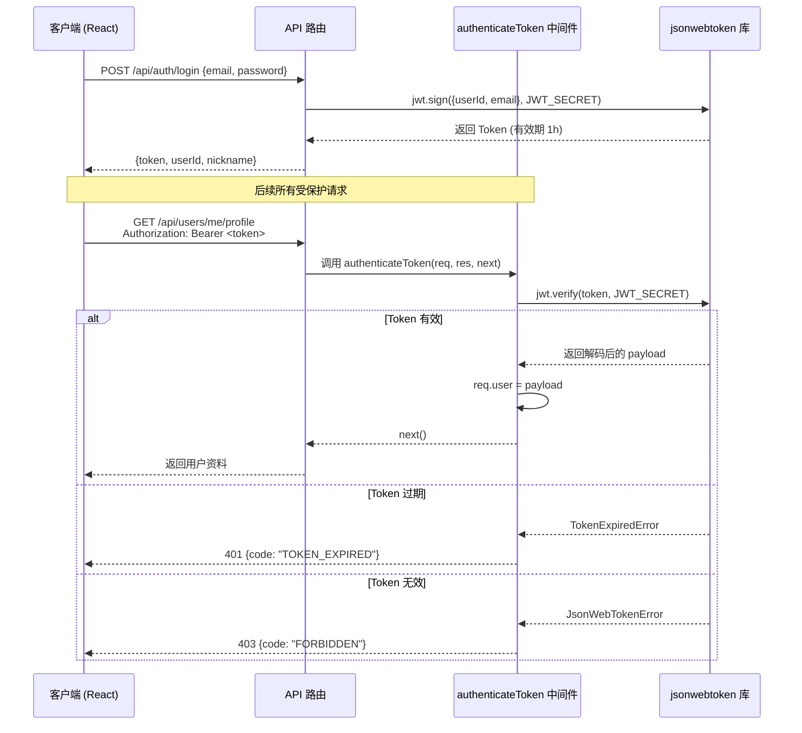
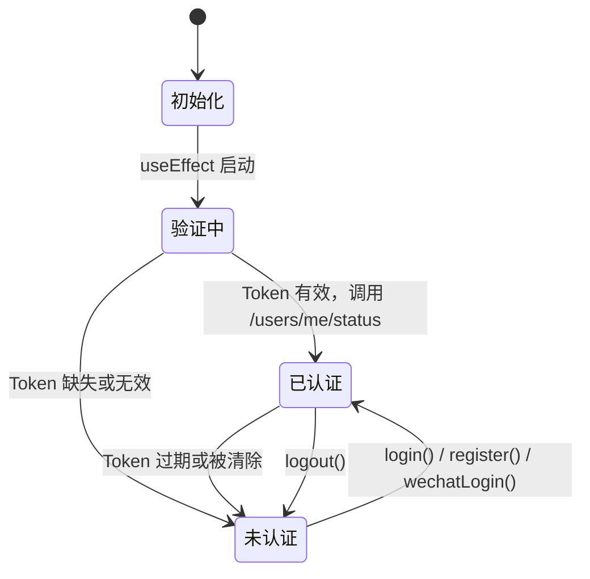

本文档深入剖析 AI月老 项目的 JWT（JSON Web Token）认证与授权架构，涵盖中间件实现原理、令牌生命周期、前后端协同机制以及错误处理策略。系统采用无状态 Token 认证模型，通过 `authenticateToken` 中间件实现统一的访问控制层。

## 认证架构全景

AI月老 采用经典的 JWT 无状态认证方案：用户通过登录凭证换取 Token，后续请求通过 `Authorization: Bearer <token>` 头携带令牌，中间件在服务端完成签名验证与身份注入，业务路由直接读取 `req.user` 获取当前用户上下文。



Sources: [authenticateToken.js](backend/middleware/authenticateToken.js#L1-L26) [auth.js](backend/routes/auth.js#L53-L65) [api.ts](frontend-react/src/services/api.ts#L11-L20)

## 中间件核心实现

`authenticateToken` 中间件是认证体系的核心守卫，驻留于 `backend/middleware/authenticateToken.js`。它从 HTTP `Authorization` 头中提取 Bearer Token，通过 `jsonwebtoken` 库完成同步验证，并将解析后的 payload 挂载到 `req.user` 对象上。

### Token 提取与验证流程

中间件首先解析请求头，采用标准 `Bearer <token>` 格式分割提取：

```javascript
const authHeader = req.headers['authorization'];
const token = authHeader && authHeader.split(' ')[1];
```

若 Token 缺失，直接返回 `401 UNAUTHORIZED`，阻止请求继续流转。验证成功后，payload 被附加到 `req.user`，下游路由可直接通过 `req.user.userId` 和 `req.user.email` 获取用户身份标识。

### 错误分类策略

中间件对 JWT 验证错误进行了精细化分类处理：

| 错误类型 | HTTP 状态码 | 错误码 | 语义说明 |
|---------|-----------|--------|---------|
| 无 Token | 401 | `UNAUTHORIZED` | 请求未携带认证凭据 |
| Token 过期 | 401 | `TOKEN_EXPIRED` | 令牌已超过有效期 |
| Token 无效 | 403 | `FORBIDDEN` | 签名不匹配或格式错误 |

**区分 Token 过期与 Token 无效至关重要**：过期意味着用户曾经认证成功，前端可触发静默刷新或跳转登录页；无效则可能暗示恶意篡改，返回 403 更具防御性。

Sources: [authenticateToken.js](backend/middleware/authenticateToken.js#L1-L26)

## 令牌生成策略

系统存在两条 Token 签发路径：邮箱密码认证和微信登录，两者在有效期策略上存在显著差异。

### 邮箱密码认证（短期令牌）

通过 `POST /api/auth/login` 和 `POST /api/auth/register` 接口签发的 Token 有效期为 **1 小时**：

```javascript
const token = jwt.sign(
    { userId: newUser.user_id, email: newUser.email },
    process.env.JWT_SECRET,
    { expiresIn: '1h' }
);
```

Payload 仅包含 `userId` 和 `email` 两个字段，遵循最小权限原则——避免将敏感信息嵌入公开传输的 Token 中。

### 微信登录（长期令牌）

微信小程序登录签发的 Token 有效期为 **30 天**，适应移动端低频主动登录的使用场景：

```javascript
token = jwt.sign(
    { userId: user.user_id, email: user.email },
    process.env.JWT_SECRET || 'YOUR_VERY_STRONG_JWT_SECRET_KEY',
    { expiresIn: '30d' }
);
```

> **安全提示**：微信登录路径中使用了 `process.env.JWT_SECRET || 'YOUR_VERY_STRONG_JWT_SECRET_KEY'` 的降级策略，生产环境必须确保环境变量已正确配置，否则将使用示例密钥。

Sources: [auth.js](backend/routes/auth.js#L53-L58) [auth.js](backend/routes/auth.js#L99-L104) [wechatAuth.js](backend/routes/wechatAuth.js#L76-L80)

## 前端认证协同机制

前端通过三层架构实现 JWT 令牌的完整生命周期管理：配置层、拦截器层和上下文层。

### Axios 请求拦截器

`api.ts` 中的请求拦截器在每次 HTTP 请求发出前自动注入 Bearer Token：

```typescript
api.interceptors.request.use(
  (config) => {
    const token = localStorage.getItem('token');
    if (token) {
      config.headers.Authorization = `Bearer ${token}`;
    }
    return config;
  },
  (error) => Promise.reject(error)
);
```

这一设计确保开发者在业务代码中无需手动处理 Token 附加，实现认证逻辑与业务逻辑的彻底解耦。

### 响应拦截器与自动登出

响应拦截器监听 `401` 状态码，自动清除本地存储并跳转登录页：

```typescript
api.interceptors.response.use(
  (response) => response,
  (error) => {
    if (error.response?.status === 401) {
      localStorage.removeItem('token');
      localStorage.removeItem('userData');
      window.location.href = '/login';
    }
    return Promise.reject(error);
  }
);
```

### AuthContext 状态管理

`AuthContext.tsx` 提供 React 应用级的认证状态管理，核心能力包括：



组件挂载时执行 Token 有效性验证——从 `localStorage` 读取 Token 后调用 `/users/me/status` 接口确认身份，若验证失败则清除残留数据并标记为未登录状态。

Sources: [api.ts](frontend-react/src/services/api.ts#L1-L36) [AuthContext.tsx](frontend-react/src/contexts/AuthContext.tsx#L1-L135)

## 路由保护覆盖范围

`authenticateToken` 中间件几乎覆盖所有业务 API 路由，形成统一的安全边界。以下是受保护路由的完整分布：

| 路由模块 | 前缀 | 受保护端点数 | 核心功能 |
|---------|------|:----------:|---------|
| 用户资料 | `/api/users` | 7 | 个人资料 CRUD、照片上传、头像设置 |
| 推荐匹配 | `/api/recommendations` | 3 | 匹配计算、推荐列表获取 |
| 聊天消息 | `/api/chat` | 2 | 消息发送、历史记录查询 |
| 地理位置 | `/api/map` | 2 | 位置更新、附近用户查询 |
| 社区照片 | `/api/community` | 5 | 照片上传、点赞、审核 |
| 精灵球系统 | `/api/pokeball` | 4 | 余额查询、充值、消费 |
| 约会任务 | `/api/tasks` | 4 | 邀请、接受、签到、我的任务 |
| 约会地点 | `/api/spots` | 4 | 地点查询、创建、类型列表 |
| 积分奖励 | `/api/rewards` | 6 | 每日签到、资料完善、排行榜 |
| 匹配记录 | `/api/users` (matches) | 2 | 匹配历史查询与创建 |

仅 `/api/auth/register`、`/api/auth/login`、`/api/auth/wechat-login` 三个公开端点无需 Token，其余所有业务操作均通过中间件守卫。

Sources: [chat.js](backend/routes/chat.js#L9) [users.js](backend/routes/users.js#L47) [recommendations.js](backend/routes/recommendations.js#L16) [community.js](backend/routes/community.js#L98) [pokeball.js](backend/routes/pokeball.js#L24) [tasks.js](backend/routes/tasks.js#L11) [map.js](backend/routes/map.js#L12) [rewards.js](backend/routes/rewards.js#L10)

## 环境变量配置

JWT 密钥通过 `JWT_SECRET` 环境变量注入，项目提供了标准化的配置模板：

```env
# JWT Configuration
# Generate a strong secret: openssl rand -base64 32
JWT_SECRET="YOUR_VERY_STRONG_JWT_SECRET_KEY_HERE"
```

**密钥生成建议**：使用 `openssl rand -base64 32` 命令生成高强度随机密钥，避免使用可预测的字符串。

Sources: [.env.example](backend/.env.example#L11-L12)

## 安全架构分析

### 当前实现的优势

- **无状态设计**：服务端无需维护会话状态，天然支持水平扩展
- **错误分类精准**：Token 过期与无效返回不同状态码，便于前端差异化处理
- **最小 Payload**：Token 仅携带 `userId` 和 `email`，减少信息泄露风险
- **前后端一致性**：所有受保护路由统一通过中间件守卫，无遗漏死角

### 潜在改进空间

| 改进项 | 当前状态 | 建议方案 |
|-------|---------|---------|
| Token 刷新机制 | 缺失 | 引入 Refresh Token 模式，避免频繁重新登录 |
| Token 撤销 | 不支持 | 将失效 Token 存入 Redis 黑名单 |
| 密钥降级 | 微信登录存在 `||` 降级 | 移除降级逻辑，启动时校验密钥存在性 |
| 固定 Token 有效期 | 1h/30d 硬编码 | 通过环境变量灵活配置 |
| 前端存储 | localStorage | 评估 HttpOnly Cookie 以防御 XSS |

Sources: [authenticateToken.js](backend/middleware/authenticateToken.js#L1-L26) [wechatAuth.js](backend/routes/wechatAuth.js#L79) [auth.js](backend/routes/auth.js#L56)

## 开发实践指南

### 在路由中使用中间件

为路由添加认证守卫只需引入中间件并作为第二个参数传入：

```javascript
const authenticateToken = require('../middleware/authenticateToken');

// GET 请求保护
router.get('/my-data', authenticateToken, async (req, res) => {
    const userId = req.user.userId; // 已验证的用户 ID
    // 业务逻辑...
});
```

### 前端发起认证请求

业务代码无需手动处理 Token，Axios 拦截器自动完成注入：

```typescript
// 直接调用即可，Token 由拦截器自动附加
const profile = await api.get('/users/me/profile');
```

### 处理 Token 过期

前端通过响应拦截器自动处理 401 错误并跳转登录页。如需实现无感刷新，可在拦截器中集成 Refresh Token 逻辑：

```typescript
api.interceptors.response.use(
  (response) => response,
  async (error) => {
    if (error.response?.status === 401 && error.response?.data?.error?.code === 'TOKEN_EXPIRED') {
      // 尝试使用 refresh_token 获取新 token
      // 失败则跳转登录页
    }
    return Promise.reject(error);
  }
);
```

## 延伸阅读

- [用户认证 API](24-yong-hu-ren-zheng-api) — 了解登录注册接口的完整实现
- [状态管理与认证上下文](14-zhuang-tai-guan-li-yu-ren-zheng-shang-xia-wen) — 前端认证状态管理细节
- [路由与权限控制](13-lu-you-yu-quan-xian-kong-zhi) — React 路由层面的权限守卫
- [微信登录集成](29-wei-xin-deng-lu-ji-cheng) — 微信认证流程与 Token 签发差异