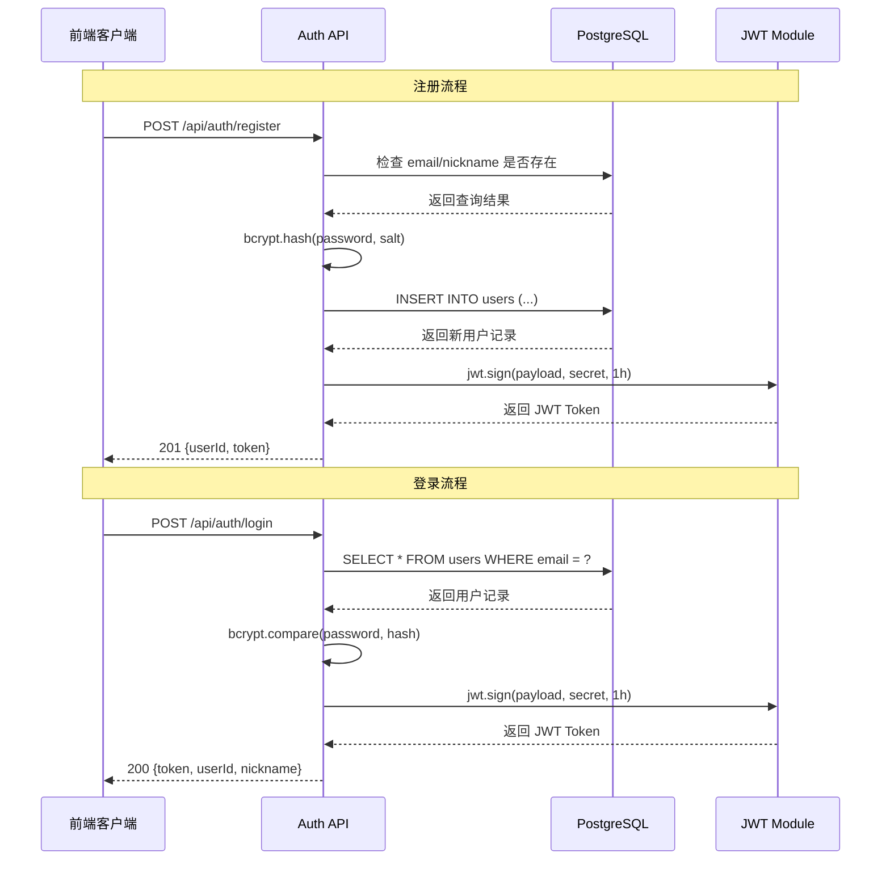
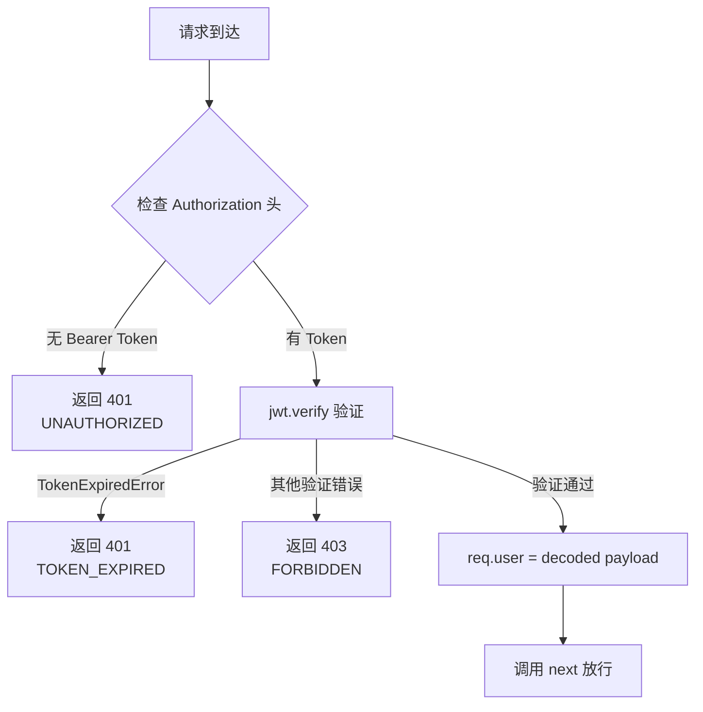
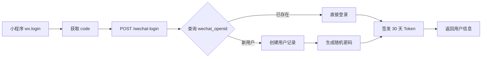

用户认证 API 是 AIlove 应用的安全入口，提供基于 JWT（JSON Web Token）的完整认证体系，支持邮箱密码注册/登录和微信一键登录双通道，并通过中间件实现受保护路由的权限验证。

## 认证架构概览

系统采用无状态 JWT 认证模型，客户端在登录后获得加密令牌，后续请求通过 `Authorization: Bearer <token>` 携带身份凭证。认证流程分为三个层级：**凭证验证层**、**令牌签发层**和**中间件防护层**。



Sources: [auth.js](backend/routes/auth.js#L11-L119), [authenticateToken.js](backend/middleware/authenticateToken.js#L1-L26)

## API 端点清单

所有认证端点统一挂载在 `/api/auth` 路由下，由 Express Router 管理。

| 方法 | 端点 | 认证要求 | 功能描述 | 响应码 |
|------|------|----------|----------|--------|
| `POST` | `/api/auth/register` | 否 | 邮箱密码注册，自动签发 Token | 201 / 400 / 409 / 500 |
| `POST` | `/api/auth/login` | 否 | 邮箱密码登录，返回 JWT Token | 200 / 400 / 401 / 500 |
| `POST` | `/api/auth/wechat-login` | 否 | 微信小程序一键登录 | 200 / 400 / 500 |
| `GET` | `/api/users/me/status` | 是 | 获取当前用户状态（用于前端 Token 校验） | 200 / 401 / 404 / 500 |

Sources: [auth.js](backend/routes/auth.js#L11-L119), [wechatAuth.js](backend/routes/wechatAuth.js#L23-L52), [server.js](backend/server.js#L56-L57)

## 注册接口详解

**`POST /api/auth/register`** 处理新用户注册，包含完整的输入校验与冲突检测机制。

请求体需要三个必需字段：`nickname`（昵称，数据库唯一约束）、`email`（邮箱，需符合标准格式）、`password`（密码，最小长度 8 字符）。

```
POST /api/auth/register
Content-Type: application/json

{
  "nickname": "训练师小明",
  "email": "xiaoming@example.com",
  "password": "SecurePass123"
}
```

注册成功后，系统自动执行三个操作：使用 bcrypt（salt rounds = 10）对密码进行哈希存储；通过 UUID v4 生成用户 ID；签发有效期为 **1 小时** 的 JWT Token。注册完成后异步触发推荐引擎更新 [`updateRecommendationsForUser`](backend/routes/auth.js#L74-L79)。

成功响应（201）返回 `userId`、`token` 和确认消息。若邮箱或昵称已存在，返回 409 冲突错误并指明冲突字段（Email 或 Nickname）。

Sources: [auth.js](backend/routes/auth.js#L13-L80)

## 登录接口详解

**`POST /api/auth/login`** 验证用户身份并签发访问令牌。

```
POST /api/auth/login
Content-Type: application/json

{
  "email": "xiaoming@example.com",
  "password": "SecurePass123"
}
```

登录流程首先根据邮箱查询用户记录，若不存在则直接返回 401 错误（安全考虑：不区分"用户不存在"和"密码错误"两种情况，防止信息泄露）。密码匹配使用 `bcrypt.compare()` 进行恒定时间比较，防止时序攻击。

成功响应（200）除了返回 `token` 和 `userId` 外，还包含 `nickname` 字段，便于前端直接展示用户名称。

Sources: [auth.js](backend/routes/auth.js#L82-L117)

## JWT 令牌规范

JWT 令牌采用 `jsonwebtoken` 库签发，配置如下：

| 属性 | 值 | 说明 |
|------|-----|------|
| Payload | `{ userId, email }` | 用户唯一标识和邮箱 |
| Secret | `process.env.JWT_SECRET` | 环境变量注入 |
| Expiration | `1h` | 注册/登录令牌 1 小时有效 |
| Expiration | `30d` | 微信登录令牌 30 天有效 |

令牌的验证由 `authenticateToken` 中间件统一处理，该中间件从 `Authorization` 请求头提取 Bearer Token，区分三种验证结果：无令牌（401 UNAUTHORIZED）、令牌过期（401 TOKEN_EXPIRED）和令牌无效（403 FORBIDDEN）。

Sources: [authenticateToken.js](backend/middleware/authenticateToken.js#L3-L25), [auth.js](backend/routes/auth.js#L62-L67), [wechatAuth.js](backend/routes/wechatAuth.js#L89-L94)

## 认证中间件工作原理

`authenticateToken` 中间件是所有受保护路由的第一道防线。其工作流程可概括为：**提取 → 验证 → 注入 → 放行**。



验证通过后，解码后的 payload 被注入到 `req.user` 对象，后续路由处理函数可通过 `req.user.userId` 获取当前用户的唯一标识。这种模式在整个后端的一致性极高——所有需要身份识别的端点（如获取个人资料、发送消息、更新位置）都依赖此中间件。

Sources: [authenticateToken.js](backend/middleware/authenticateToken.js#L1-L26), [users.js](backend/routes/users.js#L52-L53)

## 微信登录集成

**`POST /api/auth/wechat-login`** 为微信小程序用户提供免密登录通道。该接口通过微信 `code` 换取用户身份，首次登录自动创建账号。

请求参数包含微信登录授权码 `code` 和用户信息 `userInfo`（含 `nickName` 和 `avatarUrl`）。当前实现中，微信 API 调用部分标记为 TODO，使用 `code` 前 20 位模拟生成 `openid`。生产环境需要替换为真实的微信 `jscode2session` 调用。



微信登录的 Token 有效期为 30 天，远长于邮箱登录的 1 小时，这符合小程序用户的使用习惯。新用户创建时默认赋予初始等级（1 级）、精灵球数量（2 个）和资料完整度（30 分）。

Sources: [wechatAuth.js](backend/routes/wechatAuth.js#L23-L180)

## 前端认证集成

前端通过 React Context（[`AuthContext`](frontend-react/src/contexts/AuthContext.tsx)）管理全局认证状态，结合 Axios 拦截器实现自动化的 Token 注入和过期处理。

### 状态管理架构

`AuthProvider` 组件维护 `user`、`token` 和 `isLoading` 三个核心状态。应用初始化时，从 `localStorage` 恢复 Token 并调用 `GET /api/users/me/status` 验证有效性——若验证失败则清除本地存储并重定向至登录页。

### Axios 拦截器模式

`api.ts` 配置了双向拦截器：请求拦截器自动附加 `Authorization: Bearer <token>` 头；响应拦截器捕获 401 错误，清除本地 Token 并跳转 `/login`。这种设计使得业务组件无需手动处理认证逻辑。

Sources: [AuthContext.tsx](frontend-react/src/contexts/AuthContext.tsx#L1-L135), [api.ts](frontend-react/src/services/api.ts#L1-L36), [config.ts](frontend-react/src/config.ts#L1-L53)

## 安全考量

认证系统在多个层面实现了安全最佳实践：

**密码存储**：使用 bcrypt 进行单向哈希，salt rounds 设置为 10，在安全性和性能之间取得平衡。明文密码从未存入数据库。

**错误响应一致性**：登录失败时统一返回 "Invalid credentials"，不区分"用户不存在"和"密码错误"，防止攻击者枚举有效邮箱。

**Token 时效控制**：普通登录 Token 仅 1 小时有效，微信登录 30 天有效。过期的 Token 在中间件层面被拦截，前端需引导用户重新登录。

**输入校验**：注册端点校验邮箱格式（正则 `/\S+@\S+\.\S+/`）、密码最小长度（8 字符）和昵称/邮箱唯一性，在数据入库前完成验证。

**数据库事务**：微信登录使用 `pool.connect()` 获取独立连接，通过 `BEGIN/COMMIT/ROLLBACK` 确保用户创建与 Token 签发的原子性。

Sources: [auth.js](backend/routes/auth.js#L32-L35), [auth.js](backend/routes/auth.js#L93-L94), [authenticateToken.js](backend/middleware/authenticateToken.js#L15-L18), [wechatAuth.js](backend/routes/wechatAuth.js#L54-L180)

## 错误码参考

认证 API 使用标准化的错误码体系，便于前端统一处理。

| 错误码 | HTTP 状态 | 触发场景 | 建议处理方式 |
|--------|-----------|----------|-------------|
| `INVALID_INPUT` | 400 | 缺少必需字段或格式错误 | 提示用户修正输入 |
| `CONFLICT` | 409 | 邮箱或昵称已被注册 | 提示用户更换昵称/邮箱 |
| `UNAUTHORIZED` | 401 | 无效凭证、无 Token、Token 过期 | 引导用户重新登录 |
| `TOKEN_EXPIRED` | 401 | JWT 超过有效期 | 自动跳转登录页 |
| `FORBIDDEN` | 403 | Token 签名不匹配 | 清除本地 Token 并重新登录 |
| `INTERNAL_SERVER_ERROR` | 500 | 数据库或系统异常 | 显示通用错误提示 |

Sources: [auth.js](backend/routes/auth.js#L16-L18), [authenticateToken.js](backend/middleware/authenticateToken.js#L9-L21)

## 相关模块

- 用户资料管理：`[用户 API 端点](22-express-lu-you-she-ji)` — 依赖认证中间件的个人资料 CRUD
- JWT 中间件：`[JWT 认证与授权中间件](23-jwt-ren-zheng-yu-shou-quan-zhong-jian-jian)` — 中间件的详细设计模式
- 微信登录：`[微信登录集成](29-wei-xin-deng-lu-ji-cheng)` — 微信 OAuth 的完整实现细节
- 数据库模式：`[用户与资料表设计](35-yong-hu-yu-zi-liao-biao-she-ji)` — users 表的完整字段定义