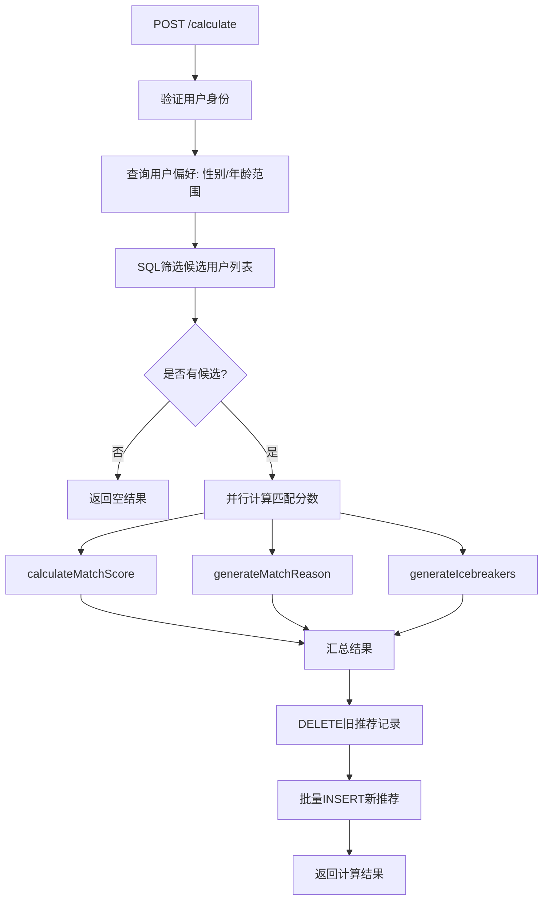
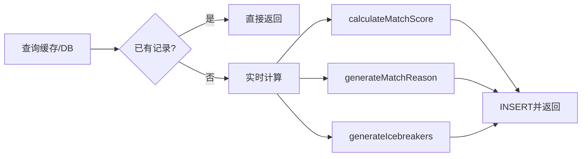
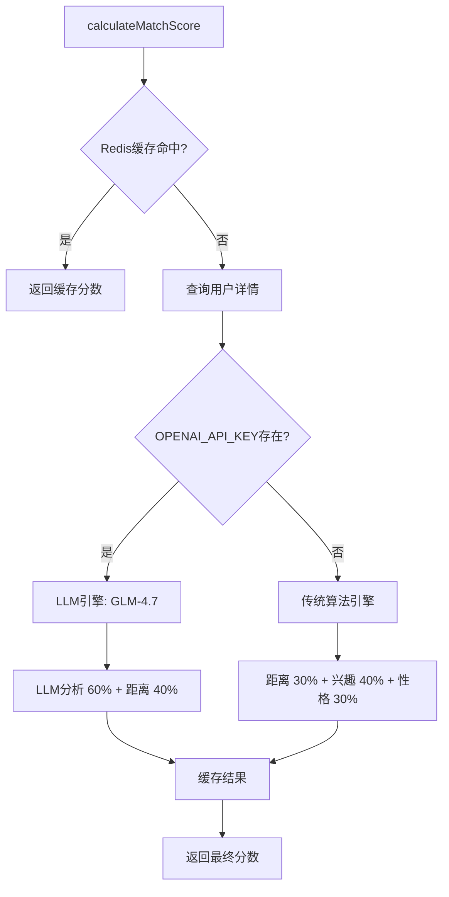
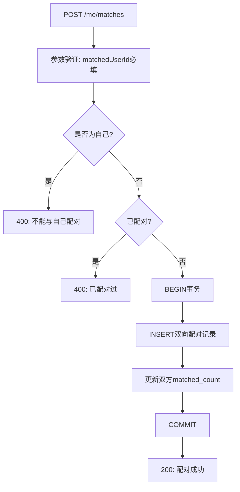

推荐匹配 API 是 AIlove 系统的核心模块之一，负责为用户计算、存储和检索潜在的匹配对象。该模块采用**双层架构**：路由层处理 HTTP 请求与响应，服务层封装匹配算法与数据逻辑。系统支持两种匹配引擎——基于 LLM（智谱AI GLM-4.7）的智能分析和基于传统算法（Jaccard + 余弦相似度）的轻量级匹配，并通过 Redis 缓存层优化性能。

Sources: [recommendations.js](backend/routes/recommendations.js#L1-L40) [server.js](backend/server.js#L45-L61)

## API 路由概览

系统共暴露两个路由文件，分别承载不同的业务语义：`/api/recommendations` 处理推荐计算与查询，`/api/users/me/matches` 管理已确认的配对记录。

| 路由 | 方法 | 认证 | 功能描述 | 响应码 |
|---|---|---|---|---|
| `/api/recommendations/calculate` | POST | ✅ JWT | 为当前用户重新计算所有推荐 | 200, 404, 500 |
| `/api/recommendations` | GET | ✅ JWT | 获取推荐列表（支持分页与最低分数筛选） | 200, 500 |
| `/api/recommendations/user/:userId` | GET | ✅ JWT | 获取与特定用户的匹配分数（缓存优先） | 200, 500 |
| `/api/users/me/matches` | GET | ✅ JWT | 获取当前用户的配对记录 | 200, 500 |
| `/api/users/me/matches` | POST | ✅ JWT | 创建双向配对记录 | 200, 400, 500 |
| `/api/users/:id/matches` | GET | ❌ 公开 | 获取指定用户的公开配对记录 | 200, 500 |

Sources: [recommendations.js](backend/routes/recommendations.js#L11-L298) [matches.js](backend/routes/matches.js#L13-L244)

## 推荐计算端点：`POST /api/recommendations/calculate`

该端点触发完整的推荐计算流程，通常在用户资料更新后手动调用。其核心逻辑分为三个阶段：**候选筛选**、**匹配评分**、**结果持久化**。



**请求体**：

```json
{ "limit": 50 }
```

**核心筛选逻辑**：

性别筛选采用**偏好优先**策略——若用户设置了 `preferred_gender`，则精确匹配该性别；否则默认展示异性。年龄筛选基于 `birth_date` 使用 `EXTRACT(YEAR FROM AGE(...))` 动态计算。所有条件通过参数化查询拼接，防范 SQL 注入。

计算阶段使用 `Promise.all` 并发处理所有候选用户，每个候选对象独立执行 `calculateMatchScore`、`generateMatchReason` 和 `generateIcebreakers` 三个函数，最终批量插入 `recommendations` 表。

Sources: [recommendations.js](backend/routes/recommendations.js#L11-L149)

## 推荐查询端点：`GET /api/recommendations`

该端点从预计算的 `recommendations` 表中检索推荐结果，支持**游标分页**和**分数阈值过滤**。

**查询参数**：

| 参数 | 类型 | 默认值 | 说明 |
|---|---|---|---|
| `limit` | int | 10 | 每页返回数量 |
| `offset` | int | 0 | 分页偏移量 |
| `min_score` | int | 0 | 最低匹配分数筛选 |

**响应结构**：

```json
{
  "recommendations": [
    {
      "userId": "uuid",
      "name": "昵称",
      "age": 25,
      "occupation": "职业",
      "bio": "个人简介",
      "imageUrl": "头像URL",
      "recommendationScore": 85,
      "match_reason": "匹配原因",
      "icebreakers": ["话题1", "话题2", "话题3"]
    }
  ],
  "totalCount": 42,
  "nextOffset": 10
}
```

排序策略为 `match_score DESC, last_calculated DESC`，确保高分结果优先展示，相同分数时最新计算的排前。

Sources: [recommendations.js](backend/routes/recommendations.js#L152-L205)

## 一对一匹配查询：`GET /api/recommendations/user/:userId`

该端点用于查看与**特定用户**的匹配详情。采用**缓存优先**策略：首先查询 `recommendations` 表是否已有计算结果，若存在则直接返回；若不存在则实时计算并落盘。



这一设计避免了重复计算开销，同时保证了数据的一致性——计算结果立即写入数据库供后续查询复用。

Sources: [recommendations.js](backend/routes/recommendations.js#L208-L276)

## 匹配算法架构

匹配计算由 [`matchingAlgorithm.js`](backend/services/matchingAlgorithm.js) 统一调度，采用**智能/传统双引擎**模式。



### 传统算法引擎

当未配置 LLM API 或 LLM 调用失败时，系统回退到传统算法：

| 维度 | 算法 | 权重 | 说明 |
|---|---|---|---|
| 地理距离 | PostGIS `ST_Distance` | 30% | 500m内100分，>10km降至10分 |
| 兴趣重叠 | Jaccard 相似度 | 40% | `交集/并集` × 100 |
| 性格匹配 | 词袋模型 + 余弦相似度 | 30% | 按字符分词的向量余弦值 |

地理距离使用 PostgreSQL 的 `ST_Distance` 函数，将经纬度转为 `GEOGRAPHY` 类型计算球面距离（米），分段映射到 0-100 分。兴趣匹配采用集合论的 Jaccard 系数，性格匹配则对 `values_description` 文本进行中文字符级别的词袋化与余弦相似度计算。

Sources: [matchingAlgorithm.js](backend/services/matchingAlgorithm.js#L238-L350)

### LLM 智能引擎

当配置了 `OPENAI_API_KEY` 且双方均填写了价值观描述时，启用 LLM 引擎。通过智谱AI GLM-4.7 模型进行多维度分析：

**Prompt 结构**：

- **系统提示**：定义情感匹配专家角色，要求返回 JSON 格式
- **用户提示**：包含双方的价值观描述、兴趣标签、问答数据
- **评估维度**：价值观契合度（30%）、兴趣重叠度（30%）、性格匹配度（20%）、潜在话题（20%）
- **输出格式**：`{ score, reason, strengths, suggestions }`

LLM 返回的分数与地理距离分数按 **6:4** 加权合成最终匹配度。温度参数设为 0.3，降低随机性以确保结果稳定性。LLM 调用失败时自动降级到传统算法。

Sources: [matchingAlgorithm.js](backend/services/matchingAlgorithm.js#L116-L197)

## 配对记录管理：`/api/users/me/matches`

与推荐不同，配对记录代表**已确认的匹配关系**。`user_matches` 表存储双方用户的 Pokémon 快照信息和相容度分数。



创建配对时使用数据库事务保证**原子性**：先检查是否存在重复配对，然后插入 `user_matches` 记录，最后递增双方的 `matched_count` 计数器。`user_id` 与 `matched_user_id` 的唯一约束防止重复配对。

**配对记录数据结构**：

```sql
CREATE TABLE user_matches (
  id UUID PRIMARY KEY DEFAULT gen_random_uuid(),
  user_id UUID NOT NULL REFERENCES users(user_id),
  matched_user_id UUID NOT NULL REFERENCES users(user_id),
  user_pokemon_type VARCHAR(50),
  user_pokemon_name VARCHAR(100),
  user_pokemon_sprite TEXT,
  matched_pokemon_type VARCHAR(50),
  matched_pokemon_name VARCHAR(100),
  matched_pokemon_sprite TEXT,
  compatibility_score DECIMAL(5,2),
  created_at TIMESTAMP WITH TIME ZONE DEFAULT CURRENT_TIMESTAMP,
  UNIQUE(user_id, matched_user_id)
);
```

配对记录中嵌入了双方的 Pokémon 快照（类型、名称、精灵图），这是一种**反范式化设计**——将匹配时刻的游戏化状态固化存储，避免因用户后续更换 Pokémon 导致历史记录失真。

Sources: [matches.js](backend/routes/matches.js#L75-L175) [add_pokeball_system.sql](backend/migrations/add_pokeball_system.sql#L51-L85)

## 破冰话题生成机制

`generateIcebreakers` 函数基于用户资料动态生成最多 3 个破冰话题，策略如下：

1. **共同兴趣优先**：若存在共同标签，生成「听说你也喜欢{X}？」和「一起{X}怎么样？」两个话题
2. **Q&A 共鸣**：若双方均填写了 `ideal_weekend`，生成「你理想中的周末是怎么度过的？」
3. **默认兜底**：无匹配数据时返回通用问候话题

```javascript
// 话题生成示例
// 共同标签: ["摄影", "咖啡"]
// 生成: ["听说你也喜欢摄影？", "一起摄影怎么样？"]

// Q&A 匹配
// 生成: ["你理想中的周末是怎么度过的？"]
```

Sources: [matchingAlgorithm.js](backend/services/matchingAlgorithm.js#L426-L465)

## Redis 缓存策略

`cacheService.js` 提供匹配分数的缓存层，TTL 设为 24 小时，键名采用**排序双ID**模式：

```
match_score:{sorted_id_a}:{sorted_id_b}
```

排序策略确保 `match_score:A:B` 和 `match_score:B:A` 命中同一缓存键，避免重复计算。用户资料更新时可调用 `invalidateUserMatchScores(userId)` 清除相关缓存，模式匹配 `match_score:*:${userId}` 和 `match_score:${userId}:*` 覆盖两个方向。

Sources: [cacheService.js](backend/services/cacheService.js#L36-L82)

## 数据库索引设计

`recommendations` 表配置了两个关键索引：

| 索引名 | 列 | 类型 | 用途 |
|---|---|---|---|
| `idx_recommendations_recommending_user_id` | `recommending_user_id` | B-tree | 加速按用户查询推荐 |
| `idx_recommendations_score` | `match_score DESC` | B-tree | 优化 ORDER BY match_score DESC 排序 |

`user_matches` 表配置了三个索引以支持配对记录的高频查询：`user_id`、`created_at DESC` 和 `compatibility_score DESC`。

Sources: [schema.sql](backend/schema.sql#L123-L124) [add_pokeball_system.sql](backend/migrations/add_pokeball_system.sql#L77-L79)

## 错误处理与响应规范

所有端点遵循统一的错误响应格式：

```json
{
  "error": {
    "code": "INTERNAL_SERVER_ERROR",
    "message": "具体错误描述"
  }
}
```

常见错误码：
- `USER_NOT_FOUND` (404) — 用户不存在
- `INTERNAL_SERVER_ERROR` (500) — 服务端异常
- 业务级 400 — 参数缺失、重复配对等

Sources: [recommendations.js](backend/routes/recommendations.js#L24-L29) [matches.js](backend/routes/matches.js#L93-L103)

## 后续阅读

深入了解相关模块：

- [匹配算法架构](30-pi-pei-suan-fa-jia-gou) — 匹配引擎的完整设计原理
- [LLM 智能匹配（智谱AI）](31-llm-zhi-neng-pi-pei-zhi-pu-ai) — GLM-4.7 集成的详细实现
- [传统匹配算法（兴趣/性格/距离）](32-chuan-tong-pi-pei-suan-fa-xing-qu-xing-ge-ju-chi) — Jaccard 与余弦相似度的数学基础
- [推荐服务与缓存](33-tui-jian-fu-wu-yu-huan-cun) — recommendationService 的 AI 精筛流程
- [Redis 缓存策略](10-redis-huan-cun-ce-lue) — 缓存层的完整架构