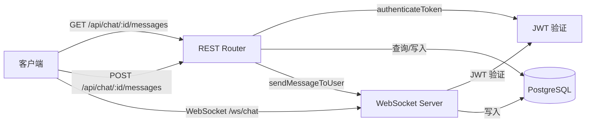
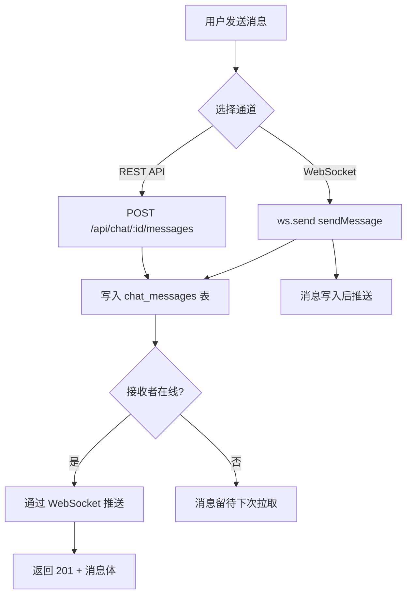
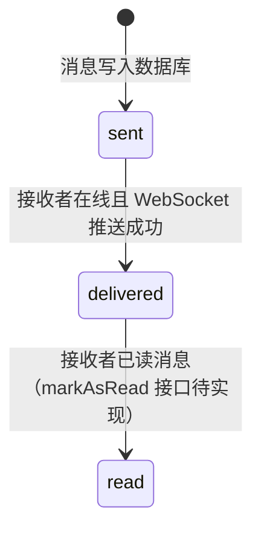

聊天消息模块采用 **REST + WebSocket 混合架构**：REST API 负责历史消息查询与离线消息持久化，WebSocket 负责实时消息推送。发送消息时，系统优先尝试通过 WebSocket 推送给在线接收者，若接收者离线则消息仅写入数据库，待用户上线后通过 REST API 拉取。这种设计兼顾了实时性与可靠性。

Sources: [chat.js](backend/routes/chat.js#L1-L130), [websocketService.js](backend/services/websocketService.js#L1-L144), [server.js](backend/server.js#L43-L72)

## 路由架构

聊天消息 API 挂载于 `/api/chat` 路径下，所有端点均需通过 JWT 认证中间件 `authenticateToken`。



Sources: [chat.js](backend/routes/chat.js#L8-L10), [server.js](backend/server.js#L57)

## REST API 端点

### 获取聊天历史

**GET** `/api/chat/:chatPartnerId/messages`

返回当前用户与指定聊天对象之间的消息记录。消息按时间倒序排列，支持基于时间戳的分页。

| 参数 | 位置 | 类型 | 必填 | 说明 |
|------|------|------|------|------|
| `chatPartnerId` | Path | UUID | 是 | 聊天对方的用户 ID |
| `limit` | Query | number | 否 | 返回消息数量上限，默认 50 |
| `beforeTimestamp` | Query | ISO 8601 | 否 | 分页游标，仅返回此时间戳之前的消息 |

**响应示例 (200)**：

```json
{
  "messages": [
    {
      "messageId": "a1b2c3d4-...",
      "senderId": "user-uuid-1",
      "receiverId": "user-uuid-2",
      "content": "你好！",
      "timestamp": "2024-01-15T10:30:00.000Z",
      "status": "sent"
    }
  ]
}
```

**业务逻辑**：查询条件使用 `(sender_id = $1 AND receiver_id = $2) OR (sender_id = $2 AND receiver_id = $1)` 确保双向消息均被检索。分页通过 `beforeTimestamp` 实现游标式加载，避免传统 offset 分页在高频写入场景下的数据不一致问题。

Sources: [chat.js](backend/routes/chat.js#L11-L52)

### 发送消息

**POST** `/api/chat/:chatPartnerId/messages`

创建一条新消息并尝试通过 WebSocket 实时推送给接收方。

| 参数 | 位置 | 类型 | 必填 | 说明 |
|------|------|------|------|------|
| `chatPartnerId` | Path | UUID | 是 | 消息接收者用户 ID |
| `content` | Body | string | 是 | 消息文本内容 |

**请求体示例**：

```json
{
  "content": "今晚有空吗？"
}
```

**响应示例 (201)**：

```json
{
  "messageId": "e5f6a7b8-...",
  "senderId": "user-uuid-1",
  "receiverId": "user-uuid-2",
  "content": "今晚有空吗？",
  "timestamp": "2024-01-15T11:00:00.000Z",
  "status": "sent"
}
```

**错误码**：

| 状态码 | Error Code | 触发条件 |
|--------|-----------|----------|
| 400 | `INVALID_INPUT` | 消息内容为空或接收者为发送者本人 |
| 404 | `NOT_FOUND` | 接收者用户不存在 |
| 500 | `INTERNAL_SERVER_ERROR` | 数据库写入或 WebSocket 推送异常 |

**推送流程**：消息写入数据库后，通过 `req.app.get('sendMessageToUser')` 调用 WebSocket 服务。若接收者在线，消息即刻推送；若离线，消息仅落盘，状态保持为 `sent`。

Sources: [chat.js](backend/routes/chat.js#L54-L128), [server.js](backend/server.js#L70-L72)

## WebSocket 实时通信

WebSocket 服务器监听 `/ws/chat` 路径，通过 URL query 参数 `token` 进行 JWT 认证。连接建立后，客户端与服务端通过 JSON 格式的消息进行交互。

### 连接建立

```
wss://<host>/ws/chat?token=<JWT_TOKEN>
```

服务端验证 token 后将 `userId → WebSocket` 映射存入内存 `clients` Map，供后续消息路由使用。认证失败的连接将被立即关闭（状态码 1008）。

Sources: [websocketService.js](backend/services/websocketService.js#L12-L35)

### 消息协议

**客户端 → 服务端**：

```json
{
  "type": "sendMessage",
  "payload": {
    "receiverId": "user-uuid-2",
    "content": "通过 WebSocket 发送的消息"
  }
}
```

**服务端 → 客户端（推送新消息）**：

```json
{
  "type": "newMessage",
  "payload": {
    "messageId": "uuid",
    "senderId": "user-uuid-2",
    "receiverId": "user-uuid-1",
    "content": "通过 WebSocket 发送的消息",
    "timestamp": "2024-01-15T11:00:00.000Z"
  }
}
```

**错误响应**：

```json
{
  "type": "error",
  "payload": {
    "message": "Missing receiverId or content."
  }
}
```

Sources: [websocketService.js](backend/services/websocketService.js#L37-L92)

### WebSocket 消息类型

| 方向 | type 值 | 触发条件 | 处理逻辑 |
|------|---------|----------|----------|
| 客户端 → 服务端 | `sendMessage` | 用户发送消息 | 写入数据库 → 推送给接收者（若在线） |
| 服务端 → 客户端 | `newMessage` | 收到新消息 | 客户端渲染消息到聊天界面 |
| 服务端 → 客户端 | `error` | 参数校验失败 | 客户端显示错误提示 |
| 客户端 → 服务端 | `markAsRead` | 用户已读消息 | 预留接口，当前未实现完整逻辑 |

Sources: [websocketService.js](backend/services/websocketService.js#L37-L92)

## REST 与 WebSocket 的双通道设计

系统提供两种发送消息的途径，客户端可根据网络状态和业务需求选择：



**REST 通道优势**：天然支持 HTTP 错误码语义，适合弱网环境下的重试逻辑；消息发送与响应绑定在同一请求生命周期内。

**WebSocket 通道优势**：低延迟双向通信，适合连续对话场景；消息送达后可即时获得 `newMessage` 推送，无需轮询。

**混合推送机制**：无论通过哪种通道发送，REST 端点在写入数据库后都会调用 `sendMessageToUser()` 尝试 WebSocket 推送（[chat.js](backend/routes/chat.js#L98-L112)）。这意味着即使用户通过 REST API 发送消息，在线接收者也能实时收到推送。

Sources: [chat.js](backend/routes/chat.js#L98-L112), [websocketService.js](backend/services/websocketService.js#L119-L128)

## 数据库模型

`chat_messages` 表采用 UUID 主键，支持级联删除与双向外键约束。

| 字段 | 类型 | 约束 | 说明 |
|------|------|------|------|
| `message_id` | UUID | PRIMARY KEY, DEFAULT gen_random_uuid() | 消息唯一标识 |
| `sender_id` | UUID | NOT NULL, FK → users(user_id) ON DELETE CASCADE | 发送者 ID |
| `receiver_id` | UUID | NOT NULL, FK → users(user_id) ON DELETE CASCADE | 接收者 ID |
| `content` | TEXT | NOT NULL | 消息文本内容 |
| `timestamp` | TIMESTAMPTZ | DEFAULT NOW() | 消息发送时间 |
| `status` | VARCHAR(20) | DEFAULT 'sent' | 消息状态：`sent` / `delivered` / `read` |

**索引策略**：表上建立了两个复合索引 `idx_chat_messages_sender_receiver` 和 `idx_chat_messages_receiver_sender`，均按 `(sender_id, receiver_id, timestamp DESC)` 排序，确保双向消息查询均可走索引扫描，避免全表扫描。

Sources: [schema.sql](backend/schema.sql#L106-L126)

## 状态流转

消息状态 `status` 字段预留了三个生命周期阶段：



**当前实现状态**：

- `sent`：消息已成功写入数据库，REST API 返回时默认状态
- `delivered`：代码中预留了状态更新逻辑（[websocketService.js](backend/services/websocketService.js#L83-L86)），但当前未启用
- `read`：`markAsRead` 消息类型已定义，数据库更新与通知发送逻辑以注释形式存在（[websocketService.js](backend/services/websocketService.js#L94-L105)）

Sources: [websocketService.js](backend/services/websocketService.js#L83-L105), [chat.js](backend/routes/chat.js#L76)

## 安全与边界处理

| 安全措施 | 实现位置 | 说明 |
|----------|----------|------|
| JWT 认证 | REST 中间件 + WebSocket 握手 | 所有请求必须携带有效 token |
| 自发消息拦截 | REST + WebSocket | 检测 `senderId === receiverId` 并拒绝 |
| 空内容校验 | REST 端点 | 拒绝空字符串或纯空白消息 |
| 接收者存在性检查 | REST 端点 | 写入前查询 `users` 表，防止向不存在用户发消息 |
| SQL 参数化查询 | 所有数据库操作 | 使用 `$1, $2...` 参数占位符防止注入 |
| 级联删除 | 数据库外键 | 用户删除时自动清理关联消息 |

Sources: [chat.js](backend/routes/chat.js#L59-L68), [websocketService.js](backend/services/websocketService.js#L49-L55), [schema.sql](backend/schema.sql#L108-L109)

## 前端集成要点

前端实现聊天功能时需注意：

1. **WebSocket 连接管理**：在用户登录后建立 WebSocket 连接，token 从本地存储获取；连接断开时应实现自动重连机制
2. **消息去重**：由于 REST 发送与 WebSocket 推送可能产生重复消息，前端应基于 `messageId` 进行去重
3. **分页加载**：使用 `beforeTimestamp` 实现上拉加载更多历史消息，首次加载获取最新 50 条
4. **离线消息处理**：用户重新上线后，应通过 REST API 拉取离线期间收到的消息

如需了解前端聊天界面的具体实现，请参阅 [实时聊天界面](20-shi-shi-liao-tian-jie-mian)。完整的实时通信协议细节见 [WebSocket 实时通信](9-websocket-shi-shi-tong-xin)。数据库表之间的关联关系见 [聊天与社区数据模型](37-liao-tian-yu-she-qu-shu-ju-mo-xing)。