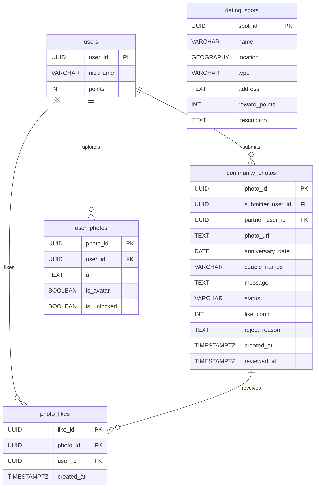
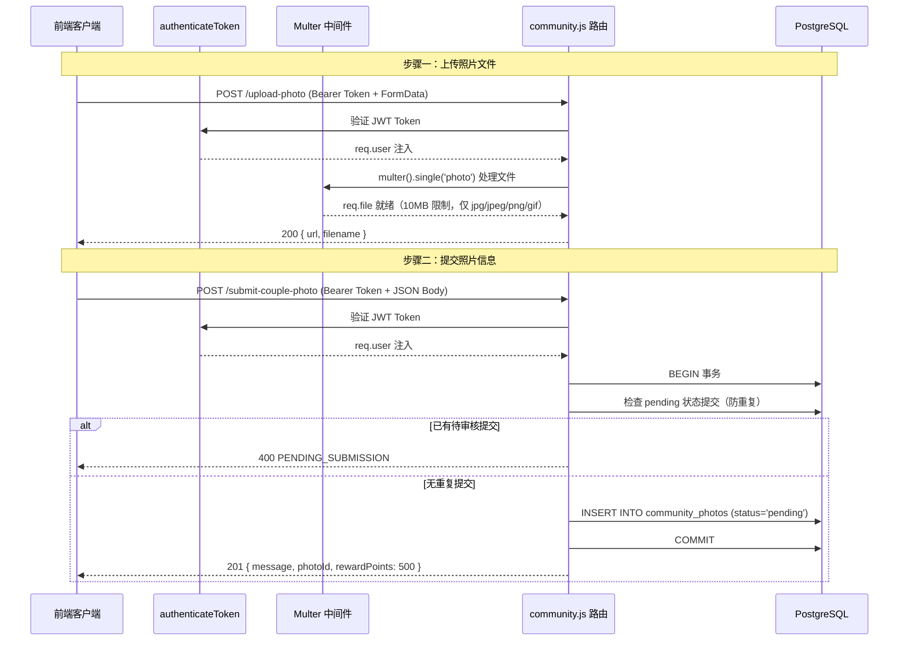
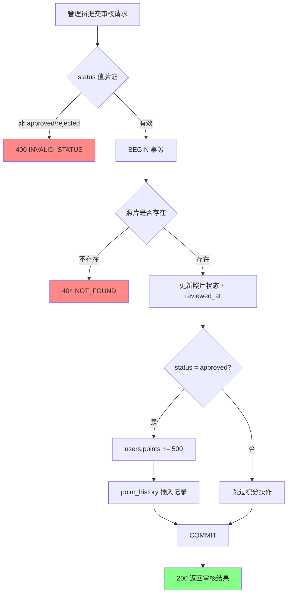
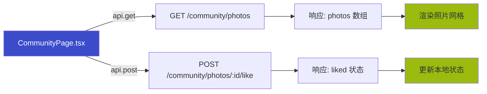

社区与照片 API 是 AI 月老系统中负责**情侣照片墙展示、照片上传提交、社交点赞互动**以及**约会地点管理**的核心模块。该模块采用审核激励机制——用户提交照片并通过审核后可获得 500 积分奖励——以此驱动社区活跃度。

系统由后端 Express 路由、PostgreSQL 数据层（含社区专用迁移脚本）和前端 React 页面三部分组成，通过 JWT 认证中间件保护写操作，通过静态文件服务暴露上传资源。

## API 路由概览

社区 API 挂载于 `/api/community` 前缀，约会地点 API 挂载于 `/api/spots` 前缀。以下是完整的路由清单：

| 方法 | 路径 | 认证 | 功能 | 响应码 |
|------|------|------|------|--------|
| `GET` | `/api/community/photos` | 否 | 获取照片墙列表（分页） | 200 / 500 |
| `POST` | `/api/community/upload-photo` | 是 | 上传照片文件 | 200 / 400 |
| `POST` | `/api/community/submit-couple-photo` | 是 | 提交情侣照片信息 | 201 / 400 / 500 |
| `POST` | `/api/community/photos/:photoId/like` | 是 | 点赞/取消点赞照片 | 200 / 201 / 500 |
| `GET` | `/api/community/my-submissions` | 是 | 获取我的提交记录 | 200 / 500 |
| `PUT` | `/api/community/admin/photos/:photoId/review` | 是 | 管理员审核照片 | 200 / 400 / 404 / 500 |
| `GET` | `/api/spots/nearby` | 是 | 获取附近约会地点 | 200 / 400 / 500 |
| `GET` | `/api/spots` | 是 | 获取约会地点列表（分页） | 200 / 500 |
| `POST` | `/api/spots` | 是 | 创建约会地点 | 201 / 400 / 500 |
| `GET` | `/api/spots/types` | 是 | 获取地点类型列表 | 200 / 500 |

Sources: [community.js](backend/routes/community.js#L1-L390), [spots.js](backend/routes/spots.js#L1-L351), [server.js](backend/server.js#L46-L62)

## 数据模型架构

社区功能涉及两张专用表，由独立迁移脚本创建。`community_photos` 存储照片元数据与审核状态，`photo_likes` 记录用户点赞行为并通过 `UNIQUE(photo_id, user_id)` 约束防止重复点赞。

数据库索引设计针对高频查询路径优化：`idx_community_photos_status` 支持按审核状态过滤，`idx_community_photos_created` 加速按时间倒序排列的列表查询，`idx_photo_likes_photo` 和 `idx_photo_likes_user` 分别支持按照片和用户查询点赞记录。

Sources: [create_community_tables.sql](backend/migrations/create_community_tables.sql#L1-L40), [schema.sql](backend/schema.sql#L58-L66)

## 照片上传与提交流程

照片上传采用**两步分离设计**：先上传文件获取 URL，再提交照片元数据。这种设计将文件操作与数据库事务解耦，避免大文件上传阻塞数据库连接。

Multer 配置要点：文件存储于 `backend/uploads/community/` 目录，文件名格式为 `couple-{timestamp}-{random}.{ext}`，文件大小上限 10MB，仅允许 `jpg/jpeg/png/gif` 四种图片格式。上传目录在服务启动时自动创建。

Sources: [community.js](backend/routes/community.js#L12-L44), [community.js](backend/routes/community.js#L89-L170)

## 照片墙列表与点赞机制

### 列表查询

`GET /api/community/photos` 接口仅返回审核通过（`status = 'approved'`）的照片。查询通过 `LEFT JOIN` 关联 `users` 表获取提交者和合作者昵称，如果 `couple_names` 字段为空，则动态拼接为 `{submitter_name} & {partner_name}` 格式。分页参数 `page` 和 `pageSize` 默认值分别为 1 和 10，响应中的 `hasMore` 字段用于前端判断是否展示"加载更多"按钮。

### 点赞操作

点赞接口实现**幂等切换**逻辑：查询 `photo_likes` 表判断用户是否已点赞，已存在则执行 DELETE + 计数器减一（取消点赞），不存在则执行 INSERT + 计数器加一（点赞）。`photo_likes` 表的 `UNIQUE(photo_id, user_id)` 约束作为数据库层面的兜底防护。

Sources: [community.js](backend/routes/community.js#L46-L87), [community.js](backend/routes/community.js#L172-L223)

## 管理员审核与积分奖励

审核接口 `PUT /api/community/admin/photos/:photoId/review` 是系统中唯一触发积分变更的社区操作。审核通过时，系统在同一个事务中完成三步操作：更新照片状态为 `approved` 并记录 `reviewed_at` 时间戳、向 `users` 表增加 500 积分（同时更新 `points` 和 `total_points_earned`）、向 `point_history` 表插入类型为 `community_reward` 的记录。

当前实现中管理员权限检查标记为 `TODO`，这意味着任何已认证用户理论上均可调用此接口——在生产环境部署前必须补充角色校验中间件。

Sources: [community.js](backend/routes/community.js#L260-L340)

## 约会地点 API

约会地点 API 依托 PostGIS 地理空间查询能力，提供基于位置的地点发现功能。`GET /api/spots/nearby` 接收经纬度坐标和可选半径（默认 10 公里），使用 `ST_DWithin` 函数进行地理围栏查询，并按距离排序返回最多 50 个结果。距离信息以三种格式返回：米数、公里数和格式化文本（<1000m 显示米，≥1000m 显示公里）。

地点类型系统采用预定义方案，包含 12 种类型：咖啡馆、餐厅、公园、电影院、博物馆、书店、酒吧、健身房、购物中心、海滩、游戏厅、KTV。每种类型配有对应的 emoji 图标。

Sources: [spots.js](backend/routes/spots.js#L10-L97), [spots.js](backend/routes/spots.js#L275-L310)

## 前端集成

前端通过 `config.ts` 中定义的 `API_ENDPOINTS.COMMUNITY` 对象管理社区 API 端点，使用 Axios 实例 `api` 发送请求。`CommunityPage.tsx` 组件实现照片墙页面，核心交互包括分页加载、点赞操作和"加载更多"按钮。

前端 `Photo` 接口定义与后端响应存在字段映射差异——前端使用 `image_url`、`caption`、`likes_count` 等字段名，而后端响应使用 `url`、`message`、`likeCount` 等字段名。这意味着当前前端代码可能需要适配层或字段映射逻辑才能正确渲染后端数据。

静态资源通过 Nginx/Express 的 `/uploads` 路径直接访问，前端 `UPLOAD_BASE_URL` 配置为 `http://{host}:{port}/uploads`，照片 URL 拼接为 `/uploads/community/{filename}` 格式。

Sources: [config.ts](frontend-react/src/config.ts#L19-L23), [CommunityPage.tsx](frontend-react/src/pages/CommunityPage.tsx#L1-L158)

## 安全与生产注意事项

| 风险项 | 当前状态 | 建议措施 |
|--------|----------|----------|
| 管理员权限校验 | TODO 未实现 | 添加角色中间件，验证 `req.user.role === 'admin'` |
| 文件类型验证 | 仅前端扩展名检查 | 增加魔数（magic number）验证或使用 `file-type` 库 |
| 文件大小限制 | 10MB Multer 限制 | 根据生产需求调整，考虑使用云存储（S3/OSS）替代本地存储 |
| 重复提交防护 | 基于 pending 状态检查 | 增加时间窗口限制，避免用户反复提交 |
| SQL 注入防护 | 参数化查询 ✅ | 已使用 `$1, $2...` 参数化查询，保持 |
| XSS 防护 | 前端渲染时未转义 | React 默认转义，但 `dangerouslySetInnerHTML` 需审查 |
| 审核事务完整性 | 事务包裹 ✅ | 已使用 `BEGIN/COMMIT/ROLLBACK`，保持 |

Sources: [community.js](backend/routes/community.js#L97-L107), [community.js](backend/routes/community.js#L12-L24)

## 相关页面

- 了解认证中间件的工作原理：[JWT 认证与授权中间件](23-jwt-ren-zheng-yu-shou-quan-zhong-jian-jian)
- 了解积分奖励的完整数据模型：[游戏化系统数据模型](38-you-xi-hua-xi-tong-shu-ju-mo-xing)
- 了解前端照片墙页面的实现细节：[社区照片墙](21-she-qu-zhao-pian-qiang)
- 了解数据库模式的整体设计：[数据库模式概览](34-shu-ju-ku-mo-shi-gai-lan)