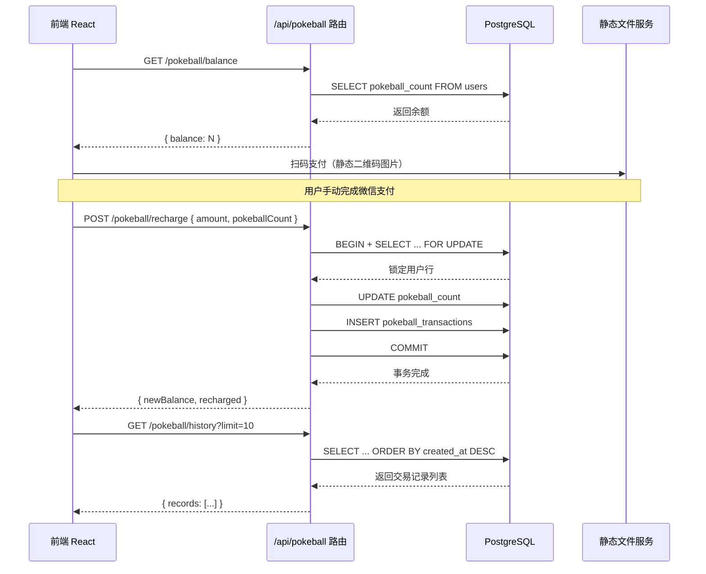
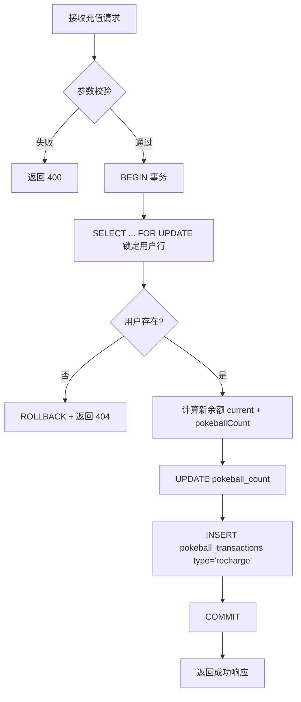
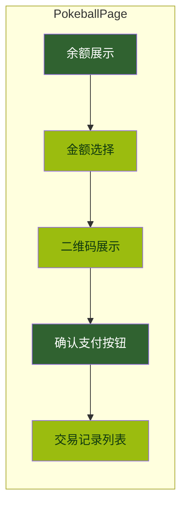

精灵球积分系统是 AIlove 平台的**核心游戏化经济模块**，负责管理用户精灵球（虚拟货币）的充值、消费与交易记录查询。精灵球作为平台内匹配行为的消耗品，构成了用户互动的基本经济循环：**充值获取 → 匹配消耗 → 记录审计**。本页面详细阐述该系统的 API 端点、数据模型、事务安全机制及前端集成方式。

## 系统架构与数据流

精灵球系统由三个核心组件构成：**RESTful API 路由层**、**PostgreSQL 事务层**、**前端页面层**。所有涉及余额变动的操作均通过数据库事务 + 行级锁（`FOR UPDATE`）保障原子性与一致性。



数据流向遵循 **读写分离** 原则：`GET` 端点用于状态查询，`POST` 端点用于状态变更，所有变更操作均受 `authenticateToken` 中间件保护。

Sources: [pokeball.js](backend/routes/pokeball.js#L1-L316) [config.ts](frontend-react/src/config.ts#L1-L53) [server.js](backend/server.js#L45-L60)

## 数据库设计

精灵球系统通过两次数据库迁移完成表结构搭建，涉及三张核心表/视图。

### 数据模型总览

| 表/视图 | 用途 | 关键字段 | 迁移文件 |
|---------|------|---------|----------|
| `users`（扩展字段） | 存储用户当前精灵球余额与配对计数 | `pokeball_count`（默认 2）、`matched_count` | [add_pokeball_system.sql](backend/migrations/add_pokeball_system.sql#L8-L13) |
| `pokeball_transactions` | 记录每一笔精灵球增减流水 | `transaction_type`（recharge/consume）、`amount`、`balance_after`、`reference_id` | [create_pokeball_transactions_table.sql](backend/migrations/create_pokeball_transactions_table.sql#L5-L14) |
| `user_matches` | 配对成功记录，携带宝可梦元数据 | `user_id`、`matched_user_id`、`compatibility_score` | [add_pokeball_system.sql](backend/migrations/add_pokeball_system.sql#L34-L63) |
| `user_pokeball_stats` | 聚合统计视图（只读） | 充值总量、消费总量、配对总数 | [add_pokeball_system.sql](backend/migrations/add_pokeball_system.sql#L79-L94) |

### 约束与索引策略

`pokeball_transactions` 表通过 `CHECK (transaction_type IN ('recharge', 'consume'))` 约束确保类型合法性，`CHECK (amount > 0)` 约束确保数量为正。索引策略覆盖三个查询维度：

- `idx_pokeball_transactions_user_id`：按用户查询历史记录
- `idx_pokeball_transactions_created_at DESC`：按时间倒序排列
- `idx_pokeball_transactions_type`：按交易类型过滤

新用户注册时，`trigger_ensure_default_pokeball` 触发器自动为其分配 **2 个初始精灵球**，确保用户首次使用即可体验匹配功能。

Sources: [add_pokeball_system.sql](backend/migrations/add_pokeball_system.sql#L1-L133) [create_pokeball_transactions_table.sql](backend/migrations/create_pokeball_transactions_table.sql#L1-L38)

## API 端点详述

所有端点统一挂载在 `/api/pokeball` 路径下，路由注册于 [server.js](backend/routes/pokeball.js#L15) 的 `app.use('/api/pokeball', pokeballRoutes)` 声明中。

### GET `/api/pokeball/balance` — 查询当前余额

获取认证用户的精灵球当前持有量，为页面展示和匹配前置校验提供数据支撑。

| 项目 | 说明 |
|------|------|
| **认证** | 需要 JWT Bearer Token |
| **请求参数** | 无 |
| **响应码** | 200 / 404 / 500 |

```json
// 成功响应 (200)
{
  "success": true,
  "balance": 7
}
```

```json
// 用户不存在 (404)
{
  "success": false,
  "error": { "message": "用户不存在" }
}
```

后端直接查询 `users` 表的 `pokeball_count` 字段，无分页逻辑。

Sources: [pokeball.js](backend/routes/pokeball.js#L250-L285)

### GET `/api/pokeball/history` — 查询交易历史

返回指定用户的精灵球交易流水记录，支持分页与类型过滤。

| 项目 | 说明 |
|------|------|
| **认证** | 需要 JWT Bearer Token |
| **Query 参数** | `limit`（默认 50）、`offset`（默认 0）、`type`（可选：`recharge` / `consume`） |
| **响应码** | 200 / 500 |

```json
// 成功响应 (200)
{
  "success": true,
  "records": [
    {
      "id": "uuid-string",
      "type": "recharge",
      "amount": 10,
      "description": "微信充值 10 元",
      "balance_after": 12,
      "reference_id": null,
      "created_at": "2025-01-15T08:30:00.000Z"
    },
    {
      "id": "uuid-string",
      "type": "consume",
      "amount": 1,
      "description": "匹配消耗",
      "balance_after": 2,
      "reference_id": "match-uuid",
      "created_at": "2025-01-15T09:00:00.000Z"
    }
  ],
  "total": 2
}
```

查询时通过动态拼接 SQL 实现条件过滤，参数化查询防止 SQL 注入。返回的 `total` 字段为当前查询返回的行数（`result.rowCount`），而非总记录数。

Sources: [pokeball.js](backend/routes/pokeball.js#L15-L60)

### POST `/api/pokeball/recharge` — 精灵球充值

用户通过微信扫码支付后手动确认充值，增加精灵球余额并创建流水记录。采用 **数据库事务 + 行级锁** 确保并发安全。

| 项目 | 说明 |
|------|------|
| **认证** | 需要 JWT Bearer Token |
| **Content-Type** | `application/json` |
| **响应码** | 200 / 400 / 404 / 500 |

**请求体：**

| 字段 | 类型 | 必填 | 说明 |
|------|------|------|------|
| `amount` | number | 是 | 充值金额（元），必须 > 0 |
| `pokeballCount` | number | 是 | 充值精灵球数量，必须 > 0 |

```json
// 请求示例
{
  "amount": 10,
  "pokeballCount": 10
}
```

```json
// 成功响应 (200)
{
  "success": true,
  "message": "成功充值 10 个精灵球",
  "data": {
    "previousBalance": 2,
    "recharged": 10,
    "newBalance": 12
  }
}
```

```json
// 参数校验失败 (400)
{
  "success": false,
  "error": { "message": "充值金额必须大于0" }
}
```

**事务流程：**



当前汇率为 **1 元 = 1 个精灵球**，通过前端 `AMOUNT_OPTIONS` 配置数组定义可选档位。

Sources: [pokeball.js](backend/routes/pokeball.js#L68-L145) [PokeballPage.tsx](frontend-react/src/pages/PokeballPage.tsx#L13-L19)

### POST `/api/pokeball/consume` — 精灵球消费

扣除用户精灵球余额，通常由匹配业务流程调用。同样采用事务保护，并在扣减前校验余额充足性。

| 项目 | 说明 |
|------|------|
| **认证** | 需要 JWT Bearer Token |
| **Content-Type** | `application/json` |
| **响应码** | 200 / 400 / 404 / 500 |

**请求体：**

| 字段 | 类型 | 必填 | 说明 |
|------|------|------|------|
| `amount` | number | 否 | 消费数量，默认 1，必须 > 0 |
| `referenceId` | string (UUID) | 否 | 关联业务 ID（如匹配 ID） |
| `description` | string | 否 | 消费描述，默认 "匹配消耗" |

```json
// 请求示例
{
  "amount": 1,
  "referenceId": "match-uuid-string",
  "description": "匹配消耗"
}
```

```json
// 成功响应 (200)
{
  "success": true,
  "message": "成功消耗 1 个精灵球",
  "data": {
    "previousBalance": 12,
    "consumed": 1,
    "newBalance": 11
  }
}
```

```json
// 余额不足 (400)
{
  "success": false,
  "error": { "message": "精灵球不足，当前剩余 0 个，需要 1 个" }
}
```

余额校验发生在事务内部，避免并发场景下的超扣问题。当 `currentBalance < amount` 时立即 ROLLBACK 并返回明确错误提示。

Sources: [pokeball.js](backend/routes/pokeball.js#L153-L244)

## 前端集成

精灵球系统的前端实现位于 `PokeballPage` 组件，通过 `/pokeball` 路由访问，集成于受保护的 `AppLayout` 布局中。

### 页面功能结构



### 数据流

页面加载时通过 `Promise.all` 并行获取余额与最近 10 条交易记录：

```typescript
const [balanceRes, historyRes] = await Promise.all([
  api.get('/pokeball/balance'),
  api.get('/pokeball/history?limit=10'),
]);
```

充值流程为 **用户手动确认模式**：用户选择充值金额 → 展示对应微信收款二维码 → 用户完成支付后点击「我已支付」→ 后端执行充值逻辑。该设计无需接入微信支付回调，降低了系统复杂度，但依赖用户诚实操作。

### 充值档位配置

| 金额（元） | 精灵球数量 | 二维码文件（`pictures/` 目录） |
|-----------|-----------|-------------------------------|
| 1 | 1 | `5443633d2ed15065ce4ec7425f78c861.jpg` |
| 5 | 5 | `d8ed6d84c8a8d3370c46a0fb95feed57.jpg` |
| 10 | 10 | `6542f00d80affe884a9874bbe39dc2b2.jpg` |
| 20 | 20 | `291a087c7b9f2211de1b8078ab4eb6f6.jpg` |
| 50 | 50 | `8d0cc8904ccb7da00f86d87282166b01.jpg` |
| 100 | 100 | `0c5a516cebe2de0af541055c17258904.jpg` |

Sources: [PokeballPage.tsx](frontend-react/src/pages/PokeballPage.tsx#L1-L196) [config.ts](frontend-react/src/config.ts#L30-L41) [App.tsx](frontend-react/src/App.tsx#L82-L92)

## 关联系统

精灵球系统与平台其他模块存在以下关联：

- **[推荐匹配 API](25-tui-jian-pi-pei-api)**：`/api/recommendations` 负责计算匹配分数与推荐列表，但不直接消耗精灵球。精灵球消耗应在推荐列表确认匹配行为后通过 `/pokeball/consume` 触发。
- **[用户匹配记录 API](matches.js)**：`/api/users/me/matches` 创建配对记录时不自动扣减精灵球，两个模块在业务逻辑上独立，需由调用方协调。
- **[积分奖励系统](rewards.js)**：`/api/rewards` 管理的 `points`（恋爱积分）与 `pokeball_count`（精灵球）为两套独立经济体系，分别用于不同场景。

## 错误码参考

| HTTP 状态码 | 场景 | 错误信息示例 |
|-------------|------|-------------|
| 400 | 参数校验失败 | "充值金额必须大于0"、"精灵球数量必须大于0"、"消费数量必须大于0" |
| 400 | 余额不足 | "精灵球不足，当前剩余 X 个，需要 Y 个" |
| 404 | 用户不存在 | "用户不存在" |
| 500 | 数据库异常 | "精灵球充值失败" / "精灵球消费失败" / "获取精灵球历史失败" |

## 安全考量

**事务隔离**：`recharge` 和 `consume` 端点均使用 `BEGIN ... COMMIT/ROLLBACK` 事务包裹，配合 `SELECT ... FOR UPDATE` 行级排他锁，防止同一用户并发请求导致的余额不一致问题。

**连接管理**：每个事务通过 `pool.connect()` 获取独立数据库连接，并在 `finally` 块中确保 `client.release()` 执行，避免连接泄漏。

**参数化查询**：所有 SQL 语句使用 `$1, $2` 占位符，由 `pg` 库处理转义，从根本上杜绝 SQL 注入风险。

**认证保护**：所有端点均经过 `authenticateToken` 中间件拦截，确保仅登录用户可操作自身精灵球数据。`userId` 从 JWT 载荷中提取，不可通过请求体伪造。