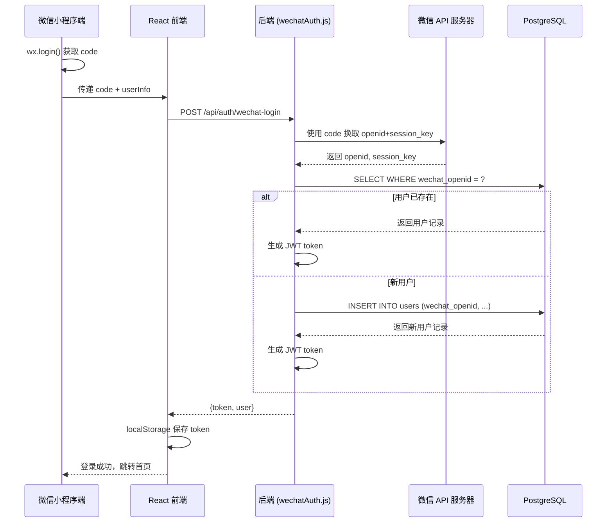
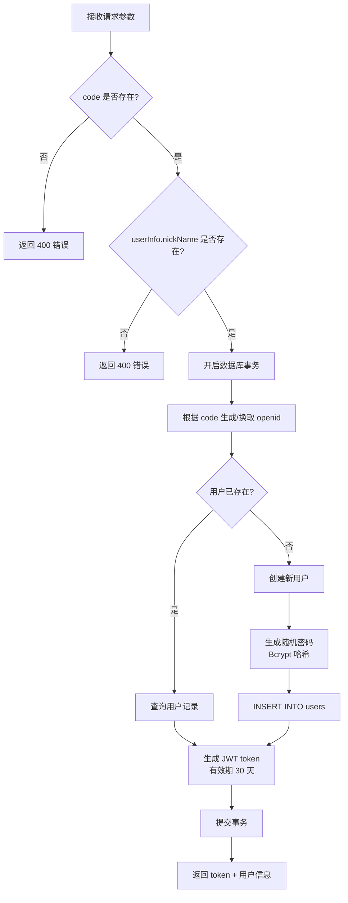
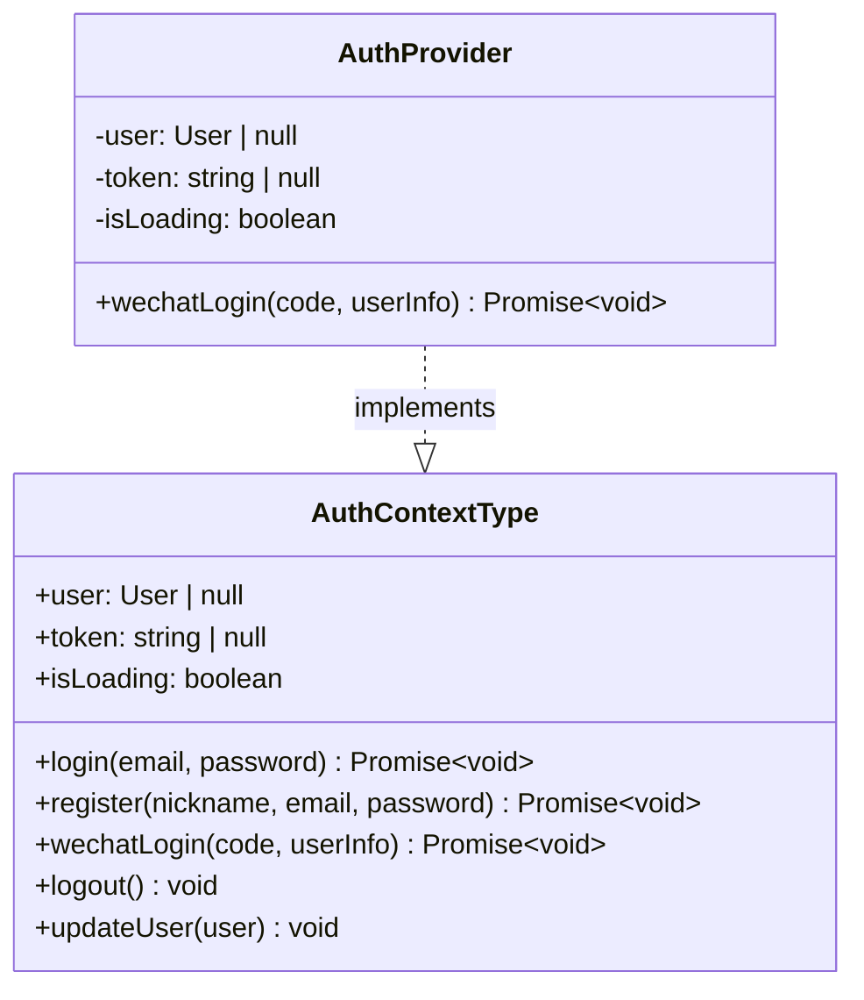

本文档详细说明 AIlove 项目中微信登录功能的完整实现架构，涵盖后端 API 路由设计、数据库模式扩展、前端认证上下文集成以及从微信小程序端到后端服务的完整认证链路。该功能允许用户通过微信账号一键登录系统，自动创建账户并颁发 JWT 令牌，无需手动填写邮箱和密码。

## 认证架构概览

微信登录采用 **OAuth 2.0 授权码模式**的变体，结合 JWT 无状态认证机制。整个流程分为客户端授权、后端换取 OpenID、用户匹配与令牌颁发三个阶段。

Sources: [wechatAuth.js](backend/routes/wechatAuth.js#L1-L80), [AuthContext.tsx](frontend-react/src/contexts/AuthContext.tsx#L104-L121)

## 数据库模式扩展

微信登录功能需要在现有用户表中添加三个专用字段，用于存储微信身份标识和关联信息。这些字段通过独立的迁移脚本管理，确保数据库结构演进的可追溯性。

| 字段名 | 数据类型 | 约束 | 用途 |
|--------|----------|------|------|
| `wechat_openid` | VARCHAR(100) | UNIQUE, 可为空 | 微信用户的唯一标识，作为登录主键 |
| `wechat_nickname` | VARCHAR(100) | 可为空 | 微信昵称的冗余存储，便于快速展示 |
| `wechat_avatar_url` | TEXT | 可为空 | 微信头像 URL，用于初始头像展示 |

迁移脚本还创建了专用索引 `idx_users_wechat_openid`，确保基于 OpenID 的用户查找操作保持 O(log n) 的查询复杂度。

Sources: [add_wechat_fields.sql](backend/migrations/add_wechat_fields.sql#L1-L25)

## 后端 API 实现

### 路由注册

微信认证路由挂载在 `/api/auth` 路径下，与传统邮箱密码认证路由共享同一父级路径前缀，形成统一的认证 API 入口。

Sources: [server.js](backend/server.js#L51-L54)

### 核心端点分析

**POST /api/auth/wechat-login** 是整个微信登录功能的核心入口。该端点接收四个请求参数，其中 `code` 为必需字段，用于后端向微信服务器换取用户唯一标识。

| 参数名 | 类型 | 必需 | 说明 |
|--------|------|------|------|
| `code` | string | 是 | 微信临时登录凭证，有效期 5 分钟 |
| `userInfo` | object | 是 | 包含 nickName、avatarUrl 等用户基本信息 |
| `encryptedData` | string | 否 | 微信加密的用户完整数据 |
| `iv` | string | 否 | 加密算法的初始向量 |

**业务逻辑流程**：

代码中使用事务包裹整个登录流程，确保在高并发场景下不会出现重复创建用户或状态不一致的问题。新用户创建时会赋予初始游戏化属性：0 积分、1 等级、"普通训练师" VIP 等级、2 个精灵球，以及 30% 的资料完整度。

Sources: [wechatAuth.js](backend/routes/wechatAuth.js#L22-L140)

### 用户信息查询端点

**GET /api/auth/wechat-user-info** 是一个受保护的端点，需要携带有效的 JWT 令牌才能访问。该端点返回当前用户的微信相关信息，包括 openid、昵称、头像 URL 以及游戏化属性。

Sources: [wechatAuth.js](backend/routes/wechatAuth.js#L145-L234)

### 认证中间件集成

微信登录返回的 JWT 令牌格式与传统登录完全一致，因此可以直接复用 [authenticateToken](backend/middleware/authenticateToken.js#L1-L26) 中间件进行后续请求的鉴权。JWT payload 中包含 `userId` 和 `email` 两个字段，令牌默认有效期为 30 天。

## 前端集成

### 认证上下文扩展

`AuthContext` 是前端认证状态的全局管理中心。微信登录功能的加入扩展了 `AuthContextType` 接口，新增了 `wechatLogin` 方法签名。

`wechatLogin` 方法内部调用 `/api/auth/wechat-login` 端点，将后端返回的 token 和用户信息序列化后存入 `localStorage`，同时更新 React 状态树。

Sources: [AuthContext.tsx](frontend-react/src/contexts/AuthContext.tsx#L22-L23), [AuthContext.tsx](frontend-react/src/contexts/AuthContext.tsx#L104-L121)

### API 端点配置

前端通过 `config.ts` 中的常量集中管理 API 端点路径，微信登录端点定义在 `API_ENDPOINTS.AUTH` 命名空间下。

Sources: [config.ts](frontend-react/src/config.ts#L13)

### 登录页与注册页集成

`LoginPage` 和 `RegisterPage` 均集成了微信一键登录按钮。当前实现使用模拟数据（`mock_wechat_code_` + 时间戳）代替真实的微信授权流程，这是因为 React 前端版本尚未接入微信小程序 SDK。

| 页面 | 按钮样式 | 模拟行为 |
|------|----------|----------|
| [LoginPage](frontend-react/src/pages/LoginPage.tsx#L40-L57) | 微信绿色 (#07C160)，边框 4px 黑色，GameBoy 风格阴影 | 生成随机昵称 "微信训练师_xxx" |
| [RegisterPage](frontend-react/src/pages/RegisterPage.tsx#L17-L34) | 同上，位于表单下方分割线之后 | 生成随机昵称 "微信训练师_xxx" |

两个页面中的按钮均通过 `handleWechatLogin` 回调函数触发，该函数构造模拟的 `code` 和 `userInfo` 对象，调用 `wechatLogin` 方法，成功后通过 `navigate('/')` 跳转至首页。

Sources: [LoginPage.tsx](frontend-react/src/pages/LoginPage.tsx#L120-L131), [RegisterPage.tsx](frontend-react/src/pages/RegisterPage.tsx#L148-L160)

## 与传统认证对比

| 维度 | 邮箱密码认证 | 微信登录 |
|------|-------------|----------|
| 端点 | POST /api/auth/login | POST /api/auth/wechat-login |
| 凭证类型 | email + password | code + userInfo |
| 用户标识 | email 字段 | wechat_openid 字段 |
| 密码存储 | bcrypt 哈希（用户提供） | bcrypt 哈希（随机生成） |
| JWT 有效期 | 1 小时 | 30 天 |
| 新用户创建 | 需要完整注册表单 | 自动创建，使用微信昵称 |
| 前端文件 | auth.js | wechatAuth.js |

Sources: [auth.js](backend/routes/auth.js#L58-L95), [wechatAuth.js](backend/routes/wechatAuth.js#L60-L120)

## 生产环境待完善项

当前实现包含若干标记为 TODO 的生产环境必要步骤，这些步骤在微信小程序正式上线前必须完成：

1. **微信 API 对接**：当前使用 `code` 的前 20 个字符模拟 `openid`，生产环境需调用 `https://api.weixin.qq.com/sns/jscode2session` 接口，传入 `appid`、`secret`、`js_code` 换取真实的 `openid` 和 `session_key`。

2. **数据解密**：需使用 `session_key` 和 `iv` 对 `encryptedData` 进行 AES-128-CBC 解密，获取完整的用户信息（包括unionId、手机号等）。

3. **签名验证**：应对微信返回的数据进行签名校验，确保数据未被篡改。

4. **环境变量配置**：微信 AppID、AppSecret 等敏感配置应纳入环境变量管理，当前 `.env.example` 中尚未包含这些配置项。

Sources: [wechatAuth.js](backend/routes/wechatAuth.js#L30-L40), [.env.example](backend/.env.example#L1-L25)

## 阅读建议

了解微信登录的完整上下文后，建议按以下顺序继续深入：

- 理解 JWT 认证机制的通用实现：[JWT 认证与授权中间件](23-jwt-ren-zheng-yu-shou-quan-zhong-jian-jian)
- 查看传统邮箱认证 API 的对比实现：[用户认证 API](24-yong-hu-ren-zheng-api)
- 了解前端认证状态管理的整体架构：[状态管理与认证上下文](14-zhuang-tai-guan-li-yu-ren-zheng-shang-xia-wen)