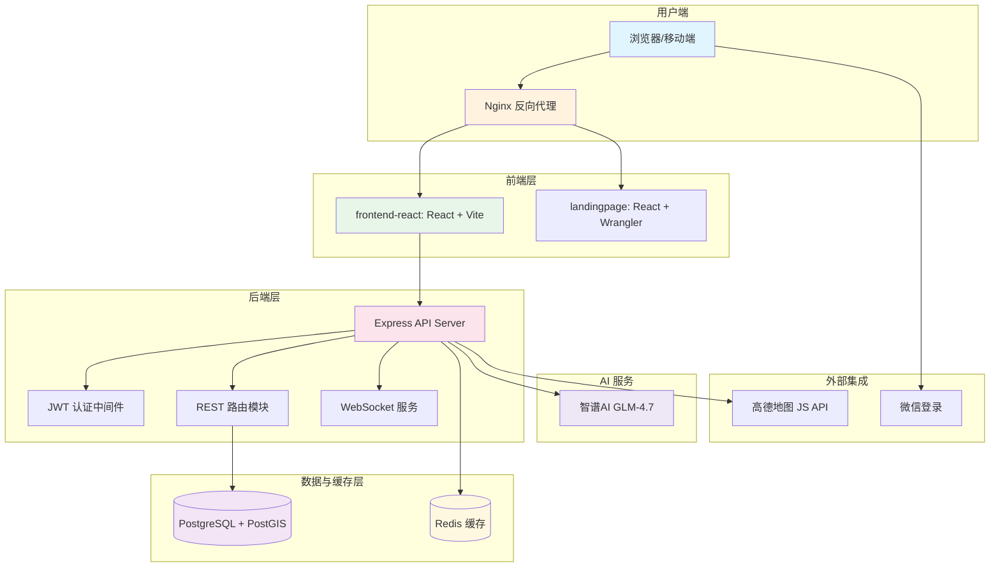

本文档系统梳理 AI月老（AI Yue Lao）项目所采用的全部技术栈、第三方依赖与基础设施组件。作为项目的技术基石，理解这些选择有助于快速建立全局认知，并为后续的开发、调试与部署工作打下坚实基础。本项目采用 **前后端分离架构**，以 TypeScript/React 构建用户界面，以 Node.js/Express 提供 API 服务，辅以 PostgreSQL + PostGIS 处理空间数据，Redis 提供缓存层，WebSocket 实现实时通信。

Sources: [backend/package.json](backend/package.json#L1-L31), [frontend-react/package.json](frontend-react/package.json#L1-L36), [docker-compose.yml](docker-compose.yml#L1-L40)

## 整体架构概览

项目由三个相对独立的子模块组成：**移动端主应用**（frontend-react）、**后端 API 服务**（backend）以及 **营销落地页**（landingpage）。三者通过 REST API 与 WebSocket 协议互联，基础设施层由 Docker Compose 统一编排。

上图揭示了请求的典型流向：用户请求经 Nginx 分流至前端静态资源或后端 API；后端通过 JWT 中间件完成身份校验后，将数据查询路由至 PostgreSQL，或将热点数据委托 Redis 缓存；匹配计算可调用智谱 AI LLM 进行智能评分；前端通过高德地图 SDK 渲染地理位置信息。

Sources: [backend/server.js](backend/server.js#L1-L84), [nginx.conf](nginx.conf#L1-L31), [frontend-react/vite.config.ts](frontend-react/vite.config.ts#L1-L16)

## 后端技术栈

后端采用 **Node.js 18** 运行环境，基于 Express 框架构建 RESTful API，数据库连接通过 `pg` 驱动直连 PostgreSQL，实时通信依托原生 `ws` 库实现。

| 依赖名称 | 版本 | 用途说明 |
|---|---|---|
| express | ^4.18.2 | HTTP 路由框架，处理 REST API 请求 |
| pg | ^8.11.3 | PostgreSQL 客户端，提供连接池管理 |
| redis | ^5.10.0 | Redis 客户端，用于匹配结果缓存 |
| ws | ^8.14.2 | WebSocket 服务端实现 |
| jsonwebtoken | ^9.0.2 | JWT Token 签发与验证 |
| bcryptjs | ^2.4.3 | 密码哈希加密 |
| multer | ^1.4.5 | 文件上传处理（头像、照片） |
| openai | ^6.16.0 | 智谱AI GLM 模型调用客户端 |
| winston | ^3.19.0 | 结构化日志记录 |
| winston-daily-rotate-file | ^5.0.0 | 按日轮转的日志文件管理 |
| cors | ^2.8.5 | 跨域资源共享中间件 |
| axios | ^1.6.0 | HTTP 请求客户端 |
| geolib | ^3.3.4 | 地理距离计算工具库 |
| uuid | ^9.0.1 | UUID 生成器 |
| dotenv | ^16.3.1 | 环境变量加载 |
| nodemon | ^3.0.1 | 开发环境热重载（devDependencies） |

Sources: [backend/package.json](backend/package.json#L9-L24), [backend/db.js](backend/db.js#L1-L29), [backend/services/redisClient.js](backend/services/redisClient.js#L1-L40), [backend/services/matchingAlgorithm.js](backend/services/matchingAlgorithm.js#L1-L50)

## 前端技术栈

主应用（frontend-react）采用 **React 19 + TypeScript** 技术组合，构建工具为 Vite 7，样式系统基于 TailwindCSS v4。落地页（landingpage）共享相同的基础技术选型，额外集成 Cloudflare Wrangler 用于边缘部署。

| 依赖名称 | 版本 | 用途说明 |
|---|---|---|
| react | ^19.2.0 | UI 组件库核心 |
| react-dom | ^19.2.0 | React DOM 渲染器 |
| react-router-dom | ^7.13.1 | 客户端路由管理 |
| typescript | ~5.9.3 | 类型系统 |
| vite | ^7.3.1 | 前端构建工具与开发服务器 |
| tailwindcss | ^4.2.1 | 原子化 CSS 框架 |
| @amap/amap-jsapi-loader | ^1.0.1 | 高德地图 JavaScript API 加载器 |
| axios | ^1.13.6 | HTTP 请求客户端 |
| @vitejs/plugin-react | ^5.1.1 | Vite React 插件 |
| eslint | ^9.39.1 | 代码规范检查 |

Sources: [frontend-react/package.json](frontend-react/package.json#L11-L35), [frontend-react/src/main.tsx](frontend-react/src/main.tsx#L1-L11), [frontend-react/src/index.css](frontend-react/src/index.css#L1-L40)

## UI 主题设计系统

项目采用 **GameBoy 复古风格** 作为视觉主题，通过 CSS 自定义属性定义了一套完整的配色方案，包含 GameBoy 经典四色（绿、深绿、浅绿、黑）与宝可梦品牌色（黄、蓝、红）。组件采用硬边框（`4px solid #000000`）与硬阴影（`4px 4px 0px 0px #000000`）模拟像素风格。

| CSS 变量 | 色值 | 语义 |
|---|---|---|
| `--gameboy-bg` | `#9BBC0F` | GameBoy 主背景色 |
| `--gameboy-dark` | `#0F380F` | 深色文本/边框 |
| `--pokemon-yellow` | `#FFCB05` | 宝可梦品牌黄 |
| `--pokemon-blue` | `#3B4CCA` | 宝可梦品牌蓝 |
| `--pokemon-red` | `#FF5A5A` | 宝可梦品牌红 |
| `--hp-red` | `#FF5A5A` | HP 条颜色 |
| `--exp-blue` | `#4A90E2` | 经验条颜色 |

前端组件库包含 `GameboyButton`、`HpExpBar`、`MusicPlayer` 与 `TabBar` 四个核心组件，分别实现交互按钮、游戏化进度条、背景音乐播放器与底部导航栏。

Sources: [frontend-react/src/index.css](frontend-react/src/index.css#L1-L40), [frontend-react/src/components](frontend-react/src/components#L1-L4)

## 基础设施与运维

项目通过 Docker Compose 进行容器编排，Nginx 作为反向代理处理静态资源分发与 API 转发。

| 组件 | 版本/镜像 | 职责 |
|---|---|---|
| Node.js | 18-alpine (Dockerfile) | 后端运行环境 |
| PostgreSQL | 外部服务（由 DATABASE_URL 指定） | 主数据库，启用 PostGIS 扩展 |
| Redis | 外部服务（由 REDIS_URL 指定） | 缓存层，支持自动重连 |
| Nginx | 官方镜像（由 docker-compose 隐含） | 反向代理与静态资源服务 |
| Docker Compose | version 3.8 | 容器编排 |

后端 Dockerfile 基于 `node:18-alpine` 镜像，工作目录为 `/usr/src/app/backend`，暴露端口 3000。Nginx 配置将 `/api/` 路径代理至后端服务 `http://backend:3000/api/`，根路径服务于前端静态文件。

Sources: [backend/Dockerfile](backend/Dockerfile#L1-L26), [docker-compose.yml](docker-compose.yml#L1-L40), [nginx.conf](nginx.conf#L1-L31)

## 第三方服务集成

| 服务 | 用途 | 配置位置 |
|---|---|---|
| 智谱AI GLM-4.7 | LLM 智能匹配评分 | `.env.example` 中 `OPENAI_API_KEY`、`OPENAI_BASE_URL` |
| 高德地图 | 前端地图渲染与地理位置展示 | `frontend-react/package.json` 中的 `@amap/amap-jsapi-loader` |
| 微信登录 | 社交账号认证 | `backend/routes/wechatAuth.js` |
| Cloudflare | 落地页边缘部署（可选） | `landingpage/package.json` 中的 `wrangler` |

智谱AI 通过 `openai` 兼容接口调用，基础 URL 配置为 `https://open.bigmodel.cn/api/coding/paas/v4`，模型版本为 `glm-4.7`，用于对用户资料进行语义级别的匹配度分析。

Sources: [backend/.env.example](backend/.env.example#L16-L22), [backend/services/matchingAlgorithm.js](backend/services/matchingAlgorithm.js#L6-L13)

## 数据库模式要点

数据库采用 PostgreSQL，核心扩展为 **PostGIS**，用于地理位置的地理空间查询。数据模型涵盖用户表（含 UUID 主键、Geography 字段、JSONB 问答字段）、用户照片表、推荐表、聊天消息表、约会任务/地点表等。其中 `users` 表同时包含 `location`（PostGIS Geography 类型）和冗余的经纬度字段，以兼顾精确空间查询与快速距离筛选。

Sources: [backend/schema.sql](backend/schema.sql#L1-L60)

## 版本兼容性参考

| 层级 | 技术 | 最低兼容版本 | 当前使用版本 |
|---|---|---|---|
| 运行时 | Node.js | 18.0 | 18-alpine |
| 运行时 | React | 18.0 | 19.2.0 |
| 构建工具 | TypeScript | 5.0 | 5.9.3 |
| 构建工具 | Vite | 5.0 | 7.3.1 |
| 数据库 | PostgreSQL | 13+（需 PostGIS 3+） | 由部署环境决定 |
| 缓存 | Redis | 6.0+ | 由部署环境决定 |

## 建议阅读路径

作为入门开发者，建议按照以下顺序深入学习各技术模块：

1. **[环境配置](5-huan-jing-bian-liang-shuo-ming)** — 了解所有环境变量及其含义
2. **[数据库初始化与迁移](6-shu-ju-ku-chu-shi-hua-yu-qian-yi)** — 掌握数据库建表与迁移流程
3. **[Express 路由设计](22-express-lu-you-she-ji)** — 理解后端 API 组织结构
4. **[React 项目结构](12-react-xiang-mu-jie-gou)** — 熟悉前端代码组织方式
5. **[WebSocket 实时通信](9-websocket-shi-shi-tong-xin)** — 学习实时聊天实现原理
6. **[LLM 智能匹配（智谱AI）](31-llm-zhi-neng-pi-pei-zhi-pu-ai)** — 了解 AI 匹配核心算法

这些页面将帮助你从环境搭建到核心功能实现形成完整的技术认知链条。