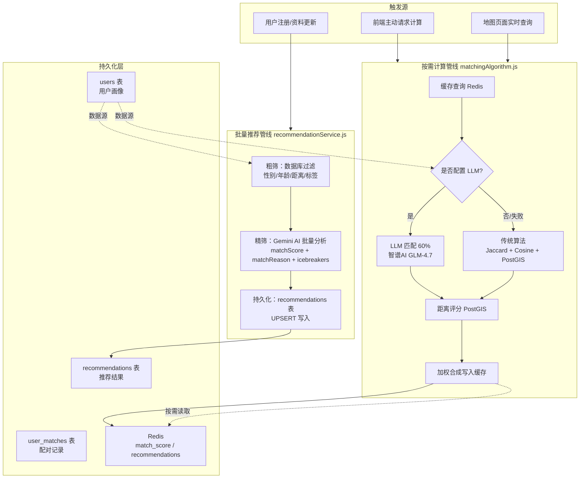
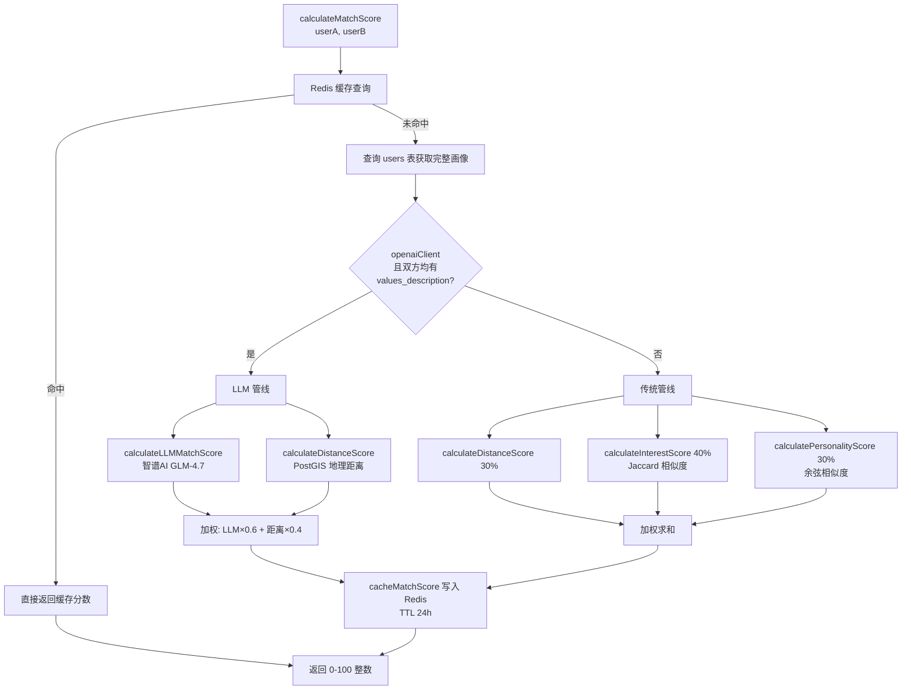
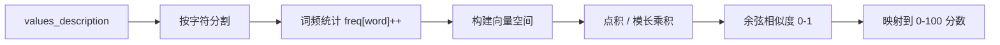
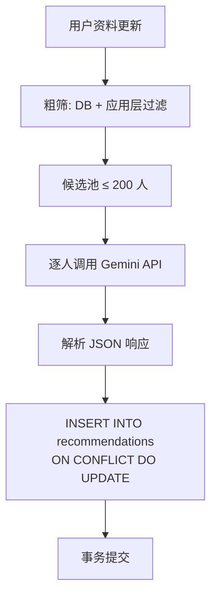
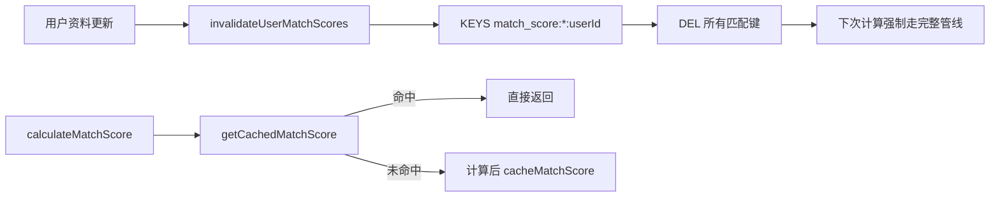
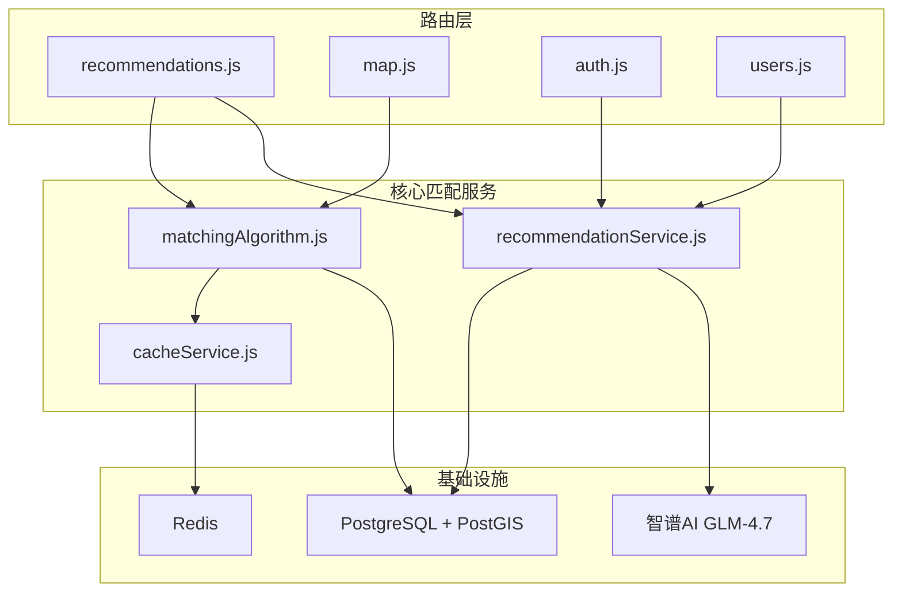

本文档系统阐述 AIlove 匹配算法的双层架构设计、评分策略、数据流转路径以及与缓存层的协同机制。核心要义在于：系统通过**两条并行的匹配管线**——按需计算管线（`matchingAlgorithm.js`）与批量推荐管线（`recommendationService.js`）——实现从粗筛到精筛、从传统算法到 LLM 智能分析的渐进式匹配能力。

## 双管线架构概览

AIlove 的匹配系统并非单一路径，而是根据触发场景与计算规模采用不同的处理管线。理解这两条管线的职责边界是掌握整体架构的前提。



**按需计算管线**（`matchingAlgorithm.js`）服务于低延迟的点对点对场景：前端请求计算推荐、地图页面实时展示匹配度。该管线优先查询 Redis 缓存，未命中时根据环境配置自动选择 LLM 或传统算法，并将结果缓存 24 小时。

**批量推荐管线**（`recommendationService.js`）服务于高吞吐的离线批量场景：用户注册或更新资料后，系统在后台对候选池（最多 200 人）执行粗筛 + Gemini AI 精筛，将结果持久化到 `recommendations` 表中。

Sources: [matchingAlgorithm.js](backend/services/matchingAlgorithm.js#L1-L120), [recommendationService.js](backend/services/recommendationService.js#L1-L120), [server.js](backend/server.js#L40-L57)

## 按需计算管线的评分策略

`matchingAlgorithm.js` 的核心函数 `calculateMatchScore` 实现了三层决策逻辑：缓存优先、LLM 回退、传统兜底。这一设计在性能与智能之间建立了优雅的平衡。



评分维度与权重随算法模式动态切换：

| 维度 | LLM 模式权重 | 传统模式权重 | 计算方式 |
|------|-------------|-------------|----------|
| 语义理解 | 60%（LLM 综合分析） | — | 智谱AI GLM-4.7，temperature=0.3 |
| 兴趣重叠 | — | 40% | Jaccard 相似度：∩A,B / ∪A,B |
| 性格匹配 | — | 30% | 词袋模型 + 余弦相似度 |
| 地理距离 | 40% | 30% | PostGIS `ST_Distance` 分段评分 |
| 价值观/话题 | 隐含在 LLM 分析中 | — | 由 LLM 从 values_description 和 q_and_a 推断 |

距离评分采用分段衰减策略：0-500 米满分 100 分，每增加一个距离区间分数递减，10 公里以外仅 10 分。这种设计在城市交友场景中能优先推荐"可达性强"的候选人。

Sources: [matchingAlgorithm.js](backend/services/matchingAlgorithm.js#L17-L120), [matchingAlgorithm.js](backend/services/matchingAlgorithm.js#L222-L280), [matchingAlgorithm.js](backend/services/matchingAlgorithm.js#L282-L370)

## 传统算法的数学基础

当 LLM 不可用或未配置时，系统回退到纯确定性算法。兴趣匹配采用 **Jaccard 相似度**——标签交集大小除以并集大小——这一度量对用户标签数量差异具有鲁棒性：

```
Jaccard(A, B) = |A ∩ B| / |A ∪ B|
```

性格匹配采用简化的**余弦相似度**，将 `values_description` 文本按字符级别构建词频向量，计算向量夹角的余弦值。这一方法虽然未接入中文分词器，但对于价值观描述这类短文本足以捕捉关键词重叠模式。



这两种算法的时间复杂度分别为 O(n+m) 和 O(n·m)，在标签数量和文本长度均有限的场景下，计算开销可忽略不计。

Sources: [matchingAlgorithm.js](backend/services/matchingAlgorithm.js#L282-L340), [matchingAlgorithm.js](backend/services/matchingAlgorithm.js#L342-L396)

## 批量推荐管线的两阶段筛选

`recommendationService.updateRecommendationsForUser` 实现了经典的"漏斗式"推荐流程：粗筛大幅缩减候选池，精筛对剩余候选进行深度分析。

**粗筛阶段**在数据库层面执行多维过滤：

1. **双向性别过滤**：候选人的性别必须符合当前用户的偏好，且当前用户的性别也必须符合候选人的偏好（除非偏好为 NULL）
2. **双向年龄过滤**：候选人年龄在当前用户偏好范围内，且当前用户年龄也在候选人偏好范围内
3. **地理距离过滤**：使用 `geolib` 在应用层过滤 50 公里以内的候选人
4. **兴趣标签过滤**：至少有一个共同标签

粗筛结果限制为 200 条，随后进入精筛阶段。精筛对每位候选人调用 Gemini API，要求返回结构化 JSON 包含 `matchScore`（0-100）、`matchReason`（50 字内）和 `icebreakers`（3 条破冰话题）。



这一管线的关键设计在于**原子性保障**：所有数据库操作包裹在 `BEGIN / COMMIT` 事务中，任何阶段失败均触发 `ROLLBACK`，确保推荐数据的一致性。

Sources: [recommendationService.js](backend/services/recommendationService.js#L16-L120), [recommendationService.js](backend/services/recommendationService.js#L121-L220)

## LLM 集成与 Prompt 工程

LLM 匹配通过 OpenAI SDK 兼容接口调用智谱 AI 的 GLM-4.7 模型。系统设计了三重保障机制确保稳定性：

**降级策略**：当 `OPENAI_API_KEY` 未配置、API 调用失败或 LLM 返回无效分数时，自动回退到传统算法。这一设计使得 LLM 成为"增强能力"而非"依赖项"。

**温度控制**：`temperature=0.3` 的低随机性设置确保相同用户对在不同时间获得一致的评分，避免因 LLM 输出波动导致用户体验不一致。

**Prompt 结构化**：LLM 被要求从四个维度（价值观契合度 30%、兴趣重叠度 30%、性格匹配度 20%、潜在话题 20%）进行评估，并返回标准 JSON 格式。系统要求 LLM 以情感匹配专家的角色定位输出客观分析。

| LLM 配置项 | 值 | 设计意图 |
|-----------|-----|---------|
| `baseURL` | `https://open.bigmodel.cn/api/coding/paas/v4` | 智谱AI 兼容端点 |
| `model` | `glm-4.7`（环境变量可覆盖） | 模型版本可配置 |
| `temperature` | 0.3 | 降低随机性 |
| `response_format` | `json_object` | 强制 JSON 输出 |
| 超时处理 | catch → 回退传统算法 | 故障容错 |

Sources: [matchingAlgorithm.js](backend/services/matchingAlgorithm.js#L124-L175), [matchingAlgorithm.js](backend/services/matchingAlgorithm.js#L179-L218)

## Redis 缓存策略

缓存层是匹配系统性能的基石。`cacheService.js` 提供了对称的键值管理，核心设计原则是**键的规范化**与**失效的精准性**。

匹配分数缓存键采用排序后的用户 ID 拼接：`match_score:{sortedId1}:{sortedId2}`。这一设计确保了 A-B 和 B-A 两个方向的查询命中同一缓存条目，避免重复计算。缓存 TTL 设为 24 小时，在数据新鲜度与计算成本之间取得平衡。

推荐列表缓存键采用 `recommendations:{userId}` 格式，缓存完整的推荐列表 JSON。当用户资料更新时，`invalidateUserMatchScores` 函数使用 `KEYS match_score:*:{userId}` 模式匹配删除所有涉及该用户的缓存键，确保下次计算使用最新的画像数据。



Redis 连接配置包含指数退避重连策略：重试次数超过 10 次后放弃连接，缓存服务降级不影响主流程。这一设计体现了"缓存是优化，不是依赖"的架构哲学。

Sources: [cacheService.js](backend/services/cacheService.js#L1-L120), [cacheService.js](backend/services/cacheService.js#L121-L228)

## API 路由与数据模型

匹配系统通过三个核心 API 路由对外暴露能力，每条路由对应不同的业务场景：

| 路由 | 方法 | 管线 | 用途 |
|------|------|------|------|
| `/api/recommendations/calculate` | POST | 按需计算 | 前端主动触发推荐计算 |
| `/api/recommendations` | GET | 读取 | 分页获取已计算的推荐列表 |
| `/api/users/me/matches` | GET/POST | 配对记录 | 查询/创建已确认的配对关系 |
| `/api/map` | GET | 按需计算 | 地图页面附近用户匹配度 |

数据模型涉及三张核心表。`users` 表存储用户画像，包含 `tags`（TEXT[]）、`values_description`（TEXT）、`q_and_a`（JSONB）等匹配关键字段。`recommendations` 表存储预计算结果，以 `(recommending_user_id, recommended_user_id)` 为唯一约束，支持 `ON CONFLICT DO UPDATE`。`user_matches` 表存储已确认的配对关系，包含配对时的宝可梦信息和相容度分数。

Sources: [recommendations.js](backend/routes/recommendations.js#L1-L120), [matches.js](backend/routes/matches.js#L1-L120), [schema.sql](backend/schema.sql#L75-L95), [add_pokeball_system.sql](backend/migrations/add_pokeball_system.sql#L51-L85)

## 服务依赖关系图

匹配系统并非孤立存在，它与认证、WebSocket、地图等模块存在明确的依赖关系。理解这些依赖有助于定位问题和规划扩展。



- `auth.js` 在用户注册成功后调用 `updateRecommendationsForUser` 触发初始推荐计算
- `users.js` 在资料更新后同样调用该函数刷新推荐
- `map.js` 调用 `calculateMatchScore` 为地图上的附近用户实时计算匹配度
- `recommendations.js` 同时使用两条管线：`calculateMatchScore` 用于计算，同时直接查询 `recommendations` 表读取历史结果

Sources: [auth.js](backend/routes/auth.js#L6), [recommendations.js](backend/routes/recommendations.js#L9), [map.js](backend/routes/map.js#L5), [users.js](backend/routes/users.js#L8]

## 扩展方向

当前架构已具备生产级匹配系统的核心要素。基于现有设计模式，以下扩展方向具有明确的实现路径：

**嵌入向量匹配**：将 `values_description` 通过 Embedding API 转为向量存储，使用向量相似度替代当前的字符级余弦相似度，可大幅提升语义理解精度。[32-传统匹配算法（兴趣/性格/距离）](32-chuan-tong-pi-pei-suan-fa-xing-qu-xing-ge-ju-chi) 页面将详细讨论这一方向。

**多模型路由**：在 LLM 层引入模型选择器，根据分数置信度或用户等级动态切换 GLM-4.7 与其他模型，实现成本与效果的动态优化。

**异步批处理**：将 `recommendationService` 的逐人 API 调用改为批量请求或消息队列异步处理，消除同步等待带来的响应延迟。

**实时匹配推送**：结合 WebSocket 服务，当系统计算出高分数匹配（>80 分）时主动向双方推送通知，创造"被系统选中"的情感体验。[9-WebSocket 实时通信](9-websocket-shi-shi-tong-xin) 页面描述了 WebSocket 基础设施的架构细节。