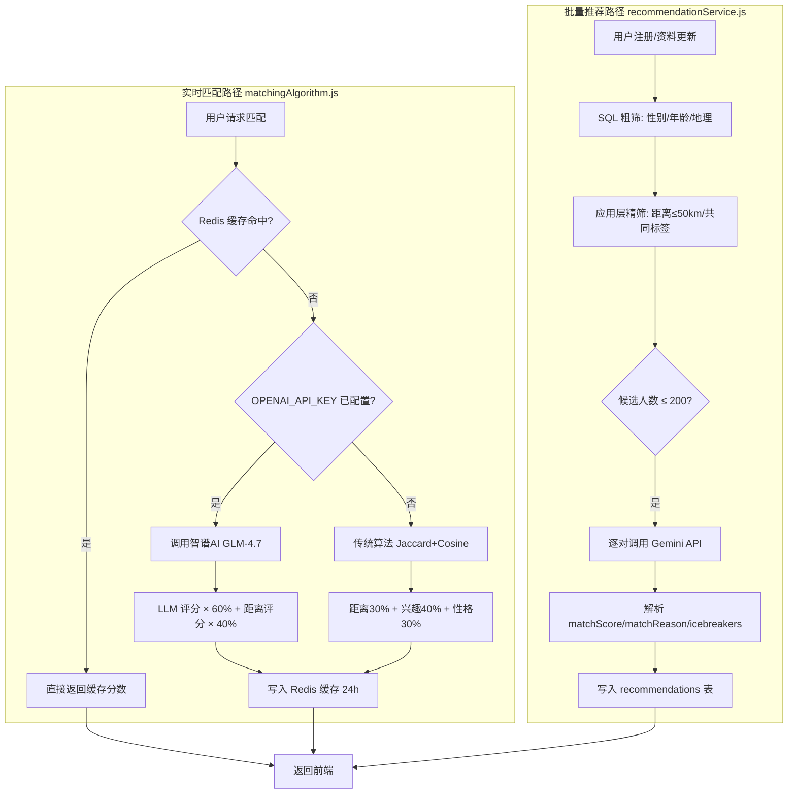
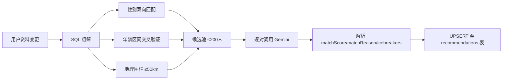
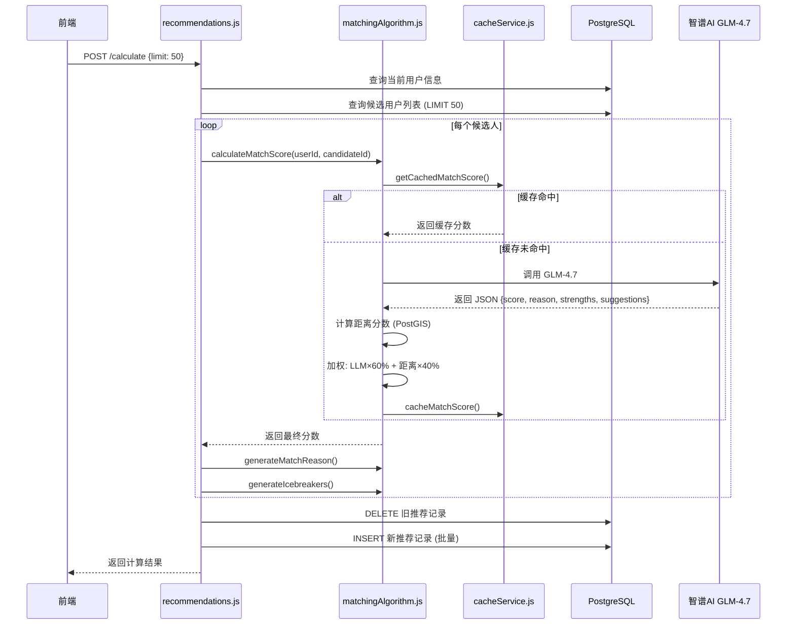
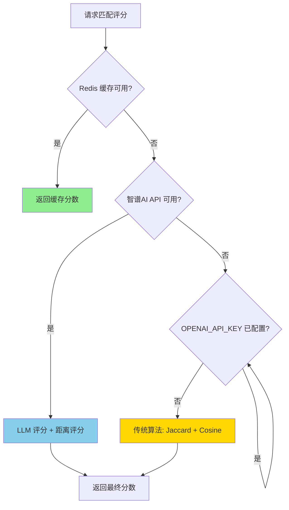

本文档阐述 AI月老 系统中基于大语言模型（LLM）的智能匹配机制。系统采用**双引擎架构**——智谱 AI GLM-4.7 负责实时 pairwise 匹配评分，Gemini API 负责批量推荐候选人的精细化筛选。两条路径共享同一套数据模型与缓存基础设施，但在调用策略、Prompt 设计和降级方案上各有侧重。

**前置阅读建议**：在深入本文档之前，建议先了解 [匹配算法架构](30-pi-pei-suan-fa-jia-gou) 中的系统分层设计、[传统匹配算法](32-chuan-tong-pi-pei-suan-fa-xing-qu-xing-ge-ju-chi) 中的 Jaccard/余弦相似度基础实现，以及 [Redis 缓存策略](10-redis-huan-cun-ce-lue) 中的缓存失效机制。

## LLM 匹配引擎架构

系统存在两条并行的 LLM 匹配路径，它们在不同的业务场景下被激活：



两条路径的核心差异在于**触发时机**和**调用粒度**：实时路径在用户主动请求匹配时按需计算单对用户的匹配度，批量推荐路径在用户资料变更时异步扫描候选池并批量写入推荐结果。

Sources: [matchingAlgorithm.js](backend/services/matchingAlgorithm.js#L1-L100), [recommendationService.js](backend/services/recommendationService.js#L1-L50)

## 智谱 AI GLM-4.7 集成实现

### 客户端初始化与配置

系统通过 `openai` 兼容 SDK 连接智谱 AI，利用其 OpenAI-compatible API 端点实现零迁移成本集成：

| 环境变量 | 默认值 | 说明 |
|---------|--------|------|
| `OPENAI_API_KEY` | 无（必填） | 智谱 AI API Key，从 [open.bigmodel.cn](https://open.bigmodel.cn/) 获取 |
| `OPENAI_BASE_URL` | `https://open.bigmodel.cn/api/coding/paas/v4` | 智谱 AI 兼容端点 |
| `OPENAI_MODEL` | `glm-4.7` | 模型标识符 |

客户端采用**条件初始化**模式——仅当 `OPENAI_API_KEY` 环境变量存在时才实例化 `openaiClient`，否则自动回退至传统算法。这种设计确保开发环境和生产环境在缺少 API Key 时仍能正常运行。

```javascript
let openaiClient = null;
if (process.env.OPENAI_API_KEY) {
    openaiClient = new OpenAI({
        apiKey: process.env.OPENAI_API_KEY,
        baseURL: process.env.OPENAI_BASE_URL || 'https://open.bigmodel.cn/api/coding/paas/v4'
    });
}
```

Sources: [matchingAlgorithm.js](backend/services/matchingAlgorithm.js#L6-L12), [.env.example](backend/.env.example#L15-L18)

### Prompt 工程设计

LLM 匹配的核心在于 Prompt 的结构化设计。系统构建的 Prompt 包含四个评估维度，每个维度附带明确的权重指引：

```
请分析以下两位用户的契合度：

【用户 A】
价值观描述：{values_description}
兴趣标签：{tags}
问答：{q_and_a}

【用户 B】
价值观描述：{values_description}
兴趣标签：{tags}
问答：{q_and_a}

请从以下几个维度进行评估：
1. 价值观契合度（30%）：两人的价值观是否一致或互补？
2. 兴趣重叠度（30%）：共同的兴趣爱好有多少？
3. 性格匹配度（20%）：从问答中推测的性格是否合适？
4. 潜在话题（20%）：是否有足够的共同话题？
```

**设计要点分析**：

- **角色锚定**：System prompt 将 LLM 定位为"专业的情感匹配专家"，限定其输出范围为"客观评估契合度"
- **JSON 强制输出**：通过 `response_format: { type: "json_object" }` 约束返回格式，便于程序化解析
- **温度控制**：`temperature: 0.3` 降低随机性，确保相同输入在不同调用中产生一致的评分
- **容错机制**：当 LLM 返回的 score 不在 0-100 范围内时，默认回退至 50 分

Sources: [matchingAlgorithm.js](backend/services/matchingAlgorithm.js#L117-L149)

### 混合评分策略

LLM 擅长语义理解和价值观分析，但对地理距离缺乏直觉判断。系统采用**混合加权策略**弥补这一缺陷：

| 评分组件 | 权重 | 计算方式 | 文件位置 |
|---------|------|---------|---------|
| LLM 语义匹配分 | 60% | GLM-4.7 分析价值观/兴趣/性格 | [matchingAlgorithm.js#L57](backend/services/matchingAlgorithm.js#L57) |
| 地理距离分 | 40% | PostGIS `ST_Distance` 计算 | [matchingAlgorithm.js#L232-L271](backend/services/matchingAlgorithm.js#L232-L271) |

距离评分采用分段函数映射，距离越近分数越高：

| 距离范围 | 分数 | 适用场景 |
|---------|------|---------|
| < 500m | 100 | 同楼层/同小区 |
| 500m - 1km | 90 | 步行可达 |
| 1km - 3km | 70 | 短途出行 |
| 3km - 5km | 50 | 同城相邻区域 |
| 5km - 10km | 30 | 同城较远区域 |
| > 10km | 10 | 跨区 |

当 LLM 调用失败时，系统自动降级至传统算法（距离 30% + 兴趣 Jaccard 40% + 性格余弦相似度 30%），确保服务可用性。

Sources: [matchingAlgorithm.js](backend/services/matchingAlgorithm.js#L50-L80)

## Gemini API 批量推荐路径

`recommendationService.js` 实现了另一条 LLM 匹配路径，采用"粗筛 + 精筛"的两阶段策略：



### 粗筛阶段（SQL + 应用层）

粗筛在数据库层和应用层协同完成，将候选人数压缩至 200 以内：

1. **性别双向匹配**：用户 A 的 `preferred_gender` 必须匹配用户 B 的 `gender`，同时用户 B 的 `preferred_gender` 必须包含用户 A 的 `gender`（或为 NULL）
2. **年龄区间交叉验证**：双方的年龄偏好必须相互包含对方的实际年龄
3. **地理围栏过滤**：使用 `geolib.getDistance` 在应用层筛选 50km 范围内的候选人
4. **共同标签过滤**：至少存在一个共同兴趣标签

Sources: [recommendationService.js](backend/services/recommendationService.js#L44-L115)

### 精筛阶段（Gemini API）

对每个候选人独立调用 Gemini API，Prompt 设计更为详细，包含了 bio、理想周末、宠物偏好等多维度信息：

```javascript
const systemPrompt = "你是一位顶尖的婚恋匹配专家。请基于两位用户的资料进行深度匹配分析，并以JSON格式返回结果。结果必须包含字段：'matchScore' (0-100整数), 'matchReason' (50字内字符串), 'icebreakers' (3个字符串数组的破冰话题)";
```

返回的 JSON 结构包含三个关键字段：`matchScore`（匹配分数）、`matchReason`（匹配原因）、`icebreakers`（破冰话题数组），直接用于前端展示。

Sources: [recommendationService.js](backend/services/recommendationService.js#L125-L133)

## Redis 缓存策略

LLM 调用成本较高，系统通过 Redis 缓存匹配结果，TTL 设置为 24 小时：

### 缓存键设计

采用**字典序排序**的键名策略，确保 `match_score:userA:userB` 和 `match_score:userB:userA` 指向同一缓存条目，避免重复计算：

```javascript
function getMatchScoreKey(userIdA, userIdB) {
    const sortedIds = [userIdA, userIdB].sort();
    return `match_score:${sortedIds[0]}:${sortedIds[1]}`;
}
```

### 缓存失效机制

当用户资料更新时，调用 `invalidateUserMatchScores(userId)` 清除该用户相关的所有匹配缓存。该方法使用 `KEYS` 命令匹配 `match_score:*:userId` 和 `match_score:userId:*` 两种模式，去重后批量删除。

Sources: [cacheService.js](backend/services/cacheService.js#L40-L78), [cacheService.js](backend/services/cacheService.js#L90-L112)

## API 接口与数据流

### POST /api/recommendations/calculate

触发重新计算当前用户的所有推荐。流程如下：



### GET /api/recommendations

获取推荐列表，支持分页和最低分数筛选。从 `recommendations` 表联合 `users` 表查询，按 `match_score DESC` 排序返回。

### POST /api/users/me/matches

创建配对记录。使用事务确保双向记录的一致性和 `matched_count` 的原子更新。

Sources: [recommendations.js](backend/routes/recommendations.js#L1-L80), [matches.js](backend/routes/matches.js#L55-L140)

## 降级与容错策略

系统在多个层级设置了降级路径，确保 LLM 服务不可用时核心功能仍可运行：



**降级层级**：
1. **L1 - 缓存层**：Redis 命中直接返回，零延迟零成本
2. **L2 - LLM 层**：智谱 AI 可用时执行智能匹配（temperature 0.3 保证稳定性）
3. **L3 - 传统算法层**：LLM 不可用或未配置 API Key 时，回退至 Jaccard 相似度 + 余弦相似度 + 距离评分的确定性算法

Sources: [matchingAlgorithm.js](backend/services/matchingAlgorithm.js#L24-L80)

## 数据模型关联

LLM 匹配结果最终存储在两个核心表中：

| 表名 | 用途 | 关键字段 |
|------|------|---------|
| `recommendations` | 推荐列表 | `recommending_user_id`, `recommended_user_id`, `match_score`, `match_reason`, `icebreakers` |
| `user_matches` | 配对记录 | `user_id`, `matched_user_id`, `compatibility_score`, `user_pokemon_type`, `matched_pokemon_type` |

`recommendations` 表使用联合唯一索引 `(recommending_user_id, recommended_user_id)` 支持 `ON CONFLICT ... DO UPDATE` 的 UPSERT 操作，避免重复插入。

Sources: [recommendationService.js](backend/services/recommendationService.js#L206-L220), [matches.js](backend/routes/matches.js#L100-L130)

## 性能考量与优化建议

### 当前实现的性能特征

| 维度 | 表现 | 瓶颈 |
|------|------|------|
| 缓存命中率 | 24h TTL 下较高 | 用户资料更新时全量失效 |
| LLM 调用并发 | 串行逐对调用 | `Promise.all` 可能触发速率限制 |
| 粗筛效率 | SQL 过滤 + 应用层距离计算 | 50km 距离过滤在应用层执行 |

### 优化方向

1. **PostGIS 原生距离过滤**：将 `recommendationService.js` 中的应用层 `geolib` 距离计算迁移至 SQL 层的 `ST_DWithin`，利用空间索引加速
2. **批量 LLM 调用**：将多对用户的匹配数据合并为单次 Prompt，利用 LLM 的 batch 处理能力减少 API 调用次数
3. **增量缓存失效**：仅失效受资料变更影响的缓存键，而非全量扫描删除
4. **向量索引预计算**：将 `values_description` 预计算为 Embedding 向量存储，使用余弦相似度进行快速初筛，减少 LLM 调用量

Sources: [recommendationService.js](backend/services/recommendationService.js#L80-L115), [matchingAlgorithm.js](backend/services/matchingAlgorithm.js#L50-L70)

## 下一步

完成 LLM 匹配系统的理解后，建议继续阅读：

- [传统匹配算法（兴趣/性格/距离）](32-chuan-tong-pi-pei-suan-fa-xing-qu-xing-ge-ju-chi) — 深入 Jaccard 相似度和余弦相似度的实现细节
- [推荐服务与缓存](33-tui-jian-fu-wu-yu-huan-cun) — 了解推荐结果的缓存策略和前端集成方式
- [匹配算法架构](30-pi-pei-suan-fa-jia-gou) — 回顾整体算法架构设计