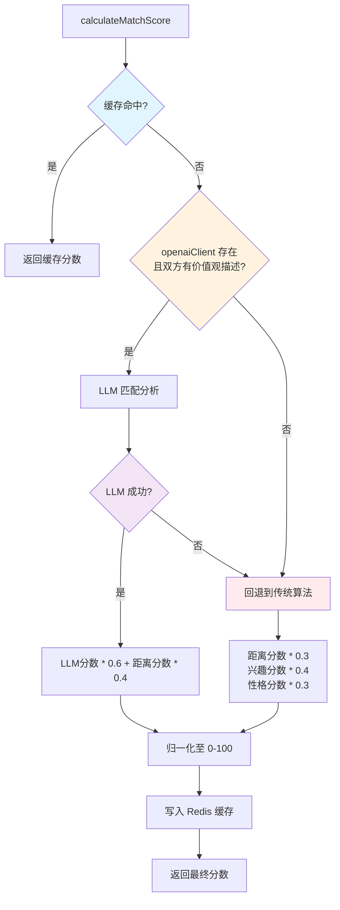
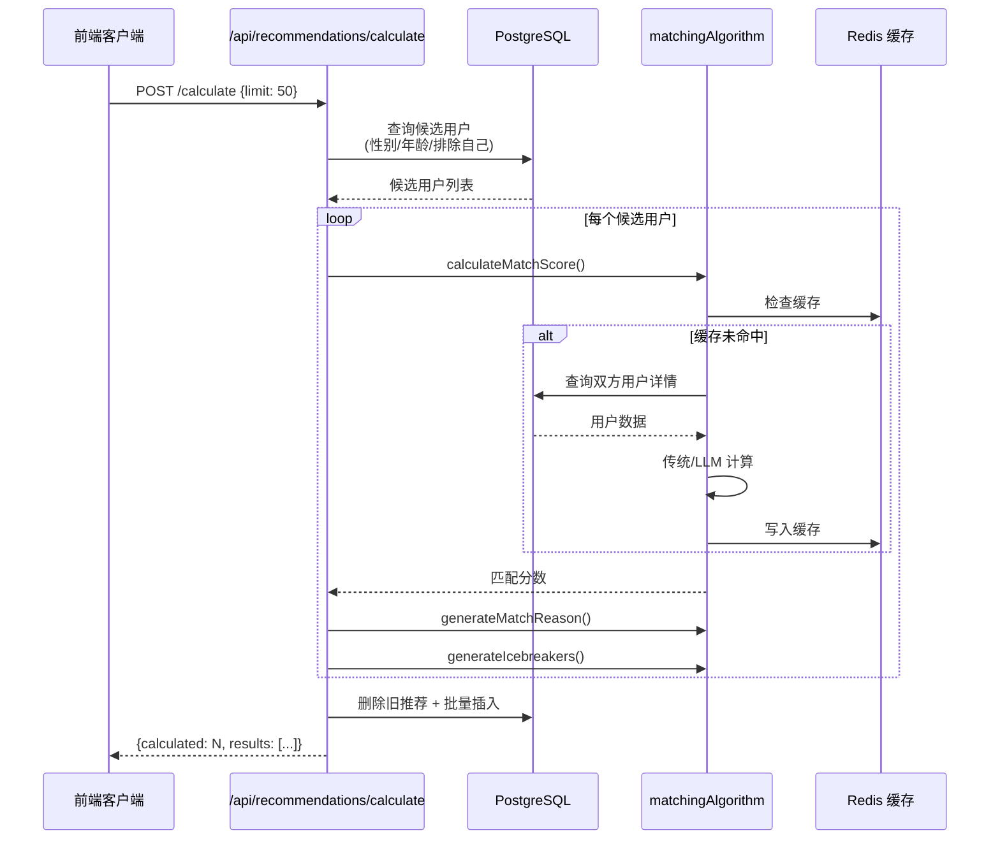
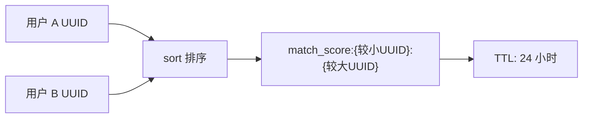

本文档深入解析 AIlove 平台中**传统匹配算法**的架构设计、数学模型与工程实现。该算法作为 LLM 智能匹配的降级回退方案（fallback），在 OpenAI API 未配置或调用失败时，提供基于 **Jaccard 相似度**、**余弦相似度** 和 **PostGIS 地理距离** 的多维匹配能力。理解该算法是掌握 [匹配算法架构](30-pi-pei-suan-fa-jia-gou) 全貌的关键环节，也是 [LLM 智能匹配（智谱AI）](31-llm-zhi-neng-pi-pei-zhi-pu-ai) 的对比基线。

## 算法定位与执行路径

传统匹配算法在系统架构中扮演**确定性降级方案**的角色。整个匹配流程采用 **三层决策树** 结构：缓存层 → LLM 层 → 传统算法层。



当系统检测到 `process.env.OPENAI_API_KEY` 未配置，或双方用户缺少 `values_description` 字段时，流程直接跳过 LLM 层，进入纯传统计算路径 [matchingAlgorithm.js](backend/services/matchingAlgorithm.js#L64-L88)。这一设计确保了**服务可用性**——即使在无 AI 能力的部署环境中，匹配功能依然可用。

Sources: [matchingAlgorithm.js](backend/services/matchingAlgorithm.js#L22-L117)

## 三维评分模型

传统匹配算法将匹配度分解为三个正交维度，通过**加权线性组合**生成最终分数。

| 维度 | 权重 | 核心算法 | 分值范围 | 数据来源 |
|------|------|----------|----------|----------|
| 地理距离 | 30% | PostGIS `ST_Distance` | 10-100 | `location_latitude`, `location_longitude` |
| 兴趣重叠 | 40% | Jaccard 相似度 | 0-100 | `tags` (TEXT[]) |
| 性格匹配 | 30% | 余弦相似度 (词袋模型) | 0-100 | `values_description` (TEXT) |

**总分公式**：

$$finalScore = \lfloor distanceScore \times 0.3 + interestScore \times 0.4 + personalityScore \times 0.3 \rceil$$

计算结果经 `Math.min(100, Math.max(0, totalScore))` 钳位后存入 Redis 缓存 [matchingAlgorithm.js](backend/services/matchingAlgorithm.js#L97-L109)。

### 维度一：地理距离评分

地理距离评分采用**分段阶梯函数**而非连续衰减，这种设计在工程上具有两个优势：减少浮点运算开销、便于运营人员调整阈值。


核心 SQL 使用 PostGIS 的 `GEOGRAPHY` 类型进行球面距离计算，精确到米级 [matchingAlgorithm.js](backend/services/matchingAlgorithm.js#L234-L246)。当任一用户缺少 `location` 信息时，该维度直接返回 0 分，这在推荐系统中是一种**惩罚性策略**——鼓励用户完善地理位置信息 [matchingAlgorithm.js](backend/services/matchingAlgorithm.js#L227-L230)。

Sources: [matchingAlgorithm.js](backend/services/matchingAlgorithm.js#L226-L269)

### 维度二：兴趣重叠评分

兴趣维度使用 **Jaccard 相似度** 计算两个用户标签集合的交集占比。Jaccard 指数的数学定义为：

$$J(A, B) = \frac{|A \cap B|}{|A \cup B|}$$

代码实现中，交集通过 `filter` + `includes` 计算，并集通过 `Set` 去重合并 [matchingAlgorithm.js](backend/services/matchingAlgorithm.js#L288-L289)。这种实现的时间复杂度为 $O(|A| \times |B|)$，在标签数量较少（通常 < 50）的场景下完全可接受。

**边界处理**：若任一用户的 `tags` 为空数组，函数返回 0 分而非默认值。这与性格维度的设计形成对比——兴趣维度采取了**零容忍策略**，因为缺少兴趣标签意味着无法建立任何话题连接 [matchingAlgorithm.js](backend/services/matchingAlgorithm.js#L283-L285)。

Sources: [matchingAlgorithm.js](backend/services/matchingAlgorithm.js#L278-L296)

### 维度三：性格匹配评分

性格维度是传统算法中最具探索性的部分。由于用户填写的 `values_description` 是自由文本，系统采用了**字符级词袋模型 + 余弦相似度**的近似方案 [matchingAlgorithm.js](backend/services/matchingAlgorithm.js#L328-L338)。

```mermaid
flowchart TD
    A["values_description A"] --> B[字符级分词<br/>split('')]
    C["values_description B"] --> D[字符级分词<br/>split('')]
    B --> E[词频统计 freqA]
    D --> F[词频统计 freqB]
    E --> G[余弦相似度计算]
    F --> G
    G --> H["相似度 × 100 取整"]

    style B fill:#bbdefb
    style D fill:#bbdefb
    style E fill:#c8e6c9
    style F fill:#c8e6c9
    style G fill:#fff9c4
```

余弦相似度的核心逻辑是计算两个词频向量在多维空间中的夹角余弦值 [matchingAlgorithm.js](backend/services/matchingAlgorithm.js#L360-L382)。值得注意的是，这里的"分词"实际上是按**单个字符**切割（`split('')`），这在中文 NLP 中是一个已知的简化方案——它无法区分词语边界，但对于价值观描述这类短文本（通常 < 100 字），字符级近似仍能提供有意义的相似度信号。

**默认值策略**：当任一用户未填写 `values_description` 时，返回 50 分（中等值）[matchingAlgorithm.js](backend/services/matchingAlgorithm.js#L310-L312)。这种设计避免了单维度缺失对总分的过度惩罚，体现了系统在**数据稀疏场景下的鲁棒性考量**。

Sources: [matchingAlgorithm.js](backend/services/matchingAlgorithm.js#L305-L382)

## LLM 与传统算法的融合策略

当 LLM 可用时，系统采用**混合加权模式**，而非完全替代传统算法。

| 对比维度 | LLM 混合模式 | 纯传统模式 |
|----------|-------------|-----------|
| LLM 分数权重 | 60% | 不适用 |
| 距离分数权重 | 40% | 30% |
| 兴趣分数权重 | 0% (被 LLM 内化) | 40% |
| 性格分数权重 | 0% (被 LLM 内化) | 30% |
| 计算延迟 | 高 (1-3s LLM 请求) | 低 (<10ms 纯计算) |
| 缓存策略 | Redis 24h TTL | Redis 24h TTL |

LLM 模式将距离分数独立计算并保留 40% 权重的原因是：**LLM 对地理空间的数值感知能力较弱**。将距离判断外包给确定性算法，既利用了 LLM 的语义理解能力，又规避了其在数值推理上的固有弱点 [matchingAlgorithm.js](backend/services/matchingAlgorithm.js#L68-L72)。

Sources: [matchingAlgorithm.js](backend/services/matchingAlgorithm.js#L63-L88)

## 匹配结果生成与破冰话题

计算匹配分数后，系统还会生成**可读性解释**和**破冰话题**，这两项功能均不依赖外部 API，完全在本地执行。

**匹配原因生成** `generateMatchReason()` 采用规则模板引擎 [matchingAlgorithm.js](backend/services/matchingAlgorithm.js#L391-L437)：
- ≥ 90 分："你们是灵魂伴侣！"
- ≥ 70 分："你们非常契合。"
- ≥ 50 分："你们有不少共同点。"
- < 50 分："试试看，也许会有惊喜。"

随后附加共同兴趣标签（最多展示 3 个）和距离判断（< 1km 标记"就在附近"）。

**破冰话题生成** `generateIcebreakers()` 的策略层级 [matchingAlgorithm.js](backend/services/matchingAlgorithm.js#L445-L472)：
1. 优先从共同兴趣中生成个性化话题（如"听说你也喜欢徒步？"）
2. 次级从 Q&A 字段中提取话题（如双方都填写了 `ideal_weekend`）
3. 兜底使用通用话题模板

最终返回最多 3 个话题，确保前端 UI 展示的一致性。

Sources: [matchingAlgorithm.js](backend/services/matchingAlgorithm.js#L391-L472)

## 推荐计算端点与批量处理

传统匹配算法被 `POST /api/recommendations/calculate` 端点调用 [recommendations.js](backend/routes/recommendations.js#L16-L171)。该端点采用**粗筛 + 精算**两阶段策略：



候选筛选在 SQL 层面完成性别和年龄的**双向过滤**——不仅筛选出符合当前用户偏好的候选人，还反向确保候选人也会偏好当前用户的性别和年龄 [recommendations.js](backend/routes/recommendations.js#L48-L81)。匹配计算通过 `Promise.all()` 并发执行，最大化利用 Node.js 的异步 I/O 能力 [recommendations.js](backend/routes/recommendations.js#L113-L126)。

Sources: [recommendations.js](backend/routes/recommendations.js#L16-L171)

## 缓存策略与失效机制

匹配分数的 Redis 缓存采用**对称键设计**，确保 A-B 和 B-A 的查询命中同一缓存条目 [cacheService.js](backend/services/cacheService.js#L47-L51)。



当用户资料更新时，通过 `invalidateUserMatchScores()` 使用 `match_score:*:${userId}` 和 `match_score:${userId}:*` 双模式扫描清除相关缓存 [cacheService.js](backend/services/cacheService.js#L103-L123)。这种**模式匹配式失效**虽然不如精确键删除高效，但避免了维护额外索引的复杂度，在用户规模可控阶段是合理的设计权衡。

Sources: [cacheService.js](backend/services/cacheService.js#L47-L123)

## 工程局限性分析与改进方向

| 局限性 | 当前实现 | 改进建议 |
|--------|----------|----------|
| 中文分词精度 | 字符级 `split('')` | 引入 `nodejieba` 等分词库 |
| 距离评分粒度 | 6 级阶梯函数 | 改用连续衰减函数 $f(d) = 100 \times e^{-\lambda d}$ |
| 并发计算瓶颈 | `Promise.all()` 无并发限制 | 引入信号量控制，防止候选量大时内存溢出 |
| 缓存失效效率 | `KEYS` 模式扫描 | 改用 Redis Set 存储用户相关键列表 |
| Jaccard 计算复杂度 | $O(|A| \times |B|)$ | 对标签建立倒排索引 |

当前实现中的 `recommendationService.js` 展示了另一种使用 Gemini API 进行精筛的架构变体 [recommendationService.js](backend/services/recommendationService.js#L1-L294)，但该文件目前处于注释化/实验状态，表明系统仍在探索**粗筛-精筛**管道的最佳实践。

Sources: [recommendationService.js](backend/services/recommendationService.js#L14-L108)

## 下一步阅读

- 了解完整的匹配系统架构设计：[匹配算法架构](30-pi-pei-suan-fa-jia-gou)
- 对比 LLM 驱动的智能匹配方案：[LLM 智能匹配（智谱AI）](31-llm-zhi-neng-pi-pei-zhi-pu-ai)
- 了解推荐结果的缓存与获取机制：[推荐服务与缓存](33-tui-jian-fu-wu-yu-huan-cun)
- 查看匹配 API 的请求/响应格式：[推荐匹配 API](25-tui-jian-pi-pei-api)