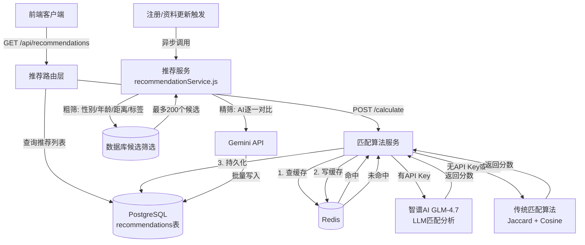
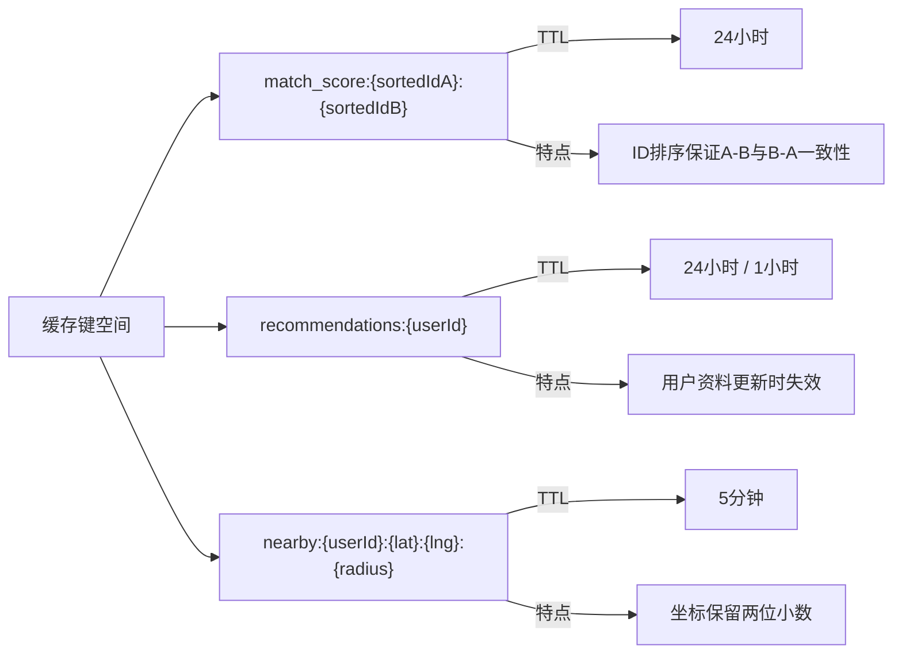
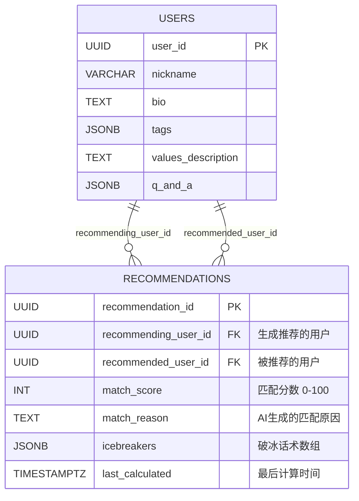

推荐服务是 AIlove 平台的核心匹配引擎，负责在海量用户中为每个个体筛选出最契合的潜在伴侣。该服务融合了 **LLM 智能分析** 与 **传统匹配算法** 的双引擎架构，并通过 **Redis 多级缓存** 策略有效降低 API 调用成本与数据库查询压力。本文档从服务架构、匹配策略、缓存设计到 API 接口，完整拆解推荐系统的设计原理与实现细节。

## 系统架构概览

推荐系统由三个核心组件协同工作：数据筛选层、匹配计算层与缓存持久层。

**架构核心设计原则**：推荐系统采用「预计算 + 实时查询」混合模式。用户在注册或更新资料时，后台异步触发批量推荐计算（`recommendationService.js`），将结果持久化至 PostgreSQL；用户浏览推荐列表时，直接读取数据库，实现毫秒级响应。

Sources: [recommendationService.js](backend/services/recommendationService.js#L1-L45), [redisClient.js](backend/services/redisClient.js#L1-L96), [server.js](backend/server.js#L8-L56)

## 推荐引擎双轨架构

系统同时维护两套推荐引擎，分别服务于不同的业务场景。

| 维度 | 批量推荐服务 (recommendationService.js) | 实时匹配服务 (matchingAlgorithm.js) |
|------|------|------|
| **触发时机** | 注册完成、资料更新时异步执行 | 用户访问个人主页、主动计算推荐时 |
| **AI 模型** | Gemini API (通过环境变量 GEMINI_API_BASE_URL) | 智谱AI GLM-4.7 (通过 OPENAI_BASE_URL) |
| **处理策略** | 串行遍历候选用户，逐一调用 AI | 优先读缓存，未命中时调用 LLM 或传统算法 |
| **筛选流程** | 两步：粗筛(DB) → 精筛(AI) | 实时计算：缓存 → LLM/传统 → 缓存 |
| **数据存储** | 批量 INSERT 至 recommendations 表 | 按需 INSERT 单条记录 |
| **权重模型** | AI 全权决定 match_score | LLM 60% + 距离 40% 或 距离30% + 兴趣40% + 性格30% |
| **降级策略** | 无候选时清空推荐列表 | LLM 失败自动回退传统算法 |

**批量推荐服务**的粗筛阶段在数据库层执行性别互选、年龄区间、50km 地理距离和兴趣标签过滤，将候选集压缩至 200 人以内，随后逐一对候选调用 Gemini API 进行深度匹配分析。每条分析结果包含 `matchScore`（0-100）、`matchReason`（50 字内）和 `icebreakers`（3 条破冰话术）。

Sources: [recommendationService.js](backend/services/recommendationService.js#L47-L150), [matchingAlgorithm.js](backend/services/matchingAlgorithm.js#L28-L102)

## 缓存策略详解

系统维护两套独立的 Redis 客户端实例，服务于不同粒度的缓存需求。

### 双 Redis 客户端设计

| 客户端 | 文件位置 | 主要职责 | TTL 策略 |
|--------|---------|---------|---------|
| redisClient.js | `services/redisClient.js` | 推荐列表缓存、附近用户缓存 | 推荐: 3600s (1h), 附近用户: 300s (5min) |
| cacheService.js | `services/cacheService.js` | 匹配分数缓存、推荐列表缓存 | 统一 86400s (24h) |

**重连机制**：两个客户端均实现指数退避重连策略，最大重试 10 次后停止，确保缓存服务降级不影响主业务功能。

### 缓存键设计

**匹配分数缓存键**使用排序后的用户 ID 组合（`match_score:id1:id2`），确保用户 A 查询 B 与 B 查询 A 命中同一缓存条目，避免重复计算。缓存值存储完整的匹配数据对象，包含分数、使用的算法标识和计算时间戳。

### 缓存失效机制

当用户资料发生变更时，系统调用 `invalidateUserMatchScores(userId)` 清除该用户相关的所有匹配分数缓存。该操作通过 Redis `KEYS` 命令匹配 `match_score:*:{userId}` 和 `match_score:{userId}:*` 两种模式，收集所有相关键后批量删除。

Sources: [cacheService.js](backend/services/cacheService.js#L10-L40), [cacheService.js](backend/services/cacheService.js#L78-L106), [redisClient.js](backend/services/redisClient.js#L46-L96)

## 匹配算法深度解析

### 传统匹配算法

当未配置 LLM API 或 LLM 调用失败时，系统回退至传统三维度加权算法。

**兴趣匹配（40% 权重）**：基于 Jaccard 相似度计算用户标签集合的交集与并集比率。若用户 A 的标签为 `[旅行, 音乐, 摄影]`，用户 B 为 `[音乐, 阅读, 摄影]`，则交集为 `{音乐, 摄影}`（2个），并集为 `{旅行, 音乐, 摄影, 阅读}`（4个），Jaccard 相似度为 0.5，对应兴趣分数 50 分。

**地理距离（30% 权重）**：利用 PostGIS 的 `ST_Distance` 函数精确计算两点间地理距离，采用阶梯式评分规则：

| 距离范围 | 距离分数 |
|---------|---------|
| 0 - 500m | 100 |
| 500m - 1km | 90 |
| 1km - 3km | 70 |
| 3km - 5km | 50 |
| 5km - 10km | 30 |
| > 10km | 10 |

**性格匹配（30% 权重）**：对用户价值观描述文本进行字符级分词，构建词袋模型后计算余弦相似度。该算法虽简单但能有效捕捉文本中的共性词汇。

### LLM 智能匹配

当配置了智谱AI API 且双方均填写了价值观描述时，系统启用 LLM 匹配模式。LLM 从四个维度进行综合评估：价值观契合度（30%）、兴趣重叠度（30%）、性格匹配度（20%）和潜在话题（20%）。最终分数通过 `LLM分数 × 0.6 + 距离分数 × 0.4` 的加权公式计算，确保地理位置因素仍占合理比重。

Sources: [matchingAlgorithm.js](backend/services/matchingAlgorithm.js#L200-L350), [matchingAlgorithm.js](backend/services/matchingAlgorithm.js#L105-L200)

## API 接口说明

### 推荐列表 API

| 端点 | 方法 | 认证 | 描述 |
|------|------|------|------|
| `/api/recommendations` | GET | ✅ | 获取推荐用户列表，支持分页和最低分数筛选 |
| `/api/recommendations/calculate` | POST | ✅ | 手动触发推荐计算 |
| `/api/recommendations/user/:userId` | GET | ✅ | 获取与指定用户的匹配分数 |

**GET /api/recommendations** 查询参数：

| 参数 | 类型 | 默认值 | 说明 |
|------|------|--------|------|
| `limit` | number | 10 | 返回记录数量 |
| `offset` | number | 0 | 分页偏移量 |
| `min_score` | number | 0 | 最低匹配分数筛选 |

返回数据包含推荐用户的昵称、年龄、职业、简介、头像 URL，以及 AI 生成的匹配分数、匹配原因和破冰话术数组。结果按 `match_score DESC, last_calculated DESC` 排序，确保高质量和最新推荐优先展示。

Sources: [recommendations.js](backend/routes/recommendations.js#L153-L210), [recommendations.js](backend/routes/recommendations.js#L218-L299)

## 数据模型

### recommendations 表结构

表结构定义了 `UNIQUE (recommending_user_id, recommended_user_id)` 约束，防止重复推荐记录。批量插入时使用 `ON CONFLICT ... DO UPDATE SET` 语法实现 UPSERT 操作，自动更新已存在记录的分数和原因。

Sources: [schema.sql](backend/schema.sql#L94-L110)

## 性能优化与注意事项

**AI 调用成本控制**：批量推荐服务对每个候选用户独立调用 AI API，200 个候选最多产生 200 次 API 请求。生产环境建议引入队列机制（如 Bull/BullMQ）进行异步批处理，并增加请求间隔避免触发速率限制。

**缓存一致性**：当前缓存失效采用模式匹配删除（`KEYS` 命令），在大规模数据集下可能产生性能瓶颈。可考虑使用 Redis Hash 结构按用户组织匹配分数，或使用 Redis 的发布订阅机制实现精确失效通知。

**双 Redis 客户端冗余**：系统中同时存在 `redisClient.js` 和 `cacheService.js` 两套 Redis 实现，存在代码重复和潜在的状态不一致风险。建议统一为单一客户端实例，通过不同 TTL 和键命名空间区分缓存类型。

Sources: [recommendationService.js](backend/services/recommendationService.js#L151-L200), [cacheService.js](backend/services/cacheService.js#L108-L140), [redisClient.js](backend/services/redisClient.js#L46-L65)

## 相关页面

- 了解匹配算法的数学原理与复杂度分析：[传统匹配算法（兴趣/性格/距离）](32-chuan-tong-pi-pei-suan-fa-xing-qu-xing-ge-ju-chi)
- 了解 LLM 集成细节：[LLM 智能匹配（智谱AI）](31-llm-zhi-neng-pi-pei-zhi-pu-ai)
- 了解 Redis 全局配置：[Redis 缓存策略](10-redis-huan-cun-ce-lue)
- 查看前端如何展示推荐结果：[首页与推荐列表](18-shou-ye-yu-tui-jian-lie-biao)