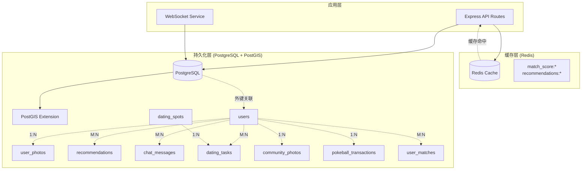
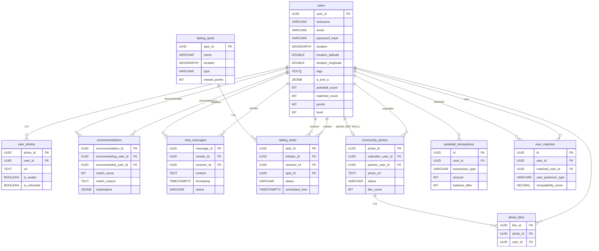
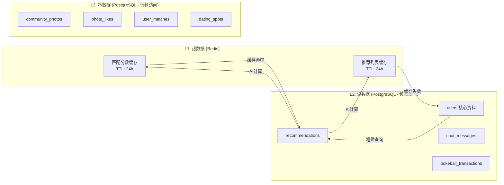

本文档提供 AIlove 项目数据库设计的整体视图，涵盖表结构、关系模式、索引策略及自动化机制。数据库采用 PostgreSQL 13+ 作为核心存储引擎，借助 PostGIS 扩展实现地理位置查询，并通过 Redis 构建缓存层以降低数据库负载。理解本模式概览是深入各子模块表设计的前提。

## 数据库架构总览

AIlove 采用**关系型数据库 + 地理空间扩展 + 键值缓存**的三层数据架构。PostgreSQL 负责持久化存储与事务管理，PostGIS 提供地理位置索引与空间查询能力，Redis 作为 L1 缓存层承载匹配分数和推荐结果的快速读写。这种设计在保持数据一致性的同时，通过缓存策略将 AI 匹配计算结果复用，避免重复调用外部 API。

数据库连接通过 [pg.Pool](backend/db.js#L9-L15) 实现连接池管理，SSL 配置由环境变量 `DB_SSL` 控制，确保本地开发环境与生产环境的安全策略自动切换。

Sources: [db.js](backend/db.js#L1-L29)

## 核心数据表总览

数据库共包含 **9 张核心表**，按业务域可分为用户域、匹配域、社交域、游戏化域和地理位置域。下表列出所有表及其职责边界。

| 表名 | 主键类型 | 所属模块 | 核心职责 | 关联表 |
|------|---------|---------|---------|--------|
| `users` | UUID | 用户域 | 用户身份认证、资料存储、地理位置、游戏化属性 | user_photos, recommendations, chat_messages, dating_tasks, community_photos, pokeball_transactions, user_matches |
| `user_photos` | UUID | 用户域 | 用户上传照片管理，支持头像标记与解锁状态 | users (FK) |
| `recommendations` | UUID | 匹配域 | 存储 AI/算法计算的匹配分数、理由与破冰话题 | users (双向 FK) |
| `chat_messages` | UUID | 社交域 | 点对点聊天消息持久化，支持状态追踪 | users (双向 FK) |
| `dating_spots` | UUID | 地理位置域 | 约会地点（类 Pokestop）定义，含地理坐标与奖励积分 | dating_tasks (FK) |
| `dating_tasks` | UUID | 社交域 | 约会邀请/任务流程管理，记录发起、接受、完成状态 | users (双向 FK), dating_spots (FK) |
| `community_photos` | UUID | 社交域 | 社区照片墙，支持审核流程与点赞统计 | users (双向 FK), photo_likes (FK) |
| `photo_likes` | UUID | 社交域 | 照片点赞记录，防止重复点赞 | community_photos (FK), users (FK) |
| `pokeball_transactions` | UUID | 游戏化域 | 精灵球充值/消费流水，支持余额追踪 | users (FK) |
| `user_matches` | UUID | 游戏化域 | 配对成功记录，存储双方宝可梦属性与相容度 | users (双向 FK) |

此外，系统通过迁移脚本还创建了 `user_pokeball_stats` 统计视图，聚合用户精灵球消费与配对数据。

Sources: [schema.sql](backend/schema.sql#L1-L167), [create_community_tables.sql](backend/migrations/create_community_tables.sql#L1-L40), [add_pokeball_system.sql](backend/migrations/add_pokeball_system.sql#L1-L133)

## 实体关系图

以下 ER 图展示核心表之间的外键约束关系，红色箭头表示级联删除（ON DELETE CASCADE），蓝色箭头表示置空策略（ON DELETE SET NULL）。

Sources: [schema.sql](backend/schema.sql#L9-L89), [create_community_tables.sql](backend/migrations/create_community_tables.sql#L4-L24), [add_pokeball_system.sql](backend/migrations/add_pokeball_system.sql#L22-L85)

## 关键设计模式

### UUID 主键策略

所有表统一使用 `gen_random_uuid()` 生成 UUID 作为主键。这一设计避免了自增 ID 的信息泄露风险，并在分布式部署场景下消除了主键冲突的可能性。PostgreSQL 13+ 原生支持该函数，无需额外安装 `uuid-ossp` 扩展。

Sources: [schema.sql](backend/schema.sql#L12-L13)

### JSONB 灵活字段

系统多处使用 JSONB 类型存储半结构化数据：`users.q_and_a` 存储开放性问答对，`users.photos` 存储照片 URL 数组，`recommendations.icebreakers` 存储破冰话题列表。JSONB 的优势在于支持 PostgreSQL 原生 JSON 运算符和索引，可在保持模式灵活性的同时实现高效查询。

Sources: [schema.sql](backend/schema.sql#L44-L45), [add_user_profile_fields_v2.sql](backend/migrations/add_user_profile_fields_v2.sql#L31)

### PostGIS 地理空间支持

数据库启用 PostGIS 扩展，通过 `GEOGRAPHY(POINT, 4326)` 类型存储经纬度坐标。系统同时维护 `location`（GEOGRAPHY 类型）、`location_latitude` 和 `location_longitude`（DOUBLE PRECISION）三组位置字段，前者用于精确的空间查询，后两者用于应用层的快速距离计算与 Geohash 匹配。

Sources: [schema.sql](backend/schema.sql#L31-L38), [schema.sql](backend/schema.sql#L103-L104)

### 迁移驱动的模式演进

数据库模式通过 `schema.sql` 定义基线结构，后续功能迭代通过独立迁移脚本追加。这种策略支持增量部署与回滚。迁移脚本按功能域组织，包括用户资料扩展、微信登录集成、社区功能、精灵球系统等。

| 迁移脚本 | 新增内容 |
|---------|---------|
| `add_user_profile_fields_v2.sql` | 星座、身高、体重、VIP 等级、资料完整度、宝可梦头像等 10+ 字段 |
| `add_wechat_fields.sql` | 微信 OpenID、昵称、头像字段及索引 |
| `create_community_tables.sql` | 社区照片墙与点赞表 |
| `add_pokeball_system.sql` | 精灵球计数、交易记录表、配对记录表、统计视图 |

Sources: [migrations 目录](backend/migrations/)

## 索引与性能策略

数据库采用**多层次索引策略**，覆盖等值查询、范围查询、空间查询和排序场景。

| 索引名称 | 目标表 | 索引类型 | 优化场景 |
|---------|--------|---------|---------|
| `idx_users_email` | users | B-Tree | 登录认证时的邮箱精确匹配 |
| `idx_users_nickname` | users | B-Tree | 用户搜索与昵称唯一性校验 |
| `idx_users_location` | users | GiST (PostGIS) | 地理位置范围查询（附近的人） |
| `idx_users_location_geohash` | users | B-Tree | Geohash 前缀匹配粗筛 |
| `idx_recommendations_recommending_user_id` | recommendations | B-Tree | 按用户获取推荐列表 |
| `idx_recommendations_score` | recommendations | B-Tree DESC | 按匹配分数排序推荐结果 |
| `idx_chat_messages_sender_receiver` | chat_messages | 复合 B-Tree | 聊天消息按会话和时间检索 |
| `idx_dating_spots_location` | dating_spots | GiST (PostGIS) | 附近约会地点查询 |
| `idx_pokeball_transactions_user_id` | pokeball_transactions | B-Tree | 用户交易流水查询 |

聊天消息表采用双向复合索引（`sender_id, receiver_id` 和 `receiver_id, sender_id`），确保无论查询视角如何都能高效检索会话消息。推荐表通过 `match_score DESC` 索引直接支持分数排序，避免额外的排序开销。

Sources: [schema.sql](backend/schema.sql#L91-L123), [add_pokeball_system.sql](backend/migrations/add_pokeball_system.sql#L48-L51)

## 触发器与自动化机制

数据库通过触发器实现字段自动维护，减少应用层逻辑复杂度。

**`trigger_set_timestamp`**：通用时间戳更新触发器，挂载于 `users` 和 `dating_tasks` 表，在每次 UPDATE 操作时自动将 `updated_at` 字段设为当前时间。这确保了数据变更时间的准确追踪，无需应用层手动维护。

Sources: [schema.sql](backend/schema.sql#L126-L142)

**`trigger_update_profile_completeness`**：资料完整度计算触发器，挂载于 `users` 表。在 INSERT 或 UPDATE 时自动计算 `profile_completeness` 字段（0-100），权重分配为：基础信息 40%、外貌信息 20%、兴趣与价值观 30%、多媒体 10%。该机制确保资料完整度始终与实际填写状态同步。

Sources: [add_user_profile_fields_v2.sql](backend/migrations/add_user_profile_fields_v2.sql#L49-L78)

**`trigger_ensure_default_pokeball`**：精灵球默认值触发器，确保新注册用户自动获得 2 个初始精灵球。该触发器在 INSERT 前检查 `pokeball_count` 是否为 NULL，若是则赋默认值 2。

Sources: [add_pokeball_system.sql](backend/migrations/add_pokeball_system.sql#L95-L110)

## 数据分层与读写模式

系统数据按访问频率和一致性要求分为三个层次。

匹配流程中，系统首先查询 Redis 缓存获取匹配分数（键格式为 `match_score:{sortedUserIdA}:{sortedUserIdB}`），缓存未命中时从 PostgreSQL 读取用户资料并计算新分数，随后同时写入数据库和 Redis。推荐列表同样采用 `recommendations:{userId}` 键进行 24 小时缓存。这种设计将匹配计算的 O(N²) 复杂度从每次请求降低至缓存周期内仅计算一次。

Sources: [cacheService.js](backend/services/cacheService.js#L11-L14), [cacheService.js](backend/services/cacheService.js#L38-L52), [cacheService.js](backend/services/cacheService.js#L115-L129), [matchingAlgorithm.js](backend/services/matchingAlgorithm.js#L20-L33)

## 模式演进与后续阅读

数据库模式随功能迭代持续扩展。`users` 表是最活跃的模式变更目标，累计经历 4 次迁移追加字段。这种演进方式保持了基线 `schema.sql` 的简洁性，同时通过迁移脚本记录每次变更的意图与影响范围。

深入了解各子模块的表设计，请参考：

- [用户与资料表设计](35-yong-hu-yu-zi-liao-biao-she-ji) — `users` 表字段详解、资料完整度计算逻辑、VIP 等级体系
- [PostGIS 地理位置查询](36-postgis-di-li-wei-zhi-cha-xun) — 空间索引原理、附近用户查询、Geohash 粗筛策略
- [聊天与社区数据模型](37-liao-tian-yu-she-qu-shu-ju-mo-xing) — 消息存储、会话管理、照片墙审核流程
- [游戏化系统数据模型](38-you-xi-hua-xi-tong-shu-ju-mo-xing) — 精灵球交易流水、配对记录、统计视图设计