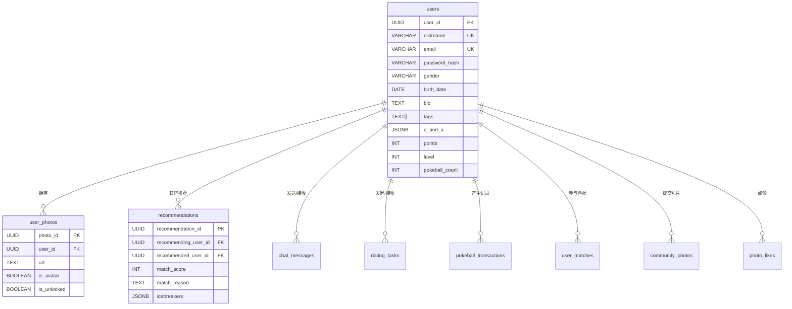
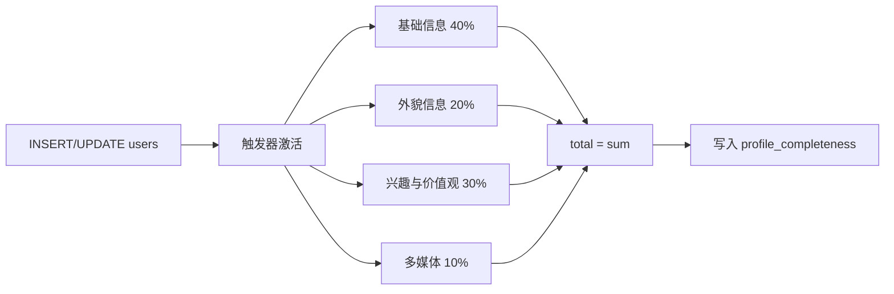
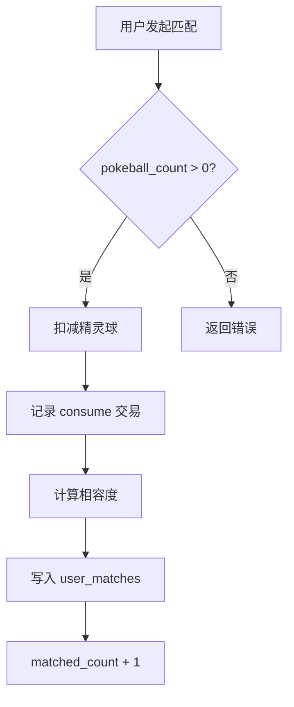

本文档系统阐述 AIlove 项目的用户数据模型架构，涵盖 `users` 核心表、`user_photos` 照片表、扩展迁移字段及其与业务模块的关联关系。理解该设计是掌握推荐匹配、社交互动和游戏化系统的前提。

## 核心数据模型概览

AIlove 的用户数据模型以 `users` 表为中心，通过外键关联照片、推荐、聊天和社区等多个业务表。整体架构呈现三层渐进式设计：**基础认证层**支撑注册登录，**资料画像层**提供匹配所需的用户特征，**游戏化扩展层**实现精灵球和等级系统。

主表 `users` 定义了 30+ 字段，按业务域可划分为六个逻辑分组。以下表格从数据类型、默认值和业务语义三个维度进行系统性梳理。

Sources: [schema.sql](backend/schema.sql#L9-L53)

## 用户表字段架构

### 认证与身份域

此域字段构成用户进入系统的凭据基础。`user_id` 使用 PostgreSQL 内置的 `gen_random_uuid()` 自动生成，确保分布式环境下的全局唯一性。`nickname` 和 `email` 均设置 `UNIQUE` 约束，注册时在 [auth.js](backend/routes/auth.js#L31-L33) 中通过 `SELECT` 前置校验防止冲突。密码采用 `bcrypt` 加盐哈希存储，盐值轮次为 10。

| 字段名 | 类型 | 约束 | 默认值 | 业务语义 |
|--------|------|------|--------|----------|
| `user_id` | UUID | PK | `gen_random_uuid()` | 全局唯一用户标识 |
| `nickname` | VARCHAR(50) | UNIQUE, NOT NULL | — | 用户昵称，登录后可修改 |
| `email` | VARCHAR(255) | UNIQUE, NOT NULL | — | 登录凭证，不可重复 |
| `password_hash` | VARCHAR(255) | NOT NULL | — | bcrypt 加密后的密码 |
| `wechat_openid` | VARCHAR(100) | UNIQUE | NULL | 微信 OpenID，支持微信登录 |
| `wechat_nickname` | VARCHAR(100) | — | NULL | 微信昵称（可选同步） |
| `wechat_avatar_url` | TEXT | — | NULL | 微信头像 URL |

`wechat_*` 系列字段由 [add_wechat_fields.sql](backend/migrations/add_wechat_fields.sql#L6-L12) 迁移脚本引入，`wechat_openid` 的 `UNIQUE` 约束确保同一微信账号不会关联多个用户记录。

Sources: [schema.sql](backend/schema.sql#L10-L14), [add_wechat_fields.sql](backend/migrations/add_wechat_fields.sql#L5-L14)

### 个人资料域

此域字段构成用户画像的核心维度，直接参与 AI 推荐匹配的粗筛和精筛过程。`gender` 字段通过 `check_gender` 约束限定为四个枚举值：`Male`、`Female`、`Gay`、`Lesbian`。`tags` 使用 PostgreSQL 数组类型 `TEXT[]`，支持多兴趣标签的直接存储和查询。

| 字段名 | 类型 | 默认值 | 业务语义 |
|--------|------|--------|----------|
| `gender` | VARCHAR(20) | NULL | 性别，受 CHECK 约束 |
| `birth_date` | DATE | NULL | 出生日期，用于计算年龄 |
| `height_cm` | INT | NULL | 身高（厘米） |
| `weight_kg` | INT | NULL | 体重（公斤） |
| `occupation` | VARCHAR(100) | NULL | 职业 |
| `salary_range` | VARCHAR(50) | NULL | 薪资范围，如 "5k-10k" |
| `orientation` | VARCHAR(50) | NULL | 性取向 |
| `bio` | TEXT | NULL | 个人简介 |
| `avatar_url` | TEXT | NULL | 头像 URL |
| `constellation` | VARCHAR(20) | NULL | 星座 |
| `monthly_income` | INT | NULL | 月收入（元） |
| `family_status` | VARCHAR(50) | NULL | 家庭情况 |

[add_user_profile_fields.sql](backend/migrations/add_user_profile_fields.sql#L7-L12) 迁移脚本引入了 `constellation`、`height`、`weight`、`monthly_income`、`family_status` 等扩展字段。需注意 `schema.sql` 中已有 `height_cm` 和 `weight_kg`，迁移脚本中的 `height`/`weight` 为冗余字段，实际使用时以 `height_cm`/`weight_kg` 为准。

Sources: [schema.sql](backend/schema.sql#L15-L27), [add_user_profile_fields.sql](backend/migrations/add_user_profile_fields.sql#L7-L12)

### 偏好设置域

此域字段定义用户的择偶偏好，是推荐系统粗筛阶段的核心过滤条件。`preferred_age_min` 和 `preferred_age_max` 构成闭区间年龄范围，`preferred_gender` 指定期望的对方性别。

| 字段名 | 类型 | 默认值 | 业务语义 |
|--------|------|--------|----------|
| `preferred_age_min` | INT | NULL | 期望对方最小年龄 |
| `preferred_age_max` | INT | NULL | 期望对方最大年龄 |
| `preferred_gender` | VARCHAR(20) | NULL | 期望对方性别 |

在 [recommendationService.js](backend/services/recommendationService.js#L36-L52) 中，粗筛阶段依次应用这三个条件构建 `WHERE` 子句，同时双向验证——不仅过滤符合当前用户偏好的候选人，还过滤其偏好包含当前用户的候选人。

Sources: [schema.sql](backend/schema.sql#L35-L40), [recommendationService.js](backend/services/recommendationService.js#L36-L52)

### 地理位置域

此域字段支持基于距离的匹配过滤，采用**冗余存储**策略——同时维护三种地理表示格式，以适应不同精度和性能需求。

| 字段名 | 类型 | 默认值 | 业务语义 |
|--------|------|--------|----------|
| `location` | GEOGRAPHY(POINT, 4326) | NULL | PostGIS 地理空间类型，支持 ST_DWithin 查询 |
| `location_geohash` | VARCHAR(20) | NULL | Geohash 编码，用于前缀匹配快速过滤 |
| `location_latitude` | DOUBLE PRECISION | NULL | 纬度（WGS84） |
| `location_longitude` | DOUBLE PRECISION | NULL | 经度（WGS84） |

PostGIS `location` 字段建立了 GiST 索引 [schema.sql](backend/schema.sql#L85)，支持高效的地理邻近查询。`location_geohash` 上建立了 B-tree 索引 [schema.sql](backend/schema.sql#L82)，适用于前缀模糊匹配。经纬度冗余字段用于应用层 `geolib` 库的精确距离计算 [recommendationService.js](backend/services/recommendationService.js#L61-L70)。

Sources: [schema.sql](backend/schema.sql#L30-L33), [recommendationService.js](backend/services/recommendationService.js#L61-L70)

### AI 特征域

此域字段为 LLM 精筛提供语义输入。`values_description` 存储用户的价值观陈述，`q_and_a` 以 JSONB 格式存储开放式问答，如 `{"ideal_weekend": "...", "about_pets": "..."}`。JSONB 类型支持 PostgreSQL 原生 JSON 操作符，便于后续按问题维度检索。

| 字段名 | 类型 | 默认值 | 业务语义 |
|--------|------|--------|----------|
| `tags` | TEXT[] | NULL | 兴趣标签数组 |
| `values_description` | TEXT | NULL | 价值观描述文本 |
| `q_and_a` | JSONB | NULL | 开放式问答 JSON 对象 |

在推荐服务的精筛阶段，这三个字段组合构造成 AI 提示词 [recommendationService.js](backend/services/recommendationService.js#L80-L85)，由 LLM 输出匹配分数、匹配理由和破冰话题。

Sources: [schema.sql](backend/schema.sql#L37-L43), [recommendationService.js](backend/services/recommendationService.js#L80-L85)

### 游戏化扩展域

此域字段实现精灵球积分系统和用户等级机制，是游戏化体验的数据基础。

| 字段名 | 类型 | 默认值 | 业务语义 |
|--------|------|--------|----------|
| `points` | INT | 0 | 恋爱积分 |
| `level` | INT | 1 | 用户等级 |
| `pokeball_count` | INT | 2 | 当前精灵球数量 |
| `matched_count` | INT | 0 | 累计配对成功次数 |
| `vip_level` | VARCHAR(50) | '普通训练师' | VIP 等级 |
| `vip_expires_at` | TIMESTAMPTZ | NULL | VIP 过期时间 |
| `profile_completeness` | INT | 0 | 资料完整度（0-100） |
| `daily_match_count` | INT | 0 | 今日匹配次数 |
| `last_match_date` | DATE | CURRENT_DATE | 最后匹配日期 |
| `pokemon_avatar_id` | VARCHAR(50) | NULL | 宝可梦头像 ID |
| `photos` | JSONB | '[]' | 用户照片 URL 数组（冗余存储） |

`pokeball_count` 和 `matched_count` 由 [add_pokeball_system.sql](backend/migrations/add_pokeball_system.sql#L7-L9) 引入，并通过 `ensure_default_pokeball` 触发器确保新用户默认获得 2 个精灵球。

Sources: [schema.sql](backend/schema.sql#L28-L29), [add_pokeball_system.sql](backend/migrations/add_pokeball_system.sql#L6-L11), [add_user_profile_fields.sql](backend/migrations/add_user_profile_fields.sql#L17-L32)

## 资料完整度自动计算机制

系统通过 PostgreSQL 触发器实现资料完整度的实时计算。`update_profile_completeness()` 函数在每次 `INSERT` 或 `UPDATE` 时自动执行，按权重累加各维度得分。

具体权重分配如下：

| 维度 | 权重 | 检查条件 | 单项分值 |
|------|------|----------|----------|
| 昵称 | 基础信息 | `nickname IS NOT NULL` | 5 |
| 性别 | 基础信息 | `gender IS NOT NULL` | 5 |
| 出生日期 | 基础信息 | `birth_date IS NOT NULL` | 10 |
| 星座 | 基础信息 | `constellation IS NOT NULL` | 5 |
| 职业 | 基础信息 | `occupation IS NOT NULL` | 10 |
| 身高 | 外貌信息 | `height IS NOT NULL` | 10 |
| 体重 | 外貌信息 | `weight IS NOT NULL` | 10 |
| 兴趣标签 | 兴趣价值观 | `tags IS NOT NULL AND array_length > 0` | 15 |
| 价值观描述 | 兴趣价值观 | `values_description IS NOT NULL AND length > 10` | 15 |
| 照片 | 多媒体 | `photos IS NOT NULL AND jsonb_array_length > 0` | 10 |

总分为 100 分，触发器在 [add_user_profile_fields.sql](backend/migrations/add_user_profile_fields.sql#L52-L75) 中定义，确保用户资料完整度始终与实际填写状态同步。

Sources: [add_user_profile_fields.sql](backend/migrations/add_user_profile_fields.sql#L52-L75)

## 照片管理模型

`user_photos` 表独立于 `users` 表存储用户照片，通过外键 `user_id` 关联并设置 `ON DELETE CASCADE`，确保用户删除时照片自动清理。

| 字段名 | 类型 | 约束 | 业务语义 |
|--------|------|------|----------|
| `photo_id` | UUID | PK | 照片唯一标识 |
| `user_id` | UUID | FK → users | 所属用户 |
| `url` | TEXT | NOT NULL | 照片存储路径 |
| `is_avatar` | BOOLEAN | DEFAULT FALSE | 是否为头像 |
| `is_unlocked` | BOOLEAN | DEFAULT FALSE | 是否已解锁（游戏化） |
| `uploaded_at` | TIMESTAMPTZ | DEFAULT NOW() | 上传时间 |

照片上传通过 [users.js](backend/routes/users.js#L277-L322) 的 `POST /api/users/me/photos` 接口实现，使用 Multer 中间件限制文件类型为 jpg/jpeg/png/gif，单文件大小不超过 5MB，单次最多上传 5 张。头像设置通过事务操作 [users.js](backend/routes/users.js#L373-L416) 确保原子性：先将用户所有照片的 `is_avatar` 设为 `FALSE`，再将目标照片设为 `TRUE`，同时更新 `users.avatar_url`。

Sources: [schema.sql](backend/schema.sql#L56-L63), [users.js](backend/routes/users.js#L277-L322)

## 关联数据模型

### 推荐记录表

`recommendations` 表存储 AI 计算出的匹配结果，核心特征是 `(recommending_user_id, recommended_user_id)` 的 `UNIQUE` 约束，确保同一用户对不会产生重复推荐。

| 字段名 | 类型 | 业务语义 |
|--------|------|----------|
| `recommendation_id` | UUID | 推荐记录 ID |
| `recommending_user_id` | UUID FK | 被推荐方（接收推荐的用户） |
| `recommended_user_id` | UUID FK | 被推荐的用户 |
| `match_score` | INT | 匹配分数（0-100） |
| `match_reason` | TEXT | AI 生成的匹配理由 |
| `icebreakers` | JSONB | 破冰话题数组 |
| `last_calculated` | TIMESTAMPTZ | 最后计算时间 |

每次用户注册或更新资料时，系统异步调用 `updateRecommendationsForUser()` [auth.js](backend/routes/auth.js#L68-L72) 重新计算推荐结果。

Sources: [schema.sql](backend/schema.sql#L94-L103), [auth.js](backend/routes/auth.js#L68-L72)

### 配对记录与精灵球交易

`user_matches` 表记录每次配对操作的详细信息，包括双方的宝可梦类型和相容度分数。`pokeball_transactions` 表作为审计日志，追踪精灵球的每一次增减变动。

`pokeball_transactions` 的关键设计：

| 字段名 | 类型 | 约束 | 业务语义 |
|--------|------|------|----------|
| `transaction_type` | VARCHAR(20) | CHECK | recharge/consume |
| `amount` | INT | CHECK > 0 | 变动数量（始终正数） |
| `balance_after` | INT | NOT NULL | 交易后余额 |
| `reference_id` | UUID | NULL | 关联业务 ID |

Sources: [add_pokeball_system.sql](backend/migrations/add_pokeball_system.sql#L15-L58)

## API 操作矩阵

用户资料相关的 RESTful 接口按操作类型组织如下：

| 方法 | 路径 | 认证 | 功能 | 来源 |
|------|------|------|------|------|
| GET | `/api/users/me/profile` | JWT | 获取自己的完整资料 | [users.js](backend/routes/users.js#L44-L73) |
| PUT | `/api/users/me/profile` | JWT | 更新自己的资料 | [users.js](backend/routes/users.js#L76-L195) |
| GET | `/api/users/:userId/profile` | JWT | 获取他人的公开资料 | [users.js](backend/routes/users.js#L198-L236) |
| POST | `/api/users/me/photos` | JWT | 上传照片（最多 5 张） | [users.js](backend/routes/users.js#L277-L322) |
| DELETE | `/api/users/me/photos/:photoId` | JWT | 删除指定照片 | [users.js](backend/routes/users.js#L325-L370) |
| PUT | `/api/users/me/avatar` | JWT | 设置头像 | [users.js](backend/routes/users.js#L373-L416) |
| POST | `/api/auth/register` | 无 | 注册新用户 | [auth.js](backend/routes/auth.js#L12-L72) |
| POST | `/api/auth/login` | 无 | 用户登录 | [auth.js](backend/routes/auth.js#L75-L108) |

私有资料接口（`/me/profile`）返回完整的字段集合，包括 `password_hash` 之外的所有列；公开资料接口（`/:userId/profile`）则经过数据净化，仅返回 `nickname`、`age`（动态计算）、`gender`、`occupation`、`bio`、`avatarUrl`、`photos` 和 `tags`。

Sources: [users.js](backend/routes/users.js#L44-L236), [auth.js](backend/routes/auth.js#L12-L108)

## 索引策略

系统针对不同查询场景建立了针对性的索引策略：

| 索引名 | 字段 | 类型 | 查询场景 |
|--------|------|------|----------|
| `idx_users_email` | `email` | B-tree | 登录时按邮箱查询 |
| `idx_users_nickname` | `nickname` | B-tree | 昵称唯一性校验 |
| `idx_users_location_geohash` | `location_geohash` | B-tree | Geohash 前缀匹配 |
| `idx_users_location` | `location` | GiST | PostGIS 空间查询 |
| `idx_users_wechat_openid` | `wechat_openid` | B-tree | 微信登录查询 |
| `idx_recommendations_recommending_user_id` | `recommending_user_id` | B-tree | 查询用户的推荐列表 |
| `idx_recommendations_score` | `match_score DESC` | B-tree | 按匹配分数排序 |

PostGIS GiST 索引支持 `ST_DWithin` 等空间操作符的加速执行，是实现附近用户查询的关键基础设施。

Sources: [schema.sql](backend/schema.sql#L79-L91), [add_wechat_fields.sql](backend/migrations/add_wechat_fields.sql#L17)

## 数据流与一致性保证

用户资料在系统中的流转遵循以下一致性模式：

1. **注册时**：[auth.js](backend/routes/auth.js#L48-L51) 仅写入 `user_id`、`nickname`、`email`、`password_hash` 四个最小必填字段，其余字段为 NULL，触发器自动计算 `profile_completeness = 0`
2. **资料更新时**：[users.js](backend/routes/users.js#L167-L195) 采用动态 `UPDATE` 语句构建模式，仅修改 `req.body` 中显式提供的字段；更新完成后检测是否涉及推荐相关字段，若是则异步触发 `updateRecommendationsForUser()`
3. **头像变更时**：[users.js](backend/routes/users.js#L373-L416) 在数据库事务中同步更新 `user_photos.is_avatar` 和 `users.avatar_url`，确保两表数据一致
4. **新用户精灵球初始化**：[add_pokeball_system.sql](backend/migrations/add_pokeball_system.sql#L96-L109) 的 `ensure_default_pokeball` 触发器在 `INSERT` 时自动设置 `pokeball_count = 2`

Sources: [auth.js](backend/routes/auth.js#L48-L72), [users.js](backend/routes/users.js#L76-L195), [add_pokeball_system.sql](backend/migrations/add_pokeball_system.sql#L96-L109)

## 后续阅读

- 了解数据库模式的整体布局：[数据库模式概览](34-shu-ju-ku-mo-shi-gai-lan)
- 深入 PostGIS 空间查询机制：[PostGIS 地理位置查询](36-postgis-di-li-wei-zhi-cha-xun)
- 探索聊天和社区数据模型：[聊天与社区数据模型](37-liao-tian-yu-she-qu-shu-ju-mo-xing)
- 了解精灵球积分系统：[游戏化系统数据模型](38-you-xi-hua-xi-tong-shu-ju-mo-xing)