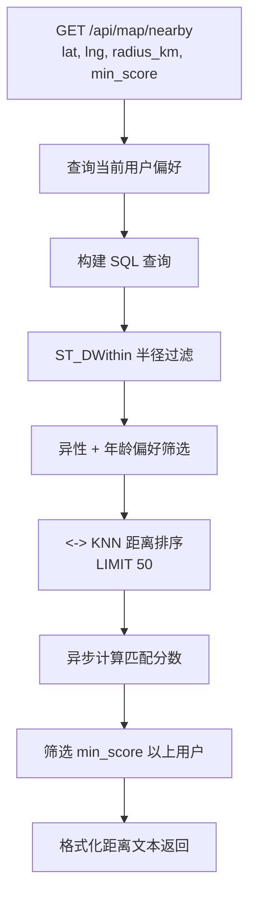
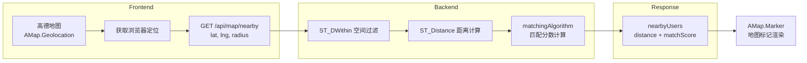

本文档详细解析 AIlove 项目中 PostGIS 地理位置查询的技术实现。项目基于 PostgreSQL 数据库的 PostGIS 扩展，构建了一套完整的地理位置存储、索引、查询与距离计算系统，服务于"附近的人"匹配、约会地点发现、以及基于地理距离的匹配算法评分等核心功能。

## 空间数据模型设计

AIlove 项目使用 PostgreSQL 的 `GEOGRAPHY(POINT, 4326)` 类型存储地理位置。该类型属于 PostGIS 的球面地理类型，以 WGS 84 坐标系（EPSG:4326）为基准，直接以经纬度表示地球表面上的点。选择 `GEOGRAPHY` 而非 `GEOMETRY` 的核心原因在于：`GEOGRAPHY` 自动处理球面曲率，距离计算返回的结果单位为米，天然适配"查找附近 X 公里内用户"这类业务场景，无需手动进行坐标投影转换。

项目中涉及地理位置的表共有两张：`users` 表和 `dating_spots` 表。两张表均采用双列冗余设计——`location` 列以 `GEOGRAPHY(POINT, 4326)` 类型存储标准化空间对象，用于 PostGIS 空间函数查询；同时 `users` 表额外保留了 `location_latitude` 和 `location_longitude` 两个 `DOUBLE PRECISION` 列作为平面冗余，便于非空间查询场景直接读取坐标数值。此外，`users` 表还设计了 `location_geohash` 列（VARCHAR），为基于 Geohash 字符串的前缀匹配预留了扩展能力。

| 表名 | 空间列 | 类型 | 用途 | 冗余列 |
|---|---|---|---|---|
| `users` | `location` | `GEOGRAPHY(POINT, 4326)` | 用户当前位置 | `location_latitude`, `location_longitude`, `location_geohash` |
| `dating_spots` | `location` | `GEOGRAPHY(POINT, 4326)` | 约会地点坐标 | 无 |

Sources: [schema.sql](backend/schema.sql#L7-L7) [schema.sql](backend/schema.sql#L27-L27) [schema.sql](backend/schema.sql#L45-L45)

## 核心 PostGIS 函数体系

项目中的 PostGIS 查询可归纳为四个核心操作模式，分别对应坐标构造、距离过滤、距离计算和最近邻排序。

### 坐标构造：ST_MakePoint + ST_SetSRID

所有空间查询的起点是将经纬度数值转换为 PostGIS 可识别的空间对象。项目统一使用 `ST_SetSRID(ST_MakePoint(lng, lat), 4326)::GEOGRAPHY` 这一组合函数链：`ST_MakePoint` 从经度、纬度数值构造几何点（**注意参数顺序是经度在前、纬度在后**），`ST_SetSRID` 为其赋予 EPSG:4326 空间参考系标识，最后的 `::GEOGRAPHY` 类型转换将球面坐标包装为地理类型。

```sql
-- 构造北京天安门的地理坐标点
ST_SetSRID(ST_MakePoint(116.4074, 39.9042), 4326)::GEOGRAPHY
```

### 距离过滤：ST_DWithin

`ST_DWithin(geog1, geog2, distance_meters)` 是项目中使用频率最高的空间谓词函数。它在 GiST 索引的辅助下高效判断两个地理对象之间的距离是否小于指定阈值（单位：米），用于实现"附近 X 公里内"的半径筛选。该函数的关键优势在于能利用空间索引进行快速剪枝，避免全表扫描。

```sql
-- 查询 5 公里范围内的用户（radius_km * 1000 转换为米）
WHERE ST_DWithin(
    u.location,
    ST_SetSRID(ST_MakePoint($lng, $lat), 4326)::GEOGRAPHY,
    $radius_meters
)
```

Sources: [map.js](backend/routes/map.js#L110-L110) [spots.js](backend/routes/spots.js#L52-L56)

### 距离计算：ST_Distance

`ST_Distance(geog1, geog2)` 返回两个地理对象之间的球面最短距离（单位：米），用于在查询结果中附加精确的距离数值，供前端展示和排序使用。该函数在 `SELECT` 子句中作为计算列出现，不参与索引过滤。

```sql
-- 计算每个用户到查询中心的精确距离
ST_Distance(
    u.location,
    ST_SetSRID(ST_MakePoint($lng, $lat), 4326)::GEOGRAPHY
) as distance_meters
```

Sources: [map.js](backend/routes/map.js#L127-L131) [matchingAlgorithm.js](backend/services/matchingAlgorithm.js#L214-L220)

### 最近邻排序：<-> 运算符

PostgreSQL 的 `<->` 距离运算符配合 GiST 索引实现 KNN（K-Nearest Neighbor）索引排序。在 `ORDER BY u.location <-> reference_point` 查询中，PostgreSQL 可以直接从空间索引树中按距离递增顺序提取记录，无需对所有候选记录逐一计算距离后再排序，大幅提升排序效率。

```sql
-- 按距离中心点由近到远排序
ORDER BY u.location <-> ST_SetSRID(ST_MakePoint($lng, $lat), 4326)::GEOGRAPHY
```

Sources: [map.js](backend/routes/map.js#L136-L136) [spots.js](backend/routes/spots.js#L57-L57)

## 空间索引策略

项目为两张包含地理位置的表分别创建了 GiST（Generalized Search Tree）索引。GiST 是一种可扩展的索引结构，PostGIS 为其实现了 R-Tree 变体，专门用于空间数据的范围查询和最近邻查询。

```sql
-- 用户位置空间索引
CREATE INDEX idx_users_location ON users USING GIST (location);

-- 约会地点空间索引
CREATE INDEX idx_dating_spots_location ON dating_spots USING GIST (location);

-- Geohash 辅助索引（字符串前缀匹配）
CREATE INDEX idx_users_location_geohash ON users(location_geohash);
```

索引的选择遵循以下原则：`ST_DWithin` 半径过滤和 `<->` 最近邻排序都能自动命中 GiST 空间索引；而 `location_geohash` 的 B-Tree 索引则作为辅助手段，适用于 Geohash 前缀匹配的降级查询场景。

Sources: [schema.sql](backend/schema.sql#L89-L89) [schema.sql](backend/schema.sql#L95-L95) [schema.sql](backend/schema.sql#L78-L78)

## API 实现模式

### 位置更新端点

`POST /api/map/update-location` 接收前端上报的经纬度，使用参数化查询同时更新 `GEOGRAPHY` 列和冗余的平面坐标列。查询中参数传入顺序为 `[lng, lat, userId]`，严格对应 `ST_MakePoint($1, $2)` 的经度-纬度顺序约定。


Sources: [map.js](backend/routes/map.js#L13-L64)

### 附近用户查询端点

`GET /api/map/nearby` 是项目中空间查询最复杂的端点。其执行流程为：首先获取当前用户的性别和偏好信息，然后构建包含性别过滤、年龄过滤、空间距离过滤的多条件查询，最后对数据库返回的候选用户逐一调用匹配算法计算匹配分数并二次过滤。



Sources: [map.js](backend/routes/map.js#L69-L230)

### 约会地点查询端点

`GET /api/spots/nearby` 的查询模式与附近用户查询类似，但更为简洁——仅执行空间半径过滤和距离排序，无需额外的业务层匹配计算。查询结果中使用 `ST_X(location::geometry)` 和 `ST_Y(location::geometry)` 从 `GEOGRAPHY` 类型中反序列化出经纬度坐标，这一转换过程先将地理类型强制转换为几何类型，再提取 X（经度）和 Y（纬度）分量。

Sources: [spots.js](backend/routes/spots.js#L36-L60) [spots.js](backend/routes/spots.js#L124-L125)

## 匹配算法中的距离评分

在 [传统匹配算法（兴趣/性格/距离）](32-chuan-tong-pi-pei-suan-fa-xing-qu-xing-ge-ju-chi) 中，地理距离是匹配分数的重要组成部分。`calculateDistanceScore` 函数通过 PostGIS 计算两点间的球面距离，再按阶梯规则映射为 0-100 的分数段。

| 距离范围 | 距离分数 | 匹配语义 |
|---|---|---|
| 0 - 500m | 100 分 | 同一街区，极近 |
| 500m - 1km | 90 分 | 步行可达 |
| 1km - 3km | 70 分 | 短途通勤 |
| 3km - 5km | 50 分 | 同城中距离 |
| 5km - 10km | 30 分 | 同城远距离 |
| > 10km | 10 分 | 跨区距离 |

在传统算法的加权模型中，地理距离占比 30%，兴趣重叠占 40%，性格匹配占 30%。在 LLM 增强算法中，距离分数占比 40%，LLM 语义分析占 60%。

Sources: [matchingAlgorithm.js](backend/services/matchingAlgorithm.js#L206-L250) [matchingAlgorithm.js](backend/services/matchingAlgorithm.js#L81-L83) [matchingAlgorithm.js](backend/services/matchingAlgorithm.js#L96-L100)

## 测试数据与坐标实践

项目的测试数据以北京城区为地理参照，使用 `ST_SetSRID(ST_MakePoint(lng, lat), 4326)::GEOGRAPHY` 语法在 SQL 脚本中直接插入地理坐标。6 位测试用户分布在天安门、西单、王府井、北京西站、国贸、南锣鼓巷等标志性位置，8 个约会地点覆盖咖啡馆、公园、博物馆等多种类型。这种数据布局可有效验证空间查询在真实城市密度下的行为表现。

Sources: [test-data.sql](backend/test-data.sql#L8-L17) [test-data.sql](backend/test-data.sql#L74-L105)

## 前端集成架构

前端地图页面通过高德地图 JS API 获取浏览器定位，将经纬度传递给后端 `/api/map/nearby` 端点。后端返回的 `nearbyUsers` 数组包含 `distance` 对象（含 meters、kilometers 和格式化文本）和 `matchScore` 字段，前端据此在地图上渲染标记点并展示用户信息卡片。



Sources: [MapPage.tsx](frontend-react/src/pages/MapPage.tsx#L130-L147) [MapPage.tsx](frontend-react/src/pages/MapPage.tsx#L50-L53)

## 性能优化要点

**GiST 索引命中率**：`ST_DWithin` 和 `<->` 运算符均可自动利用 GiST 空间索引。若查询退化为全表扫描，可通过 `EXPLAIN ANALYZE` 验证索引是否被正确使用。

**查询参数顺序**：`ST_MakePoint` 的参数顺序是（经度, 纬度）而非（纬度, 经度），这是 PostGIS 的标准约定，参数传反会导致坐标偏移到完全错误的位置。

**GEOGRAPHY vs GEOMETRY**：当查询范围超过数千公里或跨越国际日期变更线时，`GEOGRAPHY` 的球面计算优势更为明显。对于城市级别的近距离查询（如 5-10 公里半径），两者性能差异可忽略，但 `GEOGRAPHY` 省去了手动距离换算的步骤。

**双重存储权衡**：`location`（GEOGRAPHY）+ `location_latitude`/`location_longitude`（DOUBLE PRECISION）的双重设计增加了写入成本和存储开销，但简化了读取路径——当仅需展示坐标数值而无需空间计算时，可直接读取浮点列，避免类型转换开销。