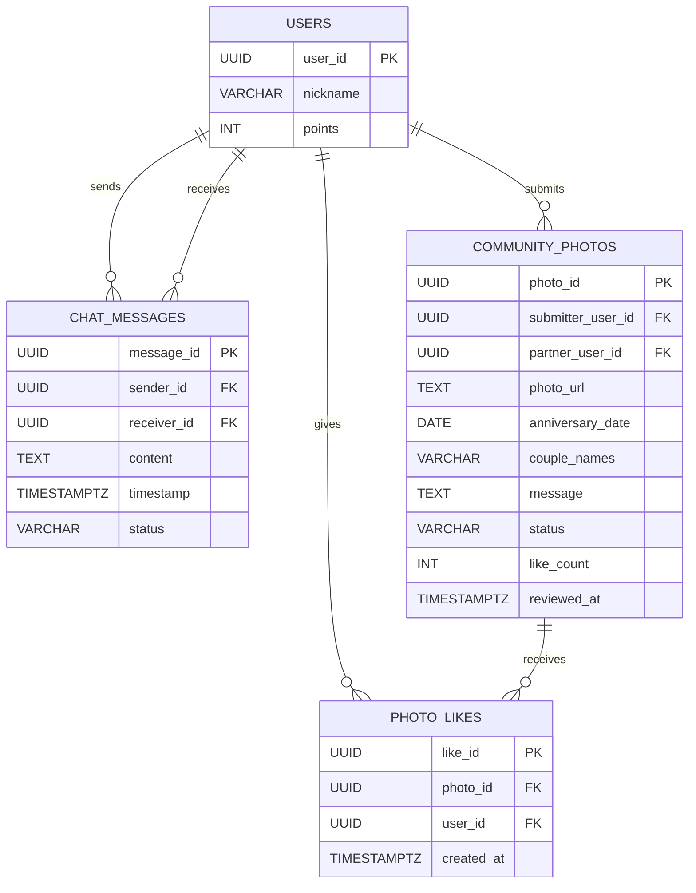
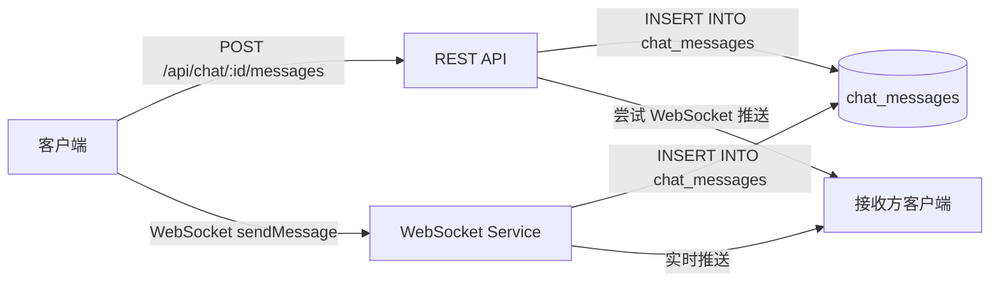
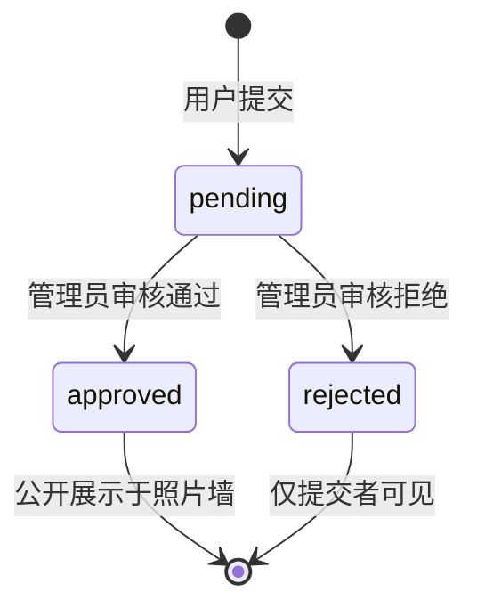
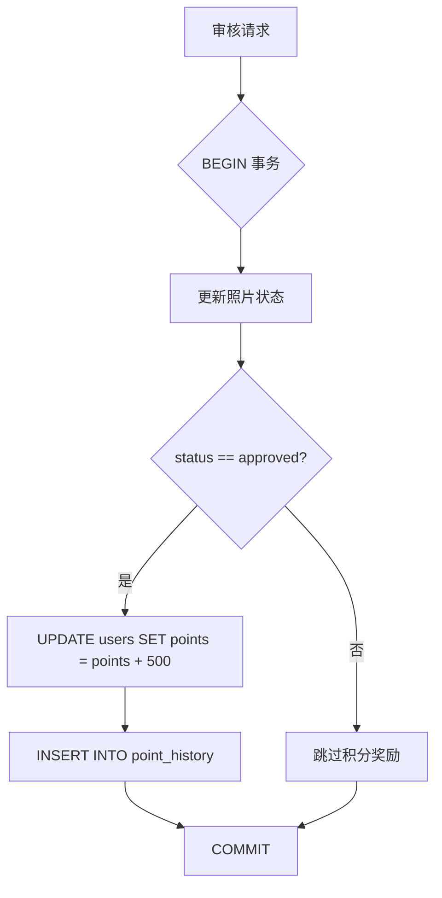

本文档深入解析 AIlove 平台的聊天消息系统与社区照片墙的数据模型设计。该模块包含双向实时消息传递架构与用户生成内容（UGC）审核发布流程，是整个社交互动层的核心数据基础设施。

## 数据模型架构概览

聊天与社区模块由三个核心数据表构成，分别承载即时通信、内容存储与社交互动三种不同的数据访问模式。



该架构呈现出**读写分离的设计哲学**：聊天消息采用高频追加写入模式，社区照片采用低频写入与高频读取模式，点赞记录则作为轻量级关系表桥接用户与内容。

## 聊天消息表（chat_messages）

聊天消息表采用**对等双向存储模型**，每条消息独立记录发送方与接收方标识，而非使用会话（conversation）抽象层。这种设计简化了数据模型，将查询复杂性转移至索引层。

| 字段名 | 类型 | 约束 | 说明 |
|--------|------|------|------|
| message_id | UUID | PRIMARY KEY | 全局唯一消息标识，由 `gen_random_uuid()` 生成 |
| sender_id | UUID | NOT NULL, FK→users | 发送者用户标识 |
| receiver_id | UUID | NOT NULL, FK→users | 接收者用户标识 |
| content | TEXT | NOT NULL | 消息文本内容 |
| timestamp | TIMESTAMPTZ | DEFAULT NOW() | 消息发送时间戳 |
| status | VARCHAR(20) | DEFAULT 'sent' | 消息状态：`sent`、`delivered`、`read` |

Sources: [schema.sql](backend/schema.sql#L115-L122)

### 索引策略

为支持双向聊天历史的高效查询，系统创建了**复合反向索引对**：

```sql
CREATE INDEX idx_chat_messages_sender_receiver 
    ON chat_messages(sender_id, receiver_id, timestamp DESC);
CREATE INDEX idx_chat_messages_receiver_sender 
    ON chat_messages(receiver_id, sender_id, timestamp DESC);
```

这种索引设计使得查询任意两个用户间的对话历史时，无论以发送者还是接收者作为主查询条件，都能利用索引覆盖扫描。`timestamp DESC` 的排序方向与前端"最新消息优先"的展示逻辑一致，避免额外的排序操作。

Sources: [schema.sql](backend/schema.sql#L136-L137)

### 消息状态流转

消息状态字段预留了三阶段递进模型，当前实现中仅使用了初始状态：

| 状态值 | 语义 | 触发时机 |
|--------|------|----------|
| `sent` | 已发送 | 消息写入数据库时（REST API 或 WebSocket） |
| `delivered` | 已送达 | 接收方 WebSocket 连接在线时实时更新（代码预留） |
| `read` | 已读 | 接收方打开聊天窗口时标记（代码预留，[chat.js](backend/routes/chat.js) 未实现） |

在 [websocketService.js](backend/services/websocketService.js#L66-L71) 中，`delivered` 状态的更新逻辑以注释形式存在，表明该功能处于待激活状态。当前消息发送后统一标记为 `sent`，通过 WebSocket 实时推送实现"准实时"体验。

Sources: [websocketService.js](backend/services/websocketService.js#L66-L71)

### REST API 与 WebSocket 双通道

聊天消息的写入存在两条路径，数据模型保持一致性约束：



REST API 路径通过 [chat.js](backend/routes/chat.js#L62-L85) 处理，消息落库后尝试调用 `sendMessageToUser()` 进行 WebSocket 推送；WebSocket 路径直接在 [websocketService.js](backend/services/websocketService.js#L48-L55) 中写入数据库并立即推送给在线接收方。两条路径共享相同的数据库插入逻辑与消息结构。

Sources: [chat.js](backend/routes/chat.js#L62-L85), [websocketService.js](backend/services/websocketService.js#L48-L55)

## 社区照片表（community_photos）

社区照片表采用**内容审核工作流模型**，支持用户提交、管理员审核、社区展示的完整生命周期。与用户个人照片（`user_photos` 表）不同，该表聚焦于"情侣故事"这一社交内容形态。

| 字段名 | 类型 | 约束 | 说明 |
|--------|------|------|------|
| photo_id | UUID | PRIMARY KEY | 照片唯一标识 |
| submitter_user_id | UUID | NOT NULL, FK→users | 提交者用户标识 |
| partner_user_id | UUID | FK→users, ON DELETE SET NULL | 伴侣用户标识（可选） |
| photo_url | TEXT | NOT NULL | 照片存储路径 |
| anniversary_date | DATE | NOT NULL | 纪念日日期 |
| couple_names | VARCHAR(100) | | 情侣昵称展示 |
| message | TEXT | | 附加留言 |
| status | VARCHAR(20) | DEFAULT 'pending', CHECK 约束 | 审核状态：`pending`、`approved`、`rejected` |
| like_count | INT | DEFAULT 0 | 点赞计数器（反范式冗余） |
| reject_reason | TEXT | | 审核拒绝原因 |
| created_at | TIMESTAMPTZ | DEFAULT CURRENT_TIMESTAMP | 提交时间 |
| reviewed_at | TIMESTAMPTZ | | 审核完成时间 |

Sources: [create_community_tables.sql](backend/migrations/create_community_tables.sql#L4-L18)

### 审核状态机

照片的生命周期遵循严格的三态审核流程：



审核通过时触发积分奖励机制（500 积分），通过事务保证数据一致性：

Sources: [community.js](backend/routes/community.js#L293-L307)



该事务逻辑在 [community.js](backend/routes/community.js#L273-L318) 的审核路由中实现，使用 `client.query('BEGIN')` / `COMMIT` / `ROLLBACK` 模式确保积分奖励与状态更新的原子性。

Sources: [community.js](backend/routes/community.js#L273-L318)

### 防重复提交约束

[community.js](backend/routes/community.js#L147-L157) 中实现了业务层面的防重复提交逻辑：检查同一用户是否存在 `pending` 状态的记录，若存在则拒绝新提交。这是一种**应用层约束**，而非数据库级别的唯一约束，允许用户在审核失败后重新提交。

Sources: [community.js](backend/routes/community.js#L147-L157)

## 照片点赞表（photo_likes）

点赞表是典型的**多对多关系桥接表**，记录用户对社区照片的互动行为。

| 字段名 | 类型 | 约束 | 说明 |
|--------|------|------|------|
| like_id | UUID | PRIMARY KEY | 点赞记录唯一标识 |
| photo_id | UUID | NOT NULL, FK→community_photos, ON DELETE CASCADE | 关联照片 |
| user_id | UUID | NOT NULL, FK→users, ON DELETE CASCADE | 点赞用户 |
| created_at | TIMESTAMPTZ | DEFAULT CURRENT_TIMESTAMP | 点赞时间 |
| — | — | UNIQUE(photo_id, user_id) | 唯一约束：同一用户对同一照片仅能点赞一次 |

Sources: [create_community_tables.sql](backend/migrations/create_community_tables.sql#L20-L26)

### 点赞/取消点赞操作模式

点赞操作采用**幂等切换模式**：同一接口根据点赞记录的存在性自动判断执行插入（点赞）或删除（取消点赞）：

```javascript
// 检查是否已点赞
const existingLike = await pool.query(
    `SELECT like_id FROM photo_likes WHERE photo_id = $1 AND user_id = $2`,
    [photoId, userId]
);

if (existingLike.rows.length > 0) {
    // 取消点赞：DELETE + like_count 减 1
} else {
    // 点赞：INSERT + like_count 加 1
}
```

Sources: [community.js](backend/routes/community.js#L215-L250)

这种设计避免了前端需要维护点赞状态的问题，后端自动处理状态切换。然而，`like_count` 字段的冗余更新存在**并发一致性风险**：在高并发场景下，多个用户同时点赞可能导致计数器不准确。当前实现未使用数据库级别的原子操作（如 `UPDATE ... SET like_count = (SELECT COUNT(*) FROM photo_likes WHERE photo_id = $1)`），而是依赖应用层的 `like_count + 1` 逻辑。

### 索引优化

点赞表创建了两个单向索引，分别支持按照片查询点赞列表和按用户查询点赞历史：

```sql
CREATE INDEX idx_photo_likes_photo ON photo_likes(photo_id);
CREATE INDEX idx_photo_likes_user ON photo_likes(user_id);
```

Sources: [create_community_tables.sql](backend/migrations/create_community_tables.sql#L28-L29)

## 数据模型关联分析

### 与用户表的关联

聊天和社区数据模型通过外键与 `users` 表建立级联关系：

| 关联表 | 外键字段 | ON DELETE 行为 | 语义 |
|--------|----------|----------------|------|
| chat_messages | sender_id | CASCADE | 用户删除时，其发送的消息同步删除 |
| chat_messages | receiver_id | CASCADE | 用户删除时，其接收的消息同步删除 |
| community_photos | submitter_user_id | CASCADE | 用户删除时，其提交的照片同步删除 |
| community_photos | partner_user_id | SET NULL | 用户删除时，伴侣字段置空，照片保留 |
| photo_likes | user_id | CASCADE | 用户删除时，其点赞记录同步删除 |

`partner_user_id` 采用 `SET NULL` 策略是重要的设计决策：当伴侣用户注销账号时，照片内容仍保留在社区中，仅伴侣标识变为空。这体现了**内容优先于关系**的设计理念。

Sources: [schema.sql](backend/schema.sql#L116-L117), [create_community_tables.sql](backend/migrations/create_community_tables.sql#L6-L7)

### 与游戏化系统的关联

社区照片审核通过与 [游戏化系统数据模型](38-you-xi-hua-xi-tong-shu-ju-mo-xing) 中的积分系统联动。审核通过时：

1. 更新 `users.points` 和 `users.total_points_earned` 字段
2. 在 `point_history` 表中插入类型为 `community_reward` 的奖励记录

这种跨模块关联通过事务保证，但 `point_history` 表的定义不在当前模式文件中，暗示该表可能通过独立的迁移脚本创建。

Sources: [community.js](backend/routes/community.js#L298-L312)

## 查询模式与 API 映射

### 聊天历史查询

[chat.js](backend/routes/chat.js#L10-L50) 实现的消息历史查询支持**游标分页**（基于时间戳的 `before` 参数），而非传统的 `OFFSET/LIMIT` 分页。这种设计避免了深分页时的性能衰减：

```sql
SELECT message_id, sender_id, receiver_id, content, timestamp, status
FROM chat_messages
WHERE (sender_id = $1 AND receiver_id = $2) OR (sender_id = $2 AND receiver_id = $1)
  AND timestamp < $3  -- 游标分页
ORDER BY timestamp DESC
LIMIT $4
```

Sources: [chat.js](backend/routes/chat.js#L18-L29)

### 社区照片墙查询

社区照片展示仅返回 `status = 'approved'` 的记录，采用传统 `OFFSET/LIMIT` 分页：

```sql
SELECT cp.photo_id, cp.photo_url, cp.anniversary_date, cp.couple_names,
       cp.message, cp.like_count, cp.created_at,
       u1.nickname as submitter_name, u2.nickname as partner_name
FROM community_photos cp
LEFT JOIN users u1 ON cp.submitter_user_id = u1.user_id
LEFT JOIN users u2 ON cp.partner_user_id = u2.user_id
WHERE cp.status = 'approved'
ORDER BY cp.created_at DESC
LIMIT $1 OFFSET $2
```

Sources: [community.js](backend/routes/community.js#L44-L56)

通过 `LEFT JOIN` 在数据库层完成用户昵称的关联查询，减少应用层的数据组装开销。

## 设计模式总结

| 设计维度 | 聊天消息模型 | 社区照片模型 |
|----------|-------------|-------------|
| **数据访问模式** | 高频写入，按时间范围读取 | 低频写入，高频全量读取 |
| **一致性要求** | 最终一致性（WebSocket 推送） | 强一致性（事务审核） |
| **冗余策略** | 无冗余，纯规范化 | `like_count` 反范式冗余 |
| **分页策略** | 游标分页（`beforeTimestamp`） | 偏移分页（`OFFSET`） |
| **状态管理** | 简单三态（`sent/delivered/read`） | 审核三态（`pending/approved/rejected`） |
| **级联策略** | 双向 CASCADE | 提交者 CASCADE，伴侣 SET NULL |

这种差异化的设计反映了两种业务场景的本质区别：聊天是**流式时间线数据**，社区是**精选内容集合数据**。

如需进一步了解与聊天模块的实时通信实现细节，请参阅 [WebSocket 实时通信](9-websocket-shi-shi-tong-xin)。关于游戏化积分系统的完整设计，请参阅 [游戏化系统数据模型](38-you-xi-hua-xi-tong-shu-ju-mo-xing)。