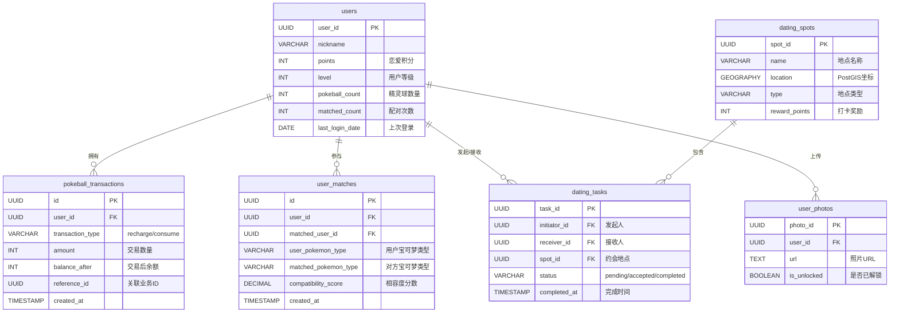
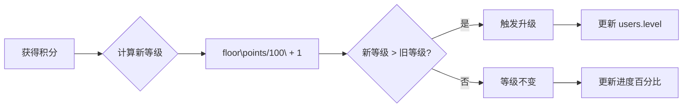
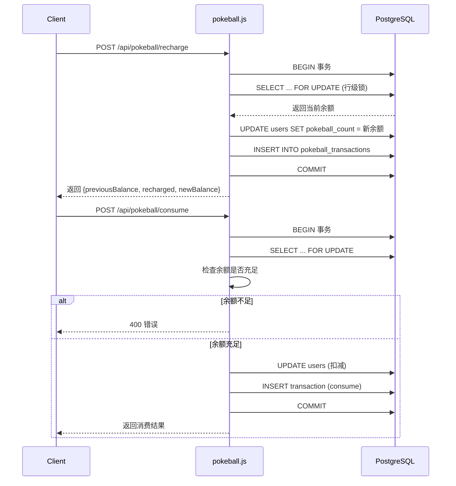
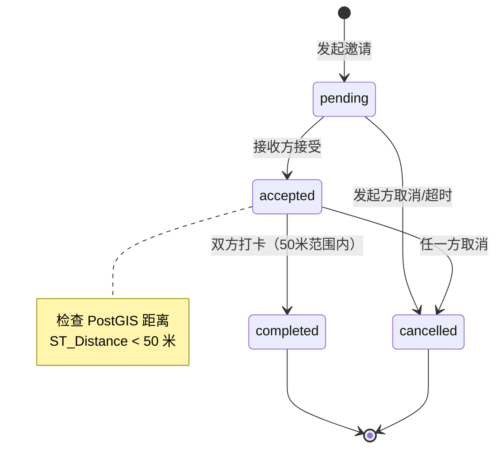

本文档详细阐述 AIlove 平台游戏化系统的核心数据架构，涵盖精灵球经济、积分等级、约会任务及社交解锁四大子系统。系统以 PostgreSQL 为持久化层，通过事务保障与触发器机制确保数据一致性，支撑用户从初次匹配到深度互动的全生命周期激励循环。

## 系统架构概览

游戏化系统由四个相互关联的子系统构成：**精灵球经济系统**控制匹配资源消耗，**积分等级系统**驱动长期用户留存，**约会任务系统**促成线下互动，**社交解锁系统**提供即时反馈激励。各子系统通过 `users` 表的核心字段 (`points`, `level`, `pokeball_count`) 实现数据贯通。



**核心设计原则**：

- **资源双轨制**：精灵球用于匹配行为消耗，积分用于解锁内容与等级成长，两者相互独立但通过奖励机制联动
- **事务保障**：精灵球充值/消费采用 `FOR UPDATE` 行级锁，确保并发场景下的余额一致性 ([pokeball.js](backend/routes/pokeball.js#L112-L119))
- **状态机驱动**：约会任务遵循 `pending → accepted → completed/cancelled` 的有限状态转换 ([tasks.js](backend/routes/tasks.js#L225-L231))

Sources: [add_pokeball_system.sql](backend/migrations/add_pokeball_system.sql#L1-L133), [schema.sql](backend/schema.sql#L1-L167), [pokeball.js](backend/routes/pokeball.js#L1-L316)

## 核心数据表设计

### users 表（游戏化扩展字段）

`users` 表是游戏化系统的数据枢纽，通过多次迁移逐步扩展游戏化相关字段。

| 字段名 | 类型 | 默认值 | 说明 |
|--------|------|--------|------|
| `points` | INT | 0 | 恋爱积分，参与等级计算与道具消耗 |
| `level` | INT | 1 | 用户等级，由积分自动推导 |
| `last_login_date` | DATE | NULL | 上次登录日期，控制每日奖励领取 |
| `pokeball_count` | INT | 2 | 当前精灵球数量，新用户默认赠送 2 个 |
| `matched_count` | INT | 0 | 配对成功累计次数 |

**触发器机制**：系统通过 `ensure_default_pokeball()` 触发器确保新用户注册时自动获得默认精灵球数量 ([add_pokeball_system.sql](backend/migrations/add_pokeball_system.sql#L64-L81))：

```sql
CREATE OR REPLACE FUNCTION ensure_default_pokeball()
RETURNS TRIGGER AS $$
BEGIN
  IF NEW.pokeball_count IS NULL THEN
    NEW.pokeball_count := 2;
  END IF;
  IF NEW.matched_count IS NULL THEN
    NEW.matched_count := 0;
  END IF;
  RETURN NEW;
END;
$$ LANGUAGE plpgsql;
```

Sources: [schema.sql](backend/schema.sql#L38-L44), [add_pokeball_system.sql](backend/migrations/add_pokeball_system.sql#L5-L11), [add_pokeball_system.sql](backend/migrations/add_pokeball_system.sql#L64-L81)

### pokeball_transactions 表（精灵球流水）

精灵球交易记录表采用**流水账模式**，所有余额变更均通过此表追溯，而非直接修改用户余额。

| 字段名 | 类型 | 约束 | 说明 |
|--------|------|------|------|
| `id` | UUID | PK | 交易唯一标识 |
| `user_id` | UUID | FK → users | 关联用户 |
| `transaction_type` | VARCHAR(20) | CHECK ('recharge', 'consume') | 交易类型 |
| `amount` | INT | > 0 | 交易数量（始终为正数） |
| `description` | TEXT | NOT NULL | 交易描述（如"微信充值 10 元"） |
| `balance_after` | INT | NOT NULL | 交易后余额快照 |
| `reference_id` | UUID | NULL | 关联业务 ID（匹配 ID、任务 ID 等） |
| `created_at` | TIMESTAMPTZ | DEFAULT NOW() | 交易时间 |

**索引策略**：三组索引分别优化用户维度查询 (`user_id`)、时间维度查询 (`created_at DESC`) 和类型维度过滤 (`transaction_type`) ([create_pokeball_transactions_table.sql](backend/migrations/create_pokeball_transactions_table.sql#L16-L18))。

Sources: [add_pokeball_system.sql](backend/migrations/add_pokeball_system.sql#L17-L42), [create_pokeball_transactions_table.sql](backend/migrations/create_pokeball_transactions_table.sql#L5-L24)

### user_matches 表（配对记录）

配对记录表存储用户之间的匹配历史，包含配对时的宝可梦元数据与相容度评分。

| 字段名 | 类型 | 说明 |
|--------|------|------|
| `id` | UUID | 配对记录 ID |
| `user_id` | UUID | 发起匹配的用户 |
| `matched_user_id` | UUID | 被匹配的用户 |
| `user_pokemon_type` | VARCHAR(50) | 发起方的宝可梦类型 |
| `matched_pokemon_type` | VARCHAR(50) | 接收方的宝可梦类型 |
| `compatibility_score` | DECIMAL(5,2) | 相容度分数 (0-100) |

**唯一约束**：`(user_id, matched_user_id)` 组合唯一，确保同一对用户仅有一条配对记录 ([add_pokeball_system.sql](backend/migrations/add_pokeball_system.sql#L60-L61))。

Sources: [add_pokeball_system.sql](backend/migrations/add_pokeball_system.sql#L45-L71)

### dating_spots 表（约会地点）

约会地点表模拟 Pokemon GO 的 Pokestops 概念，为用户提供线下互动锚点。

| 字段名 | 类型 | 默认值 | 说明 |
|--------|------|--------|------|
| `spot_id` | UUID | PK | 地点唯一标识 |
| `name` | VARCHAR(100) | NOT NULL | 地点名称 |
| `location` | GEOGRAPHY(POINT) | NOT NULL | PostGIS 地理坐标 |
| `type` | VARCHAR(50) | NOT NULL | 地点类型（cafe, park, restaurant 等） |
| `address` | TEXT | NULL | 详细地址 |
| `reward_points` | INT | 50 | 打卡奖励积分 |
| `description` | TEXT | NULL | 地点描述 |

Sources: [schema.sql](backend/schema.sql#L57-L68)

### dating_tasks 表（约会任务）

约会任务表实现从线上匹配到线下约会的状态流转。

| 字段名 | 类型 | 说明 |
|--------|------|------|
| `task_id` | UUID | 任务唯一标识 |
| `initiator_id` | UUID | 约会发起人 |
| `receiver_id` | UUID | 约会接收人 |
| `spot_id` | UUID | 约会地点 FK |
| `status` | VARCHAR(20) | 状态：pending/accepted/completed/cancelled |
| `scheduled_time` | TIMESTAMPTZ | 预约时间（可选） |
| `completed_at` | TIMESTAMPTZ | 任务完成时间 |

**防重复机制**：创建邀请前检查同一对用户是否存在 `pending` 或 `accepted` 状态的任务 ([tasks.js](backend/routes/tasks.js#L70-L81))。

Sources: [schema.sql](backend/schema.sql#L71-L82), [tasks.js](backend/routes/tasks.js#L70-L81)

### user_photos 表（照片解锁）

| 字段名 | 类型 | 默认值 | 说明 |
|--------|------|--------|------|
| `photo_id` | UUID | PK | 照片唯一标识 |
| `user_id` | UUID | FK → users | 照片所属用户 |
| `url` | TEXT | NOT NULL | 照片存储 URL |
| `is_unlocked` | BOOLEAN | FALSE | 是否已解锁（默认需积分查看） |
| `uploaded_at` | TIMESTAMPTZ | NOW() | 上传时间 |

Sources: [schema.sql](backend/schema.sql#L48-L55)

## 积分与等级计算规则

积分系统采用**线性增长模型**，等级推导逻辑在 `rewards.js` 中集中实现 ([rewards.js](backend/routes/rewards.js#L491-L507))。

### 等级计算公式

| 参数 | 公式 | 示例 |
|------|------|------|
| 等级计算 | `level = floor(points / 100) + 1` | 250 积分 → 等级 3 |
| 升级需求 | `required_points = (level - 1) × 100` | 等级 4 需要 300 积分 |



### 积分获取途径

| 行为 | 基础积分 | 加成规则 | 触发接口 |
|------|----------|----------|----------|
| 每日登录 | 10 | 每 10 级额外 +5 | `POST /api/rewards/daily-login` |
| 完善资料 | 5/字段 | 上限 50 积分 | `POST /api/rewards/complete-profile` |
| 约会打卡 | 200 | 可被 `dating_spots.reward_points` 覆盖 | `POST /api/tasks/:taskId/check-in` |

**每日登录奖励计算示例** ([rewards.js](backend/routes/rewards.js#L44-L52))：
- 用户等级 25：基础 10 + `(25/10)×5 = 20` → 总计 30 积分
- 用户等级 5：基础 10 + `(5/10)×5 = 10` → 总计 20 积分（等级 bonus 向下取整）

Sources: [rewards.js](backend/routes/rewards.js#L44-L77), [rewards.js](backend/routes/rewards.js#L491-L507), [tasks.js](backend/routes/tasks.js#L301-L307)

## 精灵球经济系统

精灵球系统采用**双账户模型**：用户余额 (`users.pokeball_count`) 与交易流水 (`pokeball_transactions`) 分离，所有变更通过事务保证原子性。

### 充值与消费流程



**关键设计决策**：
- `FOR UPDATE` 行级锁防止并发充值/消费导致的余额不一致 ([pokeball.js](backend/routes/pokeball.js#L112-L119))
- 消费接口标记为内部 API，由匹配系统调用而非直接暴露给前端 ([pokeball.js](backend/routes/pokeball.js#L172-L178))
- `reference_id` 字段关联业务上下文（如匹配 ID），便于后续审计追踪

Sources: [pokeball.js](backend/routes/pokeball.js#L85-L170), [pokeball.js](backend/routes/pokeball.js#L172-L268)

## 社交解锁系统

社交解锁系统提供两种积分消耗道具，增强用户间的信息透明度与互动深度。

### 道具定价与效果

| 道具名称 | 消耗积分 | 功能 | 实现接口 |
|----------|----------|------|----------|
| 透视镜 | 50 | 解锁目标用户照片 | `POST /api/rewards/unlock-photo` |
| 心灵感应 | 30 | 查看目标用户 Q&A 详情 | `POST /api/rewards/mind-reading` |

**透视镜实现逻辑** ([rewards.js](backend/routes/rewards.js#L301-L376))：
1. 检查当前用户积分是否 ≥ 50
2. 扣除积分（注意：此处未使用事务，存在并发风险）
3. 查询目标用户的 `user_photos` 记录返回

**设计缺陷提示**：当前 `unlock-photo` 和 `mind-reading` 接口缺少事务包裹，高并发场景下可能出现积分扣除但数据返回失败的不一致状态。建议后续重构为事务模式。

Sources: [rewards.js](backend/routes/rewards.js#L288-L376), [rewards.js](backend/routes/rewards.js#L379-L438)

## 约会任务状态机

约会任务系统实现从线上互动到线下约会的完整闭环。



**打卡验证流程** ([tasks.js](backend/routes/tasks.js#L239-L317))：
1. 验证任务状态为 `accepted`
2. 验证请求用户是任务参与者
3. 使用 PostGIS `ST_Distance` 计算用户当前位置与约会地点距离
4. 距离 ≤ 50 米才允许打卡
5. 打卡成功后更新状态为 `completed`，并为双方奖励积分

**位置验证 SQL** ([tasks.js](backend/routes/tasks.js#L271-L279))：
```sql
SELECT ST_Distance(
    ST_SetSRID(ST_MakePoint($1, $2), 4326)::GEOGRAPHY,
    $3::GEOGRAPHY
) as distance_meters
```

Sources: [tasks.js](backend/routes/tasks.js#L239-L317), [tasks.js](backend/routes/tasks.js#L320-L400)

## 统计视图与排行榜

### user_pokeball_stats 视图

系统提供聚合视图用于用户精灵球使用统计分析 ([add_pokeball_system.sql](backend/migrations/add_pokeball_system.sql#L84-L100))：

```sql
CREATE OR REPLACE VIEW user_pokeball_stats AS
SELECT
  u.id AS user_id,
  u.nickname,
  u.pokeball_count,
  u.matched_count,
  COUNT(DISTINCT um.id) AS total_matches,
  SUM(CASE WHEN pt.transaction_type = 'recharge' THEN pt.amount ELSE 0 END) AS total_recharged,
  SUM(CASE WHEN pt.transaction_type = 'consume' THEN pt.amount ELSE 0 END) AS total_consumed
FROM users u
LEFT JOIN user_matches um ON (u.id = um.user_id)
LEFT JOIN pokeball_transactions pt ON (u.id = pt.user_id)
GROUP BY u.id, u.nickname, u.pokeball_count, u.matched_count;
```

### 排行榜查询

排行榜按积分降序排列，同分时按等级降序 ([rewards.js](backend/routes/rewards.js#L168-L183))：

```sql
SELECT user_id, nickname, avatar_url, points, level, age
FROM users
ORDER BY points DESC, level DESC
LIMIT $1 OFFSET $2
```

当前用户排名通过子查询动态计算 ([rewards.js](backend/routes/rewards.js#L187-L196))。

Sources: [add_pokeball_system.sql](backend/migrations/add_pokeball_system.sql#L84-L100), [rewards.js](backend/routes/rewards.js#L168-L217)

## 数据库迁移历史

游戏化系统通过多次增量迁移逐步构建：

| 迁移文件 | 核心变更 | 依赖关系 |
|----------|----------|----------|
| `schema.sql` | 基础表结构 (`users`, `dating_spots`, `dating_tasks`, `user_photos`) | 无 |
| `add_pokeball_system.sql` | 精灵球字段、交易表、配对表、触发器、统计视图 | schema.sql |
| `create_pokeball_transactions_table.sql` | 精灵球交易表（早期版本，已被上方迁移覆盖） | schema.sql |

**注意**：`create_pokeball_transactions_table.sql` 是精灵球交易表的早期迁移文件，功能已被 `add_pokeball_system.sql` 中的更完整版本覆盖。生产环境应优先执行后者。

Sources: [schema.sql](backend/schema.sql#L1-L167), [add_pokeball_system.sql](backend/migrations/add_pokeball_system.sql#L1-L133), [create_pokeball_transactions_table.sql](backend/migrations/create_pokeball_transactions_table.sql#L1-L38)

## 与相关系统的交互

游戏化系统并非孤立运行，与以下模块存在数据交互：

| 交互系统 | 数据流向 | 关键接口 |
|----------|----------|----------|
| [匹配算法](30-pi-pei-suan-fa-jia-gou) | 匹配成功后消耗精灵球，记录 `user_matches` | 内部调用 `/api/pokeball/consume` |
| [用户认证](24-yong-hu-ren-zheng-api) | 新用户注册触发精灵球默认值 | `ensure_default_pokeball` 触发器 |
| [地图服务](19-di-tu-yu-di-li-wei-zhi) | 约会地点基于 `dating_spots` 的 PostGIS 坐标 | `GET /api/map` |
| [微信登录](29-wei-xin-deng-lu-ji-cheng) | 充值通过微信支付回调触发 | `/api/pokeball/recharge` |

如需深入了解匹配算法如何与精灵球系统联动，请参阅 [匹配算法架构](30-pi-pei-suan-fa-jia-gou)；如需了解前端如何展示游戏化数据，请参阅 [宝可梦主题组件](16-bao-ke-meng-zhu-ti-zu-jian)。