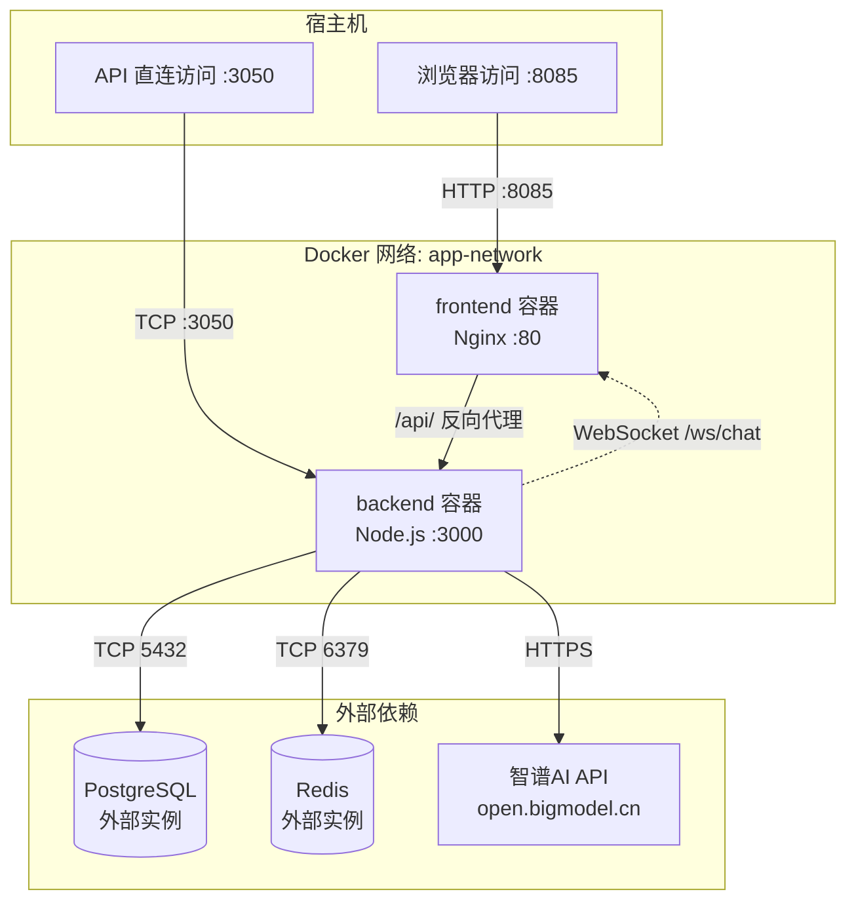
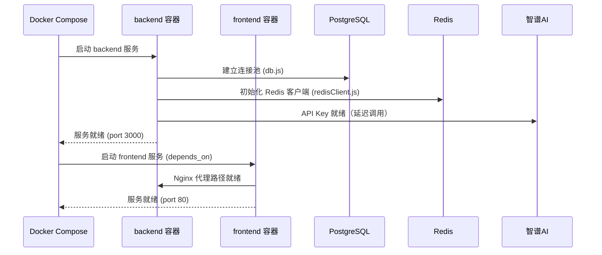

本文档阐述 AI月老 项目的 Docker 容器化架构，涵盖后端服务容器构建、前端与 Nginx 反向代理的编排策略、网络与存储卷配置，以及当前容器化方案中已识别的配置缺口与修复路径。阅读本节后，你将能够理解项目容器拓扑结构并独立完成本地容器环境搭建。

## 容器拓扑架构

项目采用**双服务容器拓扑**：后端 Express 服务与前端 Nginx 静态服务通过自定义桥接网络互联。后端暴露内部 3000 端口映射至宿主机 3050 端口，前端通过 Nginx 在 80 端口监听并将 API 请求代理至后端容器。



**关键架构特征**：

- **网络隔离**：`app-network` 采用 bridge 驱动，容器间通过服务名称解析（`backend:3000`）
- **数据持久化**：采用 bind mount 将 `./backend` 目录挂载至容器，支持开发期热重载
- **环境变量注入**：通过 `env_file` 加载 `backend/.env`，包含数据库连接串、JWT 密钥、智谱 AI 凭证等
- **依赖注入顺序**：frontend 声明 `depends_on: backend`，确保后端优先启动

Sources: [docker-compose.yml](docker-compose.yml#L1-L37), [backend/.env.example](backend/.env.example#L1-L25)

## 后端容器构建（Dockerfile）

后端采用 **Node.js 18 Alpine** 最小化基础镜像，遵循多阶段构建的最佳实践路径。构建流程分为三个明确阶段：

| 构建阶段 | 操作 | 说明 |
|---------|------|------|
| 依赖安装 | `COPY package*.json ./` + `RUN npm install` | 利用 Docker 层缓存，仅在 package.json 变更时重新安装 |
| 代码拷贝 | `COPY . .` | 将应用源码复制至工作目录 `/usr/src/app/backend` |
| 启动准备 | `EXPOSE 3000` + `CMD ["node", "server.js"]` | 声明监听端口，使用 `node` 直接启动（非 nodemon） |

**环境变量默认值**：Dockerfile 内硬编码 `ENV PORT=3000`，该值可被 docker-compose 的 `env_file` 覆盖。实际运行时端口由 `server.js` 中 `process.env.PORT || 3000` 决定（[backend/server.js](backend/server.js#L11-L11)）。

**WebSocket 支持**：后端通过 `http.createServer(app)` 创建 HTTP 服务器实例（而非直接 `app.listen`），使 WebSocket 服务共享同一端口 3000。WebSocket 端点路径为 `/ws/chat`，采用 JWT 令牌认证（[backend/server.js](backend/server.js#L12-L12), [backend/services/websocketService.js](backend/services/websocketService.js#L11-L11)）。

Sources: [backend/Dockerfile](backend/Dockerfile#L1-L26), [backend/server.js](backend/server.js#L1-L84)

## 构建上下文优化（.dockerignore）

`.dockerignore` 文件定义了 Docker 构建上下文中的排除规则，直接影响构建速度与镜像体积：

```
node_modules      # 依赖将在容器内重新安装，无需从宿主机拷贝
npm-debug.log     # 调试日志文件
Dockerfile        # Dockerfile 本身不需要进入镜像
.dockerignore     # 忽略文件本身不需要进入镜像
.env              # 环境变量文件（安全考量：避免敏感信息进入构建上下文）
.git              # Git 仓库元数据
.gitignore        # Git 忽略规则
```

**安全注意**：`.env` 文件被显式排除，意味着容器运行时必须通过 `env_file` 或 `environment` 指令注入环境变量。构建上下文不包含敏感信息，降低镜像泄露风险。

Sources: [backend/.dockerignore](backend/.dockerignore#L1-L8)

## 前端容器与 Nginx 反向代理

### Nginx 代理配置

前端容器内运行 Nginx，承担双重职责：**静态文件服务**与 **API 反向代理**。配置逻辑如下：

| location 块 | 处理逻辑 | 说明 |
|------------|---------|------|
| `/` | `try_files $uri $uri/ /index.html` | SPA 路由支持，所有前端路由 fallback 至 `index.html` |
| `/api/` | `proxy_pass http://backend:3000/api/` | API 请求转发至后端容器（通过 Docker 服务名解析） |
| `/50x.html` | 错误页处理 | 500/502/503/504 状态码的自定义错误页 |

**WebSocket 代理现状**：当前 Nginx 配置中 WebSocket 升级头已注释（[nginx.conf](nginx.conf#L17-L19)）。若前端需通过 Nginx 代理连接后端 WebSocket 服务，需取消注释以下三行：

```nginx
proxy_http_version 1.1;
proxy_set_header Upgrade $http_upgrade;
proxy_set_header Connection "upgrade";
```

**当前限制**：Nginx 的 `/api/` 代理路径假设所有后端 API 均以 `/api/` 为前缀，这与 [backend/server.js](backend/server.js#L66-L78) 中定义的路由前缀一致，确保代理规则覆盖所有 API 端点。

Sources: [nginx.conf](nginx.conf#L1-L31)

### 卷挂载策略

docker-compose 中 frontend 服务挂载了自定义 Nginx 配置：

```yaml
volumes:
  - ./nginx.conf:/etc/nginx/conf.d/default.conf:ro
```

`:ro` 标志表示**只读挂载**，防止容器内进程修改宿主机配置文件。此策略确保配置变更必须通过宿主机文件编辑实现，符合不可变基础设施原则。

Sources: [docker-compose.yml](docker-compose.yml#L27-L28)

## 启动编排与依赖管理

### 服务启动时序



**关键路径分析**：

1. **后端启动**：Node.js 进程加载 `dotenv` 配置后，立即执行 `initializeRedisClient()`（异步，不阻塞启动），随后 Express 中间件注册、路由挂载，最后 `server.listen()` 启动 HTTP/WS 监听。
2. **前端启动**：声明 `depends_on: backend` 确保后端容器先启动，但**不等待**后端应用就绪。若后端初始化时间较长（如数据库连接池建立），前端可能在首次 API 调用时遭遇连接拒绝。
3. **重启策略**：两项服务均配置 `restart: unless-stopped`，容器异常退出或宿主机重启后自动恢复。

Sources: [docker-compose.yml](docker-compose.yml#L12-L13), [docker-compose.yml](L29-L30), [backend/server.js](backend/server.js#L14-L15), [backend/services/redisClient.js](backend/services/redisClient.js#L1-L50)

## 已识别配置缺口与修复方案

通过源码审计，发现以下影响容器化部署的配置缺口：

### 缺口 1：前端 Dockerfile 缺失

[docker-compose.yml](docker-compose.yml#L19-L20) 声明 `context: ./frontend` 与 `dockerfile: Dockerfile`，但实际前端目录为 `frontend-react/` 且其中**不存在 Dockerfile**。当前配置将导致 `docker compose build` 失败。

**修复方案**：创建 `frontend-react/Dockerfile`，推荐采用多阶段构建：

```dockerfile
# 构建阶段
FROM node:18-alpine AS builder
WORKDIR /app
COPY package*.json ./
RUN npm install
COPY . .
RUN npm run build

# 运行阶段（Nginx 静态服务）
FROM nginx:alpine
COPY --from=builder /app/dist /usr/share/nginx/html
EXPOSE 80
CMD ["nginx", "-g", "daemon off;"]
```

同时需将 `docker-compose.yml` 中的 `context: ./frontend` 修正为 `context: ./frontend-react`。

### 缺口 2：卷挂载路径不匹配

[docker-compose.yml](docker-compose.yml#L9-L10) 中 backend 卷挂载为 `./backend:/usr/src/app/backend`，与 Dockerfile 中 `WORKDIR /usr/src/app/backend` 一致，但 frontend 卷挂载部分已注释（[docker-compose.yml](docker-compose.yml#L27-L31)）。若采用多阶段构建模式，前端开发期热重载需额外配置 Vite 的 HMR 代理或改用开发模式容器。

### 缺口 3：entrypoint.sh 未使用

[backend/entrypoint.sh](backend/entrypoint.sh#L1-L3) 存在但仅执行 `node hello.js`，且 Dockerfile 中使用 `CMD` 而非 `ENTRYPOINT`，该脚本未被容器启动流程引用。若需实现启动前数据库迁移检查或健康探针，可替换 `CMD` 为 `ENTRYPOINT ["./entrypoint.sh"]` 并增强脚本逻辑。

Sources: [docker-compose.yml](docker-compose.yml#L18-L33), [frontend-react/](frontend-react/), [backend/entrypoint.sh](backend/entrypoint.sh#L1-L3)

## 本地容器环境快速启动

完成上述修复后，按以下步骤启动容器环境：

**第一步：准备环境变量**
```bash
cp backend/.env.example backend/.env
# 编辑 .env，填入实际的 DATABASE_URL、JWT_SECRET、OPENAI_API_KEY
```

**第二步：构建并启动**
```bash
docker compose up --build -d
```

**第三步：验证服务状态**
```bash
docker compose ps          # 查看容器运行状态
docker compose logs backend  # 查看后端启动日志
curl http://localhost:3050   # 验证后端健康端点
curl http://localhost:8085   # 验证前端 Nginx 服务
```

**端口映射总结**：

| 服务 | 容器端口 | 宿主机端口 | 用途 |
|------|---------|-----------|------|
| backend | 3000 | 3050 | REST API + WebSocket |
| frontend | 80 | 8085 | 静态页面 + Nginx 代理 |

Sources: [docker-compose.yml](docker-compose.yml#L6-L7), [docker-compose.yml](L20-L21)

## 下一步

容器化部署完成后，你可能需要：

- 了解服务编排细节与多容器依赖管理：[Docker Compose 编排](40-docker-compose-bian-pai)
- 配置生产级反向代理与 HTTPS：[Nginx 反向代理配置](41-nginx-fan-xiang-dai-li-pei-zhi)
- 获取生产环境性能调优与安全加固建议：[生产环境优化建议](42-sheng-chan-huan-jing-you-hua-jian-yi)