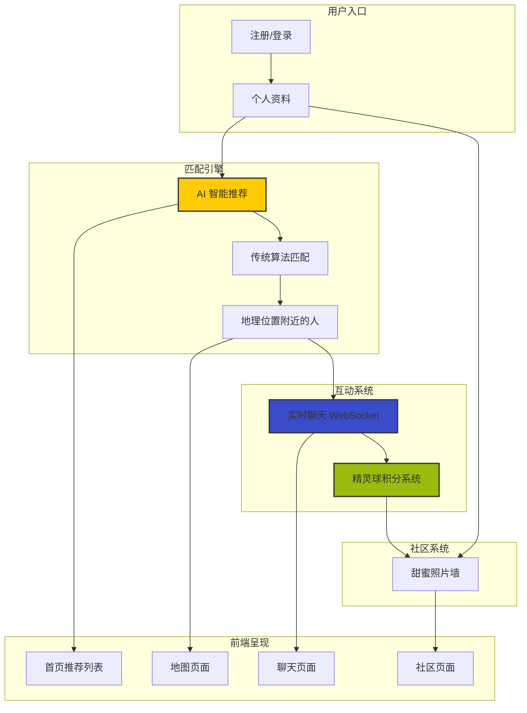

本文档带你系统了解 AIlove 项目的核心功能模块。AIlove 是一个以**宝可梦 GameBoy 复古风格**为设计语言的社交平台，通过 AI 智能匹配、地理位置服务和游戏化积分系统，为用户提供独特的交友体验。作为入门读者，你可以按本文档的指引逐步理解系统的全貌，再深入各专项技术页面。

## 系统功能总览

AIlove 的功能体系可分为**六大核心模块**，它们以前后端分离的架构协同工作，覆盖从用户注册、智能匹配到实时互动、社区展示的完整链路。



**六大模块概览：**

| 模块 | 核心功能 | 前端页面 | 后端路由 |
|---|---|---|---|
| 用户认证 | 注册、登录、JWT 认证、微信登录 | [LoginPage](frontend-react/src/pages/LoginPage.tsx)、RegisterPage | `/api/auth` |
| 智能匹配 | AI 评分 + 传统算法、破冰话题生成 | [HomePage](frontend-react/src/pages/HomePage.tsx) | `/api/recommendations` |
| 地图探索 | PostGIS 地理查询、附近的人筛选 | [MapPage](frontend-react/src/pages/MapPage.tsx) | `/api/map` |
| 实时聊天 | WebSocket 即时通信、消息持久化 | [ChatPage](frontend-react/src/pages/ChatPage.tsx) | `/api/chat` + `/ws/chat` |
| 社区照片墙 | 照片上传、拍立得展示、审核积分 | [CommunityPage](frontend-react/src/pages/CommunityPage.tsx) | `/api/community` |
| 精灵球系统 | 积分充值、消费扣减、交易历史 | [PokeballPage](frontend-react/src/pages/PokeballPage.tsx) | `/api/pokeball` |

## 一、智能匹配系统

匹配系统是 AIlove 的**核心引擎**，采用双层架构：LLM 智能分析与传统算法互补。

**工作流程**：系统首先尝试从 Redis 缓存读取匹配分数（避免重复计算），缓存未命中时进入计算流程。当配置了智谱 AI API 且双方均填写了价值观描述时，系统调用 LLM 进行语义级匹配分析，评分权重为 **LLM 分析 60% + 地理距离 40%**；LLM 不可用时自动回退到传统算法，权重为**地理距离 30% + 兴趣重叠 40% + 性格匹配 30%**。

**关键细节**：
- 兴趣匹配使用 Jaccard 相似度算法计算标签重叠度
- 性格匹配基于价值观描述（`values_description`）的余弦相似度
- 距离计算使用 PostGIS 的 `ST_Distance` 函数
- 所有匹配结果附带三条 AI 生成的破冰话题（icebreakers）
- 计算完成后批量写入 `recommendations` 表，前端按分数降序获取

Sources: [matchingAlgorithm.js](backend/services/matchingAlgorithm.js#L1-L120), [recommendations.js](backend/routes/recommendations.js#L1-L90), [recommendationService.js](backend/services/recommendationService.js#L1-L60)

## 二、地图与地理位置

地图模块利用 **PostGIS 空间数据库扩展**实现基于地理位置的用户发现。

**核心能力**：
- `POST /api/map/update-location` — 更新用户经纬度，同时写入 PostGIS 的 `GEOGRAPHY` 类型字段和独立的 `location_latitude`/`location_longitude` 字段，保证空间查询和范围筛选的双重可用
- `GET /api/map/nearby` — 使用 `ST_DWithin` 函数进行半径搜索（默认 5 公里），返回附近异性用户并附带匹配分数，仅展示分数 ≥ 70 的高质量推荐
- 支持按年龄偏好和性别偏好进行多层过滤

前端 MapPage 组件会在用户授权后调用浏览器 Geolocation API 获取坐标，并在地图上以宝可梦主题标记展示附近用户。

Sources: [map.js](backend/routes/map.js#L1-L80), [map.js](backend/routes/map.js#L85-L170)

## 三、实时聊天系统

聊天系统采用 **REST + WebSocket 双通道架构**，兼顾消息可靠性和实时性。

**通信流程**：
1. **REST API 通道**：`POST /api/chat/{partnerId}/messages` 将消息持久化到 `chat_messages` 表，同时通过 `app.get('sendMessageToUser')` 触发 WebSocket 推送给在线接收方
2. **WebSocket 通道**：客户端通过 `/ws/chat?token=JWT` 建立长连接，发送 `sendMessage` 类型消息后，服务端先入库再实时转发给目标用户
3. 消息状态分为 `sent` → `delivered` → `read` 三个层级

离线消息通过数据库持久化保障，用户上线后可通过 REST API 拉取历史消息。

Sources: [chat.js](backend/routes/chat.js#L1-L130), [websocketService.js](backend/services/websocketService.js#L1-L80)

## 四、社区照片墙

照片墙模块为用户提供拍立得风格的情侣照片展示功能，采用**提交-审核**机制保障内容质量。

**业务流程**：
1. 用户上传照片文件至 `POST /api/community/upload-photo`（Multer 处理，限制 10MB，仅允许图片格式）
2. 填写纪念日、情侣昵称、甜蜜寄语后提交至 `POST /api/community/submit-couple-photo`
3. 记录初始状态为 `pending`，审核通过后状态变更为 `approved`，用户获得 500 积分奖励
4. 前端以瀑布流（2 列自适应）展示审核通过的照片，每张照片以白色边框、-2° 随机旋转呈现拍立得效果
5. 支持点赞/取消点赞互动，点赞计数实时更新

Sources: [community.js](backend/routes/community.js#L1-L100), [community.js](backend/routes/community.js#L100-L200)

## 五、精灵球积分系统

精灵球系统是平台的**游戏化货币体系**，将用户行为转化为可视化的积分体验。

**核心操作**：
- `GET /api/pokeball/history` — 查询交易历史，支持按类型（recharge/consume）过滤，默认返回最近 50 条记录
- `POST /api/pokeball/recharge` — 微信充值精灵球，使用数据库事务保证用户余额更新与交易记录插入的原子性
- `POST /api/pokeball/consume` — 消费精灵球（如匹配扣减），内部接口，校验余额不足时回滚事务

所有交易记录存储在 `pokeball_transactions` 表中，包含交易类型、金额、操作后余额、关联业务 ID 和描述。前端 PokeballPage 以 GameBoy 风格界面展示精灵球余额和历史流水。

Sources: [pokeball.js](backend/routes/pokeball.js#L1-L120), [pokeball.js](backend/routes/pokeball.js#L120-L200)

## 六、前端路由结构

前端采用 React Router 进行页面路由管理，所有受保护页面均通过 `ProtectedRoute` 组件统一拦截未认证用户。

```mermaid
graph LR
    A[/login] -->|认证成功| B[/]
    A[/register] -->|注册成功| B[/]
    
    B["/ 首页"] --> C["/map 地图"]
    B --> D["/chat 聊天"]
    B --> E["/community 社区"]
    B --> F["/profile 资料"]
    B --> G["/pokeball 精灵球"]
    
    style B fill:#9BBC0F,stroke:#333,stroke-width:2px
    style C fill:#ffcb05,stroke:#333,stroke-width:2px
    style D fill:#3b4cca,stroke:#333,stroke-width:2px
```

**路由特点**：
- 根路径 `/` 默认重定向至 HomePage（首页推荐列表）
- 所有业务页面被 `AppLayout` 包裹，统一包含背景音乐播放器（MusicPlayer）和底部导航栏（TabBar）
- 未认证用户访问受保护页面时自动跳转至 `/login`
- 加载状态（`isLoading`）期间展示 GameBoy 风格的"加载中..."动画

Sources: [App.tsx](frontend-react/src/App.tsx#L1-L123)

## 下一步学习路线

根据你的兴趣和角色定位，建议按以下路径深入：

- **了解技术选型** → [技术栈与依赖](3-ji-zhu-zhan-yu-yi-lai)
- **快速启动项目** → [快速开始](2-kuai-su-kai-shi)
- **理解整体架构** → [系统整体架构](7-xi-tong-zheng-ti-jia-gou)
- **前后端交互** → [前后端通信协议](8-qian-hou-duan-tong-xin-xie-yi)
- **匹配算法深入** → [匹配算法架构](30-pi-pei-suan-fa-jia-gou)
- **前端页面开发** → [React 项目结构](12-react-xiang-mu-jie-gou)