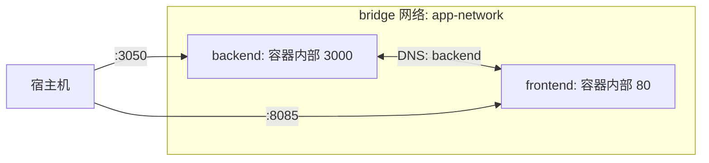
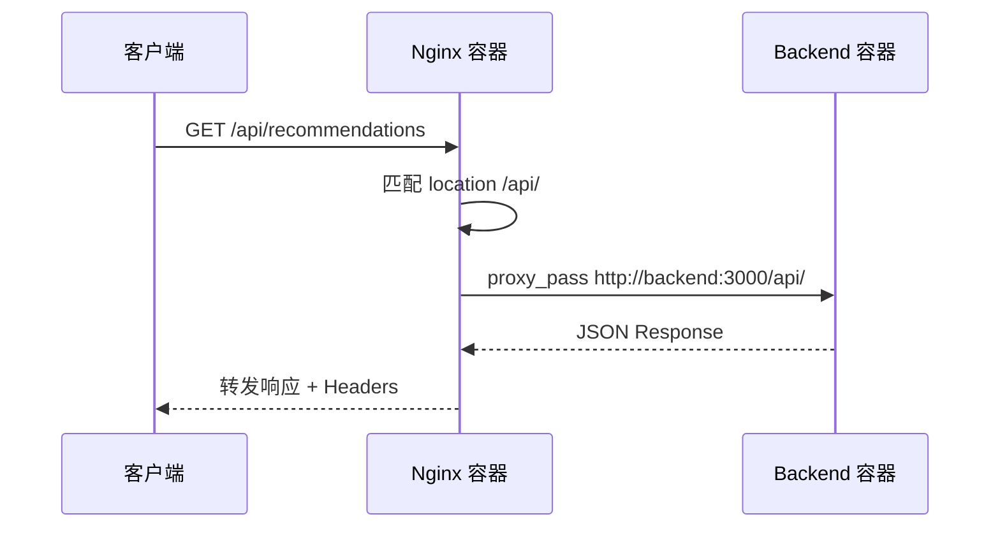
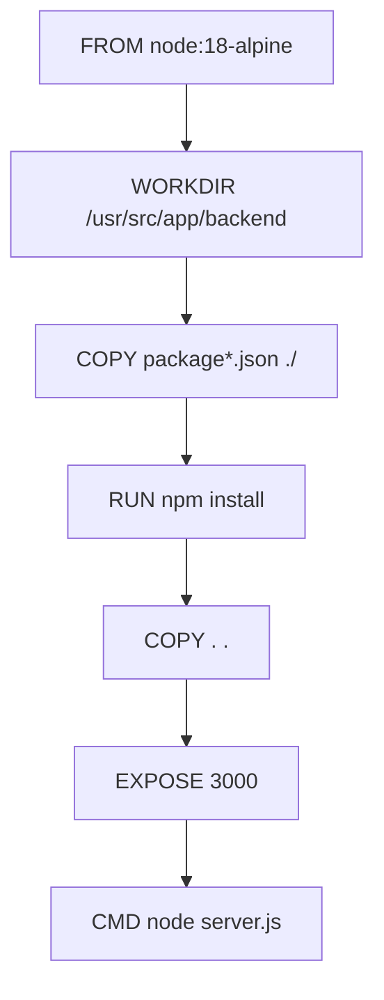

Docker Compose 是 AI月老项目的多容器编排核心，负责将后端 Node.js 服务、前端 Nginx 静态服务器以及自定义网络拓扑组织为可一键启停的开发与部署单元。编排文件定义了服务的构建上下文、端口映射、环境变量注入、持久化卷挂载以及容器间通信机制，构成了从本地开发到生产部署的基础设施骨架。

Sources: [docker-compose.yml](docker-compose.yml#L1-L40)

## 服务拓扑与依赖关系

项目当前采用双服务架构，通过共享桥接网络实现容器间通信。后端服务暴露 Node.js HTTP/WebSocket 服务器，前端服务以 Nginx 作为静态文件托管与 API 反向代理层。

```mermaid
graph TD
    Client[客户端浏览器] -->|HTTP/WS| Nginx[Nginx 前端容器 :8085]
    Nginx -->|静态资源| FrontendAssets[/usr/share/nginx/html]
    Nginx -->|/api/* 代理| Backend[Node.js 后端容器 :3050]
    Backend -->|DATABASE_URL| PostgreSQL[(外部 PostgreSQL)]
    Backend -->|REDIS_URL| Redis[(外部 Redis)]
    Backend -->|文件系统| Uploads[../uploads 目录]

    classDef service fill:#4a90d9,stroke:#357abd,color:#fff
    classDef infra fill:#27ae60,stroke:#1e8449,color:#fff
    classDef external fill:#e67e22,stroke:#d35400,color:#fff

    class Nginx,Backend service
    class FrontendAssets,Uploads infra
    class PostgreSQL,Redis external
```

两个服务通过 `app-network` 桥接网络互联，容器间使用服务名称作为 DNS 主机名进行解析。Nginx 配置中 `proxy_pass http://backend:3000/api/` 正是依赖此内部 DNS 实现服务发现。

Sources: [docker-compose.yml](docker-compose.yml#L36-L39) [nginx.conf](nginx.conf#L14-L14)

## Compose 配置详解

### 后端服务配置

后端服务从 `./backend` 目录构建镜像，将容器内部 3000 端口映射至宿主机 3050 端口，并通过 `env_file` 指令批量加载环境变量。代码卷挂载采用双层策略：宿主机代码目录映射到容器工作目录，同时通过匿名卷排除 `node_modules` 覆盖。

```yaml
backend:
  build:
    context: ./backend
    dockerfile: Dockerfile
  ports:
    - "3050:3000"
  volumes:
    - ./backend:/usr/src/app/backend
    - /usr/src/app/backend/node_modules
  env_file:
    - ./backend/.env
  restart: unless-stopped
  networks:
    - app-network
```

**关键配置解析**：

| 配置项 | 值 | 作用 |
|--------|------|------|
| `build.context` | `./backend` | 指定构建上下文目录，Docker 会将该目录内容发送至 Docker Daemon |
| `ports` | `3050:3000` | 宿主机 3050 → 容器 3000，避免与常见开发端口冲突 |
| `volumes[0]` | `./backend:/usr/src/app/backend` | 开发模式下实现代码热更新 |
| `volumes[1]` | `/usr/src/app/backend/node_modules` | 匿名卷防止宿主机空目录覆盖容器内已安装的依赖 |
| `env_file` | `./backend/.env` | 注入数据库连接、JWT 密钥、AI API 配置等敏感参数 |
| `restart` | `unless-stopped` | 容器异常退出时自动重启，手动停止后不自动恢复 |

卷挂载的双层设计是开发环境的最佳实践。第一层挂载使宿主机代码修改实时同步到容器，第二层匿名卷声明则告诉 Docker Compose 保留容器内 `node_modules` 的独立状态，避免 Linux 编译的原生模块因宿主机操作系统差异而失效。

Sources: [docker-compose.yml](docker-compose.yml#L4-L15) [backend/Dockerfile](backend/Dockerfile#L1-L26)

### 前端服务配置

前端服务目前引用 `./frontend` 目录作为构建上下文，将 Nginx 的 80 端口映射至宿主机 8085 端口，并通过只读卷挂载自定义 Nginx 配置文件。

```yaml
frontend:
  build:
    context: ./frontend
    dockerfile: Dockerfile
  ports:
    - "8085:80"
  depends_on:
    - backend
  volumes:
    - ./nginx.conf:/etc/nginx/conf.d/default.conf:ro
  restart: unless-stopped
  networks:
    - app-network
```

**关键配置解析**：

| 配置项 | 值 | 作用 |
|--------|------|------|
| `build.context` | `./frontend` | 当前目录不存在，需调整为 `./frontend-react` |
| `depends_on` | `backend` | 声明启动顺序依赖，确保后端先就绪 |
| `volumes[0]` | `./nginx.conf:/etc/nginx/conf.d/default.conf:ro` | 注入自定义反向代理规则，`:ro` 标记为只读挂载 |

`depends_on` 仅控制容器启动顺序，不等待后端健康检查通过。生产环境应配合 `healthcheck` 实现真正的就绪等待。前端构建上下文路径 `./frontend` 与实际目录 `./frontend-react` 不一致，这是当前编排配置中需要修正的偏差。

Sources: [docker-compose.yml](docker-compose.yml#L17-L30)

## 网络架构

`app-network` 采用 Docker 默认的 `bridge` 驱动，为所有服务创建一个隔离的虚拟子网。在此网络内，容器通过服务名称相互解析，无需暴露额外端口或使用宿主机 IP。



桥接网络与宿主机默认网络隔离，容器只能通过显式声明的端口映射与外界通信。这一设计提升了安全性，同时避免了端口冲突。服务间通信使用内部 DNS 而非 IP 地址，确保容器重启后 IP 变化不影响服务发现。

Sources: [docker-compose.yml](docker-compose.yml#L36-L39)

## Nginx 反向代理集成

前端容器内置的 Nginx 通过挂载的配置文件实现 API 请求代理，将 `/api/*` 路径转发至后端服务。



代理配置中注入了标准的反向代理请求头，包括真实客户端 IP（`X-Real-IP`）和代理链（`X-Forwarded-For`），使后端能够通过 `req.headers['x-real-ip']` 获取原始客户端地址。WebSocket 升级头部目前处于注释状态，若后续需要 WebSocket 穿透 Nginx 代理，需取消注释并添加 `proxy_http_version 1.1` 配置。

Sources: [nginx.conf](nginx.conf#L1-L31)

## 构建流程与镜像优化

后端 Dockerfile 基于 `node:18-alpine` 构建，采用精简镜像减小最终体积。构建过程遵循依赖缓存最佳实践：先复制 `package*.json` 执行 `npm install`，再复制应用代码。



`.dockerignore` 排除了 `node_modules`、`.env`、`.git` 等不应进入镜像的文件，有效减小构建上下文体积并防止敏感信息泄露。

Sources: [backend/Dockerfile](backend/Dockerfile#L1-L26) [backend/.dockerignore](backend/.dockerignore#L1-L8)

## 环境变量管理

Compose 通过 `env_file` 指令将 `.env` 文件中的变量注入后端容器，配置文件模板定义了数据库连接、JWT 密钥、智谱 AI API 等核心参数。

| 变量名 | 默认值 | 用途 |
|--------|--------|------|
| `PORT` | `3000` | Node.js 服务监听端口 |
| `NODE_ENV` | `development` | 运行环境标识 |
| `DATABASE_URL` | PostgreSQL 连接串 | PostGIS 数据库连接 |
| `JWT_SECRET` | 自定义密钥 | Token 签名与验证 |
| `OPENAI_API_KEY` | 智谱 AI 密钥 | LLM 匹配服务调用 |
| `OPENAI_BASE_URL` | 智谱 AI 端点 | API 基础 URL |
| `OPENAI_MODEL` | `glm-4.7` | 使用的模型名称 |
| `REDIS_URL` | 可选 | Redis 缓存连接 |

生产部署时应确保 `.env` 文件不包含在版本控制中，并通过安全的密钥管理服务注入。

Sources: [backend/.env.example](backend/.env.example#L1-L25)

## 常用运维命令

| 命令 | 作用 |
|------|------|
| `docker compose up -d` | 后台启动所有服务 |
| `docker compose up --build` | 重新构建镜像并启动 |
| `docker compose down` | 停止并移除容器与网络 |
| `docker compose down -v` | 同时移除匿名卷 |
| `docker compose logs -f backend` | 实时查看后端日志 |
| `docker compose exec backend sh` | 进入后端容器 Shell |
| `docker compose ps` | 查看服务运行状态 |

开发迭代时建议使用 `docker compose up --build` 强制重新构建，确保依赖变更被正确捕获。生产环境中可配合 `docker compose pull` 更新基础镜像。

## 编排改进方向

当前编排配置满足基础开发需求，面向生产环境还有以下可优化空间：

**健康检查**：为后端服务添加 HTTP 健康检查端点（如 `GET /`），使前端 `depends_on` 能够基于真实就绪状态而非仅启动顺序。

**前端构建修正**：将 `build.context` 从 `./frontend` 修正为 `./frontend-react`，或创建 `./frontend` 目录的符号链接指向实际前端项目目录。

**多阶段构建**：前端服务目前缺失 Dockerfile，建议创建多阶段构建配置，第一阶段使用 Node.js 执行 Vite 构建，第二阶段将产物复制到 Nginx 镜像中运行。

**数据库服务编排**：当前 PostgreSQL 和 Redis 为外部依赖，可选择将其纳入 Compose 管理，通过 `volumes` 实现数据持久化，通过 `healthcheck` 确保依赖服务就绪后再启动应用。

**网络分段**：将数据库服务置于独立的内部网络，仅后端容器可访问，进一步缩小攻击面。

完成上述优化后，建议继续阅读 [Nginx 反向代理配置](41-nginx-fan-xiang-dai-li-pei-zhi) 深入了解反向代理的细粒度调优，或参考 [生产环境优化建议](42-sheng-chan-huan-jing-you-hua-jian-yi) 获取生产部署的最佳实践指南。