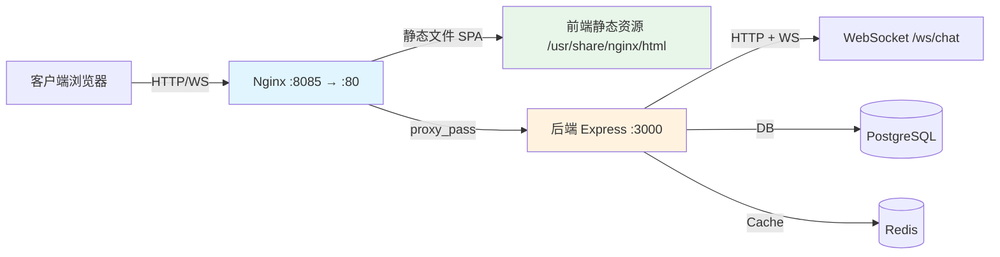
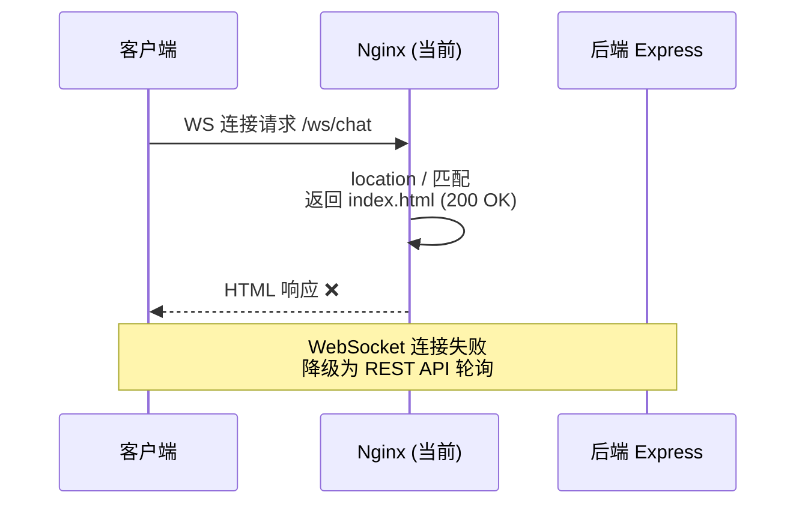
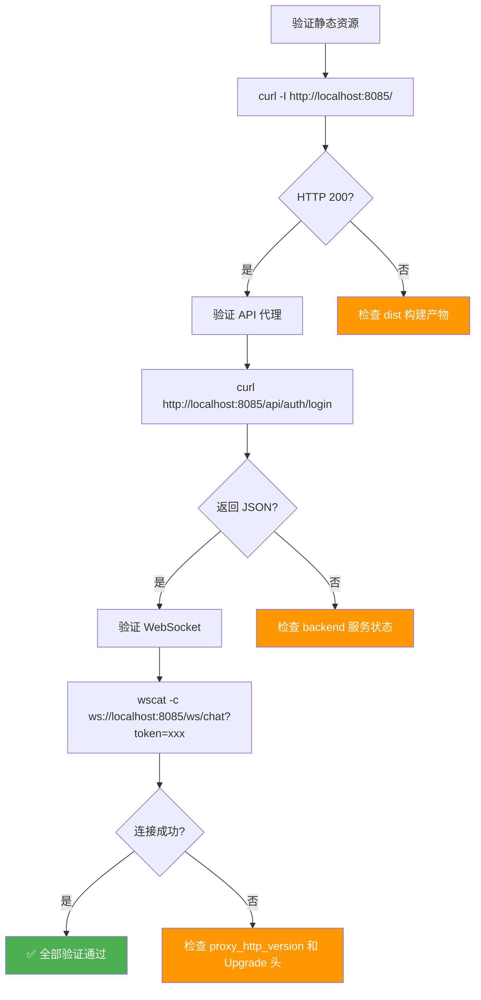

本页说明 AIlove 项目中 Nginx 反向代理的当前配置结构、流量路由逻辑、WebSocket 代理缺陷，以及生产环境可用的改进方案。理解这些内容是在 [Docker Compose 编排](40-docker-compose-bian-pai) 基础上进一步实现请求统一入口的关键步骤。

## 当前配置概览

AIlove 项目通过 Nginx 容器作为统一流量入口，接收前端请求并将 API 请求反向代理至后端服务。Nginx 配置文件挂载于 `frontend` 服务容器内，运行在容器内的 80 端口，对外暴露到宿主机的 8085 端口。



当前架构的核心流量分流逻辑由 [`nginx.conf`](nginx.conf#L1-L31) 定义，配合 [`docker-compose.yml`](docker-compose.yml#L19-L35) 的服务编排共同工作。具体而言，Nginx 承担两项职责：

**静态资源托管**：`location /` 使用 `try_files $uri $uri/ /index.html` 实现 SPA（单页应用）的客户端路由支持。这意味着所有非匹配路径的请求都会被重定向到 `index.html`，由前端 React Router 接管路由分发。

**API 反向代理**：`location /api/` 将匹配前缀的请求通过 `proxy_pass` 转发至 `http://backend:3000/api/`。这里的 `backend` 是 Docker Compose 内部网络中的服务名，容器间通过 `app-network` 桥接网络通信。

| 配置项 | 当前值 | 用途 |
|---|---|---|
| 监听端口 | `80`（容器内） | Nginx 默认 HTTP 端口 |
| 宿主机映射 | `8085:80` | 外部访问入口 |
| 静态文件根目录 | `/usr/share/nginx/html` | SPA 构建产物位置 |
| API 代理目标 | `http://backend:3000/api/` | Express 后端服务 |
| 上游服务名 | `backend` | Docker Compose 服务标识 |

Sources: [nginx.conf](nginx.conf#L1-L31), [docker-compose.yml](docker-compose.yml#L19-L35)

## 请求路由矩阵

Nginx 的 `location` 指令块定义了请求匹配规则与处理策略。以下表格完整列出当前配置的路由行为：

| location 路径 | 处理策略 | 目标 | 备注 |
|---|---|---|---|
| `/` | `try_files` 回退到 `/index.html` | 静态文件目录 | SPA 客户端路由支持 |
| `/api/` | `proxy_pass` 到后端 | `backend:3000/api/` | 所有 REST API 请求 |
| `/50x.html` | 静态文件响应 | `/usr/share/nginx/html` | 5xx 错误页面 |

后端的 Express 服务在 [`server.js`](backend/server.js#L26-L30) 中还注册了额外的静态文件路由：

| Express 路径 | 物理路径 | 内容 |
|---|---|---|
| `/uploads` | `backend/uploads/` | 用户上传文件 |
| `/music` | `../music/` | 背景音乐资源 |
| `/pictures` | `../pictures/` | 充值二维码图片 |

**关键问题**：`/uploads`、`/music`、`/pictures` 这三个路径目前**没有**被 Nginx 的 `location` 块捕获。这意味着如果前端通过 Nginx 入口访问这些资源（例如 `http://host:8085/uploads/avatar.jpg`），Nginx 会将其当作 SPA 路由处理，返回 `index.html` 而不是实际文件。正确的前端配置 [`config.ts`](frontend-react/src/config.ts#L1-L6) 显示当前开发模式直接绕过 Nginx 连接后端 `3052` 端口，这是开发环境的临时方案。

Sources: [nginx.conf](nginx.conf#L6-L9), [nginx.conf](nginx.conf#L12-L23), [backend/server.js](backend/server.js#L26-L30), [frontend-react/src/config.ts](frontend-react/src/config.ts#L1-L6)

## WebSocket 代理缺口分析

后端 WebSocket 服务在 [`websocketService.js`](backend/services/websocketService.js#L11) 中初始化于 `/ws/chat` 路径：

```javascript
const wss = new WebSocket.Server({ server: httpServer, path: '/ws/chat' });
```

然而，当前 Nginx 配置中的 WebSocket 代理指令处于**注释状态**：

```nginx
# WebSocket support (if your backend uses WebSockets directly on /api/ or subpath)
# proxy_http_version 1.1;
# proxy_set_header Upgrade $http_upgrade;
# proxy_set_header Connection "upgrade";
```

这导致三个关键问题：

1. **`/ws/chat` 路径未被匹配**：`location /api/` 只匹配 `/api/` 前缀的请求，`/ws/chat` 会被 `location /` 捕获并返回 `index.html`
2. **缺少 HTTP 升级头**：WebSocket 协议依赖 `Upgrade` 和 `Connection` 头进行协议切换，没有这些头 Nginx 会将 WebSocket 请求当作普通 HTTP 请求处理
3. **缺少 `proxy_http_version 1.1`**：WebSocket 需要 HTTP/1.1，而 Nginx 默认使用 HTTP/1.0



Sources: [backend/services/websocketService.js](backend/services/websocketService.js#L11), [nginx.conf](nginx.conf#L19-L22)

## 生产环境 Nginx 配置方案

基于当前架构分析，以下是一份完整的生产就绪配置。该配置解决了静态资源代理、WebSocket 支持和请求转发三个核心问题。

```nginx
server {
    listen 80;
    server_name localhost;

    # 1. 前端 SPA 静态文件
    location / {
        root /usr/share/nginx/html;
        try_files $uri $uri/ /index.html;
    }

    # 2. API 反向代理（REST）
    location /api/ {
        proxy_pass http://backend:3000/api/;
        proxy_set_header Host $host;
        proxy_set_header X-Real-IP $remote_addr;
        proxy_set_header X-Forwarded-For $proxy_add_x_forwarded_for;
        proxy_set_header X-Forwarded-Proto $scheme;
    }

    # 3. WebSocket 代理
    location /ws/chat {
        proxy_pass http://backend:3000/ws/chat;
        proxy_http_version 1.1;
        proxy_set_header Upgrade $http_upgrade;
        proxy_set_header Connection "upgrade";
        proxy_set_header Host $host;
        proxy_set_header X-Real-IP $remote_addr;
        proxy_set_header X-Forwarded-For $proxy_add_x_forwarded_for;
        proxy_set_header X-Forwarded-Proto $scheme;
        proxy_read_timeout 86400;  # 24 小时超时，保持长连接
    }

    # 4. 后端静态资源代理
    location /uploads/ {
        proxy_pass http://backend:3000/uploads/;
        proxy_set_header Host $host;
        expires 30d;
    }

    location /music/ {
        proxy_pass http://backend:3000/music/;
        proxy_set_header Host $host;
        expires 7d;
    }

    location /pictures/ {
        proxy_pass http://backend:3000/pictures/;
        proxy_set_header Host $host;
        expires 7d;
    }

    # 5. 错误页面
    error_page 500 502 503 504 /50x.html;
    location = /50x.html {
        root /usr/share/nginx/html;
    }
}
```

以下是对比表格，展示当前配置与改进方案的关键差异：

| 功能维度 | 当前配置 | 改进方案 | 改进效果 |
|---|---|---|---|
| API 代理 | ✅ 已配置 `/api/` | ✅ 保留 | 无变化 |
| WebSocket | ❌ 已注释 | ✅ 启用 `/ws/chat` | 实时通信恢复 |
| 上传文件 | ❌ 未配置 | ✅ 新增 `/uploads/` | 图片资源可访问 |
| 静态资源 | ❌ 未配置 `/music/`、`/pictures/` | ✅ 新增对应代理 | 完整资源服务 |
| 连接超时 | 默认 60 秒 | WS 设为 86400 秒 | 长连接稳定 |
| 资源缓存 | 无 | `expires` 指令 | 减少后端负载 |

Sources: [nginx.conf](nginx.conf#L1-L31)

## 前端 API 配置适配

当前 [`config.ts`](frontend-react/src/config.ts#L1-L6) 使用硬编码的局域网 IP 地址和端口 `3052`，这是开发模式直接连接后端的配置。当部署 Nginx 后，前端应统一通过 Nginx 入口访问所有资源：

| 配置项 | 开发模式（当前） | Nginx 生产模式 |
|---|---|---|
| `API_BASE_URL` | `http://192.168.0.14:3052/api` | `/api`（相对路径） |
| `WS_URL` | `ws://192.168.0.14:3052/ws/chat` | `ws://域名/ws/chat` 或相对路径 |
| `UPLOAD_BASE_URL` | `http://192.168.0.14:3052/uploads` | `/uploads` |
| `MUSIC_BASE_URL` | `http://192.168.0.14:3052/music` | `/music` |
| `PICTURES_BASE_URL` | `http://192.168.0.14:3052/pictures` | `/pictures` |

使用相对路径的优势在于：前端构建产物无需关心部署环境的具体域名和端口，Nginx 会统一处理所有路由分发。

Sources: [frontend-react/src/config.ts](frontend-react/src/config.ts#L1-L6)

## Docker Compose 配置注意事项

当前 [`docker-compose.yml`](docker-compose.yml#L19-L35) 存在两个需要修正的配置问题：

**前端构建上下文路径**：`build.context` 设置为 `./frontend`，但实际项目目录为 `./frontend-react`。这意味着 `docker-compose build` 命令在当前状态下无法成功构建前端镜像，因为目标目录不存在。

**缺失前端 Dockerfile**：`./frontend-react` 目录中没有 `Dockerfile`。Docker Compose 的 `frontend` 服务声明了构建指令，但缺少构建所需的多阶段构建文件。一个典型的前端生产构建 Dockerfile 应包含：

```dockerfile
# 构建阶段
FROM node:18-alpine AS builder
WORKDIR /app
COPY package*.json ./
RUN npm install
COPY . .
RUN npm run build

# 运行阶段
FROM nginx:alpine
COPY --from=builder /app/dist /usr/share/nginx/html
COPY ../nginx.conf /etc/nginx/conf.d/default.conf
EXPOSE 80
CMD ["nginx", "-g", "daemon off;"]
```

Sources: [docker-compose.yml](docker-compose.yml#L19-L35)

## 配置验证流程

部署新 Nginx 配置后，可通过以下命令验证各项功能：



Sources: [nginx.conf](nginx.conf#L1-L31)

## 下一步建议

Nginx 反向代理配置是部署链路的入口层。完成配置验证后，建议继续了解：

- [生产环境优化建议](42-sheng-chan-huan-jing-you-hua-jian-yi) — HTTPS 配置、Gzip 压缩、安全头部、负载均衡等生产级优化
- [Docker Compose 编排](40-docker-compose-bian-pai) — 服务依赖关系、网络配置、数据卷持久化
- [WebSocket 实时通信](9-websocket-shi-shi-tong-xin) — WebSocket 协议细节、消息处理逻辑、连接管理