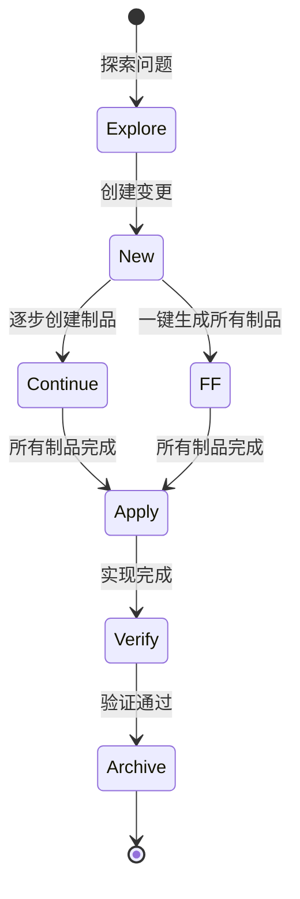
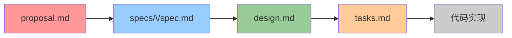

OpenSpec 是本项目采用的**制品驱动（Artifact-Driven）**变更管理工作流。它将每次功能开发、Bug 修复或架构调整抽象为一个 "Change"（变更），并通过结构化的制品文件（proposal、specs、design、tasks）记录从想法到落地的完整思考过程。对于刚接触该项目的开发者而言，OpenSpec 提供了一条清晰的开发路径——**先想清楚，再写代码**。

Sources: [openspec/config.yaml](openspec/config.yaml#L1-L21), [.amazonq/prompts/opsx-new.md](.amazonq/prompts/opsx-new.md#L1-L67)

## 核心概念

### 什么是 Change（变更）

在 OpenSpec 中，一个 Change 是 `openspec/changes/<name>/` 目录下的所有相关文件的集合。每个变更包含若干**制品（Artifacts）**，这些制品按依赖关系依次创建，形成一条完整的决策链。

### 什么是 Schema（工作流模式）

Schema 定义了制品的创建顺序和依赖关系。项目默认使用 `spec-driven` 模式，其制品序列为：

```
proposal → specs → design → tasks → apply
```

每个制品只有在其前置依赖完成后才能创建，这种设计确保了你不会跳过需求分析直接进入编码。

Sources: [.amazonq/prompts/opsx-continue.md](.amazonq/prompts/opsx-continue.md#L44-L56), [.amazonq/prompts/opsx-ff.md](.amazonq/prompts/opsx-ff.md#L30-L45)

## 变更生命周期

一个完整的变更从诞生到归档经历以下阶段：



### 各阶段命令速览

| 命令 | 功能 | 使用时机 |
|------|------|----------|
| `/opsx:explore` | 探索模式——思考问题、调查代码、澄清需求 | 开始任何变更之前 |
| `/opsx:new` | 创建新的变更目录，展示第一个制品模板 | 确定要做某件事后 |
| `/opsx:continue` | 创建下一个制品（每次一个） | 逐步推进变更时 |
| `/opsx:ff` | 快速前进——一次性生成所有制品 | 思路清晰、想直接开始时 |
| `/opsx:apply` | 根据 tasks.md 逐项实现代码 | 制品全部完成后 |
| `/opsx:verify` | 验证实现是否匹配制品描述 | 实现完成后、归档前 |
| `/opsx:archive` | 归档已完成变更到 archive 目录 | 验证通过后 |
| `/opsx:sync` | 将变更中的增量 specs 同步到主 specs | 归档前（可选） |
| `/opsx:onboard` | 引导式入门——完整走一遍流程 | 第一次使用时 |

Sources: [.amazonq/prompts/opsx-apply.md](.amazonq/prompts/opsx-apply.md#L1-L150), [.amazonq/prompts/opsx-archive.md](.amazonq/prompts/opsx-archive.md#L1-L155), [.amazonq/prompts/opsx-verify.md](.amazonq/prompts/opsx-verify.md#L1-L162)

## 制品体系详解

### spec-driven Schema 的四大制品



### 各制品职责

| 制品 | 文件路径 | 核心问题 | 内容说明 |
|------|----------|----------|----------|
| **proposal** | `proposal.md` | **为什么做？做什么？** | 变更的背景、目标、影响的 Capability、范围界定 |
| **specs** | `specs/<capability>/spec.md` | **具体需求是什么？** | 每个 Capability 的详细需求，使用 SHALL 描述，附带 Scenario 场景 |
| **design** | `design.md` | **怎么做？** | 技术方案、架构决策、组件设计、数据模型、错误处理策略 |
| **tasks** | `tasks.md` | **分几步实现？** | 带复选框的实现清单，每项标注文件路径、依赖、关联需求 |

Sources: [.amazonq/prompts/opsx-continue.md](.amazonq/prompts/opsx-continue.md#L58-L74), [.spec-workflow/templates/requirements-template.md](.spec-workflow/templates/requirements-template.md#L1-L51)

## 目录结构

```
openspec/
├── config.yaml              # OpenSpec 配置（定义默认 schema）
├── specs/                   # 主规格说明（所有变更同步后汇总于此）
│   └── <capability>/
│       └── spec.md          # 某个能力的完整需求规格
└── changes/
    ├── <active-change>/     # 进行中的变更
    │   ├── proposal.md      # 变更提案
    │   ├── design.md        # 设计文档
    │   ├── tasks.md         # 任务清单
    │   ├── specs/           # 增量规格（仅包含本次变更的需求差异）
    │   │   └── <capability>/
    │   │       └── spec.md  # 使用 ADDED/MODIFIED/REMOVED 标记
    │   └── .openspec.yaml   # 变更的元数据
    └── archive/             # 已归档变更（按日期命名）
        └── YYYY-MM-DD-<name>/
```

Sources: [.amazonq/prompts/opsx-sync.md](.amazonq/prompts/opsx-sync.md#L42-L64), [.amazonq/prompts/opsx-archive.md](.amazonq/prompts/opsx-archive.md#L58-L68)

## 完整工作流演练

以下以"添加用户头像上传功能"为例，演示完整的变更流程。

### 第一步：探索问题

```
/opsx:explore add user avatar upload
```

进入探索模式后，AI 会作为你的思考伙伴，一起调查现有代码、分析集成点、比较方案。此阶段**不会写任何代码**，只进行调查和讨论。

Sources: [.amazonq/prompts/opsx-explore.md](.amazonq/prompts/opsx-explore.md#L14-L22)

### 第二步：创建变更

```
/opsx:new add-user-avatar
```

系统会在 `openspec/changes/add-user-avatar/` 创建空目录结构，并展示第一个制品（proposal）的模板。此时变更处于"0/4 制品完成"状态。

Sources: [.amazonq/prompts/opsx-new.md](.amazonq/prompts/opsx-new.md#L28-L42)

### 第三步：逐步创建制品

**方式 A：逐步推进（推荐初学者）**

```
/opsx:continue add-user-avatar
```

每次执行 `/opsx:continue` 会创建**一个**制品。系统会自动判断哪个制品的依赖已满足，然后指导 AI 生成该制品的内容。

```
第 1 次 continue → 创建 proposal.md（1/4 完成，解锁 specs）
第 2 次 continue → 创建 specs/user-avatar/spec.md（2/4 完成，解锁 design）
第 3 次 continue → 创建 design.md（3/4 完成，解锁 tasks）
第 4 次 continue → 创建 tasks.md（4/4 完成，可以 apply）
```

**方式 B：快速前进**

```
/opsx:ff add-user-avatar
```

一次性生成 proposal → specs → design → tasks 所有制品。适合你已经想清楚所有细节的场景。

Sources: [.amazonq/prompts/opsx-continue.md](.amazonq/prompts/opsx-continue.md#L44-L75), [.amazonq/prompts/opsx-ff.md](.amazonq/prompts/opsx-ff.md#L20-L45)

### 第四步：实现代码

```
/opsx:apply add-user-avatar
```

AI 会读取 proposal、specs、design、tasks 作为上下文，然后按照 tasks.md 中的清单逐项实现。每完成一项，会自动将 `- [ ]` 标记为 `- [x]`。

```
## Implementing: add-user-avatar (schema: spec-driven)

Working on task 1/5: Create upload endpoint
[...实现代码...]
✓ Task complete

Working on task 2/5: Add frontend upload component
[...实现代码...]
✓ Task complete
```

如果遇到不确定的地方，AI 会暂停并询问你，而不是随意猜测。

Sources: [.amazonq/prompts/opsx-apply.md](.amazonq/prompts/opsx-apply.md#L50-L85)

### 第五步：验证实现

```
/opsx:verify add-user-avatar
```

验证从三个维度检查实现质量：

| 维度 | 检查内容 | 问题级别 |
|------|----------|----------|
| **Completeness（完整性）** | 所有 tasks 是否打勾、所有 specs 需求是否实现 | CRITICAL |
| **Correctness（正确性）** | 代码是否真正满足需求描述、场景覆盖是否充分 | WARNING |
| **Coherence（一致性）** | 实现是否遵循 design.md 中的架构决策、代码风格是否统一 | SUGGESTION |

验证报告会汇总所有发现的问题，并给出具体的修复建议。

Sources: [.amazonq/prompts/opsx-verify.md](.amazonq/prompts/opsx-verify.md#L30-L75)

### 第六步：归档变更

```
/opsx:archive add-user-avatar
```

归档前系统会检查：
1. 所有制品是否已完成
2. 所有 tasks 是否已标记完成
3. 增量 specs 是否需要同步到主 specs

如果存在未完成项，系统会发出警告但你仍可选择继续。归档后，变更目录被移动到 `openspec/changes/archive/YYYY-MM-DD-add-user-avatar/`。

Sources: [.amazonq/prompts/opsx-archive.md](.amazonq/prompts/opsx-archive.md#L20-L68)

## 增量 Spec 同步机制

这是 OpenSpec 中一个精妙的设计：变更中的 specs 使用**增量标记**而非完整重写。

```markdown
## ADDED Requirements

### Requirement: Avatar Upload
The system SHALL allow users to upload profile images.

#### Scenario: Successful upload
- **WHEN** user selects an image file
- **THEN** system uploads and updates profile

## MODIFIED Requirements

### Requirement: User Profile
#### Scenario: Profile display with avatar
- **WHEN** user views their profile
- **THEN** system displays the uploaded avatar
```

归档时执行 `/opsx:sync`，AI 会智能地将这些增量变更合并到 `openspec/specs/` 中的主规格文件，而不是粗暴覆盖。这意味着你可以只添加一个新场景，而保留主规格中已有的所有内容。

Sources: [.amazonq/prompts/opsx-sync.md](.amazonq/prompts/opsx-sync.md#L66-L132)

## 与 .spec-workflow 的关系

项目根目录下同时存在 `.spec-workflow/` 目录，这是一套较早的规格管理模板。两者的关系如下：

| 特性 | OpenSpec (`openspec/`) | Spec Workflow (`.spec-workflow/`) |
|------|------------------------|-----------------------------------|
| 核心驱动 | AI Agent 命令驱动（`/opsx:*`） | 模板驱动（手动填写） |
| 制品管理 | 自动依赖图、状态追踪 | 手动创建和维护 |
| 增量 Spec | 支持 ADDED/MODIFIED/REMOVED | 完整文档覆盖 |
| 归档 | 自动移动到 archive/ | 手动归档 |
| 验证 | 三维度自动验证 | 无内置验证 |

当前项目以 OpenSpec 为主要工作流，`.spec-workflow/templates/` 中的模板可作为参考，了解制品应该包含的内容结构。

Sources: [.spec-workflow/templates/design-template.md](.spec-workflow/templates/design-template.md#L1-L97), [.spec-workflow/templates/tasks-template.md](.spec-workflow/templates/tasks-template.md#L1-L140)

## 最佳实践

### 变更粒度控制

- **小步快跑**：每个变更应该能在 1-3 天内完成
- **单一职责**：一个变更只解决一个问题或实现一个功能
- **避免大变更**：如果预计超过一周工作量，考虑拆分为多个子变更

### 制品编写建议

- **proposal 要简洁**：控制在 500 字以内，清晰说明"为什么"
- **specs 要精确**：使用 SHALL/MUST 描述需求，每个需求至少一个 Scenario
- **design 要务实**：记录关键决策和权衡，不需要面面俱到
- **tasks 要可执行**：每项任务应该明确到可以独立完成的程度

### 常见陷阱

| 陷阱 | 表现 | 避免方法 |
|------|------|----------|
| 跳过 explore | 直接 new 变更导致方向错误 | 先用 explore 调查相关代码 |
| specs 过于抽象 | 无法验证是否实现 | 每个需求写具体的 Scenario |
| tasks 粒度过大 | 一项任务涵盖多个文件改动 | 拆分为每项只改 1-2 个文件 |
| 不及时 verify | 实现偏离设计但没人发现 | 每次 apply 完成后立即 verify |

## 入门路径

如果你是第一次使用 OpenSpec，建议按以下顺序学习：

1. **运行 `/opsx:onboard`** —— 引导式教程，带着你在真实代码库中走完一遍完整流程
2. **练习 `/opsx:explore`** —— 选一个小问题，熟悉探索模式
3. **尝试 `/opsx:new` + `/opsx:continue`** —— 体验逐步创建制品的过程
4. **用 `/opsx:ff` 提速** —— 思路清晰后使用快速模式
5. **习惯 `/opsx:verify`** —— 养成实现后验证的习惯

了解更多开发工作流相关内容，请参阅 [代码规范与 Git 工作流](44-dai-ma-gui-fan-yu-git-gong-zuo-liu)。