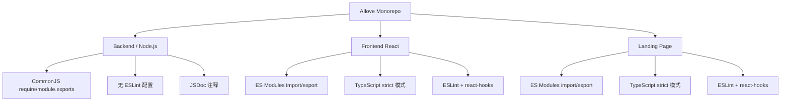
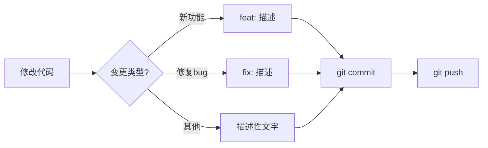
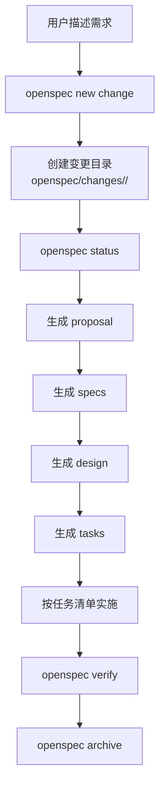

本文档梳理 AIlove 项目当前采用的代码规范体系与 Git 工作流程，帮助初学者理解项目中前端与后端各自的编码约定、提交信息格式、以及变更管理的完整流程。项目采用 **前后端分离的 monorepo 结构**，两套代码库各有独立的技术栈与规范工具。

## 项目代码规范概览

AIlove 项目分为三个主要代码区域：后端 Express 服务、前端 React 应用、以及 Landing Page 静态站点。它们各自采用不同的编码规范工具链。

| 代码区域 | 语言 | 模块系统 | 规范工具 | 配置文件 |
|---------|------|---------|---------|---------|
| [backend/](backend/) | JavaScript (Node.js) | CommonJS | 无独立 lint 工具 | 无 |
| [frontend-react/](frontend-react/) | TypeScript + React | ES Modules | ESLint (Flat Config) | [eslint.config.js](frontend-react/eslint.config.js#L1-L24) |
| [landingpage/](landingpage/) | TypeScript + React | ES Modules | ESLint (Flat Config) | [eslint.config.js](landingpage/eslint.config.js#L1-L24) |



Sources: [eslint.config.js](frontend-react/eslint.config.js#L1-L24), [eslint.config.js](landingpage/eslint.config.js#L1-L24), [server.js](backend/server.js#L1-L84)

## 后端代码规范（Express / JavaScript）

后端服务使用 Node.js 原生 CommonJS 模块系统，未配置独立的 lint 工具，代码规范主要依赖团队约定和代码审查。

### 模块导入与导出

后端统一使用 `require()` 导入模块、`module.exports` 导出模块。路由文件通过 `express.Router()` 创建独立的路由处理器，然后在 `server.js` 中统一挂载。

```javascript
// 导入示例 — backend/routes/auth.js
const express = require('express');
const bcrypt = require('bcryptjs');
const pool = require('../db');
const { updateRecommendationsForUser } = require('../services/recommendationService');

const router = express.Router();
// ... 路由定义 ...
module.exports = router;
```

Sources: [auth.js](backend/routes/auth.js#L1-L9), [server.js](backend/server.js#L38-L50)

### 错误响应格式

后端采用**统一的错误响应结构**，所有错误都以 `{ error: { code, message } }` 格式返回，错误码使用全大写下划线命名（如 `UNAUTHORIZED`、`INVALID_INPUT`、`INTERNAL_SERVER_ERROR`）。这种结构化的错误设计让前端可以方便地根据错误码做分类处理。

| 错误码 | 含义 | HTTP 状态码 | 示例场景 |
|--------|------|------------|---------|
| `INVALID_INPUT` | 请求参数不合法 | 400 | 缺少必填字段、密码长度不足 |
| `UNAUTHORIZED` | 未认证或凭证错误 | 401 | 无 token、密码不匹配 |
| `TOKEN_EXPIRED` | Token 已过期 | 401 | JWT 超过有效期 |
| `FORBIDDEN` | Token 无效 | 403 | Token 被篡改或签名错误 |
| `CONFLICT` | 资源冲突 | 409 | 邮箱或昵称已注册 |
| `INTERNAL_SERVER_ERROR` | 服务器内部错误 | 500 | 数据库异常、未捕获错误 |

Sources: [authenticateToken.js](backend/middleware/authenticateToken.js#L8-L19), [auth.js](backend/routes/auth.js#L14-L35)

### 中间件模式

后端中间件遵循 Express 标准模式，按顺序串联：CORS → JSON 解析 → API 日志 → 静态文件 → 路由 → 错误处理。**错误处理中间件必须放在所有路由之后**，这是 Express 的关键约定。

```javascript
// server.js 中间件注册顺序
app.use(cors());
app.use(express.json());
app.use(express.urlencoded({ extended: true }));
app.use('/api', apiLogger);        // API 请求日志
app.use('/uploads', express.static(...));
// ... 路由注册 ...
app.use(errorLogger);              // 必须在所有路由之后
```

Sources: [server.js](backend/server.js#L17-L57)

### 日志服务

后端使用 Winston 日志库实现**结构化日志**，支持日志轮转（按天拆分文件）、多级别日志（error/app/api 分离存储）、慢请求告警（>1 秒自动记录 warn 级别）。日志保留策略：错误日志 14 天、应用日志 30 天、API 日志 7 天。

Sources: [logger.js](backend/services/logger.js#L1-L227)

## 前端代码规范（TypeScript / React）

前端项目采用严格的技术规范体系，通过 TypeScript 编译时检查和 ESLint 静态分析双重保障代码质量。

### TypeScript 严格模式

前端启用 TypeScript 的 `strict` 模式，包含以下关键约束：

| 配置项 | 作用 | 示例影响 |
|--------|------|---------|
| `strict: true` | 启用所有严格检查 | 禁止隐式 any 类型 |
| `noUnusedLocals: true` | 禁止未使用的局部变量 | 未使用的 import 会报错 |
| `noUnusedParameters: true` | 禁止未使用的函数参数 | 多余的参数名会报错 |
| `noFallthroughCasesInSwitch: true` | 禁止 switch 穿透 | 必须显式使用 break/return |
| `verbatimModuleSyntax: true` | 严格 import 语法 | import type 与值导入必须分开 |

Sources: [tsconfig.app.json](frontend-react/tsconfig.app.json#L1-L29)

### ESLint 规则集

前后端前端均使用 ESLint Flat Config 格式（`eslint.config.js`），启用以下规则集：

- **`js.configs.recommended`** — JavaScript 基础推荐规则
- **`tseslint.configs.recommended`** — TypeScript 推荐规则
- **`reactHooks.configs.flat.recommended`** — React Hooks 使用规范（如 useEffect 依赖数组必须完整声明）
- **`reactRefresh.configs.vite`** — Vite 热更新兼容规则

```javascript
// 前端 ESLint 配置
export default defineConfig([
  globalIgnores(['dist']),
  {
    files: ['**/*.{ts,tsx}'],
    extends: [
      js.configs.recommended,
      tseslint.configs.recommended,
      reactHooks.configs.flat.recommended,
      reactRefresh.configs.vite,
    ],
    languageOptions: {
      ecmaVersion: 2020,
      globals: globals.browser,
    },
  },
])
```

Sources: [eslint.config.js](frontend-react/eslint.config.js#L1-L24)

### 组件与路由规范

前端组件遵循**函数组件 + TypeScript 类型注解**模式。路由使用 `react-router-dom` 的声明式路由定义，通过 `ProtectedRoute` 包装需要认证的路径。

```typescript
// 受保护路由模式 — App.tsx
function ProtectedRoute({ children }: { children: React.ReactNode }) {
  const { token, isLoading } = useAuth();
  if (isLoading) return <div>加载中...</div>;
  if (!token) return <Navigate to="/login" replace />;
  return <>{children}</>;
}
```

Sources: [App.tsx](frontend-react/src/App.tsx#L15-L26)

### 配置管理规范

API 地址、端点路径、二维码映射等常量统一提取到 `config.ts` 文件中，使用 `as const` 确保编译期类型安全。这避免了魔法字符串散落在组件代码中。

Sources: [config.ts](frontend-react/src/config.ts#L1-L53)

## Git 提交规范

### Conventional Commits 约定

项目正在逐步采用 **Conventional Commits** 规范，提交信息格式为：`<type>: <description>`。已使用的类型包括：

| 类型 | 含义 | 示例 |
|------|------|------|
| `feat` | 新功能 | `feat: Add Redis caching service` |
| `fix` | 修复 bug | `fix: Correct QR code mapping` |
| 无前缀 | 常规提交 | `Add screenshot images and update MapPage` |



Sources: [git log](.git#L1-L25)

### 分支策略

从提交历史可见项目使用 **单主分支 (main) 模式**，直接推送变更到主分支。对于初学者，建议养成以下习惯：

1. **功能开发**：从 main 创建功能分支 `feature/功能名称`
2. **Bug 修复**：从 main 创建修复分支 `fix/问题描述`
3. **合并方式**：开发完成后通过 Pull Request 合并回 main

## OpenSpec 变更管理工作流

项目引入了 **OpenSpec** 工具进行结构化变更管理。这是 AI 辅助开发的实验性工作流，通过规范化的产物（proposal → specs → design → tasks）驱动功能开发。

### 变更管理流程



### 工作流产物说明

| 产物 | 作用 | 依赖关系 |
|------|------|---------|
| **Proposal** | 描述变更的目标与范围 | 第一个产物，无依赖 |
| **Specs** | 定义功能的具体规格 | 依赖 Proposal |
| **Design** | 技术实现方案 | 依赖 Specs |
| **Tasks** | 拆分的开发任务清单 | 依赖 Design |

### 常用命令速查

| 命令 | 作用 |
|------|------|
| `openspec new change "<name>"` | 创建新的变更（名称使用 kebab-case） |
| `openspec status --change "<name>"` | 查看当前变更的产物完成状态 |
| `openspec instructions <artifact> --change "<name>"` | 获取生成某个产物的指引 |
| `openspec verify --change "<name>"` | 验证变更是否完成 |
| `openspec archive --change "<name>"` | 归档已完成的变更 |

Sources: [SKILL.md](.amazonq/skills/openspec-new-change/SKILL.md#L1-L75), [config.yaml](openspec/config.yaml#L1-L21), [tasks-template.md](.spec-workflow/templates/tasks-template.md#L1-L140)

## Git 忽略文件规范

项目的 `.gitignore` 定义了全面的忽略规则，确保只有源代码被提交到版本库中。以下是关键的忽略类别：

| 类别 | 忽略模式 | 说明 |
|------|---------|------|
| 依赖目录 | `node_modules/` | 各子项目的依赖包 |
| 构建输出 | `dist/`, `build/` | 编译后的产物 |
| 环境变量 | `.env`, `.env.local`, `.env.production` | 敏感配置信息 |
| 日志文件 | `logs/`, `*.log` | 运行时日志 |
| IDE 配置 | `.vscode/`, `.idea/` | 编辑器本地配置 |
| 上传文件 | `backend/uploads/`（保留 `.gitkeep`） | 用户上传的资源 |
| 数据库备份 | `*.sql.backup`, `*.sql.bak` | 数据库导出文件 |

Sources: [.gitignore](.gitignore#L1-L270)

## 开发者入门清单

作为初学者，参与本项目时应遵循以下步骤：

1. **配置 Git 用户信息**：`git config user.name "你的名字"` 和 `git config user.email "你的邮箱"`
2. **拉取最新代码**：`git pull origin main`
3. **创建功能分支**：`git checkout -b feature/你的功能名`
4. **开发过程中**：
   - 后端代码：确保使用 `require/module.exports` 格式，遵循统一的错误响应结构
   - 前端代码：确保通过 `npm run lint` 无报错，TypeScript 编译无错误
5. **提交代码**：使用 `feat:` 或 `fix:` 前缀描述你的变更
6. **推送并合并**：`git push origin 你的分支名`，然后通过 GitHub 创建 Pull Request

## 下一步阅读

根据你的开发角色，建议继续阅读以下文档：

- **后端开发者**：[Express 路由设计](22-express-lu-you-she-ji) → [JWT 认证与授权中间件](23-jwt-ren-zheng-yu-shou-quan-zhong-jian-jian)
- **前端开发者**：[React 项目结构](12-react-xiang-mu-jie-gou) → [路由与权限控制](13-lu-you-yu-quan-xian-kong-zhi)
- **了解变更管理**：[OpenSpec 变更管理](43-openspec-bian-geng-guan-li)
- **了解部署流程**：[Docker 容器化部署](39-docker-rong-qi-hua-bu-shu)