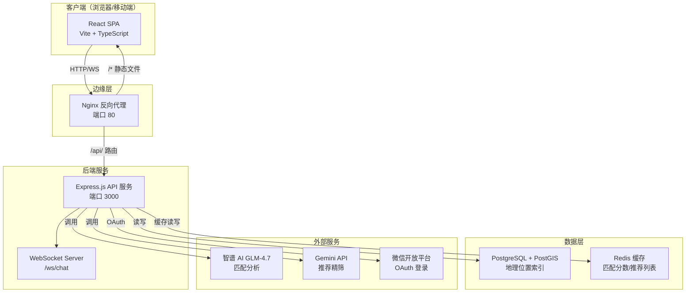
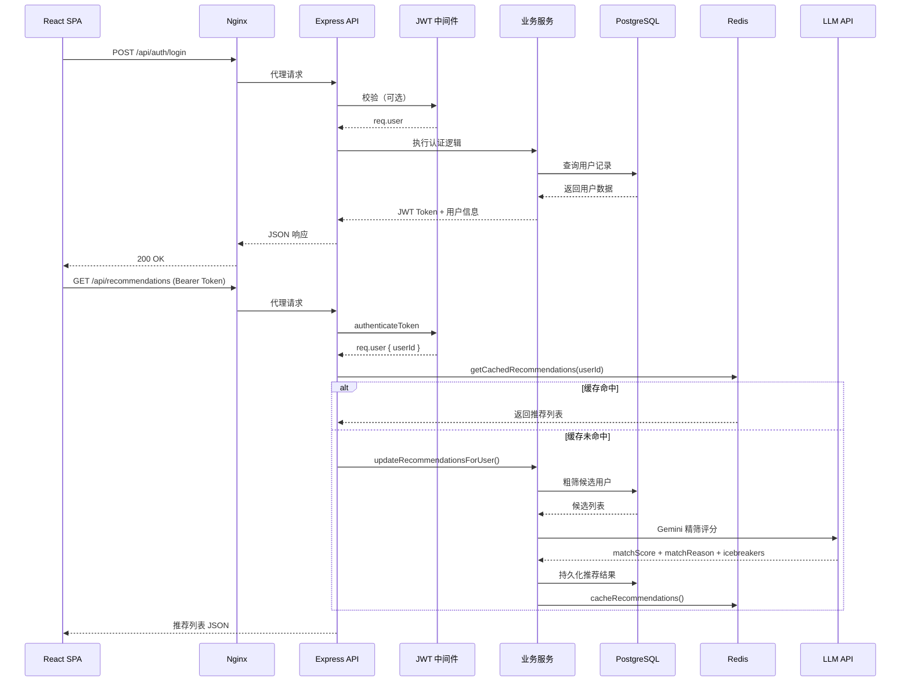
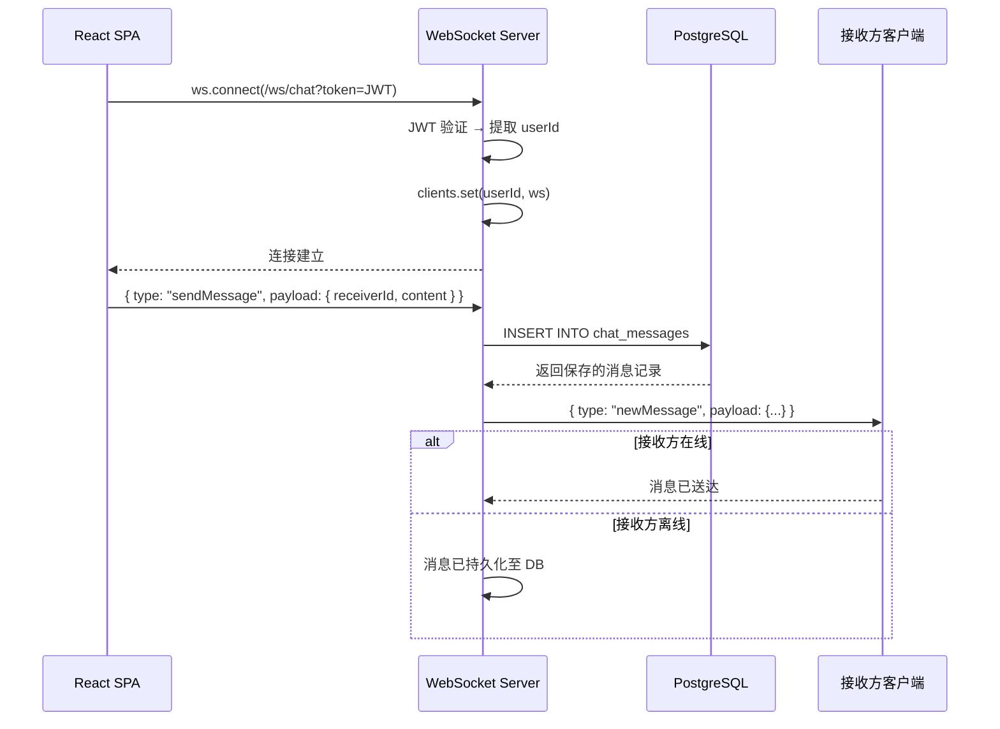
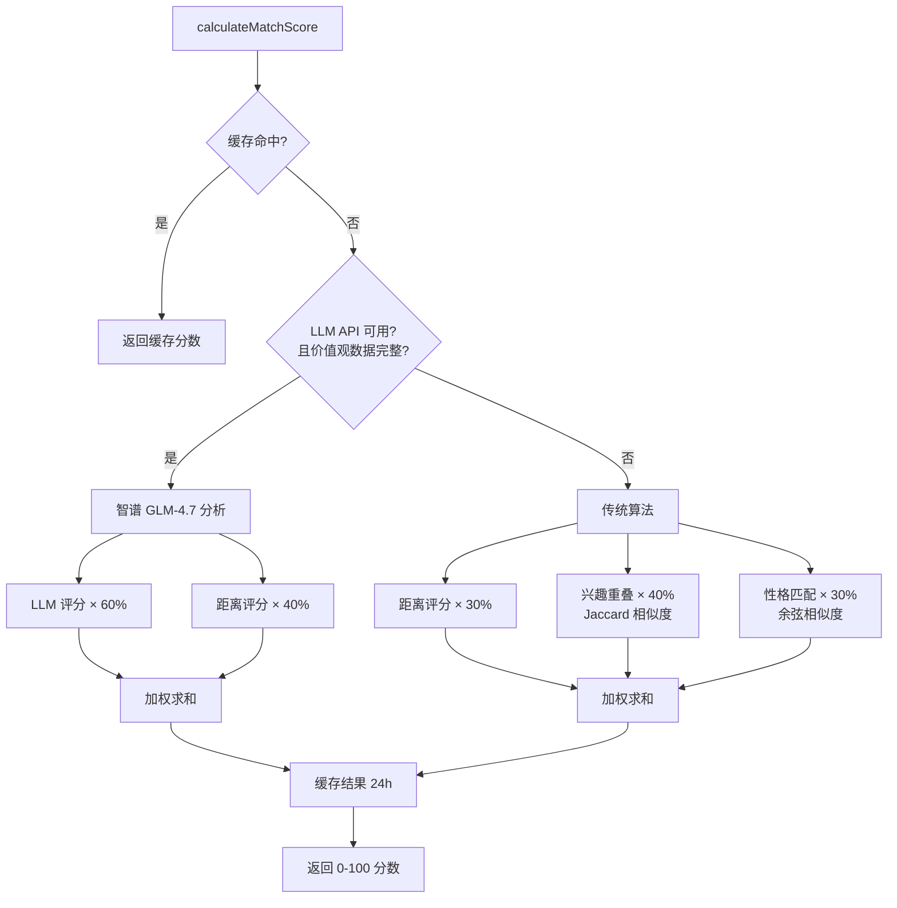
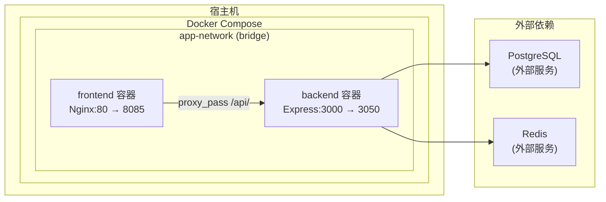

本文档描述 AI 月老（AI Yue Lao）系统的整体技术架构，涵盖前端 React 应用、后端 Express API 服务、PostgreSQL + PostGIS 数据库、Redis 缓存层、WebSocket 实时通信以及 Docker 容器化部署。系统采用 **客户端-服务端（Client-Server）** 架构，前端负责 UI 渲染与用户交互，后端提供 RESTful API 和 WebSocket 双通道通信，数据库承载业务数据与地理位置索引，Redis 作为匹配分数的热数据缓存。

## 架构全景图

系统由五大核心组件构成，通过 Docker Compose 编排在同一个虚拟网络中协同工作：



Sources: [server.js](backend/server.js#L1-L84), [docker-compose.yml](docker-compose.yml#L1-L40), [nginx.conf](nginx.conf#L1-L31)

## 分层架构详解

系统采用经典的 **三层架构（Three-Tier Architecture）**，各层职责清晰、技术选型明确。

### 表现层（Presentation Layer）

前端为基于 **React 19 + TypeScript + Vite** 构建的单页应用（SPA），以 GameBoy 复古风格为设计基调，通过 `react-router-dom` 实现客户端路由。核心结构如下：

| 模块 | 路径 | 职责 |
|------|------|------|
| 应用入口 | `src/App.tsx` | 路由定义、布局容器、`AuthProvider` 包裹 |
| 认证上下文 | `src/contexts/AuthContext.tsx` | JWT 状态管理、登录/注册/微信登录、自动续期验证 |
| API 服务层 | `src/services/api.ts` | Axios 封装、请求拦截器注入 Bearer Token、401 自动跳转 |
| 配置中心 | `src/config.ts` | API Base URL、WebSocket URL、端点枚举、收款码映射 |
| 页面组件 | `src/pages/` | 首页、地图、聊天、社区、资料、精灵球 6 个主页面 |
| UI 组件 | `src/components/` | `TabBar`、`GameboyButton`、`HpExpBar`、`MusicPlayer` |

前端通过 `ProtectedRoute` 守卫实现路由级权限控制：未认证用户访问 `/`、`/map`、`/chat` 等页面时自动重定向至 `/login`。

Sources: [App.tsx](frontend-react/src/App.tsx#L1-L123), [AuthContext.tsx](frontend-react/src/contexts/AuthContext.tsx#L1-L135), [api.ts](frontend-react/src/services/api.ts#L1-L36), [config.ts](frontend-react/src/config.ts#L1-L53)

### 业务逻辑层（Application Layer）

后端基于 **Express.js** 构建，使用 `http` 模块创建统一的 HTTP + WebSocket 服务器。中间件管道按以下顺序组装：

```
CORS → express.json() → express.urlencoded() → API 日志中间件 → 静态文件路由 → 业务路由 → 错误处理中间件
```

**路由模块清单**：

| 路由前缀 | 文件 | 核心功能 |
|----------|------|----------|
| `/api/auth` | `routes/auth.js` | 邮箱注册/登录、JWT 签发 |
| `/api/auth` | `routes/wechatAuth.js` | 微信 OAuth 登录集成 |
| `/api/users` | `routes/users.js` | 用户资料 CRUD、头像管理 |
| `/api/recommendations` | `routes/recommendations.js` | 获取推荐列表、触发 AI 重新计算 |
| `/api/chat` | `routes/chat.js` | 聊天历史查询、REST 方式发送消息 |
| `/api/map` | `routes/map.js` | 附近用户查询、位置更新（PostGIS） |
| `/api/tasks` | `routes/tasks.js` | 约会任务发起与状态管理 |
| `/api/spots` | `routes/spots.js` | 约会地点 CRUD |
| `/api/rewards` | `routes/rewards.js` | 积分奖励、签到系统 |
| `/api/community` | `routes/community.js` | 照片墙上传、解锁、点赞 |
| `/api/pokeball` | `routes/pokeball.js` | 精灵球积分余额、充值确认、消费记录 |
| `/api/users` | `routes/matches.js` | 用户匹配记录查询 |

**服务层（Services）** 是后端的独立逻辑单元，与路由解耦：

| 服务 | 文件 | 职责 |
|------|------|------|
| WebSocket 服务 | `services/websocketService.js` | 连接管理（Map 存储）、JWT 鉴权、实时消息路由、数据库持久化 |
| 匹配算法 | `services/matchingAlgorithm.js` | LLM 智能评分（智谱 GLM-4.7）+ 传统算法（距离/兴趣/性格）双模式 |
| 推荐服务 | `services/recommendationService.js` | 粗筛（性别/年龄/距离/标签）→ 精筛（Gemini API）→ 存储结果 |
| 缓存服务 | `services/cacheService.js` | Redis 连接管理、匹配分数缓存、推荐列表缓存、失效策略 |
| Redis 客户端 | `services/redisClient.js` | 独立 Redis 实例初始化 |
| 日志服务 | `services/logger.js` | API 请求日志、错误日志、结构化输出 |
| 精灵球映射 | `services/pokemonMapper.js` | 宝可梦数据映射逻辑 |

Sources: [server.js](backend/server.js#L26-L55), [authenticateToken.js](backend/middleware/authenticateToken.js#L1-L26), [websocketService.js](backend/services/websocketService.js#L1-L144), [matchingAlgorithm.js](backend/services/matchingAlgorithm.js#L1-L200), [recommendationService.js](backend/services/recommendationService.js#L1-L200), [cacheService.js](backend/services/cacheService.js#L1-L200)

### 数据层（Data Layer）

数据层由 **PostgreSQL（主数据库）** 和 **Redis（缓存层）** 构成，两者职责互补。

**PostgreSQL 数据模型概览**：

| 表名 | 主键 | 核心字段 | 关联关系 |
|------|------|----------|----------|
| `users` | `user_id UUID` | 基本信息、偏好设置、`location` (PostGIS GEOGRAPHY)、`tags TEXT[]`、`q_and_a JSONB` | 一对多关联照片、推荐、任务、消息 |
| `user_photos` | `photo_id UUID` | `url`、`is_avatar`、`is_unlocked` | 外键 → `users(user_id)` |
| `dating_spots` | `spot_id UUID` | `location GEOGRAPHY`、`type`、`reward_points` | 一对多关联任务 |
| `dating_tasks` | `task_id UUID` | `initiator_id`、`receiver_id`、`spot_id`、`status` | 外键 → `users` ×2 + `dating_spots` |
| `recommendations` | `recommendation_id UUID` | `match_score INT`、`match_reason TEXT`、`icebreakers JSONB` | 复合唯一约束 `(recommending_user_id, recommended_user_id)` |
| `chat_messages` | `message_id UUID` | `sender_id`、`receiver_id`、`content`、`status` | 外键 → `users(user_id)` ×2 |

PostgreSQL 启用了 **PostGIS 扩展**，为 `users.location` 和 `dating_spots.location` 字段建立 GiST 空间索引，支持高效的地理邻域查询。`users.location_geohash` 字段提供 Geohash 前缀匹配的辅助索引方案。

**Redis 缓存策略**：

| 缓存键模式 | 数据结构 | TTL | 失效条件 |
|-----------|----------|-----|----------|
| `match_score:{uidA}:{uidB}` | String (JSON) | 24 小时 | 用户资料更新时通过 `invalidateUserMatchScores()` 批量删除 |
| `recommendations:{userId}` | String (JSON) | 24 小时 | 推荐列表重新计算时覆盖 |

缓存键设计采用 **排序后的用户 ID** 作为后缀，确保 `match_score:A:B` 与 `match_score:B:A` 指向同一缓存条目，避免重复计算。

Sources: [schema.sql](backend/schema.sql#L1-L167), [cacheService.js](backend/services/cacheService.js#L40-L105), [redisClient.js](backend/services/redisClient.js#L1-L30)

## 请求流与通信协议

系统支持 **REST + WebSocket** 双通道通信，两种协议在不同场景下各司其职。

### REST API 请求流



Sources: [server.js](backend/server.js#L26-L55), [api.ts](frontend-react/src/services/api.ts#L1-L36), [recommendationService.js](backend/services/recommendationService.js#L1-L200)

### WebSocket 实时聊天流



WebSocket 路径固定为 `/ws/chat`，认证方式通过 URL Query 参数传递 JWT Token（`?token=xxx`）。服务器内部使用 `Map<userId, WebSocket>` 维护在线用户映射。REST API 端点也可通过 `app.set('sendMessageToUser', ...)` 间接触发 WebSocket 推送。

Sources: [websocketService.js](backend/services/websocketService.js#L1-L144), [server.js](backend/server.js#L58-L63)

## 匹配引擎架构

系统内置 **双模式匹配引擎**，支持 LLM 智能匹配与传统算法自动降级。



**推荐服务** 采用两阶段漏斗模型：粗筛阶段基于性别偏好、年龄范围、地理半径（50km）、共同标签进行 SQL + 应用层过滤，将候选集缩减至 200 人以内；精筛阶段调用 Gemini API 为每个候选人生成 `matchScore`、`matchReason` 和 `icebreakers` 数组，最终写入 `recommendations` 表并缓存。

Sources: [matchingAlgorithm.js](backend/services/matchingAlgorithm.js#L1-L200), [recommendationService.js](backend/services/recommendationService.js#L1-L200)

## 部署架构

系统通过 **Docker Compose** 实现一键编排，包含两个服务和一个共享网络：



**服务配置要点**：

| 服务 | 构建上下文 | 端口映射 | 依赖 | 卷挂载 |
|------|-----------|----------|------|--------|
| `backend` | `./backend` | 宿主 3050 → 容器 3000 | 无（PostgreSQL/Redis 在外部） | 代码热重载、node_modules 隔离 |
| `frontend` | `./frontend` | 宿主 8085 → 容器 80 | `depends_on: backend` | `nginx.conf` 只读挂载 |

前端容器内嵌 Nginx，通过 `nginx.conf` 中的 `proxy_pass http://backend:3000/api/` 将 `/api/` 前缀的请求代理至后端容器。静态文件（`/uploads`、`/music`、`/pictures`）由后端直接提供。后端容器通过 `env_file: ./backend/.env` 加载环境变量，包括 `DATABASE_URL`、`JWT_SECRET`、`REDIS_URL`、OpenAI/Gemini API 密钥等。

Sources: [docker-compose.yml](docker-compose.yml#L1-L40), [nginx.conf](nginx.conf#L1-L31), [db.js](backend/db.js#L1-L29)

## 技术栈总览

| 层级 | 技术 | 版本/说明 |
|------|------|-----------|
| 前端框架 | React + TypeScript + Vite | SPA 架构，路由守卫，上下文状态管理 |
| 样式方案 | TailwindCSS | GameBoy 复古配色体系 |
| 后端框架 | Express.js + Node.js | RESTful API + HTTP Server |
| 实时通信 | WebSocket (ws 库) | `/ws/chat` 路径，JWT Query 认证 |
| 主数据库 | PostgreSQL + PostGIS | UUID 主键，GEOGRAPHY 空间索引，JSONB 灵活字段 |
| 缓存 | Redis | 匹配分数缓存，推荐列表缓存，24h TTL |
| AI 服务 | 智谱 GLM-4.7 / Gemini API | 匹配评分、推荐理由、破冰话题生成 |
| 认证 | JWT (jsonwebtoken) | Bearer Token + 过期处理 |
| 容器化 | Docker + Docker Compose | 双服务编排，bridge 网络 |
| 反向代理 | Nginx | SPA 路由回退 + API 代理 |

Sources: [package.json](backend/package.json#L1-L50), [package.json](frontend-react/package.json#L1-L50), [docker-compose.yml](docker-compose.yml#L1-L40)

## 下一步阅读建议

了解整体架构后，建议按以下路径深入各子系统：

1. **[前后端通信协议](8-qian-hou-duan-tong-xin-xie-yi)** — 详细理解 REST API 规范与 WebSocket 消息格式
2. **[WebSocket 实时通信](9-websocket-shi-shi-tong-xin)** — 深入聊天实时推送机制
3. **[Redis 缓存策略](10-redis-huan-cun-ce-lue)** — 了解缓存键设计、失效策略与降级方案
4. **[匹配算法架构](30-pi-pei-suan-fa-jia-gou)** — 深入 AI 匹配与传统算法的实现细节
5. **[数据库模式概览](34-shu-ju-ku-mo-shi-gai-lan)** — 完整理解 PostgreSQL 数据模型
6. **[Docker Compose 编排](40-docker-compose-bian-pai)** — 掌握容器化部署配置