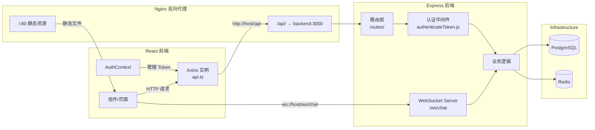
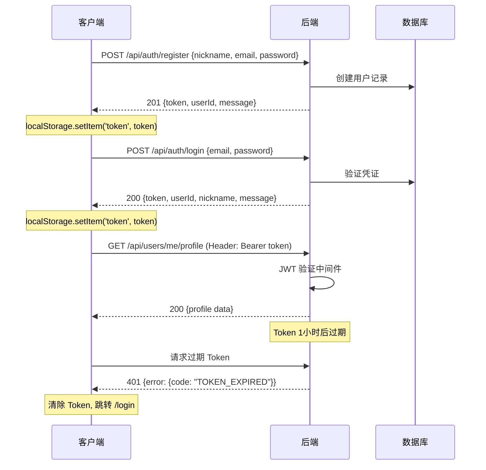
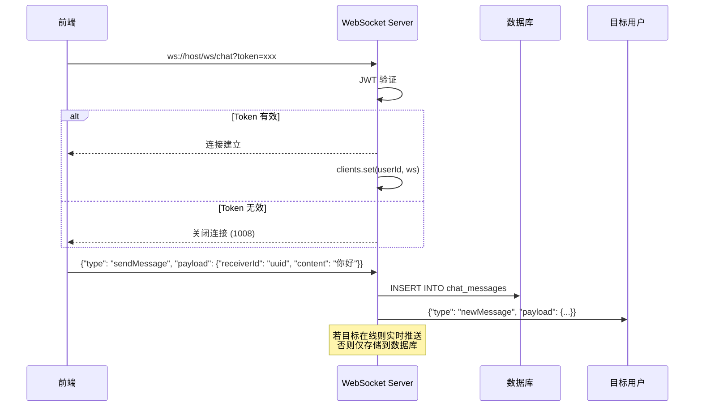
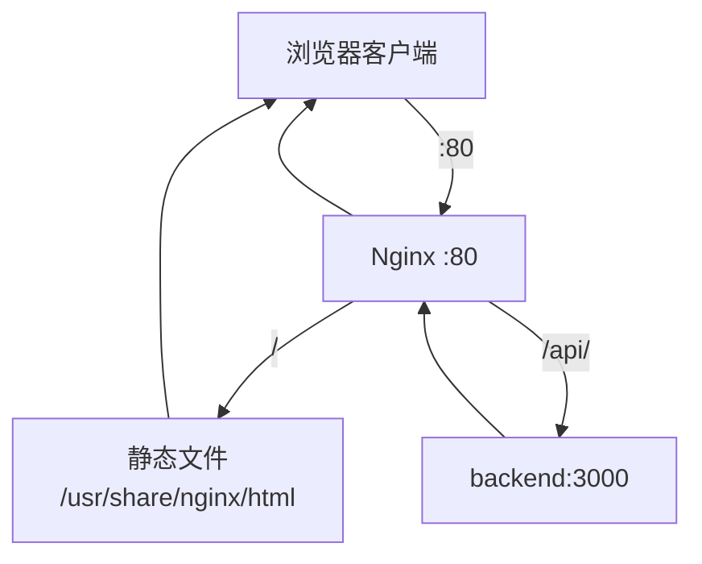

本文档描述 AI 月老项目中前端 React 应用与后端 Express 服务之间的通信机制，涵盖 REST API 调用规范、JWT 认证流程、WebSocket 实时消息通道、文件上传策略以及错误处理约定。理解本协议是进行前后端联调、新功能开发和问题排查的基础。

## 通信架构概览

系统采用 **混合通信模式**：常规 CRUD 操作通过 RESTful API 完成，实时聊天和推送消息则通过 WebSocket 长连接实现。前端所有请求统一经由 Axios 实例发出，该实例配置了自动注入 Token 的请求拦截器和 401 自动跳转的响应拦截器。



Sources: [api.ts](frontend-react/src/services/api.ts#L1-L36), [server.js](backend/server.js#L1-L84), [nginx.conf](nginx.conf#L1-L31)

## 基础通信配置

### 端点地址映射

前端通过 `config.ts` 集中管理所有后端地址。开发环境中直接指向后端服务器 IP，生产环境中应通过 Nginx 代理统一入口。

| 配置项 | 默认值 | 用途 |
|--------|--------|------|
| `API_BASE_URL` | `http://192.168.0.14:3052/api` | REST API 基础路径 |
| `UPLOAD_BASE_URL` | `http://192.168.0.14:3052/uploads` | 上传文件访问前缀 |
| `WS_URL` | `ws://192.168.0.14:3052/ws/chat` | WebSocket 聊天连接 |
| `MUSIC_BASE_URL` | `http://192.168.0.14:3052/music` | 静态音乐资源 |
| `PICTURES_BASE_URL` | `http://192.168.0.14:3052/pictures` | 静态图片资源 |

Sources: [config.ts](frontend-react/src/config.ts#L1-L10)

### API 路由注册表

后端通过 Express Router 模块化注册路由，所有 API 端点均以 `/api` 为前缀。

| 路由前缀 | 对应模块 | 认证要求 | 功能域 |
|----------|----------|----------|--------|
| `/api/auth` | auth.js, wechatAuth.js | 部分公开 | 注册/登录/微信认证 |
| `/api/users` | users.js, matches.js | 需要 Token | 用户资料/匹配记录 |
| `/api/recommendations` | recommendations.js | 需要 Token | 推荐列表/匹配计算 |
| `/api/chat` | chat.js | 需要 Token | 聊天历史/发送消息 |
| `/api/map` | map.js | 需要 Token | 地理位置/附近用户 |
| `/api/community` | community.js | 部分公开 | 照片墙/上传/点赞 |
| `/api/pokeball` | pokeball.js | 需要 Token | 精灵球积分系统 |
| `/api/tasks` | tasks.js | 需要 Token | 约会任务 |
| `/api/spots` | spots.js | 部分公开 | 约会地点 |
| `/api/rewards` | rewards.js | 需要 Token | 积分奖励 |

Sources: [server.js](backend/server.js#L37-L51), [config.ts](frontend-react/src/config.ts#L13-L48)

## 认证与授权协议

### JWT Token 生命周期

系统采用 **Bearer Token** 认证方案。Token 由后端签发，前端存储于 `localStorage`，每次请求自动附加到 `Authorization` 请求头。



Sources: [auth.js](backend/routes/auth.js#L1-L119), [authenticateToken.js](backend/middleware/authenticateToken.js#L1-L26), [AuthContext.tsx](frontend-react/src/contexts/AuthContext.tsx#L36-L52)

### Token 错误码体系

| HTTP 状态码 | 错误码 | 触发场景 | 前端处理 |
|-------------|--------|----------|----------|
| 401 | `UNAUTHORIZED` | 未提供 Token | 自动跳转登录页 |
| 401 | `TOKEN_EXPIRED` | Token 已过期 | 自动跳转登录页 |
| 403 | `FORBIDDEN` | Token 无效/伪造 | 自动跳转登录页 |
| 401 | `UNAUTHORIZED` | 凭证错误（登录时） | 显示错误提示 |

Axios 响应拦截器统一处理 401 状态：清除本地存储的 `token` 和 `userData`，并强制重定向至 `/login`。

Sources: [api.ts](frontend-react/src/services/api.ts#L21-L31), [authenticateToken.js](backend/middleware/authenticateToken.js#L8-L20)

## REST API 通信规范

### 请求格式约定

**JSON 请求体**（默认 Content-Type）：

```
POST /api/auth/login
Content-Type: application/json
Authorization: Bearer <token>

{
  "email": "user@example.com",
  "password": "securePassword123"
}
```

**FormData 请求体**（文件上传）：

```
POST /api/community/upload-photo
Content-Type: multipart/form-data
Authorization: Bearer <token>

Form Data:
  photo: <File>
  message: "我们的纪念日"
```

Sources: [api.ts](frontend-react/src/services/api.ts#L4-L8), [community.js](backend/routes/community.js#L14-L34)

### 响应格式约定

**成功响应**（2xx）：返回业务数据，无统一包装层。

```json
// GET /api/users/me/profile
{
  "user_id": "uuid-string",
  "nickname": "用户名",
  "email": "user@example.com",
  "gender": "male",
  "bio": "个人简介",
  "photos": [...]
}

// POST /api/auth/register → 201
{
  "userId": "uuid-string",
  "token": "jwt-token-string",
  "message": "User registered successfully"
}
```

**错误响应**（4xx/5xx）：统一使用 `error` 对象包装，包含 `code` 和 `message` 字段。

```json
{
  "error": {
    "code": "INVALID_INPUT",
    "message": "Nickname, email, and password are required."
  }
}
```

Sources: [auth.js](backend/routes/auth.js#L15-L16), [auth.js](backend/routes/auth.js#L114-L117), [chat.js](backend/routes/chat.js#L120-L123)

### 错误码分类

| 错误码分类 | 错误码值 | 语义 | 示例场景 |
|-----------|----------|------|----------|
| 客户端错误 | `INVALID_INPUT` | 参数校验失败 | 密码长度不足、缺少必填字段 |
| 认证错误 | `UNAUTHORIZED` | 未认证或凭证错误 | Token 缺失、密码错误 |
| 授权错误 | `FORBIDDEN` | Token 无效 | Token 被篡改 |
| 资源冲突 | `CONFLICT` | 唯一约束冲突 | 邮箱/昵称已注册 |
| 资源缺失 | `NOT_FOUND` | 目标不存在 | 用户不存在、聊天对象不存在 |
| 服务端错误 | `INTERNAL_SERVER_ERROR` | 内部异常 | 数据库查询失败 |

Sources: [auth.js](backend/routes/auth.js#L15-L17), [users.js](backend/routes/users.js#L56-L57), [recommendations.js](backend/routes/recommendations.js#L41-L46)

### 分页与过滤

列表接口采用 **基于参数的分页** 模式：

| 参数 | 类型 | 默认值 | 说明 |
|------|------|--------|------|
| `page` | number | 1 | 页码 |
| `pageSize` | number | 10 | 每页数量 |
| `limit` | number | 50 | 最大返回条数 |
| `beforeTimestamp` | ISO 8601 | — | 游标分页（聊天记录） |

```json
// GET /api/community/photos?page=1&pageSize=10
{
  "photos": [...],
  "page": 1,
  "pageSize": 10,
  "hasMore": true
}
```

Sources: [community.js](backend/routes/community.js#L40-L41), [chat.js](backend/routes/chat.js#L11-L12)

## WebSocket 实时通信

### 连接建立流程

WebSocket 连接在 HTTP 服务器同一端口上运行，路径为 `/ws/chat`。连接时必须通过查询参数传递 JWT Token 进行身份认证。



Sources: [websocketService.js](backend/services/websocketService.js#L12-L35), [websocketService.js](backend/services/websocketService.js#L37-L79)

### 消息协议格式

**客户端 → 服务端**：

| 字段 | 类型 | 必填 | 说明 |
|------|------|------|------|
| `type` | string | 是 | 消息类型标识 |
| `payload` | object | 是 | 业务数据 |

支持的 `type` 值：

| type | payload 结构 | 行为 |
|------|-------------|------|
| `sendMessage` | `{ receiverId: string, content: string }` | 发送聊天消息并持久化 |
| `markAsRead` | `{ messageIdToMark: string }` | 标记消息已读（预留） |

**服务端 → 客户端**：

| type | payload 结构 | 触发时机 |
|------|-------------|----------|
| `newMessage` | `{ messageId, senderId, receiverId, content, timestamp, status }` | 收到新消息时推送 |
| `error` | `{ message: string }` | 处理异常时返回 |

Sources: [websocketService.js](backend/services/websocketService.js#L39-L76)

### REST 与 WebSocket 的混合模式

聊天消息支持 **双通道发送**：

1. **REST API 通道**（`POST /api/chat/:chatPartnerId/messages`）：适用于离线消息补发、历史记录查询、网络不稳定时的重试场景。
2. **WebSocket 通道**：适用于双方均在线时的实时推送。

当通过 REST API 发送消息时，后端会尝试通过 WebSocket 向在线的接收方推送通知，形成互补机制。

Sources: [chat.js](backend/routes/chat.js#L69-L88), [websocketService.js](backend/services/websocketService.js#L125-L134)

## 文件上传协议

### 上传端点

| 端点 | 文件大小限制 | 字段名 | 支持格式 | 存储位置 |
|------|-------------|--------|----------|----------|
| `/api/users/me/avatar` | 5 MB | `photos`（最多 5 张） | jpg, jpeg, png, gif | `backend/uploads/` |
| `/api/community/upload-photo` | 10 MB | `photo`（单张） | jpg, jpeg, png, gif | `backend/uploads/community/` |

### 文件命名策略

后端采用 **时间戳 + 随机数 + 原始扩展名** 的策略生成唯一文件名，避免文件名冲突。

```
1709234567890-123456789.jpg
couple-1709234567890-987654321.png
```

上传成功后返回文件 URL，前端通过 `UPLOAD_BASE_URL` 拼接完整访问路径。

Sources: [users.js](backend/routes/users.js#L22-L37), [community.js](backend/routes/community.js#L14-L30)

## 前端 API 客户端实现

### Axios 实例配置

前端使用 Axios 创建预配置的 API 客户端，具备以下能力：

- **基础 URL**：从 `config.ts` 读取，支持环境切换
- **请求头**：自动设置 `Content-Type: application/json`
- **请求拦截器**：从 `localStorage` 读取 Token 并注入 `Authorization` 头
- **响应拦截器**：统一处理 401 错误，清除本地认证状态并跳转登录页

```typescript
// 请求拦截器逻辑
api.interceptors.request.use((config) => {
  const token = localStorage.getItem('token');
  if (token) {
    config.headers.Authorization = `Bearer ${token}`;
  }
  return config;
});

// 响应拦截器逻辑
api.interceptors.response.use(
  (response) => response,
  (error) => {
    if (error.response?.status === 401) {
      localStorage.removeItem('token');
      localStorage.removeItem('userData');
      window.location.href = '/login';
    }
    return Promise.reject(error);
  }
);
```

Sources: [api.ts](frontend-react/src/services/api.ts#L10-L31)

### 认证上下文集成

`AuthContext` 封装了所有认证相关操作，组件通过 `useAuth()` Hook 访问认证状态和方法。应用启动时自动验证本地 Token 的有效性：

1. 检查 `localStorage` 中是否存在 Token
2. 调用 `GET /api/users/me/status` 验证 Token 是否有效
3. 若验证失败则清除本地状态，用户需重新登录

Sources: [AuthContext.tsx](frontend-react/src/contexts/AuthContext.tsx#L36-L52)

## Nginx 代理配置

生产环境中 Nginx 承担反向代理职责，将前端静态资源与后端 API 请求分流：



当前配置中 WebSocket 升级头（`Upgrade`/`Connection`）已被注释。若在生产环境中启用 WebSocket 代理，需取消注释相关配置行。

Sources: [nginx.conf](nginx.conf#L8-L21)

## 通信协议开发指南

### 新增 API 端点 Checklist

1. 在 `backend/routes/` 下创建或修改路由文件
2. 使用 `authenticateToken` 中间件保护需要认证的端点
3. 错误响应统一使用 `{ error: { code, message } }` 格式
4. 在 `frontend-react/src/config.ts` 的 `API_ENDPOINTS` 中添加端点定义
5. 在组件中通过导入的 `api` 实例发起请求

### 调试建议

| 场景 | 工具 | 说明 |
|------|------|------|
| REST API 调试 | 浏览器开发者工具 → Network 面板 | 查看请求头、响应体、状态码 |
| WebSocket 调试 | 浏览器开发者工具 → WS 面板 | 查看连接状态、消息收发 |
| 后端日志 | 终端输出 + `services/logger.js` | 查看 API 请求日志和错误堆栈 |
| Token 验证 | JWT.io 或本地解码 | 检查 Token payload 和过期时间 |