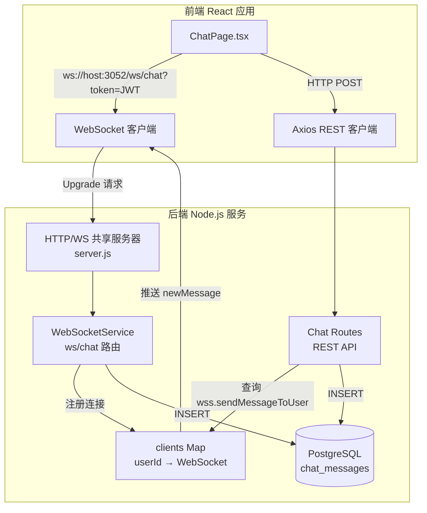
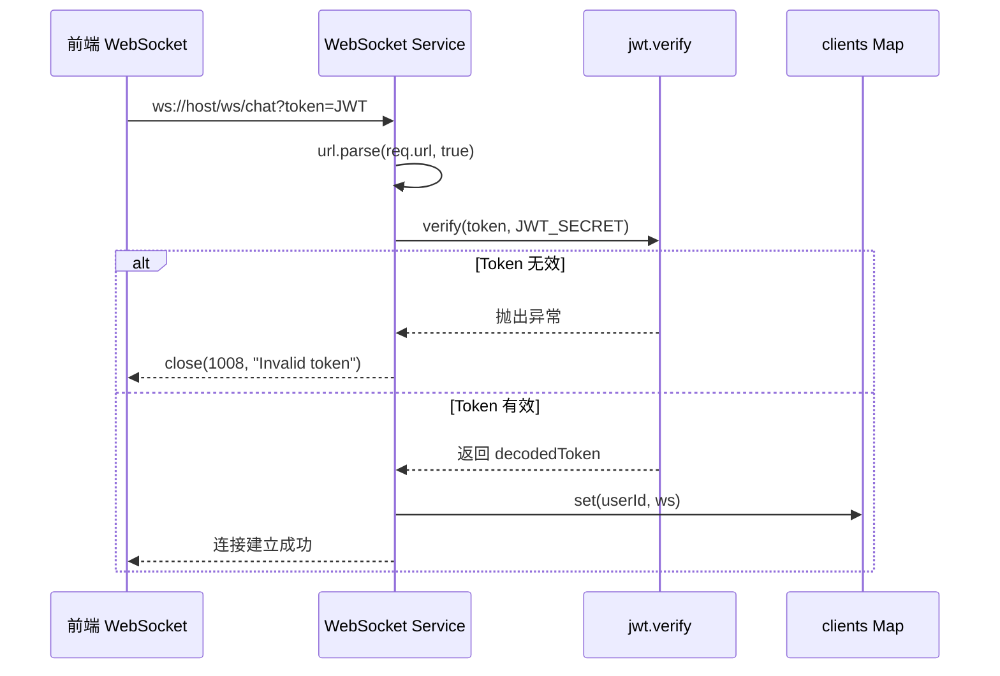
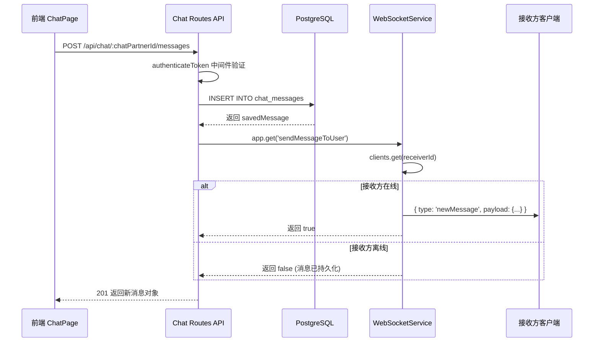
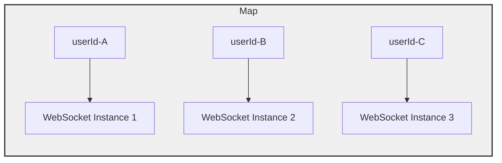
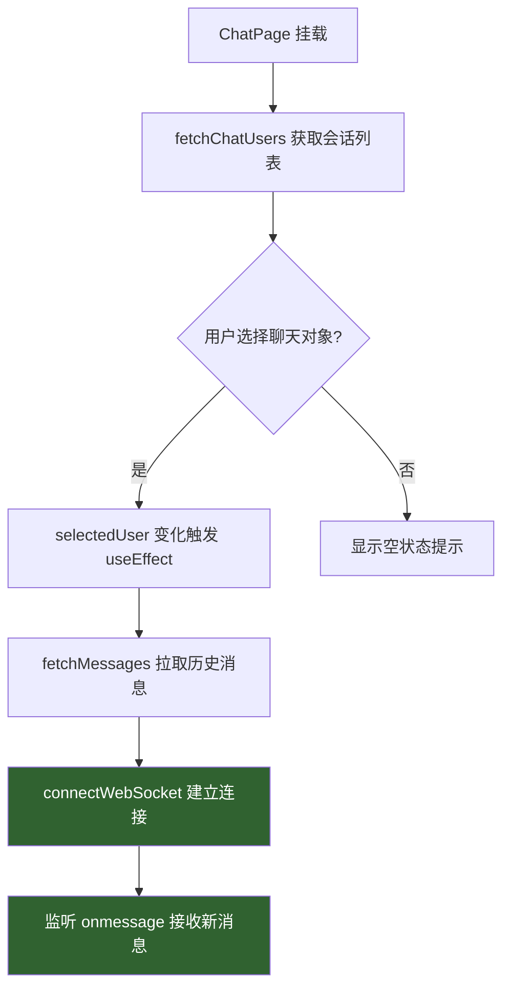

本页面深入解析 AI 月老项目中 WebSocket 实时通信系统的架构设计、消息流转机制与前后端集成方案。该系统为即时聊天功能提供低延迟双向通信能力，同时与 REST API 形成混合通信模式，确保消息的可靠持久化与实时推送。

## 系统架构概览

WebSocket 服务依附于 Express HTTP 服务器运行，共享同一端口。客户端通过携带 JWT Token 的升级请求建立持久连接，服务端通过内存中的 `Map` 结构维护在线用户与 WebSocket 实例的映射关系。消息发送采用**双重路径**：前端可通过 REST API 或 WebSocket 直接发送消息，而消息的实时推送则统一通过 WebSocket 通道完成。



核心设计决策在于将 WebSocket 服务器实例通过 `app.set()` 暴露给路由模块（[server.js#L62-L64](backend/server.js#L62-L64)），使得 REST API 端点能够在消息持久化后主动触发 WebSocket 推送，形成 **"REST 写入 + WebSocket 推送"** 的混合模式。

Sources: [server.js](backend/server.js#L1-L84), [websocketService.js](backend/services/websocketService.js#L1-L144)

## 认证与连接建立

WebSocket 连接通过 URL 查询参数传递 JWT Token 完成身份验证。服务端在 `connection` 事件中解析 URL、提取 Token 并进行验证，验证通过后以 `userId` 为键将 WebSocket 实例注册到 `clients` Map 中。



认证流程的关键实现位于 [websocketService.js#L11-L31](backend/services/websocketService.js#L11-L31)：

| 验证场景 | 处理方式 | 关闭码 |
|---------|---------|-------|
| 未提供 Token | 直接关闭连接 | 1008 |
| Token 格式错误或过期 | 捕获异常后关闭 | 1008 |
| Token 验证通过 | 注册到 clients Map | — |

前端在 [ChatPage.tsx#L68-L70](frontend-react/src/pages/ChatPage.tsx#L68-L70) 中通过 `localStorage.getItem('token')` 获取 Token 并拼接 WebSocket URL。全局配置常量定义在 [config.ts#L4](frontend-react/src/config.ts#L4) 中：`WS_URL = 'ws://192.168.0.14:3052/ws/chat'`。

Sources: [websocketService.js](backend/services/websocketService.js#L11-L31), [ChatPage.tsx](frontend-react/src/pages/ChatPage.tsx#L68-L70), [config.ts](frontend-react/src/config.ts#L4)

## 消息协议与流转

系统定义了三种消息类型，通过 JSON 格式在 WebSocket 通道中传输。消息的完整生命周期涉及前端发起、服务端持久化、实时推送三个环节。

### 消息类型定义

| 消息类型 | 方向 | 触发方 | Payload 字段 | 用途 |
|---------|------|-------|-------------|------|
| `sendMessage` | 客户端 → 服务端 | 前端 | `{ receiverId, content }` | 通过 WebSocket 直接发送消息 |
| `newMessage` | 服务端 → 客户端 | 后端 | `{ messageId, senderId, receiverId, content, timestamp, status }` | 实时推送新消息通知 |
| `error` | 服务端 → 客户端 | 后端 | `{ message }` | 错误反馈 |

注意：前端 ChatPage 目前采用 REST API 发送消息（[ChatPage.tsx#L91-L99](frontend-react/src/pages/ChatPage.tsx#L91-L99)），而非直接通过 WebSocket 的 `sendMessage` 类型。WebSocket 的 `sendMessage` 类型主要用于测试脚本（[test_websocket_v2.js#L81-L89](backend/test_websocket_v2.js#L81-L89)）。

### REST 路径下的消息流转

当用户通过 REST API 发送消息时，系统执行以下流程：



此流程的关键集成点在 [chat.js#L99-L113](backend/routes/chat.js#L99-L113)：REST 端点在消息入库后调用 `sendMessageToUser()` 函数，通过 `clients` Map 查找接收方的 WebSocket 连接并推送实时通知。

Sources: [chat.js](backend/routes/chat.js#L56-L130), [websocketService.js](backend/services/websocketService.js#L100-L130)

## 客户端管理策略

`clients` Map 是整个 WebSocket 系统的核心数据结构，以 `userId`（UUID 字符串）为键，`WebSocket` 实例为值。该设计天然支持**单设备登录**模型：同一用户的新连接会覆盖旧连接。



### 生命周期管理

| 事件 | 行为 | 代码位置 |
|-----|------|---------|
| `connection` | JWT 验证通过后 `clients.set(userId, ws)` | [websocketService.js#L30](backend/services/websocketService.js#L30) |
| `close` | `clients.delete(userId)` | [websocketService.js#L97-L98](backend/services/websocketService.js#L97-L98) |
| `error` | 记录日志，不操作 clients（由 close 事件清理） | [websocketService.js#L101-L103](backend/services/websocketService.js#L101-L103) |

`sendMessageToUser()` 函数（[websocketService.js#L107-L114](backend/services/websocketService.js#L107-L114)）在推送前检查 `readyState === WebSocket.OPEN`，确保不会向已断开的连接发送数据。

Sources: [websocketService.js](backend/services/websocketService.js#L8-L144)

## 前端集成实现

前端在 `ChatPage.tsx` 中实现了 WebSocket 客户端的完整生命周期管理，包括连接建立、消息接收和清理逻辑。

### 连接时机

WebSocket 连接在用户**选择聊天对象时**建立，而非页面加载时立即连接。这种延迟连接策略减少了不必要的长连接资源消耗。



### 消息接收处理

`onmessage` 回调在 [ChatPage.tsx#L76-L84](frontend-react/src/pages/ChatPage.tsx#L76-L84) 中解析收到的 JSON 数据。当前实现检查 `data.type === 'new_message'`（注意：此处使用了 `new_message` 而非后端的 `newMessage`，存在**类型命名不一致**的潜在问题），并根据 `selectedUser` 过滤是否更新消息列表。

### 清理机制

两个 `useEffect` 钩子均在返回函数中关闭 WebSocket 连接（[ChatPage.tsx#L33-L35](frontend-react/src/pages/ChatPage.tsx#L33-L35) 和 [ChatPage.tsx#L39-L41](frontend-react/src/pages/ChatPage.tsx#L39-L41)），防止组件卸载或切换聊天对象时产生连接泄漏。

Sources: [ChatPage.tsx](frontend-react/src/pages/ChatPage.tsx#L29-L100)

## 数据库持久化

所有聊天消息持久化到 PostgreSQL 的 `chat_messages` 表中，该表结构定义在 [schema.sql#L106-L112](backend/schema.sql#L106-L112)：

```sql
CREATE TABLE chat_messages (
    message_id UUID PRIMARY KEY DEFAULT gen_random_uuid(),
    sender_id UUID NOT NULL REFERENCES users(user_id) ON DELETE CASCADE,
    receiver_id UUID NOT NULL REFERENCES users(user_id) ON DELETE CASCADE,
    content TEXT NOT NULL,
    timestamp TIMESTAMPTZ DEFAULT NOW(),
    status VARCHAR(20) DEFAULT 'sent'
);
```

`status` 字段预留了消息状态追踪能力（`sent` → `delivered` → `read`），相关逻辑在 websocketService 中以注释形式保留（[websocketService.js#L66-L67](backend/services/websocketService.js#L66-L67) 和 [websocketService.js#L78-L89](backend/services/websocketService.js#L78-L89)），表明未来可扩展消息已读回执功能。

性能方面，系统为聊天表创建了双向索引（[schema.sql#L125-L126](backend/schema.sql#L125-L126)），确保按 `(sender_id, receiver_id)` 和 `(receiver_id, sender_id)` 查询时均能利用索引扫描。

Sources: [schema.sql](backend/schema.sql#L106-L126)

## 架构模式总结

AI 月老的 WebSocket 实现采用了一种**务实的混合架构**，兼具 REST API 的可靠性与 WebSocket 的实时性。

| 维度 | 设计选择 | 权衡分析 |
|-----|---------|---------|
| 通信模式 | REST 写入 + WebSocket 推送 | 牺牲了 WebSocket 原生发送的简洁性，换取了 REST 的标准化错误处理和中间件复用 |
| 认证方式 | URL 查询参数传递 JWT | 实现简单，但 Token 可能出现在服务器日志中 |
| 客户端管理 | 单连接 Map（最后连接优先） | 简单高效，但不支持多设备同时在线 |
| 消息可靠性 | 先持久化后推送 | 确保离线消息不丢失，但未实现确认回执机制 |
| 扩展性 | 单机内存 Map | 当前阶段足够，多实例部署需替换为 Redis Pub/Sub |

Sources: [websocketService.js](backend/services/websocketService.js#L1-L144), [server.js](backend/server.js#L1-L84), [chat.js](backend/routes/chat.js#L56-L130)

## 已知注意事项

1. **消息类型命名不一致**：后端推送使用 `newMessage`（[websocketService.js#L60](backend/services/websocketService.js#L60)），前端监听使用 `new_message`（[ChatPage.tsx#L77](frontend-react/src/pages/ChatPage.tsx#L77)），导致前端 `onmessage` 回调可能无法匹配消息类型。建议统一为 `newMessage`。

2. **离线消息拉取**：当前前端在 `connectWebSocket` 时通过 REST API 拉取历史消息（[ChatPage.tsx#L58-L64](frontend-react/src/pages/ChatPage.tsx#L58-L64)），但 WebSocket 连接建立后收到的消息不会与历史消息去重，可能导致消息重复显示。

3. **`/chat/conversations` 端点缺失**：前端在 [ChatPage.tsx#L40](frontend-react/src/pages/ChatPage.tsx#L40) 调用 `GET /chat/conversations` 获取聊天列表，但后端 chat 路由中未实现该端点。

4. **多实例部署限制**：`clients` Map 存储在进程内存中，水平扩展时需要引入 Redis Pub/Sub 或消息队列替代本地 Map。相关讨论可参考 [Redis 缓存策略](10-redis-huan-cun-ce-lue)。